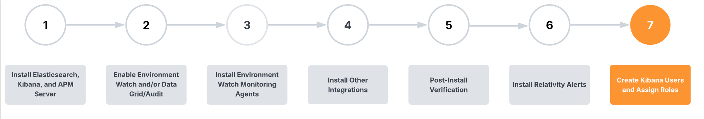
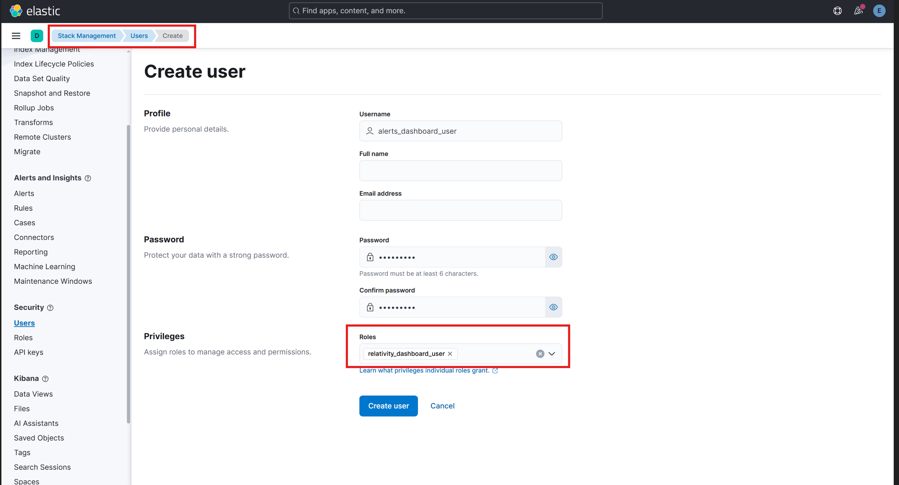

# Step 7: Create Kibana Users and Assign Roles

This section applies to Environment Watch Only.

 

To access Kibana dashboards and saved searches, a new account must be created for each user and be assigned to the custom Kibana role that was installed during the Environment Watch CLI setup.

### Creating Kibana Users with Dashboard Access
To create a Kibana user and assign the custom Kibana role:
1. Log in to Kibana as a user with administrative privileges.
2. Navigate to **Stack Management** > **Security** > **Users**.
3. Click **Create user**.
4. Fill out the following:
- **Username**: A unique login name (e.g., `alerts_dashboard_user`). 
- **Password**: Set a strong password. 
- **Full name / Email address**: Optional but recommended. 
5. Under **Roles**, search for and assign the `relativity_dashboard_user` role.
6. Click **Create user** to save.  

	
> [!WARNING] 
> **Important:** Users must log in with this account to access the Kibana dashboards and saved searches provided by Environment Watch.

---

### Congratulations!

You have reached the end of the setup process. If you are still running into any issues, please refer to the  [Troubleshooting Guides](/docs/environment_watch_troubleshooting.md) for further assistance.
