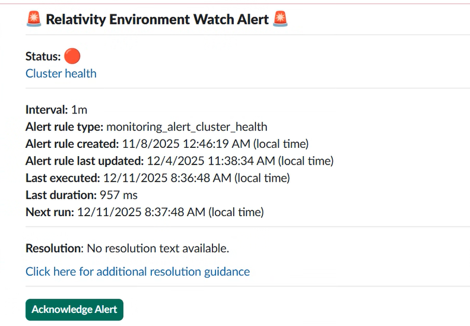

## Alert Notification Handlers [Early Access]

The `alertNotificationHandlers` section configures integrations for sending alerts when monitored resources meet specified conditions. This enables automated notifications to external platforms such as Slack.

### Slack Handler

The Slack handler allows alerts to be sent to a designated Slack channel. Configuration options include:

| Property                   | Description                                                                 |
|----------------------------|-----------------------------------------------------------------------------|
| `accessToken`              | The Slack API token used for authentication.                                |
| `acknowledgeAlertEnabled`  | Boolean flag to enable/disable alert acknowledgment in Slack. This is by dafault false since implementation is not done.               |
| `channel`                  | The Slack channel ID where alerts will be posted.                         |
| `enabled`                  | Boolean flag to enable/disable Slack notifications.                         |
| `messageIntervalSeconds`   | Interval (in seconds) between alert messages sent to Slack. It should be more than or equal to  min slack interval in seconds i.e. 180               |

---

### Configure Slack in Custom JSON

#### Prerequisites

Before configuring Slack notifications:

- Create a Slack App in your Slack workspace.
- Generate an OAuth token with the required permissions to post messages to channels.

#### Configuration

To configure Slack notification in the custom JSON file, locate the `alertNotificationHandlers` section and update the configuration as below.

- Provide OAuth Token in `accessToken`.
- Set `channel` to the Slack channel ID where alerts will be sent.
- Set `enabled` to `true` to enable Slack notifications.
- Set `messageIntervalSeconds` to define the interval at which messages are sent to Slack. By default, it is set to 180 seconds from the code base. If, we set it to less than 180 seconds, it will be overridden to 180 seconds.

```json
"alertNotificationHandlers": {
			"slack": {
				"accessToken": "slack-access-token",
				"acknowledgeAlertEnabled": false,
				"channel": "slack-channel-id",
				"enabled": true,
				"messageIntervalSeconds": 60
			}
		}
```

### Verification in Kibana

- Navigate to Kibana Discover.
- Select `logs-*` Data View.
- Search for "The Environment Watch shared configuration object is not empty" which indicates that the EW Windows Service fetching values from the custom JSON configuration successfully.


### Slack Notification Example



