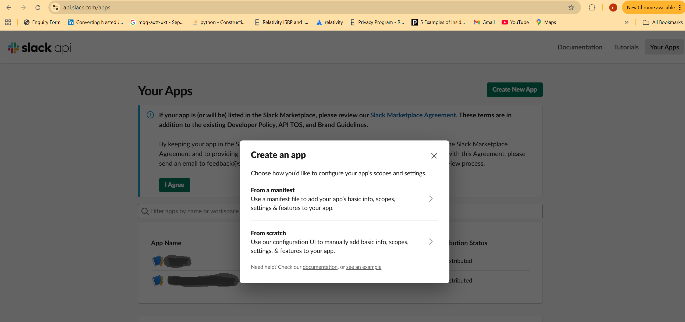
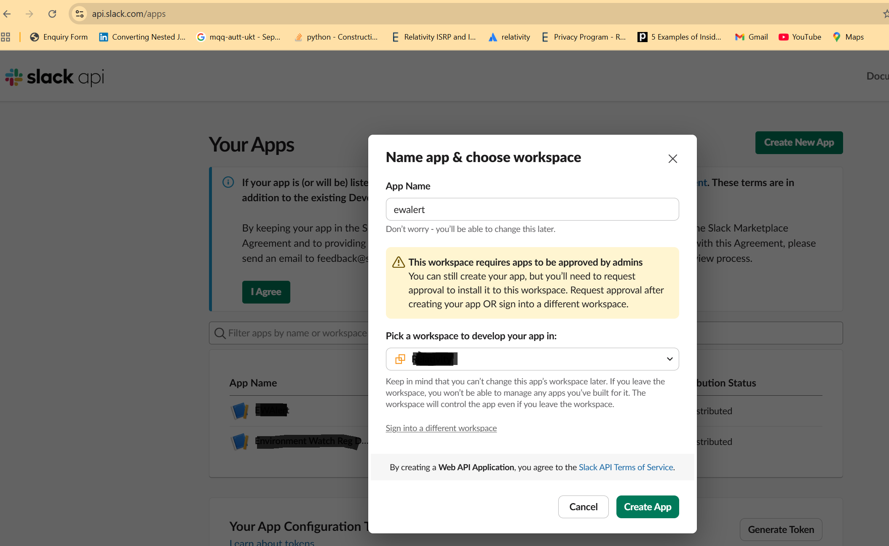
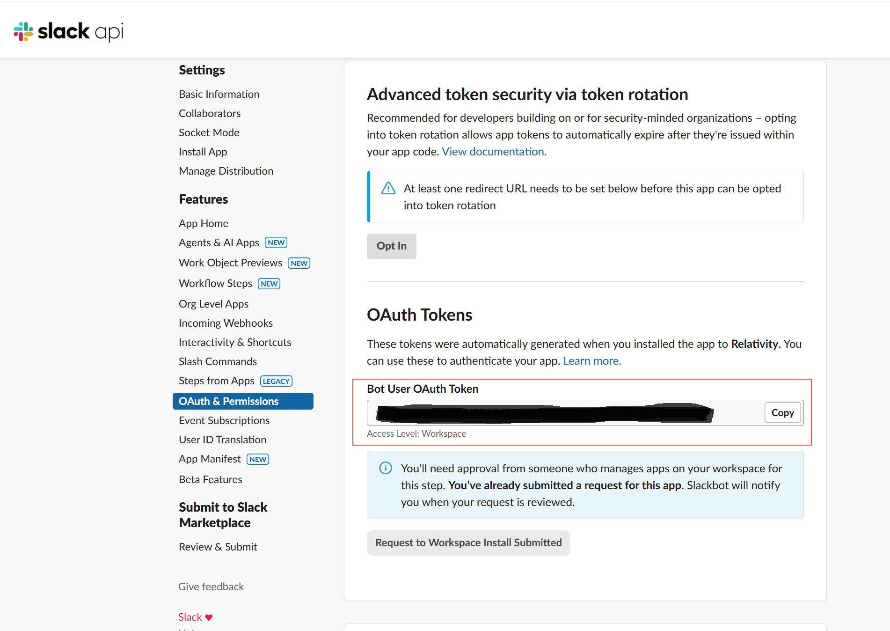
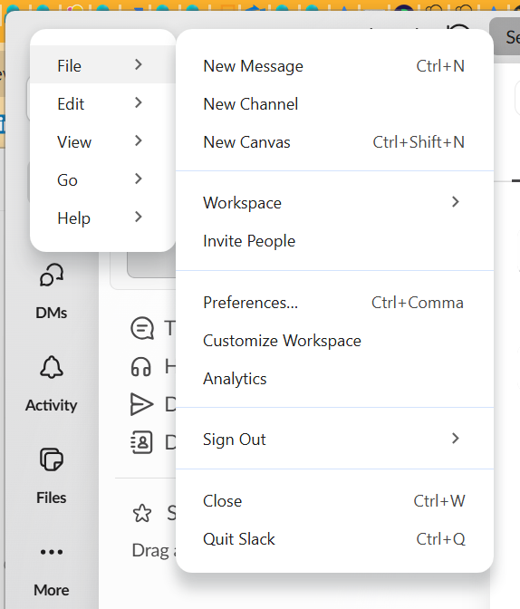
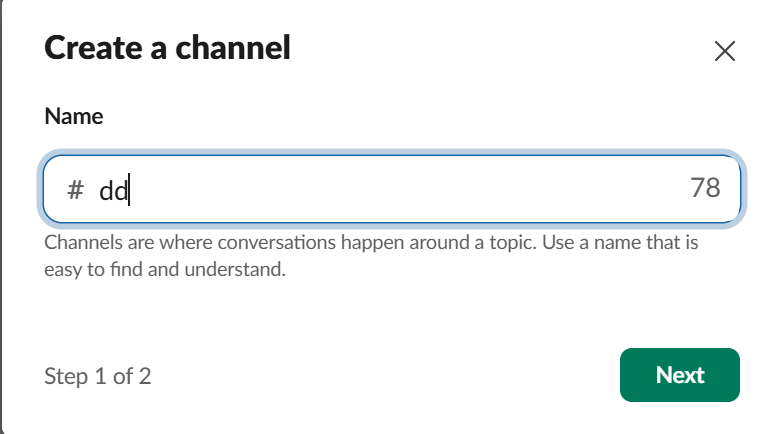
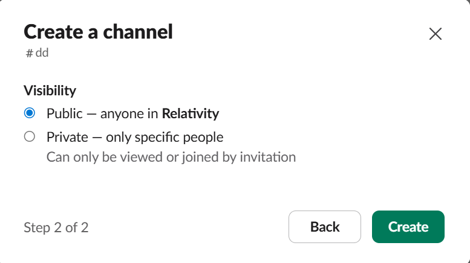
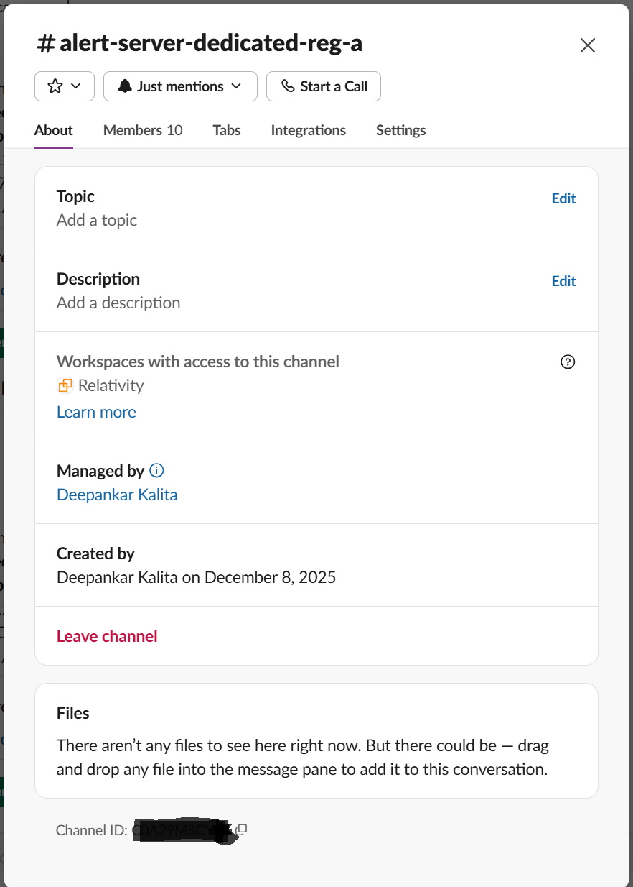

# Custom JSON Configuration

This document provides an overview of the custom JSON configuration for Environment Watch, allowing user to monitor Windows services and certificates from a shared path for any host, and to send alerts to a Slack channel based on the specified Slack settings.

---

## Configuration Structure

The configuration is organized in a hierarchical JSON format, with top-level sections and nested objects for each monitored entity. It will be saved in the BCPPath and the inside folder EnvironmentWatch. The name of the file will be environment-watch-configuration.json. Below is an example structure and explanation:

---

## Reference Structure

- **Top-level object**: `environmentWatchConfiguration`
- **Sections**:
  - `monitoring`: Contains configuration for instance, installed products, and hosts.
    - `instance`: Defines sources monitored at the instance level.
    - `installedProducts`: Array of product objects, each with its own sources.
    - `hosts`: Array of host objects, each with its own sources.
  - `alertNotificationHandlers`: Defines notification handlers (e.g., Slack).

---

## Monitoring Sections

### Monitoring by Instance
The `instance` section defines sources that are monitored at the environment or system-wide level, regardless of specific products or hosts.
- **Purpose:** Monitors general resources (like certificates or Windows services) that are relevant to the entire instance.
- **Use Case:** Useful for checks that apply everywhere, such as core system services.

### Monitoring by Installed Product
The `installedProducts` section contains an array of product objects, each with its own monitoring sources.
- **Purpose:** Monitors resources specific to each installed product (e.g., web server, agent).
- **Use Case:** Allows you to tailor monitoring to the needs of each product, such as product-specific services or certificates.

### Monitoring by Host
The `hosts` section contains an array of host objects, each with its own monitoring sources.
- **Purpose:** Monitors resources on a per-host basis, such as services or certificates unique to a particular server.
- **Use Case:** Enables granular monitoring for individual machines, supporting host-specific checks (e.g., SQL services on a database server).

---

### Monitoring Section Breakdown

| Property                    | Description                                                                 |
|----------------------------|-----------------------------------------------------------------------------|
| `sources`                  | Specifies what is monitored (certificates, windowsServices, sqlServers, etc.)|
| `enabled`                  | Boolean flag to enable/disable monitoring for the source.                    |
| `include`                  | List of specific items to monitor (service names, certificate details, etc.) |
| `otelCollectorYamlFiles`   | List of OpenTelemetry Collector YAML files (empty in this example).          |

---


## Monitoring Source Types

This section describes the main types of sources that can be monitored using the Environment Watch configuration: Windows Services, Certificates, and SQL Services. Each source type has its own configuration structure and properties.

---

### Windows Services

Monitors the status of specified Windows services configured to ensure they are running as expected. There are windows services by default monitored without configuration and they are based on installed product. 

**Default Services**

| Service Display Name                  | Description                                      |
|---------------------------------------|--------------------------------------------------|
| apm-server                           | Elastic Stack APM Server                         |
| Elasticsearch                        | Elastic Stack Elasticsearch Service              |
| W3SVC                                 | Internet Information Services (IIS)              |
| QueueManager                         | Invariant Queue Manager                          |
| RabbitMQ                             | RabbitMQ Message Broker                          |
| kCura EDDS Agent Manager             | Relativity Agent Manager                         |
| Relativity Analytics Engine           | Relativity Analytics Engine (CAAT)               |
| Relativity Secret Store               | Relativity Secret Store                          |
| kCura Service Host Manager           | Relativity Service Host Manager                  |
| kCura EDDS Web Processing Manager    | Relativity Web Processing Manager                |

**Properties Table**

| Property    | Type     | Description                                                      |
|-------------|----------|------------------------------------------------------------------|
| `enabled`   | boolean  | Enables or disables monitoring for Windows services.              |
| `include`   | array    | List of Windows service names to monitor (e.g., `"WinDefend"`).  |

**Example**---
```json
{
	"windowsServices": {
		"enabled": true,
		"include": [
			"WindowsAzureGuestAgent",
			"mpssvc"
		]
	}
}
```
### Certificates

Monitors the presence and validity of specified certificates in Windows certificate stores.There are certificates by default monitored without configuration and they are based on installed product.

**Default Certificates**
| Certificate Name                  | Description                                      |
|-----------------------------------|--------------------------------------------------|
|Relativity Secret Store            | Certificate for Relativity Secret Store.         |

**Properties Table**

| Property      | Type     | Description                                                      |
|---------------|----------|------------------------------------------------------------------|
| `enabled`     | boolean  | Enables or disables monitoring for certificates.                 |
| `include`     | array    | List of certificate objects to monitor.                          |
| `StoreName`   | string   | Name of the certificate store (e.g., `"My"`).                    |
| `StoreLocation`| string  | Location of the store (e.g., `"LocalMachine"`).                  |
| `Thumbprint`  | string   | Certificate thumbprint to identify the certificate.              |


#### StoreLocation Enum Values

The `StoreLocation` Field specifies the location of the X.509 certificate store to use.

**Possible Values**

| Value         | Description                                                    |
|---------------|----------------------------------------------------------------|
| CurrentUser   | The X.509 certificate store is located in the current user's profile. |
| LocalMachine  | The X.509 certificate store is located in the local computer's profile. |

#### StoreName Enum Values

The `StoreName` Field specifies name of the Windows certificate store where the X.509 certificate is located.

**Possible Values**

| Value                | Description                                   |
|----------------------|-----------------------------------------------|
| AddressBook          | Other people                                  |
| AuthRoot             | Third party trusted roots                     |
| CertificateAuthority | Intermediate CAs                              |
| Disallowed           | Revoked certificates                          |
| My                   | Personal certificates                         |
| Root                 | Trusted root CAs                              |
| TrustedPeople        | Trusted people (used in EFS)                  |
| TrustedPublisher     | Trusted publishers (used in Authenticode)     |

**Example**
```json
"certificates": {
					"enabled": true,
					"include": [
						{
							"StoreName": "My",
							"StoreLocation": "LocalMachine",
							"Thumbprint": "A54225760344699530649239D175BAA73C70DC1B"
						}
					]
				}
```
### SQL Services

Monitors the availability of specified SQL Server instances.

**Properties Table**

| Property    | Type     | Description                                                      |
|-------------|----------|------------------------------------------------------------------|
| `enabled`   | boolean  | Enables or disables monitoring for SQL services.                 |
| `include`   | array    | List of SQL Server instance names to monitor (e.g., `"VIRTSQL\\INSTANCE01"`). |

**Example**
```json
"sqlServers": {
				"enabled": true,
				"include": [ "Host\\INSTANCE01" ]
			  }
```
## Alert Notification Handlers [Preview Feature]

The `alertNotificationHandlers` section configures integrations for sending alerts when monitored resources meet specified conditions. This enables automated notifications to external systems such as Slack.

### Slack Handler

The Slack handler allows alerts to be sent to a designated Slack channel. Configuration options include:

| Property                   | Description                                                                 |
|----------------------------|-----------------------------------------------------------------------------|
| `accessToken`              | The Slack API token used for authentication.                                |
| `acknowledgeAlertEnabled`  | Boolean flag to enable/disable alert acknowledgment in Slack. This is by dafault false since implementation is not done.               |
| `channel`                  | The Slack channel ID where alerts will be posted.                         |
| `enabled`                  | Boolean flag to enable/disable Slack notifications.                         |
| `messageIntervalSeconds`   | Interval (in seconds) between alert messages sent to Slack. It should be more than or equal to  min slack interval in seconds i.e. 180               |


---

## Configure Slack Channel

### Create a Slack App

Step 1 : Go to Slack API website:
Open your browser and go to: https://api.slack.com/apps


Step 2 : Click "Create New App"



Step 3 : Choose "From scratch"

Step 4 : Name the AppName and Pick your workspace from the dropdown.Click `Create App`



### Get Access Token

Go To Settings of Channel. Select `OAuth & Permissions`. Copy Bot User Auth Token and assign it to access token.




### Create Slack Channel

Step 1 : Click on 3 horizontal lines on the extreme left side of the slack. Click `File` and then `New Channel` 



Step 2 : Enter Channel Name 



Step 3 : Make the channel visibility `Public`. click on `Create`.



### Map Channel to Slack App

go to the required channel aand type below command and Enter

/invite @appname 

where appname is slack app name.

### Get Channel Id

Go to required channel and in About copy channel Id and assign it to channel in slack configuration.



### Slack Notofication Example


## Example Configuration

```json
{
	"environmentWatchConfiguration": {
		"monitoring": {
			"instance": {
				"sources": {
					"certificates": {
						"enabled": false,
						"include": []
					},
					"windowsServices": {
						"enabled": true,
						"include": [
							"WindowsAzureGuestAgent",
							"mpssvc"
						]
					}
				},
				"otelCollectorYamlFiles": []
			},
			"installedProducts": [
				{
					"productName": "Web",
					"sources": {
						"certificates": {
							"enabled": true,
							"include": [
								{
									"StoreName": "My",
									"StoreLocation": "LocalMachine",
									"Thumbprint": "A54225760344699530649239D175BAA73C70DC1B"
								}
							]
						},
						"windowsServices": {
							"enabled": true,
							"include": [ "IISADMIN", "WinDefend" ]
						}
					},
					"otelCollectorYamlFiles": []
				},
				{
					"productName": "Agent",
					"sources": {
						"certificates": {
							"enabled": false,
							"include": []
						},
						"windowsServices": {
							"enabled": true,
							"include": [ "RpcSs" ]
						}
					},
					"otelCollectorYamlFiles": []
				}
			],
			"hosts": [
				{
					"hostName": "SQL01",
					"sources": {
						"certificates": {
							"enabled": true,
							"include": []
						},
						"sqlServers": {
							"enabled": true,
							"include": [ "VIRTSQL\\INSTANCE01" ]
						},
						"windowsServices": {
							"enabled": true,
							"include": [ "MSSQLSERVER" ]
						}
					},
					"otelCollectorYamlFiles": []
				},
				{
					"hostName": "DG01",
					"sources": {
						"certificates": {
							"enabled": true,
							"include": []
						},
						"windowsServices": {
							"enabled": true,
							"include": [ "Dhcp" ]
						}
					},
					"otelCollectorYamlFiles": []
				},
				{
					"hostName": "DG02",
					"sources": {
						"certificates": {
							"enabled": false,
							"include": []
						},
						"windowsServices": {
							"enabled": true,
							"include": [ "Schedule" ]
						}
					},
					"otelCollectorYamlFiles": []
				},
				{
					"hostName": "CORE01",
					"sources": {
						"certificates": {
							"enabled": true,
							"include": [
								{
									"storeName": "My",
									"storeLocation": "LocalMachine",
									"thumbprint": "F8809D2677E010477847C92C5A1A673784537CBC"
								},
								{
									"storeName": "My",
									"storeLocation": "LocalMachine",
									"thumbprint": "984812C68F059EB19A346D538ECFB072968C11C3"
								},
								{
									"storeName": "My",
									"storeLocation": "LocalMachine",
									"thumbprint": "984812C68F059EB19A346D538ECFB072968C11C3"
								}
							]
						},
						"windowsServices": {
							"enabled": false,
							"include": []
						}
					},
					"otelCollectorYamlFiles": []
				},
				{
					"hostName": "CORE02",
					"sources": {
						"certificates": {
							"enabled": true,
							"include": [
								{
									"storeName": "My",
									"storeLocation": "LocalMachine",
									"thumbprint": "F8809D2677E010477847C92C5A1A673784537CBC"
								}
							]
						},
						"windowsServices": {
							"enabled": false,
							"include": []
						}
					},
					"otelCollectorYamlFiles": []
				}
			]
		},
		"alertNotificationHandlers": {
			"slack": {
				"accessToken": "slack-access-token",
				"acknowledgeAlertEnabled": false,
				"channel": "ABC12M3PQR4",
				"enabled": true,
				"messageIntervalSeconds": 180
			}
		}
	}
}
```
