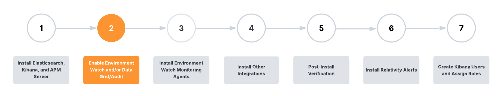

# Enable Data Grid Audit



<div style="padding: 10px 15px; background-color: #e7f3fe; border-inline-start: 5px solid #0b69da; color: #000000;">
This section applies to Datagrid Only.
</div>
<br>

After installing the required Elastic components for Data Grid Audit, the integration between Elastic and Relativity is configured by running the Relativity Server CLI on the Primary SQL Server.

For customers already using Data Grid Audit prior to upgrading to Relativity Server 2024, refer to the **_Important information for existing Data Grid Audit customers section_** for additional context on what happens when running the ‘Set up Data Grid’ workflow using the Relativity Server CLI for the first time.

### Prerequisites

> [!NOTE]
> Ensuring the minimum supported version of Elasticsearch for Data Grid Audit is installed, as specified in the release bundle, is especially important for existing Data Grid Audit customers that may be running legacy versions of Elasticsearch. Existing Data Grid Audit users must be on Elasticsearch 7.17 when initially running the Data Grid Audit setup using the Relativity Server CLI. After successfully configuring Data Grid Audit using the Relativity Server CLI, an upgrade to Elasticsearch 8.17 in any cluster being used for Data Grid Audit can be performed.

    While 7.17 is the minimum supported version for the initial release of the Relativity Server CLI in Server 2024 Patch 1, it is recommended to always check the minimum version requirements in the specific Environment Watch release bundle being used.

1. [Data Grid Audit only] Install the mapper-size plugin on all nodes in the Elasticsearch cluster (instructions available [here](https://www.elastic.co/guide/en/elasticsearch/plugins/current/mapper-size.html)). The Elasticsearch service must also be restarted after installing the plugin.

2. [Data Grid Audit only] Before upgrading to Elasticsearch 8.17.3, the ESIndexCreationSetting may need to be updated. For further details, refer to the [Instance settings' descriptions - Server2024](https://help.relativity.com/Server2024/Content/System_Guides/Instance_Setting_Guide/Instance_setting_descriptions.htm#ESIndexCreationSettings).

3. The Server-bundle zip file has been downloaded and extracted to `C:\Server.Bundle.x.y.z'
   
4. Verify that the InfraWatch Services application is installed in the Relativity instance (this RAP is delivered as part of the base Relativity Server 2024 installation package).

### Set up Data Grid Audit

This section covers the steps for configuring the integration between Relativity and Elasticsearch for Data Grid Audit.

For a first-time setup of Data Grid Audit, the Audit application will also need to be installed to workspaces and the Audit agents added. See [here](https://help.relativity.com/Server2024/Content/Relativity/Audit/Audit.htm#InstallingandconfiguringAudit) for more information about the Audit agents.

### Important information for existing Data Grid Audit customers
> [!NOTE]
> Existing Data Grid Audit users must be on Elasticsearch 7.17 when initially running the Data Grid Audit setup using the Relativity Server CLI. After successfully configuring Data Grid Audit using the Relativity Server CLI, an upgrade to Elasticsearch 8.17.3 in any cluster being used for Data Grid Audit can be performed.

#### Set up instructions

Follow these steps to set up Data Grid Audit using the Relativity Server CLI. All setup will occur on the SQL Primary server.

**Step 1** - Select Data Grid Setup Option
Run the `setup` command from an elevated Command/Powershell to enter the setup workflow. Select **DataGrid** when prompted.

```powershell
C:\Server.Bundle.x.y.z> ./relsvr.exe setup

What would you like to setup?
> DataGrid
  Environment watch
  Exit
```

**Step 2** - Enter the required Relativity and Elasticsearch parameters.

```
Confirm you would like to perform the 'DataGrid' setup [y/n] (y): y

Existing settings do not exist
Enter the Relativity admin username (relativity.admin@kcura.com): relativity.admin@kcura.com
Enter the Relativity admin password: *********
Enter the Relativity instance url (https://emttest/Relativity): https://emttest/Relativity
Relativity instance is verified
Enter the Elasticsearch admin username (elastic): elastic
Enter the Elasticsearch admin password: *********
Enter the Elasticsearch cluster endpoint URL (https://emttest:9200): https://emttest:9200

```

**Step 3** - Wait for Setup to Complete.

```
Elasticsearch cluster endpoint URL is verified
Elasticsearch plugin verified

API Key creation and validation completed ------------------------- 100%
Relativity instance setting validation completed ------------------ 100%
Relativity secret store updated ----------------------------------- 100%
Elastic Stack settings validation completed ----------------------- 100%
Relativity toggles validation completed --------------------------- 100%

The Relativity Data Grid setup has been completed. Please restart all Relativity services, including "kCura Edds Agent Manager," "kCura Edds Web Processing Manager," and "kCura Service Host Manager" on each server contained within this Relativity instance to complete the setup.
```
If the setup completes successfully, Datagrid is now configured for the environment.

**Step 4** - Restart the Relativity services on all machines for the changes to take effect.


**Step 5** - Verify Audit Dashboard
Navigate to the Audit tab in the Relativity environment and confirm that the dashboard and its data are loading correctly.


## Next

[Click here for the next step](install_environment_watch_monitoring_agents.md)