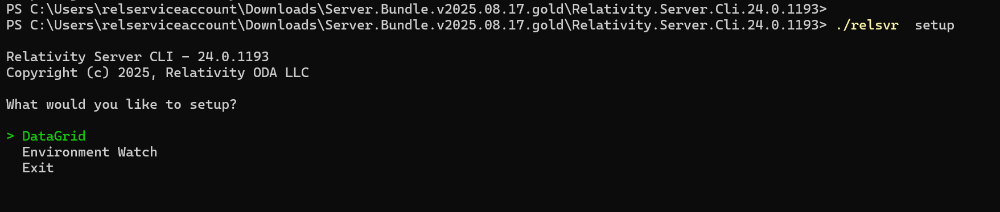
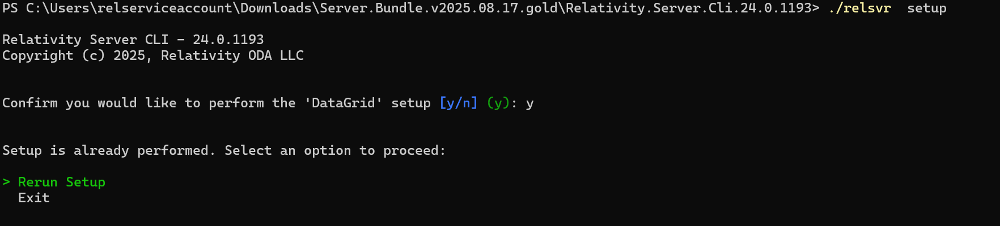
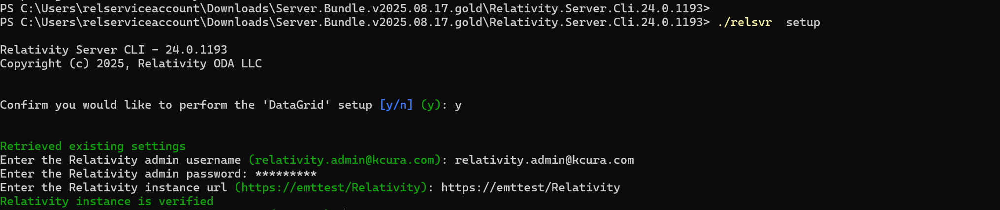
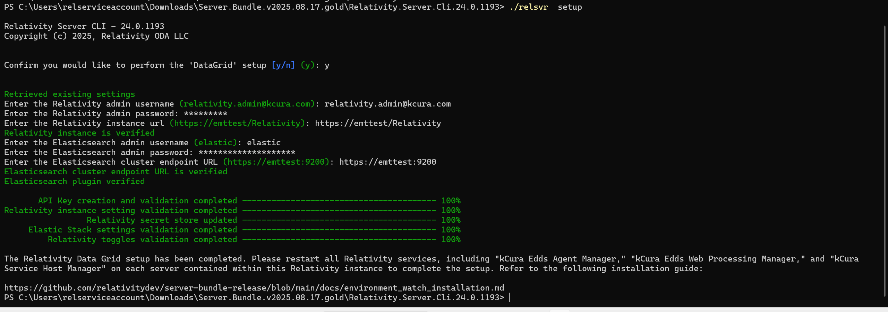

# Enable Data Grid Audit


Now that you have installed the required Elastic components for Data Grid Audit, you will configure the integration between Elastic and Relativity by running the Relativity Server CLI on your Primary SQL Server.

For customers already using Data Grid Audit prior to upgrading to Relativity Server 2024, please see the **_Important information for existing Data Grid Audit customers section_** below for additional context on what will happen when you run the ‘Set up Data Grid’ workflow using the Relativity Server CLI for the first time.

### Before you start

Before entering the Data Grid Audit setup workflows, perform or check the following:<br/>

1. Confirm that all Elastic components are installed and verified from steps 1 and 2 of this installation guide. This includes ensuring that the minimum versions of Elasticsearch and Kibana that are specified in the Environment Watch release bundle that you are using are installed and that Elastic certificates have been installed on all Elastic hosts.<br/>

   **Note:**  Ensuring that you are on the minimum supported version of Elasticsearch for Data Grid Audit as specified in the release bundle is especially important for existing Data Grid Audit customers that may be running legacy versions of Elasticsearch. If you are an existing Data Grid Audit user, you must be on Elasticsearch 7.17 when you initially run the Data Grid Audit setup using the Relativity Server CLI. After you successfully configure Data Grid Audit using the Relativity Server CLI, you can then upgrade to Elasticsearch 8.17 in any cluster being used for Data Grid Audit.<br/>

    While 7.17 is the minimum supported version for the initial release of the Relativity Server CLI in Server 2024 Patch 1, you should always check the minimum version requirements in the specific Environment Watch release bundle that you are using.

2. [Data Grid Audit only] Install the mapper-size plugin on all nodes in your Elasticsearch cluster (instructions available [here](https://www.elastic.co/guide/en/elasticsearch/plugins/current/mapper-size.html)). You also must restart the Elasticsearch service after installing the plugin.<br/>
3. [Data Grid Audit only] Before upgrading to Elasticsearch 8.17, the ESIndexCreationSetting may need to be updated. For further details, please refer to the [Instance settings' descriptions - Server2024](https://help.relativity.com/Server2024/Content/System_Guides/Instance_Setting_Guide/Instance_setting_descriptions.htm#ESIndexCreationSettings).<br/>
4. At least the minimum Relativity major version and patch specified in the Environment Watch bundle you intend to deploy is installed on all servers in the environment. See the [release bundle](https://github.com/relativitydev/server-bundle-release/releases) requirements for the minimum version required.<br/>
5. Verify that the InfraWatch Services application is installed in your Relativity instance (this RAP is delivered as part of the base Relativity Server 2024 installation package).<br/>
6. Follow [these instructions](https://help.relativity.com/Server2024/Content/System_Guides/Secret_Store/Secret_Store.htm#Configuringclients) to whitelist all hosts with Elastic installed for Secret Store access.<br/>
7. Ensure that you have access to Relativity, as well as the Primary and Distributed SQL Servers<br/>
8. The user must have Command Prompt installed to run the CLI executable.<br/>

### Set up Data Grid Audit

This section covers the steps for configuring the integration between Relativity and Elasticsearch for Data Grid Audit.

If you are setting up Data Grid Audit for the first time, you will also need to install the Audit application to workspaces and add the Audit agents. See [here](https://help.relativity.com/Server2024/Content/Relativity/Audit/Audit.htm#InstallingandconfiguringAudit) for more information about the Audit agents.

#### Important information for existing Data Grid Audit customers

If you have been using Data Grid Audit prior to upgrading to Relativity Server 2024 Patch 1 or later, running the Relativity Server CLI’s ‘Set up Data Grid’ workflow will update how your Elasticsearch cluster authenticates into Relativity. Prior to Server 2024 Patch 1, Data Grid Audit relied on a Elastic plug-in called Custom Realms for authentication. Starting with Server 2024 Patch 1, authentication no longer requires Custom Realms and is now based on an API key-based OAuth2 authentication method.

Once you have cut over to the new API key-based authentication using the Relativity Server CLI, you no longer need to use the Elastic Platinum license key that Relativity previously provided as part of our Elasticsearch installation package ("DataTron") to use Data Grid Audit. Moving forward, you will use the free/open Elastic license, or optionally apply a Platinum or Enterprise license key held by your organization if you are interested in utilizing Elasticsearch features that are not supported under the free/open license. No core Data Grid Audit functionality is impacted when you downgrade to the free/open license.

All Relativity Server customers that use Data Grid Audit will be required to upgrade to at least Server 2024 Patch 1, cut over to the new API key-based authentication using the Relativity Server CLI, and swap out the Relativity-provided license key for a free/open license or a Platinum/Enterprise license held by your organization by early 2026 in order for Data Grid Audit to continue working.

**Note:** Steps 12-15 below include important instructions for any existing Audit users that are setting up Data Grid using the Relativity Server CLI for the first time.

**Note:** If you are an existing Data Grid Audit user, you must be on Elasticsearch 7.17 when you initially run the Data Grid Audit setup using the Relativity Server CLI. After you successfully configure Data Grid Audit using the Relativity Server CLI, you can then upgrade to Elasticsearch 8.17 in any cluster being used for Data Grid Audit.

#### Set up instructions

Follow these steps to set up Data Grid Audit using the Relativity Server CLI.

**All setup will occur on the SQL Primary server.**

**Note:** If you have already run the ‘Set up Environment Watch’ workflow on this host, you do not need to repeat steps 1-2 below.

**Step 1:**<br/>
Install Elastic certificate on SQL Primary Server<br/>
**Step 2:**<br/>
Download the CLI – From [here](https://github.com/relativitydev/server-bundle-release/releases), download the release bundle.<br/>
**Step 3:**<br/>
Open Command Terminal - Launch Command Terminal v7 from the Start menu.<br/>
**Step 4:**<br/>
Extract the CLI - Navigate to the directory where the release bundle was downloaded to and extract the Relativity.Server.Cli.YY.x.xxxx.zip.<br/>
**Step 5:**<br/>
Run the Setup Command – From Command Prompt, execute the following command to enter the setup workflow:<br/>
    ```
    ./relsvr.exe setup
    ```

**Step 6:**<br/>
Select DataGrid<br/>
   
**Step 7:**<br/>
[Only applicable if Data Grid Audit has been set up previously using the Relativity Server CLI] Choose setup type – If Data Grid Audit has been set up on this host previously, you will be prompted to select "Rerun Setup" or "Exit". If you are using the Relativity Server CLI to set up Data Grid Audit on this host for the first time (even if you began adopting Data Grid Audit before the Relativity Server CLI was initially released), you will not be prompted to make this selection and the setup process will continue to the next step.<br/>
   
**Step 8:**<br/>
Provide Relativity parameters – Enter the Relativity admin username and password and Relativity URL.<br/>
   
**Step 9:**<br/>
Provide Elasticsearch parameters - Enter the Elasticsearch admin username and password and Elasticsearch cluster endpoint URL (any node in your cluster will work, but we recommend providing the node URL for the master node where you first installed Elasticsearch in step 1 of this installation guide).<br/>
**Step 10:**<br/>
Verify the generated API keys – To verify that the API keys used for authenticating Elastic to Relativity were generated:<br/>
    a. Open Kibana<br/>
    b. Navigate to the path: /app/management/security/api_keys<br/>
    c. Verify that API keys for rel-datagrid is present.<br/> 
	**Note:** This API key will need to be refreshed every six months.<br/>
    
**Step 11:**<br/>
Restart Relativity services<br/>

**Note:** Steps 12-15 are only applicable if you are running the CLI setup workflow to cut over from the legacy custom realms-based authentication to API key-based authentication.<br/>

**Step 12:**<br/>
Verify that API key authentication is being used – Execute the below query at the EDDS database level to verify that Elastic API key authentication is enabled.<br/>
       
        ```
        SELECT TOP(50) FROM [EDDSLogging][eddsdbo][RelativityLogs] where message like '%elastic api key authentication%' ORDER by 1 desc
        SELECT * FROM [EDDS].[eddsdbo].[Toggle] where name ='ElasticAPIKeyAuthenticationToggle'
        ```

**Step 13:**<br/>
Verify that the Audit dashboard is functional<br/>
    a. Navigate to the Audit tab in your Relativity environment.<br/>
    b. Verify that the Audit dashboard graphs and data is loading.<br/>
**Step 14:**<br/>
Update license key – After successfully running the Data Grid setup and verifying that API key authentication is now being used, you need to update your license to free/open or a different Platinum or Enterprise license that is not the one previously provided by Relativity.<br/>
    a. Open Kibana and navigate to Stack Management -> License management<br/>
    b. Update your license<br/>

**Note:** Steps 15-16 are only applicable if you have not already installed Elastic certificates on Web and Agent Servers during Environment Watch setup or a previous Data Grid Audit setup.<br/>

**Step 15:**<br/>
Install Elastic certificates on all Web Servers in your environment. Restart services on each host after installing the certificates.<br/>
**Step 16:**<br/>
Install Elastic certificates on all Agent Servers in your environment. Restart services on each host after installing the certificates.<br/>
**Note:** Step 17 is only applicable if you are doing a first-time setup of Audit in your Relativity instance.<br/>

**Step 17:**<br/>
Install Audit application and agents - If you are setting up Data Grid Audit for the first time, you will also need to install the Audit application to workspaces and add the Audit agents. See [here](https://help.relativity.com/Server2024/Content/Relativity/Audit/Audit.htm#InstallingandconfiguringAudit) for more information about the Audit agents.<br/>

If the setup completes successfully, the integration between Elasticsearch and Relativity for Data Grid Audit is now configured for your environment. If you encountered any errors while entering Relativity or Elasticsearch parameters, you will have three retry attempts before the CLI forces an exit and you must restart the setup process.
