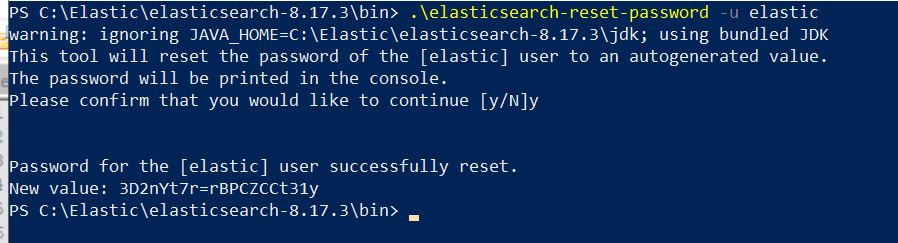
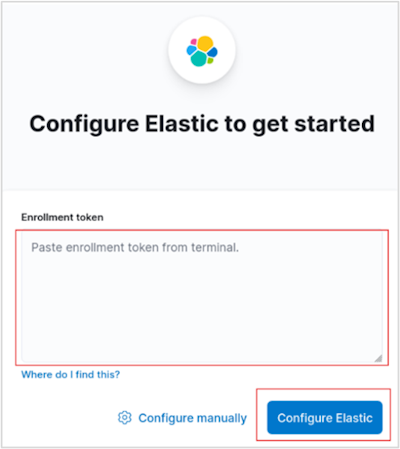
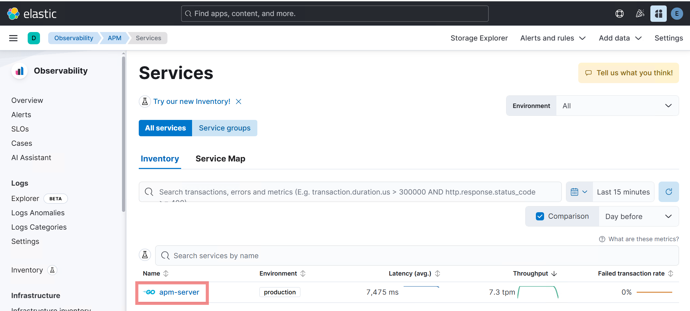
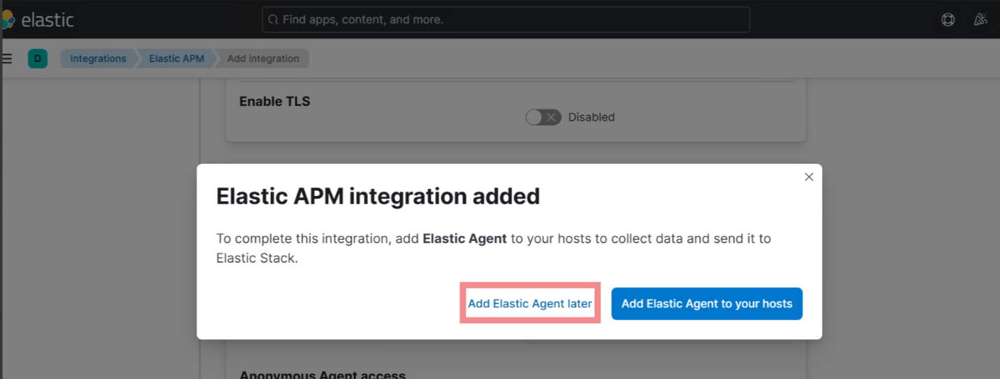
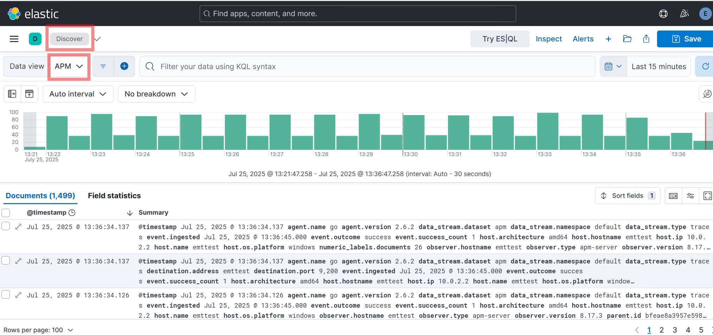

# Install Elasticsearch, Kibana and APM Server - Production Environment


> [!NOTE]
> This step is required for both Environment Watch and Data Grid Audit

## Cluster Architecture Decision

Before beginning installation, you must decide on your cluster architecture:

**Option 1: Single Unified Cluster**
- One Elasticsearch cluster that contains all data (Environment Watch and Data Grid Audit)
- Simpler to manage and maintain
- Shared resources and infrastructure
- Suitable for most deployments

**Option 2: Separate Clusters**
- Two independent Elasticsearch clusters:
  - One dedicated cluster for Environment Watch
  - One dedicated cluster for Data Grid Audit
- Complete isolation between workloads
- Independent scaling and resource allocation
- Recommended for very large deployments or when strict data separation is required

> [!TIP]
> For most organizations, **Option 1 (Single Unified Cluster)** is recommended as it simplifies operations while providing adequate performance and isolation through index management.

## How to Unblock Downloaded Files
If you download a .zip or other file from the internet, Windows may block the file and prevent it from running correctly. To unblock a file:

1. Right-click the downloaded file and select **Properties**.
2. In the **General** tab, check the box for **Unblock** at the bottom (if present).
3. Click **Apply** and then **OK**.

    

## Download and Install Elasticsearch 8.x.x or 9.x.x on one server

> [!NOTE]
> **Official Documentation:** For detailed installation guidance, see [Elastic's official Elasticsearch installation documentation](https://www.elastic.co/guide/en/elasticsearch/reference/current/install-elasticsearch.html) and [Windows installation guide](https://www.elastic.co/guide/en/elasticsearch/reference/current/zip-windows.html).

### Download Elasticsearch 8.x.x or 9.x.x

1. Visit [Elastic's official download page](https://www.elastic.co/downloads/elasticsearch).
2. Download the 8.x.x or 9.x.x Windows .zip version. Server 2024 supports 8.x.x and Server 2025 supports both 8.x.x and 9.x.x.
3. Before extracting, see [How to Unblock Downloaded Files](#how-to-unblock-downloaded-files).
4. Extract the files to `C:\elastic`

### Install and Configure Elasticsearch 8.x.x or 9.x.x

1. Open an elevated PowerShell, navigate to ElasticSearch's bin folder(`C:\elastic\elasticsearch-x.x.x\bin`) and run the following command to start Elasticsearch and perform the auto installation steps:     
    ```
    .\elasticsearch.bat
    ```
    <a id="enrollment-token-generation"></a>

    > - When starting Elasticsearch for the first time, security features are enabled and configured by default:
    > - Authentication and authorization are enabled, and a password is generated for the elastic built-in superuser.
    > - Certificates and keys for TLS are generated for the transport and HTTP layer, and TLS is enabled and configured with these keys and certificates.
    > - An enrollment token is generated for Kibana, which is valid for 30 minutes.

    > Multi-Node Clusters: In a multi-node cluster setup, the enrollment token should be created from the master node.

2. Save the token for future reference. Once the enrollment token is displayed, you need to stop Elasticsearch so you can proceed with the next steps. To do this, return to the PowerShell window where Elasticsearch is running and press `Ctrl+C` on your keyboard. This will safely terminate the process. The enrollment token will look similar to:
    ```
    Enrollment token for Kibana:
    eyJ2ZXIiOiI4LjE3LjMiLCJ...<rest_of_token>
    ```

> [!NOTE]
> To stop Elasticsearch after you have copied the enrollment token, click inside the PowerShell window and press `Ctrl` and `C` at the same time. This will end the running process.

3. Open an elevated PowerShell, navigate to ElasticSearch's bin folder(`C:\elastic\elasticsearch-x.x.x\bin`) and run the following command to install Elasticsearch as a Windows service:
    ```
    .\elasticsearch-service.bat install
    ```

    The output will look similar to:
    ```
    Installing service      :  "elasticsearch-service-x64"
    Using JAVA_HOME (64-bit):  C:\Program Files\Java\jdk-17
    The service 'elasticsearch-service-x64' has been installed.
    ```

### Run Elasticsearch as a Windows Service

1. Open an elevated PowerShell, navigate to ElasticSearch's bin folder(`C:\elastic\elasticsearch-x.x.x\bin`) and run the following command to start the Elasticsearch service:
    ```
    .\elasticsearch-service.bat start
    ```

    The output will look similar to:
    ```
    Starting service   :  "elasticsearch-service-x64"
    The service 'elasticsearch-service-x64' has been started.
    ```

    > **Alternative:** If PowerShell fails to start the service, you can use the Windows Services application:
    > 1. Open the Start menu, type `services.msc`, and press Enter.
    > 2. In the Services window, locate `elasticsearch-service-x64`.
    > 3. Right-click the service and select Start.
    > 4. Use this method if you encounter permission or environment issues with PowerShell.

### Enable Stack Monitoring

1. Navigate to the Elasticsearch configuration folder (e.g., `C:\elastic\elasticsearch-x.x.x\config`) and open the **elasticsearch.yml** file.
2. Add the following line to enable Stack Monitoring:
    ```
    xpack.monitoring.collection.enabled: true
    ```
3. Save the changes and restart the Elasticsearch service using the Windows Services application.

### Reset the Elastic (Admin) User Password

1. The following command resets the password for the `elastic` user, which is the default superuser (admin) account in Elasticsearch. This account is required for logging in to Kibana and for performing administrative tasks such as managing users, roles, and system settings.
2. Navigate to ElasticSearch's bin folder (`C:\elastic\elasticsearch-x.x.x\bin`).
3. Open an elevated PowerShell and run the following command:

    ```powershell
    .\elasticsearch-reset-password -u elastic
    ```

    > **Alternative:**
    > You can also use the batch file with interactive and user options:
    > 
    >     .\elasticsearch-reset-password.bat -i -u elastic
    > 
    > This will prompt you interactively for the user and password reset process.

4. When prompted, press 'Y' to confirm and reset the password.

    

5. When you run this command, a new password will be generated and displayed in the console output.


> [!IMPORTANT]
> The password is shown only once and cannot be retrieved later. Immediately record and securely store the password according to your organization's credential management and security policies. You will need this password for future authentication to Elasticsearch and Kibana.

### Configure Node Roles, Discovery and Network

> [!NOTE]
> **Official Documentation:** For comprehensive configuration details, see [Elasticsearch configuration documentation](https://www.elastic.co/guide/en/elasticsearch/reference/current/settings.html), [Node roles](https://www.elastic.co/guide/en/elasticsearch/reference/current/modules-node.html), and [Discovery and cluster formation](https://www.elastic.co/guide/en/elasticsearch/reference/current/modules-discovery.html).

**Master Nodes** (`node.roles: [master, remote_cluster_client]`):
- Manage cluster state and coordination
- Lightweight operations - do NOT store data
- Resources: 2-4 CPU, 8-16GB RAM

**Data Nodes** (`node.roles: [data, ingest]`):
- Store indices and execute queries
- Resource-intensive - do NOT participate in master elections
- Minimum 2 nodes for redundancy
- Resources: Based on data volume (high CPU, RAM, fast storage)

1. Navigate to the Elasticsearch configuration folder (e.g., `C:\elastic\elasticsearch-x.x.x\config`), open the **elasticsearch.yml** file and configure node roles:

    - **cluster.name:** {Logical name of the Elasticsearch cluster}
    - **node.name:** {Unique identifier for the node within the cluster}
    - **node.roles:** {List of responsibilities the node performs (master, data, ingest, coordinating, ml)}
    - **network.host:** {The network interface/address Elasticsearch binds to for transport and HTTP. Bind to a specific management/private IP in production. Avoid 0.0.0.0 unless you intentionally expose it.}
    - **http.port:** {Port for the HTTP REST API (Kibana, APM, curl clients)}
    - **discovery.seed_hosts:** {Addresses used by a node to find and connect to other nodes on startup.Include at least the dedicated master nodes and a couple of other stable nodes.}
    - **cluster.initial_master_nodes:** {List of candidate master node names used only during the very first cluster bootstrap to form an initial master-eligible quorum.}
    <details>
    <summary>Production Master Node Configuration</summary>

    ```yaml
    # ---------------------------------- Cluster -----------------------------------
    cluster.name: Cluster01
    #
    # ------------------------------------ Node ------------------------------------
    node.name: es-master-01
    node.roles: [ "master" ]  # Master-only - NO data role
    #
    # ---------------------------------- Network -----------------------------------
    network.host: 10.0.1.10
    http.port: 9200
    #
    # --------------------------------- Discovery ----------------------------------
    discovery.seed_hosts: ["10.0.1.10","10.0.1.11","10.0.1.12"]
    cluster.initial_master_nodes: ["es-master-01","es-master-02","es-master-03"]
    ```

    </details>

    <details>
    <summary>Production Data Node Configuration</summary>

    ```yaml
    # ---------------------------------- Cluster -----------------------------------
    cluster.name: Cluster01
    #
    # ------------------------------------ Node ------------------------------------
    #
    # Use a descriptive name for the node:
    #
    node.name: es-data-01
    node.roles: [ "data", "ingest" ]
    #
    # ---------------------------------- Network -----------------------------------
    #
    network.host: 10.0.1.12
    http.port: 9200
    #
    # --------------------------------- Discovery ----------------------------------
    #
    discovery.seed_hosts: ["es-master-01","es-data-01","es-data-02"]
    cluster.initial_master_nodes: ["es-master-01"]  # only on first cluster bootstrap
    ```

    </details>

2. For dedicated master nodes, use `node.roles: ["master"]` and verify that they do not hold data (`node.data: false`) if desired.

> [!IMPORTANT]
 > **Node role separation is the most critical production architectural difference**
>
> **Critical Rules:**
> - NEVER mix master and data roles in production
> - Roles must be explicitly planned for 2-node, 3-node, or larger clusters
> - Master and data nodes have very different configurations
> - Proper master/data node setup is the most important production concern
>
> **Development Environment:**
> - For development purposes, a single node can have all roles assigned
> - Example: `node.roles: ["master", "data", "ingest"]`


### Configure Storage Paths

> [!IMPORTANT]
> **Storage location is critical for Elasticsearch performance**
>
> Elasticsearch requires fast storage with high read/write performance.
>
> **Development:**
> - May use OS disk (C:) temporarily
> - Still not recommended
>
> **Production:**
> - NEVER use the OS drive (C:)
> - Data MUST reside on a dedicated, high-performance disk
> - Fast storage (SSD/NVMe) is required
> - Never share disk with the operating system
>
> **Configuration is simple:** Only two settings are needed to redirect data paths.

**Understanding Elasticsearch directories:**
- **`path.data`**: Stores indices (the actual indexed documents, inverted indices, and metadata)
- **`path.logs`**: Stores Elasticsearch application logs (startup, errors, warnings, query logs)

These are separate directories because data directories require high-performance storage and regular backups, while log directories primarily need adequate space for troubleshooting and monitoring.

1. Configure `path.data` and `path.logs` in `elasticsearch.yml` to point to dedicated high-performance volumes:

    ```yaml
    # Production - use dedicated fast disk (D:, E:, or SAN)
    path.data: X:/esdata
    path.logs: X:/eslogs
    ```

2. Save the changes and restart the Elasticsearch service:

    ```powershell
    Restart-Service -Name "elasticsearch-service-x64"
    ```

    > **Alternative:** To restart using the Windows Services application:
    > 1. Open the Start menu, type `services.msc`, and press Enter.
    > 2. In the Services window, locate `elasticsearch-service-x64`.
    > 3. Right-click the service and select **Restart**.

> [!NOTE]
> **Development Environment:**
> If you are running a single-node development environment and have changed the data path, you may need to reset the `elastic` user password after restarting the service. Use the following command in the Elasticsearch bin directory:
> ```
> .\elasticsearch-reset-password -u elastic
> ```
> This ensures you can log in to Kibana and perform admin tasks after moving the data directory.

### Configure Transport Layer Security for Multi-Node Clusters (Production)

> [!IMPORTANT]
> **This step is only required for multi-node production clusters.** If you are running a single-node development environment, you can skip this section and proceed to Step 7. Transport layer security ensures secure communication between nodes in a cluster using certificates signed by a Certificate Authority (CA).

> [!NOTE]
> **Official Documentation:** For comprehensive transport layer security details, see [Elastic's security configuration documentation](https://www.elastic.co/guide/en/elasticsearch/reference/current/security-basic-setup.html) and [TLS encryption documentation](https://www.elastic.co/guide/en/elasticsearch/reference/current/security-basic-setup-https.html).

#### Create a Certificate Authority (CA)

**Purpose:** To create a root CA used for signing and issuing certificates for nodes in the cluster. The CA ensures mutual trust among cluster nodes using certificates signed by the same authority.

> [!NOTE]
> **Multi-Node Clusters:** Certificates must be generated only from the **master node** server.

Follow these steps on the **Master node server**:

1. Open PowerShell in admin mode.
2. Navigate to the bin folder of Elasticsearch (e.g., `C:\elastic\elasticsearch-x.x.x\bin`).
3. Run the following command:
    ```powershell
    .\elasticsearch-certutil ca
    ```
4. This will generate an `elastic-stack-ca.p12` file, which acts as the root CA certificate.

#### Generate Certificates and Private Keys for Nodes

**Purpose:** To create unique certificates and private keys for each node in the cluster. These certificates, signed by the CA, enable secure inter-node communication.

1. Open PowerShell in admin mode.
2. Navigate to the bin folder of Elasticsearch (e.g., `C:\elastic\elasticsearch-x.x.x\bin`).
3. Run the following command:
    ```powershell
    .\elasticsearch-certutil cert --ca elastic-stack-ca.p12
    ```
4. During execution:
    - **Certificate Name:** Provide a unique name for each node (e.g., `node1.p12`, `node2.p12`).
    - **Password:** Set a password (use the same password for all nodes).
5. Repeat this command for each node in the cluster.
6. After creation of certificates, copy each certificate to its corresponding node server in the same directory where the certificate was generated.

#### Distribute Certificates and Configure elasticsearch.yml

**Purpose:** To distribute the generated certificates to all nodes and configure transport layer security settings in elasticsearch.yml.

Follow these steps on **all nodes** in the cluster:

1. Copy the generated certificate files to each respective node:
    - Copy `elastic-stack-ca.p12` to each node (e.g., `C:\elastic\elasticsearch-x.x.x\config\certs\`)
    - Copy the node-specific certificate (e.g., `node1.p12`, `node2.p12`) to its corresponding node

2. On each node, open the `elasticsearch.yml` file (e.g., `C:\elastic\elasticsearch-x.x.x\config\elasticsearch.yml`)

3. Add the following transport layer security configuration (update `keystore.path` to match the node-specific certificate):

    **Example for Node 1:**
    ```yaml
    xpack.security.transport.ssl.enabled: true
    xpack.security.transport.ssl.verification_mode: certificate
    xpack.security.transport.ssl.keystore.path: certs/node1.p12
    xpack.security.transport.ssl.truststore.path: certs/elastic-stack-ca.p12
    ```

    **Example for Node 2:**
    ```yaml
    xpack.security.transport.ssl.enabled: true
    xpack.security.transport.ssl.verification_mode: certificate
    xpack.security.transport.ssl.keystore.path: certs/node2.p12
    xpack.security.transport.ssl.truststore.path: certs/elastic-stack-ca.p12
    ```

> [!NOTE]
> You may use the same file for both `keystore.path` and `truststore.path` **if** your `.p12` file contains both the node's private key and the CA certificate. This is common if you generated the node certificate with the CA included. If not, set `truststore.path` to the CA file (e.g., `certs/elastic-stack-ca.p12`).

> [!IMPORTANT]
> Each node must reference its own unique certificate in the keystore.path setting. The truststore.path remains the same on all nodes pointing to the shared CA certificate.

4. Save the changes to `elasticsearch.yml`

#### Configure Keystore for Secure Password Management

**Purpose:** To securely store the keystore and truststore passwords, ensuring encrypted access to certificates and private keys.

Follow these steps on **all servers** and use the **same password** on all servers:

1. For each node, execute the following commands in the bin folder of Elasticsearch:

    **Remove Existing Passwords** (if any):
    
    - Keystore Password:
        ```powershell
        .\elasticsearch-keystore remove xpack.security.transport.ssl.keystore.secure_password
        ```
    - Truststore Password:
        ```powershell
        .\elasticsearch-keystore remove xpack.security.transport.ssl.truststore.secure_password
        ```

    **Add New Passwords:**
    
    - Keystore Password:

        Enter the password created during certificate generation when prompted.

        ```powershell
        .\elasticsearch-keystore add xpack.security.transport.ssl.keystore.secure_password
        ```
            
    - Truststore Password:

        Enter the same password used during certificate generation when prompted.

        ```powershell
        .\elasticsearch-keystore add xpack.security.transport.ssl.truststore.secure_password
        ```
        
> [!IMPORTANT]
> The passwords must be identical on all nodes in the cluster for proper inter-node communication.

### Install the 'mapper-size' plugin

1. Open an elevated PowerShell, navigate to ElasticSearch's bin folder(C:\elastic\elasticsearch-x.x.x\bin) and run the following command to install the 'mapper-size' plugin:
    ```
    .\elasticsearch-plugin install mapper-size
    ```
2. To verify the 'mapper-size' plugin is installed, run:
    ```
    .\elasticsearch-plugin list
    ```
3. Restart the Elasticsearch Service. To restart the Elasticsearch service, run the following in an elevated PowerShell session:
    ```
    Restart-Service -Name "elasticsearch-service-x64"
    ```
    The output will look similar to:
    ```
    WARNING: Waiting for service 'Elasticsearch x.x.x (elasticsearch-service-x64) (elasticsearch-service-x64)' to stop...
    ```

### Configure JVM Heap Settings (Production)

> [!NOTE]
> **Official Documentation:** For detailed JVM configuration guidance, see [Elastic's JVM heap size documentation](https://www.elastic.co/guide/en/elasticsearch/reference/current/advanced-configuration.html#set-jvm-heap-size).

Proper JVM heap configuration is critical for Elasticsearch performance and stability.

- Navigate to `C:\elastic\elasticsearch-x.x.x\config\jvm.options`

- Set heap size to 50% of available RAM, with a maximum of 31GB per node:

```
# Xms represents the initial heap size
# Xmx represents the maximum heap size
# Both values should be equal to avoid heap resizing

-Xms16g
-Xmx16g
```

**Production Sizing Guidelines:**
- For 32GB RAM server: `-Xms16g -Xmx16g`
- For 64GB RAM server: `-Xms31g -Xmx31g` (do not exceed 31GB)
- For 128GB RAM server: `-Xms31g -Xmx31g` (leave remainder for OS and Lucene)

> [!IMPORTANT]
> - Never set heap size above 31GB (compressed oops threshold)
> - Always set Xms and Xmx to the same value
> - Reserve at least 50% of RAM for the operating system and Lucene file cache
> - Monitor heap usage and adjust based on actual workload

- Restart the Elasticsearch service after making changes:

```powershell
Restart-Service -Name "elasticsearch-service-x64"
```

### Verify Elasticsearch Server

1. To verify Elasticsearch is running, open an elevated Command Prompt and run the following command (replace `<username>`, `<password>`, and `<hostname_or_ip>` with your actual values). In production do NOT use `-k`; validate the server certificate using the CA certificate you installed:
    ```
    curl.exe -u <username>:<password> --cacert "C:\elastic\config\certs\http_ca.crt" --ssl-no-revoke https://<hostname_or_ip>:9200
    ```
    Or with PowerShell (validates TLS by default):
    ```powershell
    Invoke-RestMethod -Uri https://<hostname_or_ip>:9200 -Credential (Get-Credential)
    ```
    > **Alternative:**
    > You can also open the following URL in your browser to verify Elasticsearch is running:
    >
    >     https://<hostname_or_ip>:9200
    >
    > You should see a JSON response with cluster information if the server is accessible and running.

2. The response should show basic cluster information in JSON format if the server is running and accessible.

    <details>
    <summary>Sample JSON response</summary>

    ```
    {
    "name" : "emttest",
    "cluster_name" : "elasticsearch",
    "cluster_uuid" : "q5VtYDCQT2iNHU9dOdqomw",
    "version" : {
        "number" : "8.x.x",
        "build_flavor" : "default",
        "build_type" : "zip",
        "build_hash" : "a091390de485bd4b127884f7e565c0cad59b10d2",
        "build_date" : "2025-02-28T10:07:26.089129809Z",
        "build_snapshot" : false,
        "lucene_version" : "9.12.0",
        "minimum_wire_compatibility_version" : "7.17.0",
        "minimum_index_compatibility_version" : "7.0.0"
    },
    "tagline" : "You Know, for Search"
    }
    ```
    
    </details>

## Install and Configure Kibana

> [!NOTE]
> **Official Documentation:** For detailed Kibana installation guidance, see [Elastic's official Kibana installation documentation](https://www.elastic.co/guide/en/kibana/current/install.html) and [Windows installation guide](https://www.elastic.co/guide/en/kibana/current/windows.html).

### Download Kibana 8.x.x or 9.x.x

1. Download and extract the 8.x.x or 9.x.x Windows .zip version of Kibana from [Elastic's official Kibana download page](https://www.elastic.co/downloads/kibana) to stable paths.
2. Verify that the Elasticsearch service is installed and running before Kibana setup.
3. Before extracting, see [How to Unblock Downloaded Files](#how-to-unblock-downloaded-files).

### Start Kibana from the command line

1. Navigate to Kibana's `bin` folder (e.g., `C:\elastic\kibana\bin`).
2. Open an elevated PowerShell and run the following command:
    ```
    .\kibana.bat
    ```
3. If successful, you should see output indicating that the Kibana server has started and is listening on port 5601. Look for lines similar to:
    ```
    [INFO][server][http] http server running at http://localhost:5601
    ...
    kibana has not been configured
    Go to https://localhost:5601/?code=xyz to get started
    ```

### Enable TLS for Kibana

> [!NOTE]
> **Official Documentation:** For comprehensive TLS configuration details, see [Elastic's Kibana security documentation](https://www.elastic.co/guide/en/kibana/current/using-kibana-with-security.html) and [Encrypt communications in Kibana](https://www.elastic.co/guide/en/kibana/current/security-settings-kb.html).

**Option A: Use elasticsearch-certutil**

> [!NOTE]
> For multi-node clusters, run the following commands on the master node server.

1. Open an elevated PowerShell in C:\elastic\elasticsearch\bin.

2. Create CA by running the following command:

    ```powershell
    .\elasticsearch-certutil.bat ca --silent --pem --out "C:\elastic\secrets\kibana_ca.zip"
    ```

3. Extract zip contents into `C:\elastic\secrets\ca\` (you should have ca.crt and ca.key).

4. Create server cert for Kibana. Build SAN args with your DNS and IPs, e.g., `--dns <fqdn> --dns <shortname> --ip <server-ip>`, then run:

    ```powershell
    .\elasticsearch-certutil.bat cert --silent --pem --ca-cert "C:\elastic\secrets\ca\ca.crt" --ca-key "C:\elastic\secrets\ca\ca.key" --name kibana [SAN args] --out "C:\elastic\secrets\kibana_server.zip"
    ```

5. Extract zip contents into `C:\elastic\secrets\kibana\` to get kibana.crt and kibana.key.

    

6. Create `C:\elastic\kibana\config\certs` directory.

7. Copy the certificate files:

    ```
    C:\elastic\secrets\kibana\kibana.crt -> C:\elastic\kibana\config\certs\kibana.crt
    C:\elastic\secrets\kibana\kibana.key -> C:\elastic\kibana\config\certs\kibana.key
    C:\elastic\secrets\ca\ca.crt -> C:\elastic\kibana\config\certs\ca.crt
    ```

8. Install CA to Windows trust (Local Machine Root) so browsers trust Kibana. Run mmc, add Certificates snap-in for Computer account, import ca.crt under Trusted Root Certification Authorities, or run:

    ```powershell
    certutil.exe -addstore -f Root "C:\elastic\kibana\config\certs\ca.crt"
    ```
     
**Option B: Use OpenSSL (if certutil missing or for self-signed)**

1. Verify that OPENSSL_HOME is set or openssl.exe is available in PATH.

2. Create config `C:\elastic\secrets\kibana-openssl.cnf` with SANs and server settings with [req], [dn], [v3_req], [alt_names] including DNS.N and IP.N entries aligned to your hostnames and IPs.
    
    <details>
    <summary>Sample kibana-openssl.cnf</summary>
    
    ```
    [ req ]
    distinguished_name = dn
    prompt = no
    req_extensions = v3_req

    [ dn ]
    CN = your.kibana.host.example.com

    [ v3_req ]
    basicConstraints = CA:FALSE
    keyUsage = critical, digitalSignature, keyEncipherment
    extendedKeyUsage = serverAuth
    subjectAltName = @alt_names

    [ alt_names ]
    DNS.1 = your.kibana.host.example.com
    IP.1 = 10.0.2.3
    IP.2 = 127.0.0.1
    ```
    
    </details>
    
    Use the exact hostname that will be browsed (FQDN preferred) as CN and include it in DNS SANS/ [alt_names]. Also include the short machine name if used, as part of DNS SANS. Ex:
    ```
    DNS.2 = your-kibana-host
    ```

    Include only stable addresses as part of IP SANs.

3. Navigate to the path where openssl is installed. Open an elevated PowerShell from the navigated path.

4. Generate local CA by running:

    ```
    .\openssl.exe req -x509 -newkey rsa:4096 -sha256 -days 730 -nodes -subj "/CN=Relativity Kibana Local CA" -keyout "C:\elastic\secrets\kibana-ca.key" -out "C:\elastic\secrets\kibana-ca.crt" -config "C:\elastic\secrets\kibana-openssl.cnf"
    ```

5. Generate CSR and server key:

    ```
    \openssl.exe req -new -newkey rsa:4096 -nodes -keyout "C:\elastic\kibana\config\certs\kibana.key" -out "C:\elastic\secrets\kibana.csr" -config "C:\elastic\secrets\kibana-openssl.cnf"
    ```

6. Sign server certificate:

    ```
    \openssl.exe x509 -req -in "C:\elastic\secrets\kibana.csr" -CA "C:\elastic\secrets\kibana-ca.crt" -CAkey "C:\elastic\secrets\kibana-ca.key" -CAcreateserial -CAserial "C:\elastic\secrets\kibana-ca.srl" -out "C:\elastic\kibana\config\certs\kibana.crt" -days 730 -sha256 -extensions v3_req -extfile "C:\elastic\secrets\kibana-openssl.cnf"
    ```

7. Copy CA:

    ```
    "C:\elastic\secrets\kibana-ca.crt" -> "C:\elastic\kibana\config\certs\ca.crt"
    ```

8. Install CA to Windows trust using the steps mentioned in Option A above.

**Configure kibana.yml**

1. Open C:\elastic\kibana\config\kibana.yml and set:

    ```json
    server.host: "<bind address>" (use the specific interface or hostname; avoid 0.0.0.0 unless required)
    server.port: 5601
    server.publicBaseUrl: "https://your.kibana.host:5601"
    server.ssl.enabled: true
    server.ssl.certificate: "C:/elastic/kibana/config/certs/kibana.crt"
    server.ssl.key: "C:/elastic/kibana/config/certs/kibana.key"
    ```
     
        Use forward slashes in paths (C:/...) to avoid YAML escape issues.     

### Enroll Kibana

1. In your terminal, click the generated link to open Kibana in your browser.
2. In your browser, paste the enrollment token that was generated in the terminal when you started Elasticsearch, then click the Configure Elastic button to connect your Kibana instance with Elasticsearch.
    [See where the enrollment token is generated.](#enrollment-token-generation)
3. If the token has expired, generate a new one by running the following command in the Elasticsearch's bin folder (e.g., `C:\elastic\elasticsearch-x.x.x\bin`).

> [!NOTE]
> **Multi-Node Clusters:** Run this command on the **master node** server.

```
.\elasticsearch-create-enrollment-token --scope kibana
```
<details>
<summary>Sample output</summary>
eyJ2ZXIiOiI4LjE0LjAiLCJhZHIiOlsiMTAuMC4yLjI6OTIwMCJdLCJmZ3IiOiI4ZGE1MWZkYTExZmM1ZDAwNDBhZWZlNTJlNmRiYzQ5ZTM2NmYxYTkyOGIwY2NiMzExOGY0MWFjZTczODNkZDliIiwia2V5IjoiOGFfc1BKZ0Jra09qNlh6dngycS06bG5sWkNEMnpSbFNiZjZZclpRSHF6dyJ9
</details>

4. Log in to Kibana as the `elastic` user with the password that was generated when you started Elasticsearch.
5. See the screenshot below for the login screen:

    

### Generate Kibana encryption keys

> [!NOTE]
> **Official Documentation:** For encryption key details, see [Elastic's Kibana encryption keys documentation](https://www.elastic.co/guide/en/kibana/current/xpack-security-secure-saved-objects.html).

> [!NOTE]
> Skipping the steps below will cause the Relativity Server CLI to fail.

1. Open an elevated PowerShell, navigate to bin folder(C:\Kibana\kibana-x.x.x\bin) and run the following command:
    ```
    .\kibana-encryption-keys generate
    ```
    
2. If successful, you will see output showing the generated encryption keys. For example:

    <details>
    <summary>Sample output</summary>
    
    ```
    xpack.encryptedSavedObjects.encryptionKey: "<randomly-generated-key-1>"
    xpack.reporting.encryptionKey: "<randomly-generated-key-2>"
    xpack.security.encryptionKey: "<randomly-generated-key-3>"
    ```
    
    </details>

3. Store encryption keys securely (production)

> [!IMPORTANT]
> Do NOT paste encryption keys or other secrets into `kibana.yml` in production or commit them to source control. Use the `kibana-keystore` (recommended) or an external secrets manager.

**Option A: Add keys to Kibana keystore (Recommended)**

1. Example (elevated PowerShell) to add the generated keys to the Kibana keystore:

    ```powershell
    cd C:\Kibana\kibana-x.x.x\bin

    # Create the keystore if it doesn't exist
    .\kibana-keystore.bat create

    # Add encryption keys (interactive)
    .\kibana-keystore.bat add xpack.encryptedSavedObjects.encryptionKey
    .\kibana-keystore.bat add xpack.reporting.encryptionKey
    .\kibana-keystore.bat add xpack.security.encryptionKey

    # Or add non-interactively (stdin)
    Write-Output '<randomly-generated-key-1>' | .\kibana-keystore.bat add xpack.encryptedSavedObjects.encryptionKey --stdin
    Write-Output '<randomly-generated-key-2>' | .\kibana-keystore.bat add xpack.reporting.encryptionKey --stdin
    Write-Output '<randomly-generated-key-3>' | .\kibana-keystore.bat add xpack.security.encryptionKey --stdin
    ```

2. After adding secrets, restart Kibana so it reads the keystore.
3. Verify that the keystore file has restrictive ACLs so only the Kibana service account can read it.

4. Restart the Kibana service, by opening an elevated PowerShell, navigate to bin folder(C:\Kibana\kibana-x.x.x\bin) and run the following command:
    ```
    .\kibana.bat
    ```
   
5. To verify success, check the terminal output for lines indicating that Kibana has started successfully. You can also refer to the screenshots below:
    
6. After Kibana has restarted, open a browser and go to `https://<hostname_or_ip>:5601`.
7. Log in using the `elastic` username and the password you generated earlier. This verifies that Kibana is running and your credentials are working.
    
8. For more details, refer to the official documentation: https://www.elastic.co/guide/en/kibana/current/kibana-encryption-keys.html

**Option B: Add keys directly to kibana.yml (Development only)**

> [!WARNING]
> This method is only suitable for development environments. For production, always use the keystore method above.

1. Open `C:\elastic\kibana\config\kibana.yml` and add the following lines with your generated keys:

    ```yaml
    xpack.encryptedSavedObjects.encryptionKey: "<randomly-generated-key-1>"
    xpack.reporting.encryptionKey: "<randomly-generated-key-2>"
    xpack.security.encryptionKey: "<randomly-generated-key-3>"
    ```

### Create Kibana Windows Service

> [!IMPORTANT]
> **Running Kibana as a Windows Service is Optional**
>
> Environment Watch does NOT require Kibana to run as a Windows service, nor does it require the use of NSSM. NSSM is a commonly used open-source tool to help run applications as services, but it is not mandatory. You can run Kibana manually from the code line if you prefer, and this will work perfectly for development and most production scenarios.
>
> Only use NSSM if you want Kibana to start automatically as a service on Windows. If you do not wish to use NSSM, simply run `kibana.bat` manually:
>
> ```
> C:\Kibana\kibana-x.x.x\bin\kibana.bat
> ```
    
1. Download the latest NSSM executable from https://nssm.cc/download and place it in the C drive (e.g., `C:\nssm-2.24`).

> [!NOTE]
> Kibana does not install as a Windows service by default. We recommend using NSSM — a commonly used open-source tool—to run Kibana as a Windows service.

2. Open an elevated PowerShell, navigate to "C:\nssm-2.24\win64" and run the following command:

    ```
    .\nssm.exe install kibana
    ```
    
    This will open a popup to create a Windows service for Kibana.

3. In the Application tab, enter the path to `kibana.bat` and its folder as shown below:
    
    


    > **Editing Kibana Service Properties:**
    > If you accidentally install the Kibana service before completing your configuration (for example, by pressing Return too early in the NSSM dialog), you can easily edit the service properties afterward. This allows you to update the application path, log file settings, or other options without reinstalling the service.
    > To edit the service properties, open an elevated PowerShell and run the following command: `C:\nssm-2.24\win64\nssm.exe edit kibana`

4. In the I/O tab, enter the full path of a log file where the service logs will be stored. For example, create a folder in the Kibana directory (e.g., `C:\Kibana\kibana-x.x.x\service_logs`) and a blank log file (e.g., `C:\Kibana\kibana-x.x.x\service_logs\kibana_service.log`). 
    
5. Copy the full log file path into the stdout and stderr sections:
    
    
    
6. In the File rotation tab, check all boxes and enter `10485760` bytes so a new log file is generated for every 10 MB of logs:
    
   
    
7. Click the Install service button to create the Windows service for Kibana.

8. Service account (recommended)
    - Create a dedicated, least-privilege Windows service account (for example: `svc_kibana`). Do not run Kibana under LocalSystem in production.
    - In NSSM, you can set the account under the Log On tab in the GUI after installing the service, or via command:
        ```powershell
        C:\nssm-2.24\win64\nssm.exe set kibana ObjectName "DOMAIN\svc_kibana"
        C:\nssm-2.24\win64\nssm.exe set kibana Password "<service-account-password>"
        ```
    - Verify that the service account has read access to Kibana installation, config, certs and the kibana keystore, and only those privileges required.

9. Go to the Services app in Windows, search for the `kibana` service, right click, and start the service.

10. Right click on the service and open **Properties** to change the startup type to **Automatic**, so Kibana runs automatically on system startup.

11. Verify that Kibana is running by opening it in your browser.

> [!NOTE]
> It is normal for Kibana to take 1-5 minutes to become accessible after starting the service, depending on your system. Please be patient while it starts up.

### Verify Kibana Server

1. Open a browser and go to `https://<hostname_or_ip>:5601`.
2. Log in using the `elastic` credential to verify successful access.

    
    

## Install and Configure APM Server

> [!NOTE]
> **Official Documentation:** For detailed APM Server installation and configuration guidance, see [Elastic's official APM Server documentation](https://www.elastic.co/guide/en/apm/guide/current/apm-quick-start.html) and [APM Server configuration](https://www.elastic.co/guide/en/apm/guide/current/configuring-howto-apm-server.html).

### Prerequisites to setup APM Server

- Elastic and Kibana should be configured and services should be up and running.

### Download APM Server 8.x.x or 9.x.x

1. Visit [Elastic's APM Server page](https://www.elastic.co/downloads/apm).
2. Download and extract the 8.x.x or 9.x.x Windows .zip file.
3. Before extracting, see [How to Unblock Downloaded Files](#how-to-unblock-downloaded-files).
4. Extract the files to `C:\`.

### Enable TLS for APM

**Option A: Use elasticsearch-certutil**

> [!NOTE]
> **Multi-Node Clusters:** Run the following commands on the **master node** server.

1. Open an elevated PowerShell in C:\elastic\elasticsearch\bin.

2. Create CA by running:

    ```powershell
    .\elasticsearch-certutil.bat ca --silent --pem --out "C:\elastic\secrets\apm_ca.zip"
    ```

3. Extract apm_ca.zip contents into `C:\elastic\secrets\apm-ca\` (you should have ca.crt and ca.key inside the folder).

4. Create server cert for APM. Build SAN args with your DNS and IPs, e.g., `--dns <fqdn> --dns <shortname> --ip <server-ip>`, then run:

    ```powershell
    .\elasticsearch-certutil.bat cert --silent --pem --ca-cert "C:\elastic\secrets\apm-ca\ca.crt" --ca-key "C:\elastic\secrets\apm-ca\ca.key" --name apm-server [SAN args] --out "C:\elastic\secrets\apm-server.zip"
    ```

5. Extract zip contents into `C:\elastic\secrets\apm-server\` to get APM.crt and APM.key (you should have C:/elastic/secrets/apm-server/apm-server.crt and apm-server.key).

6. Create `C:\elastic\apm-server\config\certs` directory.

7. Copy the certificate files:

    ```
    C:/elastic/secrets/apm-server/apm-server.crt -> C:/elastic/apm-server/config/certs/apm-server.crt
    C:/elastic/secrets/apm-server/apm-server.key -> C:/elastic/apm-server/config/certs/apm-server.key
    C:/elastic/secrets/apm-ca/ca.crt -> C:/elastic/apm-server/config/certs/ca.crt
    ```

8. Install CA to Windows trust (Local Machine Root) so browsers trust APM. Run mmc, add Certificates snap-in for Computer account, import ca.crt under Trusted Root Certification Authorities, or run:

    ```powershell
    certutil.exe -addstore -f Root "C:\elastic\apm-server\config\certs\ca.crt"
    ```
     
**Option B: Use OpenSSL (if certutil missing or for self-signed)**

> [!NOTE]
> **Multi-Node Clusters:** Run the following commands on the **master node** server.

1. Verify that OPENSSL_HOME is set or openssl.exe is available in PATH.

2. Create config `C:\elastic\secrets\apm-openssl.cnf` with SANs and server settings with [req], [dn], [v3_req], [alt_names] including DNS.N and IP.N entries aligned to your hostnames and IPs.
    
    <details>
    <summary>Sample apm-openssl.cnf</summary>
    
    ```
    [ req ]
    distinguished_name = dn
    prompt = no
    req_extensions = v3_req

    [ dn ]
    CN = your.kibana.host.example.com

    [ v3_req ]
    basicConstraints = CA:FALSE
    keyUsage = critical, digitalSignature, keyEncipherment
    extendedKeyUsage = serverAuth
    subjectAltName = @alt_names

    [ alt_names ]
    DNS.1 = your.kibana.host.example.com
    IP.1 = 10.0.2.3
    IP.2 = 127.0.0.1
    ```
    
    </details>
    
    Use the exact hostname that will be browsed (FQDN preferred) as CN and include it in DNS SANS/ [alt_names]. Also include the short machine name if used, as part of DNS SANS. Ex:
    ```
    DNS.2 = your-apm-server-host
    ```

    Include only stable addresses as part of IP SANs.

3. Navigate to the path where openssl is installed. Open an elevated PowerShell from the navigated path.

4. Generate local CA by running:

    ```
    .\openssl.exe req -x509 -newkey rsa:4096 -sha256 -days 730 -nodes -subj "/CN=Relativity APM Local CA" -keyout "C:\elastic\secrets\apm-ca.key" -out "C:\elastic\secrets\apm-ca.crt" -config "C:\elastic\secrets\apm-openssl.cnf"
    ```

5. Generate CSR and server key:

    ```
    \openssl.exe req -new -newkey rsa:4096 -nodes -keyout "C:\elastic\apm-server\config\certs\apm-server.key" -out "C:\elastic\secrets\apm-server.csr" -config "C:\elastic\secrets\apm-openssl.cnf"
    ```

6. Sign server certificate:

    ```
    \openssl.exe x509 -req -in "C:\elastic\secrets\apm-server.csr" -CA "C:\elastic\secrets\apm-ca.crt" -CAkey "C:\elastic\secrets\apm-ca.key" -CAcreateserial -CAserial "C:\elastic\secrets\apm-ca.srl" -out "C:\elastic\apm-server\config\certs\apm-server.crt" -days 730 -sha256 -extensions v3_req -extfile "C:\elastic\secrets\apm-openssl.cnf"
    ```

7. Copy CA:

    ```
    "C:\elastic\secrets\apm-ca.crt" -> "C:\elastic\apm-server\config\certs\ca.crt"
    ```

8. Install CA to Windows trust using the steps mentioned in Option A above.  


### Configure APM Server

1. **Create an API Key for APM/Beats:**
        - Log in to Kibana at `https://<hostname_or_ip>:5601` using the `elastic` user.
        - Use the global search to find **API keys** and select it.
        - Click **Create API key**.
        - Enter a descriptive name (e.g., "APM Server Key").
        - Click **Create API key**.
        - In **Privileges**, select **Beats** for recommended permissions.
        - Copy and securely store the generated `id` and `api_key` values.


> [!IMPORTANT]
> Copy and save `id` and `api_key` values immediately. Store them securely according to your organization's credential management and security policies.

2. **Edit the APM Server Configuration:**
        - Navigate to the APM Server folder (e.g., `C:\apm-server-x.x.x-windows-x86_64`).
        - Open `apm-server.yml` in a text editor.
        - Update the file to match the following sample configuration. Replace all placeholder values (`your-elasticsearch-host`, `your_api_id:your_api_key`, etc.) with your actual environment values.

    ```yaml
    apm-server:
        host: "0.0.0.0:8200"
        ssl.enabled: true
        ssl.certificate: "C:/path/to/apm-server.crt"
        ssl.key: "C:/path/to/apm-server.key"

    output.elasticsearch:
        hosts:
            - "https://your-elasticsearch-host:9200"
        api_key: "your_api_id:your_api_key"
        ssl.enabled: true
        ssl.certificate_authorities:
            - "C:/path/to/http_ca.crt"
        ssl.verification_mode: full

    setup.kibana:
        host: "https://your-kibana-host:5601"
        ssl.enabled: true
        ssl.certificate_authorities:
            - "C:/path/to/http_ca.crt"

    instrumentation:
        enabled: true
        environment: production

    # Enable Stack Monitoring for APM Server
    monitoring:
        enabled: true
        elasticsearch:
            hosts:
                - "https://your-elasticsearch-host:9200"
            api_key: "your_api_id:your_api_key"
            ssl:
                certificate_authorities:
                    - "C:/path/to/http_ca.crt"
    ```

### Install APM Server as a Windows Service

1. Open an elevated PowerShell window.
2. Change directory to the APM Server installation folder (e.g., `cd C:\apm-server-8.17.3-windows-x86_64`).
3. Run the following command to install the service:

    ```powershell
    PowerShell.exe -ExecutionPolicy UnRestricted -File .\install-service.ps1
    ```

    The output should look similar to:

    ```powershell
    Installing service apm-server...
    Service "apm-server" has been successfully installed.
    ```
     
### Start the APM Server service

1. Open an elevated PowerShell and run the following command:
    
    ```
    Start-Service -Name "apm-server"
    ```

> [!TIP]
> **If PowerShell fails to start the APM Server service:**
> You can use the Windows Services application as an alternative:
> 1. Open the **Start** menu, type `services.msc`, and press **Enter**.
> 2. In the Services window, locate **apm-server**.
> 3. Right-click the service and select **Start**.
> 4. Use this method if you encounter permission or environment issues with PowerShell.

2. Once the instrumentation is set, you can verify it in Kibana as shown below:

    

### Verify APM Server

1. Open an elevated Command Prompt and run the following command (replace `<hostname_or_ip>` with your actual value). Validate TLS using the CA certificate rather than using `-k`:

    ```
    curl --cacert C:\elastic\apm-server\config\certs\ca.crt https://<hostname_or_ip>:8200
    ```
    Or with PowerShell:
    ```powershell
    Invoke-RestMethod -Uri https://<hostname_or_ip>:8200
    ```

    The response should indicate `publish_ready` is `true` and will look similar to:

    ```
    {
    "build_date": "2025-02-27T18:17:35Z",
    "build_sha": "f6b917b725e1a22af433e5b52c5c6f0ff9164adf",
    "publish_ready": true,
    "version": "8.x.x"
    }
    ```

> [!TIP]
> **Alternative to browser:**
> If you cannot access the APM Server endpoint in a browser, use the above `curl` or `Invoke-RestMethod` commands in your terminal to verify the server status. This is useful for headless environments or remote servers.

## Additional Setup and Verification

### Add Elastic APM Integration Package

> [!IMPORTANT]
> Skipping the steps below will cause the Relativity Server CLI to fail.

1. Login to Kibana and select the Elastic APM under Integration, or in the search bar type "Elastic APM" and select it under Integration.
     
    

2. In the top right, select the Add Elastic APM button.

    

3. Add an Integration name and for server configuration. Update apm hostname and apm url.  
    Ex: Host: <hostname_or_ip>:8200  
    URL: https://<hostname_or_ip>:8200

4. Click on **Save** and **Continue**.

    

5. Select **Add Elastic Agent later** button as Agent is not required for the initial setups.

    

### Verify APM Data View
   
Before proceeding with EW CLI, check if the APM Data View is created in Kibana:

1. Open a browser and go to https://<hostname_or_ip>:5601
2. Log in using elastic credentials
3. Navigate to **Discover**, or type `Discover` in the search bar.   
4. Confirm the APM Data View is present:

    

### Verify Cluster Health
    
1. Open an elevated Command Prompt and run the following command (replace `username`, `password`, and `hostname_or_ip` with your actual values). In production validate TLS with the CA certificate:

    ```
    curl -u <username>:<password> --cacert C:\elastic\secrets\ca\ca.crt https://<hostname_or_ip>:9200/_cat/health
    ```
    Or with PowerShell:
    ```powershell

    Invoke-RestMethod -Uri https://<hostname_or_ip>:9200/_cat/health -Credential (Get-Credential)
    ```

> [!TIP]
> **Alternative:**
> You can also check cluster health in your browser by navigating to:
>
>     https://<hostname_or_ip>:9200/_cat/health
>
> You will be prompted for credentials. The response will be a single line showing the cluster health status (e.g., green, yellow, or red).

2. You should see a response similar to:

    ```
    1690219200 10:00:00 elasticsearch green 1 1 0 0 0 0 0 0 - 100.0%
    ```

3. The word `green` in the response means the cluster is healthy. The word `yellow` in the response means the cluster is partially healthy. If you see `red`, investigate further.

## Elasticsearch Snapshot Repository Setup

> [!NOTE]
> **Official Documentation:** For comprehensive snapshot and restore guidance, see [Elastic's snapshot and restore documentation](https://www.elastic.co/guide/en/elasticsearch/reference/current/snapshot-restore.html).

> [!IMPORTANT]
> For multi-node clusters, `path.repo` must be configured in `elasticsearch.yml` on **every node**. All nodes must have access to the same backup location (shared network drive or replicated storage).

### Create and Configure Backup Directory

1. Create a backup directory on a dedicated high-performance volume (not C:):

   ```powershell
   # Use a dedicated volume for backups
   mkdir X:\es-backups
   ```

2. Grant the Elasticsearch service account full read/write permissions:

   ```powershell
   # For LocalSystem (default service account)
   icacls "X:\es-backups" /grant "NT AUTHORITY\SYSTEM:(OI)(CI)F" /T

   # For custom service account (replace DOMAIN\svc_elasticsearch)
   # icacls "X:\es-backups" /grant "DOMAIN\svc_elasticsearch:(OI)(CI)F" /T

   # Verify permissions
   icacls "X:\es-backups"
   ```

3. Configure the snapshot repository path in `elasticsearch.yml` on **all nodes**:

   ```yaml
   path.repo: ["X:/es-backups"]
   ```

4. Restart Elasticsearch on all nodes to apply the changes:

   ```powershell
   Restart-Service -Name "elasticsearch-service-x64"
   ```

### Register Snapshot Repository

1. Open Kibana and navigate to **Dev Tools** (Management > Dev Tools).

2. Run the following command to register the repository:

   ```json
   PUT _snapshot/my_backup
   {
       "type": "fs",
       "settings": {
           "location": "X:/es-backups",
           "compress": true
       }
   }
   ```

> [!NOTE]
> Verify that the `location` path matches the `path.repo` value configured in `elasticsearch.yml`.

### Verify Snapshot Repository

1. In Kibana **Dev Tools**, run the following command:

   ```json
   POST _snapshot/my_backup/_verify
   ```

2. You should see a response confirming the repository is valid:

   ```json
   {
       "nodes": {
           "node_id": {
               "name": "node_name"
           }
       }
   }
   ```

### Test Snapshot and Restore Operations

1. Create a test snapshot:

   ```json
   PUT _snapshot/my_backup/test_snapshot_001
   {
       "indices": "*",
       "ignore_unavailable": true,
       "include_global_state": false
   }
   ```

2. Monitor snapshot progress:

   ```json
   GET _snapshot/my_backup/test_snapshot_001/_status
   ```

3. List available snapshots:

   ```json
   GET _snapshot/my_backup/_all
   ```

4. Test restore (creates a renamed copy to avoid overwriting):

   ```json
   POST _snapshot/my_backup/test_snapshot_001/_restore
   {
       "indices": "your-index-name",
       "ignore_unavailable": true,
       "include_global_state": false,
       "rename_pattern": "(.+)",
       "rename_replacement": "restored_$1",
       "include_aliases": false
   }
   ```

5. Monitor restore progress:

   ```json
   GET _recovery?human
   ```

6. Clean up test snapshot after verification:

   ```json
   DELETE _snapshot/my_backup/test_snapshot_001
   ```

> [!TIP]
> **Creating Manual Snapshots:**
> To create a snapshot manually at any time, use: `PUT _snapshot/my_backup/snapshot_name`
> 
> **Automated Backups:**
> For automated scheduled snapshots, consider implementing Snapshot Lifecycle Management (SLM). See the [official SLM documentation](https://www.elastic.co/guide/en/elasticsearch/reference/current/snapshot-lifecycle-management.html) for details.
## Next Step

[Click here for the next step](relativity_server_cli_setup.md)