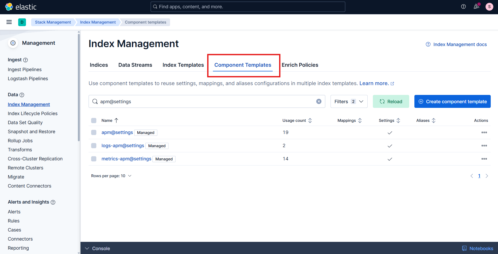
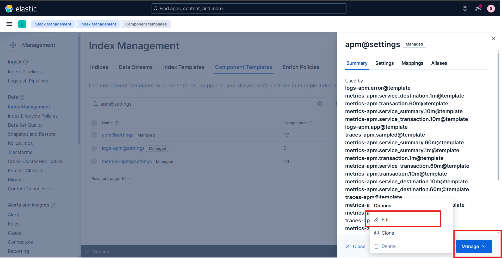
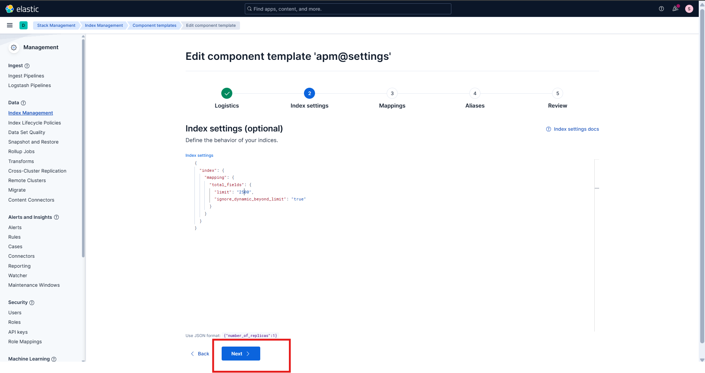
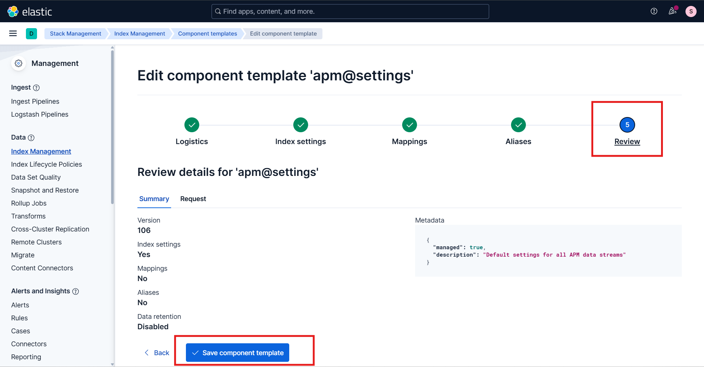
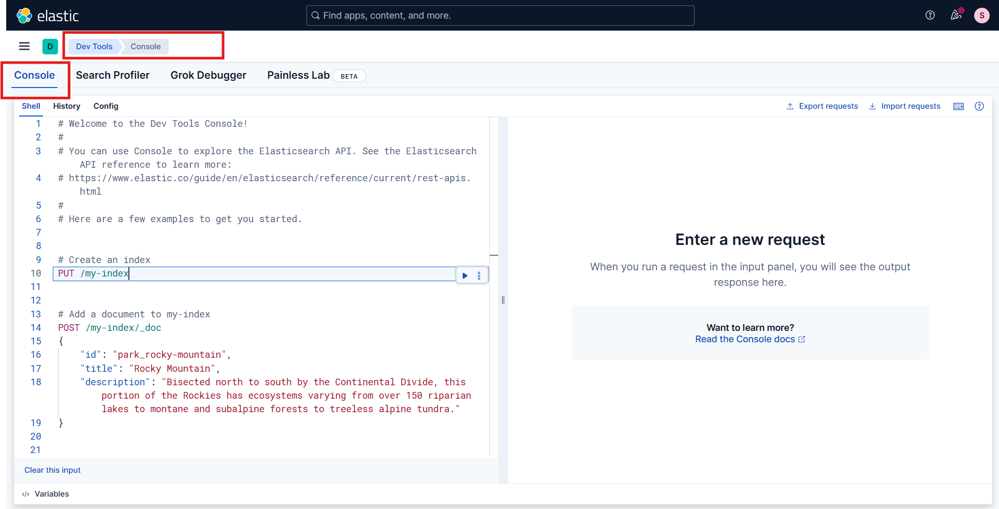
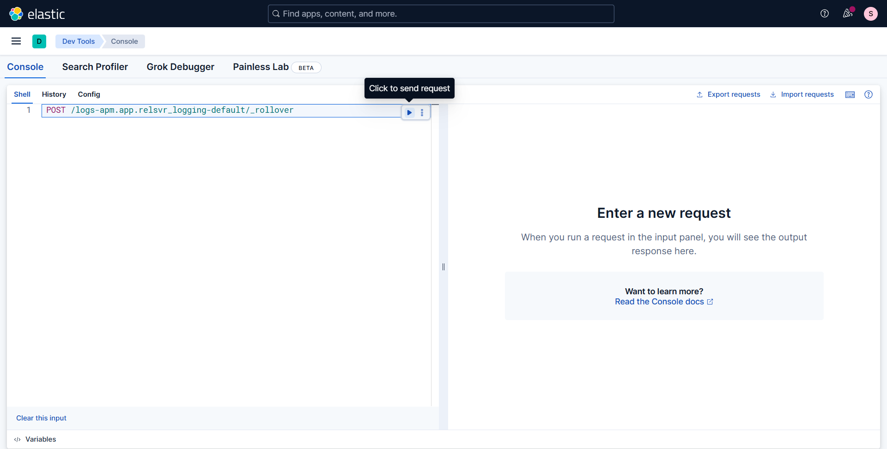
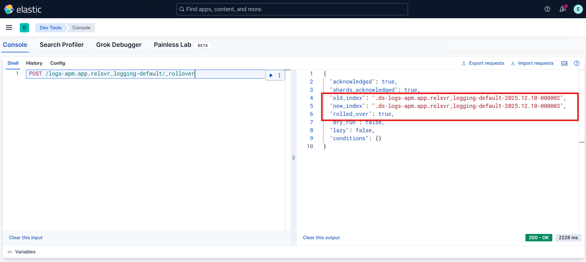
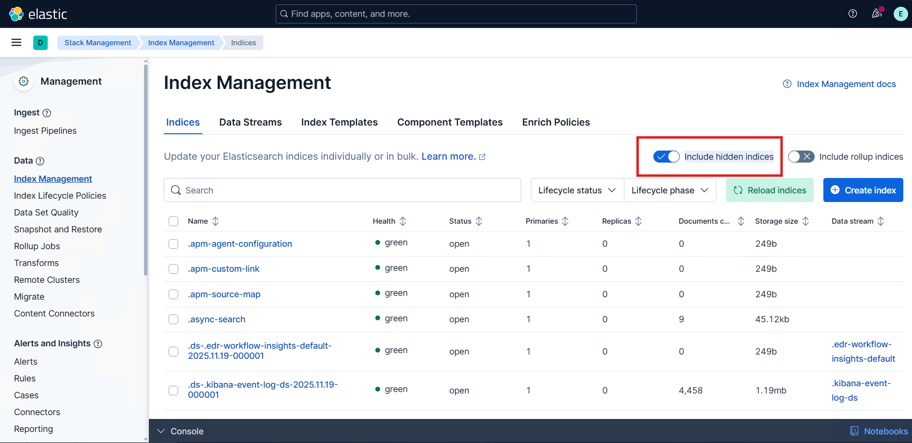
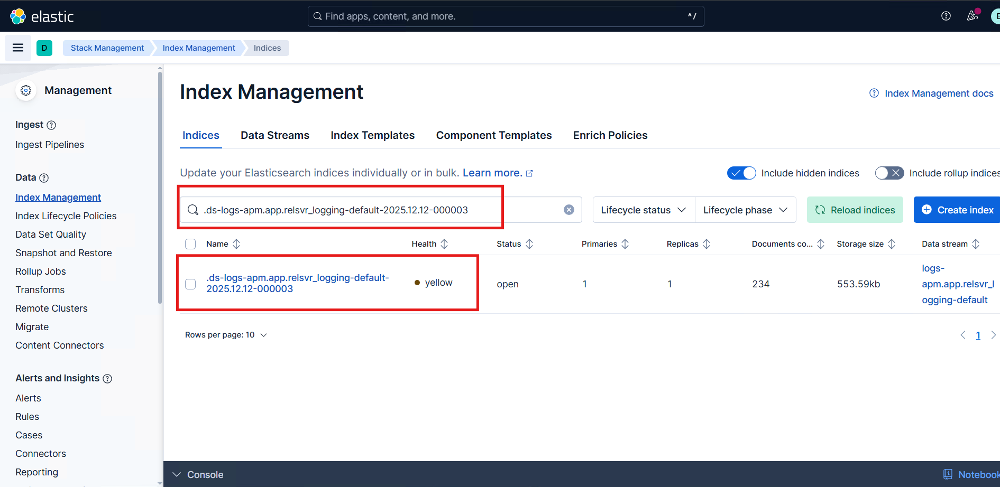
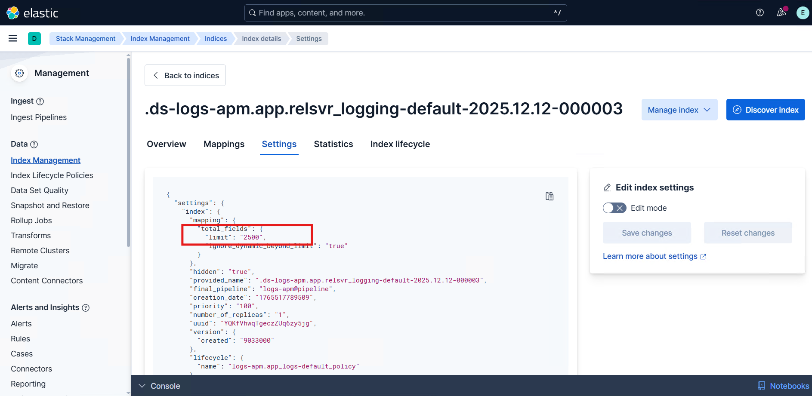

# Manual Elasticsearch Configuration

This guide provides the required steps to update and optimize Elasticsearch settings. These adjustments help ensure that Elasticsearch is configured to handle the expected data volume, prevent indexing issues, and maintain reliable system performance.


## Updating the index field limit

Elasticsearch enforces a limit on the total number of fields that can exist within an index. This is controlled by the `index.mapping.total_fields.limit` setting, which helps protect the cluster from mapping explosions and excessive memory usage.

When documents contain more fields than the value configured in index.mapping.total_fields.limit, Elasticsearch silently ignores the additional fields. This leads to:

- Missing or incomplete data
- Inconsistent query results
- Difficulty performing accurate analysis and aggregations

To ensure all fields are properly indexed and stored, the index.mapping.total_fields.limit value must be increased to accommodate the actual number of fields present in the incoming documents.

This documentation provides step-by-step instructions for manually updating Elasticsearch index settings to adjust the field limit and prevent data loss caused by exceeding the configured threshold.

### Step 1: Update the field limit in the apm@settings component template


1. Open Microsoft Edge.
2. Navigate to Kibana.
3. In Kibana, go to **Stack Management** → **Index Management** → **Component Templates**.
   
4. Use the search box to search for **apm@settings** template.
   
5. Open the **apm@settings** component template.
   1. Click on the template to view details.
   2. Click on **Manage**, select **Edit**.
   
6. In the edit view, navigate to the **Index settings** section.
    
7. Add or update the field limit to the required limit.
    
8. Save the component template.
   1. After updating the field limit, save the template using either method:
      1. **Guided workflow**: Click Next through the remaining tabs (**Mappings** → **Aliases** → **Review**) and then click **Save component template** on the **Review** page.
      
      2. **Direct save**: Navigate directly to the **Review** tab and click **Save**.
      

    Both options will successfully apply the updated template settings.
9. Verify **apm@settings** component template field limit is updated to the required limit.
  


### Step 2: Perform a rollover to apply the new settings

> [!NOTE]
> A rollover is only required when APM data streams already contain existing backing indices.
In the case of a fresh installation, no data has been ingested yet, and the APM data streams have not created any backing indices.
Because of this, Elasticsearch will automatically create the first index using the updated component template settings, and no rollover action is needed.

APM data streams consist of multiple backing indices (for example: metrics-apm-default-000123).
Updating the component template does not retroactively apply changes to these existing backing indices.

Because the data stream already has active backing indices, the updated field limit will only apply to new indices created after the change.

To apply the new settings, the following steps are required:
- Identify the correct APM data stream.
- Trigger a rollover to create a new backing index.
- Verify that the newly created index includes the updated limit.


1. Identify the APM data stream
    1. Go to **Discover**.
    2. Select the **Data view** associated with the index you are working with.
  

    3. Click on any of the latest documents to expand its details.
    4. Locate the `_index` field. 
        
       In the document details, find the value of the `_index` field.        
       Example: `.ds-logs-apm.app.relsvr_logging-default-2025.11.26-000013`
       

    5. Derive the data stream name
         
        Remove the `.ds-` prefix and the date/suffix portion from the index name.
        
        Using the example above: 
        `logs-apm.app.relsvr_logging-default`
        
        This is the data stream name that should be used for the rollover API.

2. Perform a rollover

    1. In Kibana, navigate to **Management** → **Dev Tools** → **Console**.
      

    2. Run the rollover command in the console window. Paste the following API request (replace the data stream name).
       ```
       POST /<data-stream-name-from-above-step>/_rollover
       ```

       

    3. Click the **Run** button (the arrow icon on the right side of the console input panel) to execute the request. In the response panel, ensure that the output contains:
        
        - `"rolled_over": true`, and
        - A new backing index is listed under `"new_index"`.

       

3. Validate the rollover applied the updated field limit

    1. In Kibana, go to **Stack Management** → **Index Management** → **Indices**.
    2. Enable the **Include hidden indices** option.
      
    3. Use the search box to search for the newly created backing index as part of the rollover.
      
    4. Click on the index to view details.
    5. Click on **Settings** and validate that the new limit is applied to the index.
      