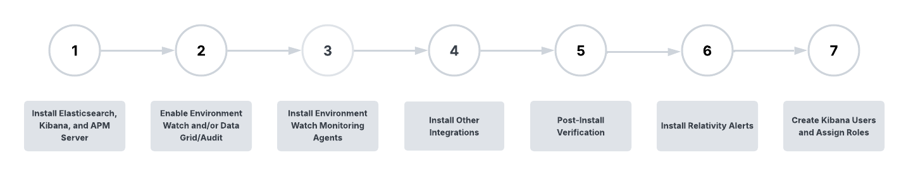

# Elasticsearch Pre-Installation Overview

## Install Elastic Stack Components

The first step of the **Environment Watch** and/or **Data Grid Audit** setup involves installing required third-party software from the **Elastic Stack**. The following Elastic components are used for these two products:

| Elastic Component | Environment Watch | Data Grid Audit |
|-------------------|-------------------|------------------|
| **Elasticsearch** | Required          | Required         |
| **Kibana**        | Required          | Recommended but optional |
| **APM Server**    | Required          | Not used         |

> [!NOTE]
> At this stage, there is no integration between any Elastic components and Relativity. Integration will be configured during **Step 2**.

In **Step 1**, the following actions are performed:
- Set up and verify the **Elasticsearch** cluster
- Set up **Kibana** and/or **APM Server**, depending on the product configuration

This step covers configuring a **shared Elasticsearch cluster** to be used for both **Environment Watch** and **Data Grid Audit**.

For detailed software and hardware prerequisites, refer to the [System Requirements section in the README](../README.md).

Before proceeding, the following section introduces key **Elastic Stack concepts**.

## Elastic Key Concepts

### Elasticsearch

> [!IMPORTANT]
> Ensure inbound/outbound ports are open for this Elastic stack component.

[See the port diagram for network requirements.](environment-watch/port-diagram.md)

Elasticsearch is a distributed search and analytics engine, scalable data store, and vector database built on Apache Lucene. It’s optimized for speed and relevance on production-scale workloads.

#### Elasticsearch Cluster

Elasticsearch is built on a distributed architecture made up of many servers or nodes. An Elasticsearch cluster is a group of one or more node instances that are connected together. Clustering enables Elasticsearch nodes to work together to ensure high availability when one or more nodes are down. An Elasticsearch cluster can continue operating normally if some of its nodes are unavailable or disconnected, as long as there are enough well-connected nodes to ensure high resilience and improved search performance.

See below for more information on Elasticsearch cluster configuration and high availability options:

- [Cluster configuration](https://www.elastic.co/guide/en/elasticsearch/reference/current/settings.html)
- [Set up a cluster for high availability](https://www.elastic.co/guide/en/elasticsearch/reference/current/high-availability.html)

#### Elasticsearch Nodes

An Elasticsearch node is a single server that is a part of a cluster. If a single node of Elasticsearch is running, then there is a cluster of one node. A node can have one or many roles that define the role(s) it plays within the cluster. The node role(s) is defined within the elasticsearch.yml . If roles are not set, the node is assigned to most available roles.

See [here](https://www.elastic.co/guide/en/elasticsearch/reference/current/modules-node.html#node-name-settings) for more information on Elasticsearch node settings and roles.

The two key roles for an Environment Watch and/or Data Grid Audit cluster are master and data.

- **Master Node**: controls the Elasticsearch cluster and is responsible for all cluster-wide operations like creating/deleting an index and adding/removing nodes.
- **Data Node**: stores data and executes data-related operations such as search and aggregation.

Every Elasticsearch cluster requires at least one node designated master and data.

> [!NOTE]
> In a cluster being used for both Environment Watch and Data Grid Audit, you do not designate any given data node as being for one or the other. Any node in the cluster can support operations for either product.

### Kibana

> [!IMPORTANT]
> Ensure inbound/outbound ports are open for this Elastic stack component.

[See the port diagram for network requirements.](environment-watch/port-diagram.md)

Kibana is a user interface that lets users visualize Elasticsearch data and navigate the Elastic stack. See below for more information on Kibana.

- [What is Kibana?](https://www.elastic.co/guide/en/kibana/current/introduction.html)
- [Kibana key concepts](https://www.elastic.co/guide/en/kibana/current/kibana-concepts-analysts.html)

### APM Server

> [!IMPORTANT]
> Ensure inbound/outbound ports are open for this Elastic stack component.

[See the port diagram for network requirements.](environment-watch/port-diagram.md)

The APM Server provides a fully Open Telemetry compliant telemetry backend to periodically receive log, metric, and trace data from each monitored server.

See [here](https://www.elastic.co/guide/en/observability/current/apm.html) for more information about Elastic’s APM Server.

## System Requirements and Licensing

> [!NOTE]
> The documentation below includes several links to instructions in Elastic’s official documentation. Whenever jumping into Elastic documentation, ensure the proper Elasticsearch, Kibana, or APM Server documentation version is selected.

Setting up the Elastic stack components will require installing Elastic software on one or more servers. This installation guide covers configuring a shared Elasticsearch cluster to use for both Environment Watch and Data Grid Audit. The **_Hardware Recommendations by Environment Size_** section below provides hardware guidance for different deployment scenarios and reference environments.

**Small environment size used for Environment Watch and Data Grid Audit_**

### Software Requirements

Any server being used to host Elastic components requires:

- **Operating System** – See [here](https://help.relativity.com/Server2024/Content/System_Guides/Workstation_Configuration/User_hardware_and_software_requirements.htm) for supported operating systems.

### Hardware Recommendations by Environment Size

The number of servers and hardware specifications needed to host the Elastic components will vary depending on the size of the Relativity instance and whether the cluster is intended for Environment Watch, Data Grid Audit, or both. Below are recommendations based on four Relativity Server environment sizes. These are only recommendations. The node counts and role blends can be adjusted for the environment based on observed and desired performance and reliability needs.

**A few other key notes and reminders:**

- **Tuning for speed** – Review Elastic’s guidance on how to tune the environment for speed [here](https://www.elastic.co/guide/en/elasticsearch/reference/current/tune-for-search-speed.html).

**Environment Size**

| Environment Size              | Web Servers | Agent Servers | Worker Servers | SQL Distributed Servers |
| ----------------------------- | ----------- | ------------- | -------------- | ----------------------- |
| Development                   | 1           | 2             | 1              | 1                       |
| Small                         | 2           | 10            | 2              | 2                       |
| Medium                        | 8           | 20            | 6              | 6                       |
| Large                         | 12          | 40            | 10             | 12                      |
| X-Large                       | 24          | 80            | 10             | 16                      |

#### Elastic Stack Infrastructure Recommendations

| Environment Size              | DG/Audit Data Nodes | Environment Watch Data Nodes | APM Servers | Kibana Servers |
| ----------------------------- | ------------------- | ---------------------------- | ----------- | -------------- |
| Development                   | 1 / 500 GB          | 1 / 1 TB                     | 1           | 1              |
| Small                         | 1 / 1 TB            | 1 / 2 TB                     | 1           | 1              |
| Medium                        | 2 / 2 TB            | 2 / 3 TB                     | 1           | 1              |
| Large                         | 5 / 16 TB           | 3 / 8 TB                     | 2           | 2              |
| X-Large                       | 10 / 32 TB          | 5 / 16 TB                    | 3           | 3              |

- Separate Elastic clusters is supported when using both Audit/Environment Watch but not required 
- APM/Kibana servers can be load balanced
- Each Elasticsearch node should have at least <b>4 vCPU</b> and <b>32 GB RAM</b>.
- A single Data node can be used for both Audit and Environment Watch in Development environments.

### Licensing

Both Environment Watch and Data Grid Audit require only a free and open ("Basic") Elastic license. By default, new installations have a Basic license that never expires. If you would like to utilize additional Elastic features from the Platinum or Enterprise subscription, you will need to purchase the license separately.

If you have used Elasticsearch for the optional Data Grid Audit feature on Relativity Server prior to April 2025, you would have been using a Platinum license key provided by Relativity. Effective with Server 2024 Patch 1, the Platinum license is no longer required for Data Grid Audit and Relativity will not provide a Platinum license for any new deployments of Data Grid Audit. All existing Data Grid Audit customers will have until early 2026 to adopt Relativity Server 2024 and update to a Basic Elastic license.

## Installing the Elastic stack components

### Before you start

1. **Plan your cluster** – based on the size of your environment, establish a game plan for how many servers/nodes you intend to use and the role of each node within the cluster. We recommend using a Development environment to test drive Environment Watch in order to get up and running as quickly as possible.

2. **Review the required ports for Elastic components** – See the [port diagram](environment-watch/port-diagram.md) for network requirements and ensure all necessary ports are open between servers hosting Elasticsearch, Kibana, and APM Server.

3. **Windows *should* be updated to support long paths** - This is recommended because the Elastic Stack components have dense file paths when fully extracted. In many cases, the product appears to function properly but certain features may fail because files may be missing or cannot be accessed because the path exceeds the max Windows character length. Run "gpedit.msc" to navigate into Local Group Policy Editor → Computer Configuration → Administrative Template → System → Filesystem. Double click on Enable Win32 Long path. Select the Enable radio button, click Apply, and then click OK.

    https://learn.microsoft.com/en-us/windows/win32/fileio/maximum-file-path-limitation?tabs=registry#enable-long-paths-in-windows-10-version-1607-and-later

3. **Verify the minimum supported version of Elastic** -  All Relativity products have been certified with Elastic Stack 8.17.x, though Data Grid Audit alone is supported on 7.17.x. If you intend to use a single cluster for both, you must install the same version of Elasticsearch on all nodes in the cluster, and that version must be the higher of the minimum versions for Environment Watch and Data Grid Audit, if different. 

4. **At least the minimum Relativity major version and patch** specified in the Environment Watch bundle you intend to deploy is installed on all servers in the environment. See the [System Requirements](../README.md) for the minimum version required.

5. **At least the minimum supported version of Windows Server** for the major version of Relativity installed in your environment is installed on each target server in your cluster (see [here](https://help.relativity.com/Server2024/Content/System_Guides/Workstation_Configuration/User_hardware_and_software_requirements.htm)).

### Next step

[Click here to setup an Elastic Stack for a development environment](./elasticsearch_setup_development.md)

[Click here to setup an Elastic Stack for a production environment](./elasticsearch_setup_production.md)