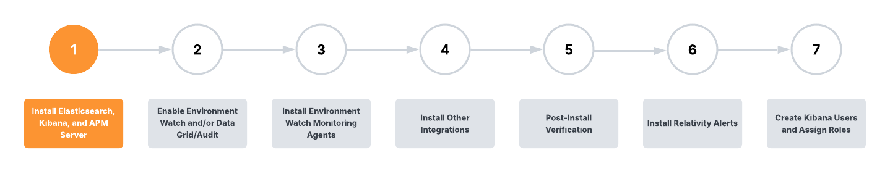

# System Requirements

> **Banner:**
> This documentation and release have been tested and certified by Relativity with the following software versions. Any versions above those listed below have not been tested or certified for this release.

**Relativity Server Version:**
- Minimum required: Relativity Server 2024 Patch 1

**Elasticsearch Version:**
- 8.17.3 (Required for both Environment Watch and Data Grid Audit)

**Kibana Version:**
- 8.17.3

**APM Server Version:**
- 8.17.3

# Installing Elasticsearch, Kibana, and APM Server

This first stage of the Environment Watch and/or Data Grid Audit setup involves installing required third-party software from the Elastic stack. There are three Elastic components used for these two products:

| Elastic component | Environment Watch | Data Grid Audit |
| --- | --- | --- |
| **Elasticsearch** | Required | Required |
| **Kibana** | Required | Recommended but optional |
| **APM Server** | Required | Not used |

When you complete stage 1, there will be no integration between any of the Elastic components and Relativity when you complete this step. The integration will be set up during stage 2. Within stage 1, you will first set up and verify your Elasticsearch cluster and then proceed to set up Kibana and/or APM Server depending on whether you are configuring Environment Watch, Data Grid Audit, or both.

Stage 1 of this installation guide is based on a scenario where you are configuring a single shared Elasticsearch cluster to use for both Environment Watch and Data Grid Audit in a Small Relativity Server environment. The System Requirements section below includes additional details on software and hardware requirements based on the size of your Relativity Server environment and whether you are setting up Environment Watch, Data Grid Audit, or both.

Before you start, we will cover some key Elastic stack concepts.

## Elastic Key Concepts

### Elasticsearch
[See the port diagram for network requirements.](environment-watch/port-diagram.md)

> **Banner:**
> Ensure inbound/outbound ports are open for this Elastic stack component.

Elasticsearch is a distributed search and analytics engine, scalable data store, and vector database built on Apache Lucene. It’s optimized for speed and relevance on production-scale workloads.

#### Elasticsearch Cluster

Elasticsearch is built on a distributed architecture made up of many servers or nodes. An Elasticsearch cluster is a group of one or more node instances that are connected together. Clustering enables Elasticsearch nodes to work together to ensure high availability when one or more nodes are down. An Elasticsearch cluster can continue operating normally if some of its nodes are unavailable or disconnected, as long as there are enough well-connected nodes to ensure high resilience and improved search performance.

See below for more information on Elasticsearch cluster configuration and high availability options:

- [Cluster configuration](https://www.elastic.co/guide/en/elasticsearch/reference/current/settings.html)
- [Set up a cluster for high availability](https://www.elastic.co/guide/en/elasticsearch/reference/current/high-availability.html)

#### Elasticsearch Nodes

An Elasticsearch node is a single server that is a part of a cluster. If you are running a single node of Elasticsearch, then you have a cluster of one node. A node can have one or many roles that define the role(s) it plays within the cluster. You define a node’s roles in the elasticsearch.yml file. The node role(s) is defined within the elasticsearch.yml . If you don’t set roles, the node is assigned to most available roles.

See [here](https://www.elastic.co/guide/en/elasticsearch/reference/current/modules-node.html#node-name-settings) for more information on Elasticsearch node settings and roles.

The two key roles for an Environment Watch and/or Data Grid Audit cluster are master and data.

- **Master Node**: controls the Elasticsearch cluster and is responsible for all cluster-wide operations like creating/deleting an index and adding/removing nodes.
- **Data Node**: stores data and executes data-related operations such as search and aggregation.

Every Elasticsearch cluster requires at least one node designated master and data.

In a cluster being used for both Environment Watch and Data Grid Audit, you do not designate any given data node as being for one or the other. Any node in the cluster can support operations for either product.

### Kibana
[See the port diagram for network requirements.](environment-watch/port-diagram.md)

> **Banner:**
> Ensure inbound/outbound ports are open for this Elastic stack component.

Kibana is a user interface that lets you visualize your Elasticsearch data and navigate the Elastic stack. See below for more information on Kibana.

- [What is Kibana?](https://www.elastic.co/guide/en/kibana/current/introduction.html)
- [Kibana key concepts](https://www.elastic.co/guide/en/kibana/current/kibana-concepts-analysts.html)

### APM Server
[See the port diagram for network requirements.](environment-watch/port-diagram.md)

> **Banner:**
> Ensure inbound/outbound ports are open for this Elastic stack component.

The APM Server provides a fully Open Telemetry compliant telemetry backend to periodically receive log, metric, and trace data from each monitored server.

See [here](https://www.elastic.co/guide/en/observability/current/apm.html) for more information about Elastic’s APM Server.

## System Requirements and Licensing

The documentation below includes several links to instructions in Elastic’s official documentation. Whenever you are jumping into Elastic documentation, ensure the proper Elasticsearch, Kibana, or APM Server documentation version is selected.

Setting up your Elastic stack components will require you to install Elastic software on one or more servers. This installation guide is based on a scenario where you are configuring a single shared Elasticsearch cluster to use for both Environment Watch and Data Grid Audit in a Small Relativity Server environment. In this scenario you will be installing Elastic on five separate servers as pictured below. The **_Hardware Recommendations by Environment Size_** section below provides hardware guidance based on the size of your Relativity Server environment and whether you are setting up Environment Watch, Data Grid Audit, or both.

**Small environment size used for Environment Watch and Data Grid Audit_**

### Software Requirements

Any server being used to host Elastic components requires:

- **Operating System** – See [here](https://help.relativity.com/Server2024/Content/System_Guides/Workstation_Configuration/User_hardware_and_software_requirements.htm) for supported operating systems.

### Hardware Recommendations by Environment Size

The number of servers and hardware specifications that you need to host the Elastic components will vary depending on the size of your Relativity instance and whether you intend to use the cluster for Environment Watch, Data Grid Audit, or both. Below you will find recommendations based on four Relativity Server environment sizes. These are only recommendations. You can adjust the node counts and role blends for your environment based on observed and desired performance and reliability needs.

**A few other key notes and reminders:**

- **Tuning for speed** – Review Elastic’s guidance on how to tune your environment for speed [here](https://www.elastic.co/guide/en/elasticsearch/reference/current/tune-for-search-speed.html).
- **Hosting Elastic** – While the guidance below recommends installing the Elastic components on many dedicated servers, there are no hard requirements to isolate Elasticsearch, Kibana, or APM Server on dedicated hosts. As evident with the Development environment specifications, you can deploy the full Elastic stack on a single host if that server can meet your storage needs.
  - **Kibana and APM Server hosting:**
    - For Small environments, we recommend dedicated servers for Kibana and APM Server, but you can consider installing Kibana and/or APM Server on a single server or even on the same server being used as an Elasticsearch node for development and very small environments.
    - For Medium environments and above, we strongly recommend installing Kibana and APM Server each on dedicated servers.
- **Nodes in a shared Environment Watch/Data Grid cluster** – In a cluster being used for both Environment Watch and Data Grid Audit, you are not required to designate data nodes for one or the other. Any node in the cluster can support operations for either product, though dedicated node assignments may be needed for certain workloads.

**Environment Size**

The environment size is defined by the number of Web, Agent, and Worker servers within the instance.

| Environment Size| Web Servers   | Agent Servers | Workers |
| --------------- | ------------- | ------------- | ------- |
| Development     | 1             | 1             | 1       |
| Small           | 1             | 4             | 1       |
| Medium          | 2-4           | 5-9           | 2-9     |
| Large           | 5+            | 10+           | 10+     |

#### Environment Size – Development

For a development environment, all Elasticsearch components are installed within a single server to minimize complexity and get up and running as quickly as possible. <b>There are no data upgrades performed for this environment.</b>

 

| Elastic Stack Component                   | Server Count | CPU | RAM (GB) | Disk (TB) |
| ----------------------------------------- | ------------ | --- | -------- | --------- |
| **Environment Watch Only**                |              |     |          |           |
| Elasticsearch/Kibana/APM Server           | 1            | 4   | 32       | 1         |
| **Data Grid Audit Only**                  |              |     |          |           |
| Elasticsearch/Kibana (optional)           | 1            | 4   | 32       | 1         |
| **Environment Watch and Data Grid Audit** |              |     |          |           |
| Elasticsearch/Kibana/APM Server           | 1            | 4   | 32       | 1         |

#### Environment Size – Small

For a small environment, we recommend dedicated Kibana and APM Server server, but can consider installing Kibana and/or APM Server on a single server or even on the same server being used as an Elasticsearch node.

 

| Elastic Stack Component                   | Server Count | CPU | RAM (GB) | Disk (TB) |
| ----------------------------------------- | ------------ | --- | -------- | --------- |
| **Environment Watch Only**                |              |     |          |           |
| Elasticsearch nodes                       | 2            | 4   | 32       | 1         |
| Kibana                                    | 1            | 4   | 32       | 1         |
| APM Server                                | 1            | 4   | 32       | 1         |
| **Data Grid Audit Only**                  |              |     |          |           |
| Elasticsearch nodes                       | 2            | 4   | 32       | 1         |
| Kibana (optional)                         | 1            | 4   | 32       | 1         |
| APM Server                                | N/A          | -   | -        | -         |
| **Environment Watch and Data Grid Audit** |              |     |          |           |
| Elasticsearch nodes                       | 3            | 4   | 32       | 1         |
| Kibana                                    | 1            | 4   | 32       | 1         |
| APM Server                                | 1            | 4   | 32       | 1         |

#### Environment Size – Medium

For a medium environment, a few additional nodes are added to the Elasticsearch cluster(s).

 

| Elastic Stack Component                   | Server Count | CPU | RAM (GB) | Disk (TB) |
| ----------------------------------------- | ------------ | --- | -------- | --------- |
| **Environment Watch Only**                |              |     |          |           |
| Elasticsearch nodes                       | 3            | 4   | 32       | 1         |
| Kibana                                    | 1            | 4   | 32       | 1         |
| APM Server                                | 1            | 4   | 32       | 1         |
| **Data Grid Audit Only**                  |              |     |          |           |
| Elasticsearch nodes                       | 3            | 4   | 32       | 1         |
| Kibana (optional)                         | 1            | 4   | 32       | 1         |
| APM Server                                | N/A          | -   | -        | -         |
| **Environment Watch and Data Grid Audit** |              |     |          |           |
| Elasticsearch nodes                       | 6            | 4   | 32       | 1         |
| Kibana                                    | 1            | 4   | 32       | 1         |
| APM Server                                | 1            | 4   | 32       | 1         |

#### Environment Size – Large

For a large environment, Elasticsearch is scaled horizontally by adding more nodes to the cluster(s).

 

| Elastic Stack Component                   | Server Count           | CPU | RAM (GB) | Disk (TB) |
| ----------------------------------------- | ---------------------- | --- | -------- | --------- |
| **Environment Watch Only**                |                        |     |          |           |
| Elasticsearch nodes                       | 4                      | 4   | 32       | 1         |
| Kibana                                    | 1                      | 4   | 32       | 1         |
| APM Server                                | 1                      | 4   | 32       | 1         |
| **Data Grid Audit Only**                  |                        |     |          |           |
| Elasticsearch nodes                       | 1-15 (scale on demand) | 4   | 32       | 1         |
| Kibana (optional)                         | 1                      | 4   | 32       | 1         |
| APM Server                                | N/A                    | -   | -        | -         |
| **Environment Watch and Data Grid Audit** |                        |     |          |           |
| Elasticsearch nodes                       | 4-18 (scale on demand) | 4   | 32       | 1         |
| Kibana                                    | 1                      | 4   | 32       | 1         |
| APM Server                                | 1                      | 4   | 32       | 1         |

### Licensing

Environment Watch only requires a free and open ("Basic") Elastic license. By default, new installations have a Basic license that never expires. If you would like to utilize additional Elastic features from the Platinum or Enterprise subscription, you will need to purchase the license separately.

If you have used Elasticsearch for the optional Data Grid Audit feature on Relativity Server prior to April 2025, you would have been using a Platinum license key provided by Relativity. Effective with Server 2024 Patch 1, the Platinum license is no longer required for Data Grid Audit and Relativity will not provide a Platinum license for any new deployments of Data Grid Audit. All existing Data Grid Audit customers will have until early 2026 to adopt Relativity Server 2024 and update to a Basic Elastic license.

## Installing the Elastic stack components

### Before you start

1. **Plan your cluster** – based on the size of your environment, establish a game plan for how many servers/nodes you intend to use and the role of each node within the cluster. We recommend using a Development environment to test drive Environment Watch in order to get up and running as quickly as possible.

2. **Review the required ports for Elastic components** – See the [port diagram](environment-watch/port-diagram.md) for network requirements and ensure all necessary ports are open between servers hosting Elasticsearch, Kibana, and APM Server.

3. **Windows *should* be updated to support long paths** - This is recommended because the Elastic Stack components have dense file paths when fully extracted. In many cases, the product apppears to function properly but certain features may fail because files may be missing or cannot be accessed because the path exceeds the max Windows character length. Run "gpedit.msc" to navigate into Local Group Policy Editor → Computer Configuration → Administrative Template → System → Filesystem. Double click on enable the Long path.

    https://learn.microsoft.com/en-us/windows/win32/fileio/maximum-file-path-limitation?tabs=registry#enable-long-paths-in-windows-10-version-1607-and-later

3. **Verify the minimum supported version of Elastic** -  All Relativity products have been certified with Elastic Stack 8.17.x, though Data Grid Audit alone is supported on 7.17.x. If you intend to use a single cluster for both, you must install the same version of Elasticsearch on all nodes in the cluster, and that version must be the higher of the minimum versions for Environment Watch and Data Grid Audit, if different. 

4. **At least the minimum Relativity major version and patch** specified in the Environment Watch bundle you intend to deploy is installed on all servers in the environment. See the [release bundle](https://github.com/relativitydev/server-bundle-release/releases) requirements for the minimum version required.

5. **At least the minimum supported version of Windows Server** for the major version of Relativity installed in your environment is installed on each target server in your cluster (see [here](https://help.relativity.com/Server2024/Content/System_Guides/Workstation_Configuration/User_hardware_and_software_requirements.htm)).

### Installation steps

[Click here to setup an Elastic Stack for a development environment](./elasticsearch_setup_development.md)

[Click here to setup an Elastic Stack for a production environment](./elasticsearch_setup_production.md)