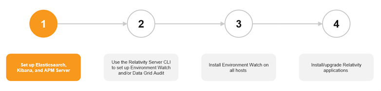

# Installing Elasticsearch, Kibana, and APM Server



This first stage of the Environment Watch and/or Data Grid Audit setup involves installing required third-party software from the Elastic stack. There are three Elastic components used for these two products:

| Elastic component | Environment Watch | Data Grid Audit |
| --- | --- | --- |
| **Elasticsearch** | Required | Required |
| **Kibana** | Required | Recommended but optional |
| **APM Server** | Required | Not used |

When you complete stage 1, there will be no integration between any of the Elastic components and Relativity when you complete this step. The integration will be set up during stage 2. Within stage 1, you will first set up and verify your Elasticsearch cluster and then proceed to set up Kibana and/or APM Server depending on whether you are configuring Environment Watch, Data Grid Audit, or both.

Stage 1 of this installation guide is based on a scenario where you are configuring a single shared Elasticsearch cluster to use for both Environment Watch and Data Grid Audit in a Tier 1 (Small) Relativity Server environment. The System Requirements section below includes additional details on software and hardware requirements based on the size of your Relativity Server environment and whether you are setting up Environment Watch, Data Grid Audit, or both.

Before you start, we will cover some key Elastic stack concepts.

## Elastic Key Concepts

### Elasticsearch

Elasticsearch is a distributed search and analytics engine, scalable data store, and vector database built on Apache Lucene. It’s optimized for speed and relevance on production-scale workloads.

#### Elasticsearch Cluster

Elasticsearch is built on a distributed architecture made up of many servers or nodes. An Elasticsearch cluster is a group of one or more node instances that are connected together. Clustering enables Elasticsearch nodes to work together to ensure high availability when one or more nodes are down. An Elasticsearch cluster can continue operating normally if some of its nodes are unavailable or disconnected, as long as there are enough well-connected nodes to ensure high resilience and improved search performance.

See below for more information on Elasticsearch cluster configuration and high availability options:

- [Cluster configuration](https://www.elastic.co/guide/en/elasticsearch/reference/current/settings.html)
- [Set up a cluster for high availability](https://www.elastic.co/guide/en/elasticsearch/reference/current/high-availability.html)

#### Elasticsearch Nodes

An Elasticsearch node is a single server that is a part of a cluster. If you are running a single node of Elasticsearch, then you have a cluster of one node. A node can have one or many roles that define the role(s) it plays within the cluster. You define a node’s roles in the elasticsearch.yml file. The node role(s) is defined within the elasticsearch.yml . If you don’t set roles, the node is assigned to most available roles.

See [here](https://www.elastic.co/guide/en/elasticsearch/reference/current/modules-node.html#node-name-settings) for more information on Elasticsearch node settings and roles.

The two key roles for an Environment Watch and/or Data Grid Audit cluster are master and data.

- **Master Node**: controls the Elasticsearch cluster and is responsible for all cluster-wide operations like creating/deleting an index and adding/removing nodes.
- **Data Node**: stores data and executes data-related operations such as search and aggregation.

Every Elasticsearch cluster requires at least one node designated master and data.

<div class="note">In a cluster being used for both Environment Watch and Data Grid Audit, you do not designate any given data node as being for one or the other. Any node in the cluster can support operations for either product.</div>

### Kibana

Kibana is a user interface that lets you visualize your Elasticsearch data and navigate the Elastic stack. See below for more information on Kibana.

- [What is Kibana?](https://www.elastic.co/guide/en/kibana/current/introduction.html)
- [Kibana key concepts](https://www.elastic.co/guide/en/kibana/current/kibana-concepts-analysts.html)

### APM Server

The APM Server provides a fully Open Telemetry compliant telemetry backend to periodically receive log, metric, and trace data from each monitored server.

See [here](https://www.elastic.co/guide/en/observability/current/apm.html) for more information about Elastic’s APM Server.

## System Requirements and Licensing

<div class="note">The documentation below includes several links to instructions in Elastic’s official documentation. Whenever you are jumping into Elastic documentation, ensure the proper Elasticsearch, Kibana, or APM Server documentation version is selected.</div>

Setting up your Elastic stack components will require you to install Elastic software on one or more servers. This installation guide is based on a scenario where you are configuring a single shared Elasticsearch cluster to use for both Environment Watch and Data Grid Audit in a Tier 1 (Small) Relativity Server environment. In this scenario you will be installing Elastic on five separate servers as pictured below. The **_Hardware Requirements by Instance Tier_** section below provides hardware guidance based on the size of your Relativity Server environment and whether you are setting up Environment Watch, Data Grid Audit, or both.


**_Tier 1 environment used for Environment Watch and Data Grid Audit_**

### Software Requirements

Any server being used to host Elastic components requires:

- **Operating System** – See [here](https://help.relativity.com/Server2024/Content/System_Guides/Workstation_Configuration/User_hardware_and_software_requirements.htm) for supported operating systems.

### Hardware Recommendations by Instance Tier

The number of servers and hardware specifications that you need to host the Elastic components will vary depending on the size of your Relativity instance and whether you intend to use the cluster for Environment Watch, Data Grid Audit, or both. Below you will find recommendations based on four Relativity Server instance tiers. These are only recommendations. You can adjust the node counts and role blends for your environment based on observed and desired performance and reliability needs.

A few other key notes and reminders:

- **Tuning for speed** - Review Elastic’s guidance on how to tune your environment for speed [here](https://www.elastic.co/guide/en/elasticsearch/reference/current/tune-for-search-speed.html).
- **Hosting Elastic –** While the guidance below recommends installing the Elastic components on many dedicated servers, there are no hard requirements to isolate Elasticsearch, Kibana, or APM Server on dedicated hosts. As evident with the Tier 0 – Test environment specifications, you can deploy the full Elastic stack on a single host if that server can meet your storage needs.
  - **Kibana and APM Server hosting** –
    - For Tier 1 instances we recommend dedicated servers for Kibana and APM Server, but on the smaller end of the tier you can consider installing Kibana and/or APM Server on a single server or even on the same server being used as an Elasticsearch node.
    - For Tier 2 and 3 environments, we strongly recommend installing Kibana and APM Server on dedicated servers for each.
- **Nodes in a shared Environment Watch/Data Grid cluster** - In a cluster being used for both Environment Watch and Data Grid Audit, you do not designate any given data node as being for one or the other. Any node in the cluster can support operations for either product.

**Tier Definitions**

The instance tiers are defined by the number of Web, Agent, and Worker servers in the instance.

| Tier | Web Servers | Agent Servers | Workers |
| --- | --- | --- | --- |
| 0 - Test | Single device |     |     |
| 1 - Small | 1   | 4   | 1   |
| 2 - Medium | 2-4 | 5-9 | 2-9 |
| 3 - Large | 5+  | 10+ | 10+ |

#### Tier 1 – Small

<div class="note">For Tier 1 instances we recommend dedicated servers for Kibana and APM Server, but on the smaller end of the tier you can consider installing Kibana and/or APM Server on a single server or even on the same server being used as an Elasticsearch node.</div>

| Elastic component | Server Count | CPU | RAM (GB) | Disk (TB) |
| --- | --- | --- | --- | --- |
| **Environment Watch Only** |     |     |     |     |
| Elasticsearch nodes | 2   | 4   | 32  | 1   |
| Kibana | 1   | 4   | 32  | 1   |
| APM Server | 1   | 4   | 32  | 1   |
| **Data Grid Audit Only** |     |     |     |     |
| Elasticsearch nodes | 2   | 4   | 32  | 1   |
| Kibana (optional) | 1   | 4   | 32  | 1   |
| APM Server | N/A | \-  | \-  | \-  |
| **Environment Watch and Data Grid Audit** |     |     |     |     |
| Elasticsearch nodes | 3   | 4   | 32  | 1   |
| Kibana | 1   | 4   | 32  | 1   |
| APM Server | 1   | 4   | 32  | 1   |

#### Tier 2 – Medium

| Elastic component | Server Count | CPU | RAM (GB) | Disk (TB) |
| --- | --- | --- | --- | --- |
| **Environment Watch Only** |     |     |     |     |
| Elasticsearch nodes | 3   | 4   | 32  | 2   |
| Kibana | 1   | 4   | 32  | 2   |
| APM Server | 1   | 4   | 32  | 2   |
| **Data Grid Audit Only** |     |     |     |     |
| Elasticsearch nodes | 3   | 4   | 32  | 2   |
| Kibana (optional) | 1   | 4   | 32  | 2   |
| APM Server | N/A | \-  | \-  | \-  |
| **Environment Watch and Data Grid Audit** |     |     |     |     |
| Elasticsearch nodes | 6   | 4   | 32  | 2   |
| Kibana | 1   | 4   | 32  | 2   |
| APM Server | 1   | 4   | 32  | 2   |

#### Tier 3 – Large

| Elastic component | Server Count | CPU | RAM (GB) | Disk (TB) |
| --- | --- | --- | --- | --- |
| **Environment Watch Only** |     |     |     |     |
| Elasticsearch nodes | 4   | 4   | 32  | 4   |
| Kibana | 1   | 4   | 32  | 4   |
| APM Server | 1   | 4   | 32  | 4   |
| **Data Grid Audit Only** |     |     |     |     |
| Elasticsearch nodes | 1-15 (scale on demand) | 4   | 32  | 2   |
| Kibana (optional) | 1   | 4   | 32  | 2   |
| APM Server | N/A | \-  | \-  | \-  |
| **Environment Watch and Data Grid Audit** |     |     |     |     |
| Elasticsearch nodes | 4 -18 (scale on demand) | 4   | 32  | 4   |
| Kibana | 1   | 4   | 32  | 4   |
| APM Server | 1   | 4   | 32  | 4   |

### Licensing

Environment Watch only requires a free and open ("Basic") Elastic license. By default, new installations have a Basic license that never expires. If you would like to utilize additional Elastic features from the Platinum or Enterprise subscription, you will need to purchase the license separately.

If you have used Elasticsearch for the optional Data Grid Audit feature on Relativity Server prior to April 2025, you would have been using a Platinum license key provided by Relativity. Effective with Server 2024 Patch 1, the Platinum license is no longer required for Data Grid Audit and Relativity will not provide a Platinum license for any new deployments of Data Grid Audit. All existing Data Grid Audit customers will have until early 2026 to adopt Relativity Server 2024 and update to a Basic Elastic license.

## Installing the Elastic stack components

### Before you start

1. **Plan your cluster** – based on the size of your environment, establish a game plan for how many servers/nodes you intend to use and the role of each node within the cluster.
2. **Windows must be updated to support long paths to enable the Local Group Policy Editor** - Run "gpedit.msc" to navigate into Local Group Policy Editor → Computer Configuration → Administrative Template → System → Filesystem. Double click on enable the Long path.
3. **Verify the minimum supported version of Elastic**
    <div class="note">Data Grid Audit may require a lower minimum version of Elasticsearch than Environment Watch. If you intend to use a cluster for both, you must install the same version of Elasticsearch on all nodes in the cluster, and that version must be the higher of the minimum versions for Environment Watch and Data Grid Audit, if different.</div>
4. **At least the minimum Relativity major version and patch** specified in the Environment Watch bundle you intend to deploy is installed on all servers in the environment. See the [release bundle](https://github.com/relativityone/server-environment-watch-releases/releases) requirements for the minimum version required.
5. **At least the minimum supported version of Windows Server** for the major version of Relativity installed in your environment is installed on each target server in your cluster (see [here](https://help.relativity.com/Server2024/Content/System_Guides/Workstation_Configuration/User_hardware_and_software_requirements.htm)).

### Installation steps

#### Step 1: Download and Install Elasticsearch on All Three Nodes

1. **Download Elasticsearch**
	a. Visit [Elastic’s official download page](https://www.elastic.co/downloads/elasticsearch).
	b. Download the Windows .zip version.
	c. Extract it to a directory (e.g., C:\\Elasticsearch\\Node1, C:\\Elasticsearch\\Node2, C:\\Elasticsearch\\Node3).
	d. Run bin\\elasticsearch.bat from the command line to start Elasticsearch
		- When starting Elasticsearch for the first time, security features are enabled and configured by default. The following security configuration occurs automatically:
			- Authentication and authorization are enabled, and a password is generated for the elastic built-in superuser.
			- Certificates and keys for TLS are generated for the transport and HTTP layer, and TLS is enabled and configured with these keys and certificates.
			- An enrollment token is generated for Kibana, which is valid for 30 minutes.
2. **Configure elasticsearch.yml on Each Node**  
	a. Modify config\\elasticsearch.yml on each node:
    ```
    cluster.name: my-cluster  
    node.name: node-1 # Change for each node (node-2, node-3)  
    node.roles: \[master, data\]  
    path.data: C:\\Elasticsearch\\Node1\\data  
    path.logs: C:\\Elasticsearch\\Node1\\logs  
    network.host: 0.0.0.0  
    http.port: 9200  
    discovery.seed_hosts: \["192.168.1.101", "192.168.1.102", "192.168.1.103"\]  
    cluster.initial_master_nodes: \["node-1", "node-2", "node-3"\]
    ```
3. **Set JVM Heap Size**  
	a. Edit config\\jvm.options and set:
    ```
    -Xms8g
    -Xmx10g
    ```
4. **Run Elasticsearch as a Windows Service**
	a. Open PowerShell (as Administrator) and navigate to the Elasticsearch folder:
    ```
    .\bin\elasticsearch-service.bat install
    .\bin\elasticsearch-service.bat start
    ```

#### Step 2: Secure Elasticsearch Communications

1. **Generate SSL Certificates (Self-Signed or CA-Signed)**
	a. Run the following command to generate certificates:
    ```
    .\bin\elasticsearch-certutil.bat http
    ```
	b. Follow the prompts and distribute certificates to all nodes.

2. **Enable HTTPS for Elasticsearch**
	a. Edit config\\elasticsearch.yml:
    ```
    xpack.security.enabled: true  
    xpack.security.http.ssl.enabled: true  
    xpack.security.http.ssl.keystore.path: certs/http.p12  
    xpack.security.transport.ssl.enabled: true  
    xpack.security.transport.ssl.verification_mode: certificate  
    xpack.security.transport.ssl.keystore.path: certs/transport.p12  
    xpack.security.transport.ssl.truststore.path: certs/transport.p12
    ```
3. **Restart Elasticsearch Services on All Nodes**
    ```
    .\bin\elasticsearch-service.bat restart
    ```
4. **Create Elastic User Passwords**
    ```
    .\bin\elasticsearch-reset-password -u elastic
    ```

#### Step 3: Install and Configure Kibana

1. **Download Kibana**
	a. Download and extract the Windows .zip version of Kibana from [Elastic’s official Kibana download page](https://www.elastic.co/downloads/kibana).
2. **Start Kibana from the command line**
    ```
    .\bin\kibana.bat
    ```
3. **Enroll Kibana**
	a. In your terminal, click the generated link to open Kibana in your browser.
	b. In your browser, paste the enrollment token that was generated in the terminal when you started Elasticsearch, and then click the button to connect your Kibana instance with Elasticsearch.
	c. Log in to Kibana as the elastic user with the password that was generated when you started Elasticsearch.<br/>
	
4. **Generate Kibana encryption keys**
	```
	.\bin\kibana-encryption-keys generate.bat
	```
5. **Create Kibana Windows Service**
	a. Download latest nssm exe file version from <https://nssm.cc/download>
	b. Run:
		- nssm install kibana
		- Set Application path to C:\\Kibana\\bin\\kibana.bat.
		- In the **Service Name** field, provide a custom name (e.g., kibana-service).
	c. Click **Install Service**.
6. **Rename Kibana Service Using NSSM**
    - If the service name is not what you want (e.g., kibana), you can rename it using NSSM:
    - Run the following to rename the service:
    - nssm set kibana-service DisplayName "Kibana Service"  
        nssm set kibana-service Start "SERVICE_DEMAND_START"
    <div class="note">Replace kibana-service with the actual service name you chose in the previous step.</div>

#### Step 4: Secure Kibana Communications

1. **Enable HTTPS for Kibana**
	a. Place SSL certificates in config\\certs\\.
	b. Modify config\\kibana.yml:
	c. yamlCopyEditserver.ssl.enabled: true  
		- server.ssl.certificate: certs/kibana.crt  
		- server.ssl.key: certs/kibana.key
2. **Encrypt Traffic Between Kibana and Elasticsearch**
    ```
    elasticsearch.ssl.verificationMode: certificate  
    elasticsearch.ssl.certificateAuthorities: certs/ca.crt
    ```
3. **Restart the Kibana service from Windows Services**

#### Step 5: Install and Configure APM Server

1. **Download APM Server**
	a. Visit [Elastic’s APM Server page](https://www.elastic.co/downloads/apm).
	b. Download and extract the Windows .zip file.
2. **Configure APM Server (config\\apm-server.yml)**
    ```
    apm-server:  
    host: "0.0.0.0:8200"  
    output.elasticsearch:  
    hosts: \["<https://192.168.1.101:9200>", "<https://192.168.1.102:9200>", "<https://192.168.1.103:9200"\>]  
    username: "apm_system" "elastic_username"  
    password: "your_apm_password" "elastic_password"  
    ssl.certificate_authorities: certs/ca.crt
    ```
3. **Run APM Server as a Windows Service**
	a. nssm install apm-server
		- Set Application path to C:\\APM\\bin\\apm-server.exe.
		- Start the service:
		- powershellCopyEditnet start apm-server

#### Step 6: Verify Deployment

1. **Check Elasticsearch Cluster Health**
    ```
    curl -k -u elastic:your_password <https://192.168.1.101:9200/_cluster/health?pretty>
    ```
2. **Check Kibana Status**
		- Open a browser and go to <https://192.168.1.101:5601>.
		- Log in using elastic or kibana_system credentials.
3. **Test APM Server**
    ```
    curl -k -X GET "<https://192.168.1.101:8200>"
    ```

## Next

After setting up Elastic proceed to stage 2: [Use the Relativity Server CLI to setup Environment Watch and/or Data Grid](relativity_server_cli_setup.md)