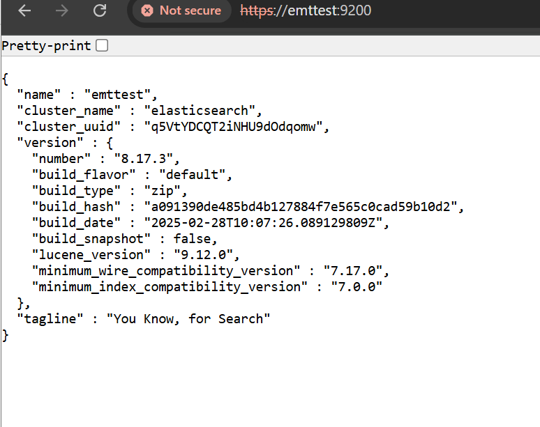
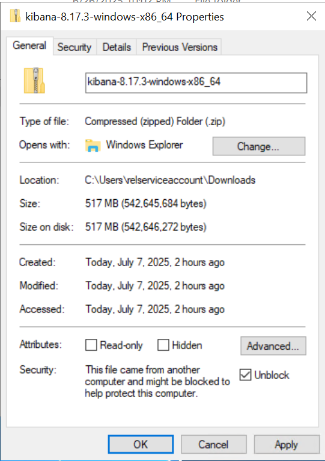
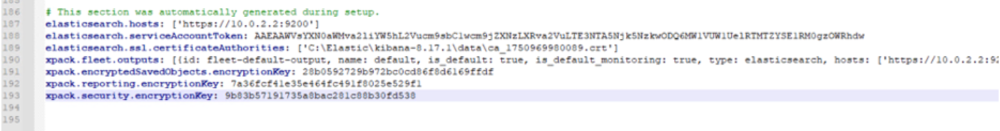
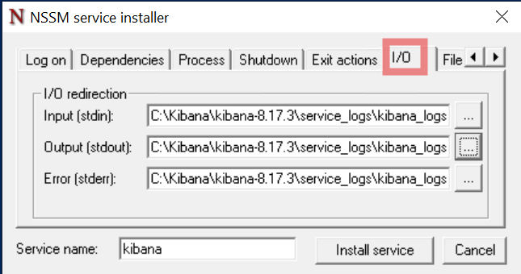
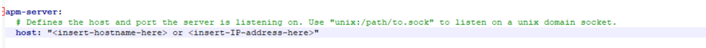
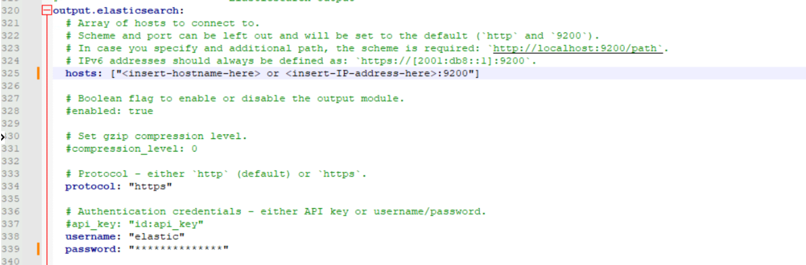
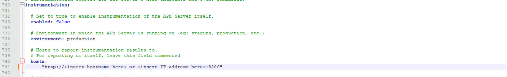

# Development Tier

## Step 1: Download and Install Elasticsearch 8.17.x on One Server

1. **Download Elasticsearch 8.17.x**
   
	a. Visit [Elastic’s official download page](https://www.elastic.co/downloads/elasticsearch).<br/>
	b. Download the 8.17.x Windows .zip version.<br/>    

    TODO: Ensure the file is unblocked (include screenshot)

    

	c. Extract the files to C:\\elastic<br/>

2. **Install and Configure Elasticsearch 8.17.x**
	a. Run the below command from a terminal using an elevated command prompt to start Elasticsearch and perform the auto installation steps.<br/>

      **Note:** When starting Elasticsearch for the first time, security features are enabled and configured by default. The following security configuration occurs automatically: 
      - Authentication and authorization are enabled, and a password is generated for the elastic built-in superuser. 
	  - Certificates and keys for TLS are generated for the transport and HTTP layer, and TLS is enabled and configured with these keys and certificates.
	  - An enrollment token is generated for Kibana, which is valid for 30 minutes.

    ```
    bin\elasticsearch.bat
    ```
  
    b. Save the token for future reference. Terminate the process once token is generated

    

    c. Run the below command from an elevated Command Prompt to install elasticsearch as a Windows service.<br/>
    
    ```
    .\bin\elasticsearch-service.bat install
    ```

3. **Set JVM Heap Size**  <br/>
   
	a. Edit config\\jvm.options and set both -Xms and -Xmx to 50% of available system memory, but not more than 30 GB. For ex::
    ```
    -Xms8g
    -Xmx8g
    ```

    There should be no space while uncommenting and setting the line for heap size

    

4. **Run Elasticsearch as a Windows Service**
TBD - Verify this is necessary because I think this is started automatically when running the ".bat install" command above.   

    TODO: Every single command must be explicitly defined and use common terminology.

	a. Run the below command from an elevated Command Prompt :
    ```
    .\bin\elasticsearch-service.bat start
    ```

5. **Enable  "Stack Monitoring" built-in dashboard**
   
   a. To enable "Stack Monitoring" built-in dashboard add following line to elasticsearch.yml 

    ```
    xpack.monitoring.collection.enabled: true
    ```

   b. Save the changes and restart Elasticsearch service.
    --Press Win + R, type services.msc, and press Enter 
    --Look for service name starting with ElasticSearch
    --Right click on the service and select Restart

6. **Create Elastic User Passwords**

    TODO: What are they supposed to do with this? We tell them to run this command but make no mention at all why this is done and what should b done with the output. In fact, it doesn't even explain the fact that the command OUTPUT displays the new elastic account password. This should provide some basic display on what the user will see and recommendation for them to write this password down for sake keeping.

    The following command generates a new password for the elastic user, which is the default superuser account in Elasticsearch. This account has full administrative privileges and is required for logging in to Kibana and for performing administrative tasks such as managing users, roles, and system settings.

    ```
    .\bin\elasticsearch-reset-password -u elastic
    ```
    a. The password will be displayed only once in the console output and cannot be retrieved afterward.
    b. It is strongly recommended that you immediately record and securely store the password in accordance with your organization’s credential management and security policies.
    c. This password will be required for future authentication to Elasticsearch and Kibana.

7. **Check mapper-size plugin**
    ```
    ./elasticsearch-plugin list
    ```
    If mapper-size plugin not installed, please install using below cmd
    ```
    .\elasticsearch-plugin install mapper-size
    ```

    Re-Start the ElasticSearch Service
    - Press Win + R, type services.msc, and press Enter
    - Look for service name starting with ElasticSearch
    - Right click on the service and select Restart

8. **Verify Elasticsearch Server**
    - Open a browser and navigate to https://{insert-hostname-here} or {insert-IP-address-here}:9200.
    - Verify the response is valid.

    TODO: ADD SCREENSHOT SHOWING THE EXPECTED RESPONSE.

    

## Step 2: Install and Configure Kibana

⚠️WARNING : **When the Kibana distribution is extracted, it can exceed the maximum Windows path. To prevent this from occurring, Relativity recommends enabling the long path feature** - <br/>
- Run "gpedit.msc" to navigate into Local Group Policy Editor → Computer Configuration → Administrative Template → System → Filesystem. 
- Double click on enable the Long path. 

1. **Download Kibana 8.17.x**
	
    a. Download and extract the 8.17.x Windows .zip version of Kibana from [Elastic’s official Kibana download page](https://www.elastic.co/downloads/kibana). <br/>    

    TODO: Ensure the file is unblocked (include screenshot).

    
    
    TODO: This is also where you should remind the reader on the issue of exceeding the max Windows path.


2. **Start Kibana from the command line**
    
    a. Navigate to Kibana's bin folder Ex: “C:\elastic\kibana\bin” <br/>
    b. Run the below command in PowerShell or Command prompt using Admin rights <br/>
    ```
    .\kibana.bat
    ```

    TODO: What should they see? How do you know if this was successful?

    

3. **Enroll Kibana**
	
    a. In your terminal, click the generated link to open Kibana in your browser. <br/>
	b. In your browser, paste the enrollment token that was generated in the terminal when you started Elasticsearch, and then click the button to connect your Kibana instance with Elasticsearch. <br/>
    c. In case token got expired, execute the following command in Elastic bin folder <br/> 
    ```
	.\elasticsearch-create-enrollment-token --scope kibana
	```
    
	d. Log in to Kibana as the elastic user with the password that was generated when you started Elasticsearch.<br/>
	

4. **Generate Kibana encryption keys**

    ⚠️WARNING: Skipping below steps will cause the Relativity Server CLI to fail
   
    a. Navigate to Kibana's bin folder Ex: "C:\elastic\kibana\bin" <br/>
    b. Run the below command in PowerShell or Command prompt using Admin rights <br/>
	```
	.\kibana-encryption-keys generate
	```
    
    TODO: What should they see? How do you know if this was successful?
    

    c. Copy the encryption keys generated and paste it in kibana.yml file <br/>

    TODO: Show a complete picture on what the key YAML configuration should look like at this point in time.
    

    d. Restart kibana service using **./kibana.bat** navigating to bin folder in powershell admin mode. <br/>

    TODO: How is this verified?
    
    

    e. Refer https://www.elastic.co/guide/en/kibana/current/kibana-encryption-keys.html for more details

5. **Create Kibana Windows Service**
	
    a. Download latest nssm exe file version from https://nssm.cc/download and place it in C drive (Example: C:\nssm\nssm.exe)<br/>
    
    b. Open a command line with administrative privilege in the folder with nssm.exe and run the command .\nssm.exe install kibana_service. A popup will open to create a windows service.<br/>

    c. In the Application tab, Enter the path of kibana.bat and the folder of kibana.bat as shown below <br/>
    

    **Note:** If you accidentally press Return, that will cause the service to be installed before your configuration is complete. In that case, you can use this command, to continue to edit the service properties:
    
    ```
    .\nssm.exe edit kibana_service
    ```
    
    d. In the I/O tab, enter the path of a log file where the service logs will be stored. For this purpose, create a folder in kibana folder (like service_logs) and create a blank log file (say kibana_service.log), Copy the path of the log file created and paste in stdout and stderr section <br/>

    

    e. In the File rotation tab, check all the boxes and enter 10485760 bytes, so that a new log file will be generated for every 5 MB of logs.
    
    


    f. Finally click the Install service button to create a windows service for kibana

    g. Go to the Services app in windows, search for kibana_service service, right click and start the service

    h. Right click on the service and open the properties to change the startup type as Automatic to make the Kibana service run automatically upon system startup

    i. Verify if Kibana is running in the browser

6. **Rename Kibana Service Using NSSM**
    - If the service name is not what you want (e.g., kibana), you can rename it using NSSM:
    - Run the following to rename the service:
    - nssm set kibana-service DisplayName "Kibana Service"  
        nssm set kibana-service Start "SERVICE_DEMAND_START"
    <div class="note">Replace kibana-service with the actual service name you chose in the previous step.</div>

7. **Verify Kibana Server**
    - Open a browser and go to https://{insert-hostname-here} or {insert-IP-address-here}:5601
    - Verify the elastic or kibana_system credential can be used to successfully login

    TODO: ADD SCREENSHOT.
    
    

## Step 3: Install and Configure APM Server

1. **Prerequisites to setup APM Server**

    a. Elastic and Kibana should be configured and Services should be up and running.

2. **Download APM Server 8.17.x**
   
	a. Visit [Elastic’s APM Server page](https://www.elastic.co/downloads/apm). <br/>
	b. Download and extract the 8.17.x Windows .zip file. <br/>

    TODO: This must specify the latest supported version.

    TODO: Ensure the file is unblocked (include screenshot)
    

    c. Extract the files to C:\\elastic<br/>

3. **Configure APM Server (config\\apm-server.yml)**
    Either Username / Password or API Key is required for configuring APM. If Username and Password is used, can ignore using API key inside apm-server.yml file and for API Key usage check below step(a).

    a. Create new API key from kibana. Navigate to StackManagement  → API Keys  → Create. And create one by providing API Key name. Keep the other default settings as it is. 

    

    b. Once the API key is generated, keep a note of the key.

    c. Open PowerShell window under Admin and Navigate to "Relativity Secret Store\Client" folder. 
        E.g. CD "C:\Program Files\Relativity Secret Store\Client"

    d. Execute the following script:

    ```
    do {
    $urlServer = Read-Host -Prompt "Please enter url for your Elasticsearch Server"
    } until ($urlServer -ne '')

    do {
        $apiKey = Read-Host -Prompt "Please enter API key to access your Elasticsearch Server"
    } until ($urlServer -ne '')
 
    #Replace 'ElasticSearchServer' with a real Server Host name
    .\secretstore.exe secret write /database/elasticsearch/clusters/rel-cluster-datagrid primary-node-url=$urlServer kibana-server-url=$urlServer apm-server-url=$urlServer primary-node-tls-skip-certificate-validation=true apm-server-tls-skip-certificate-validation=true kibana-server-tls-skip-certificate-validation=true
    
    #Replace 'NewlyGeneratedApiKey' with a real newly created ApiKey value
    .\secretstore.exe secret write database/elasticsearch/clusters/rel-cluster-datagrid/security/api-keys/rel-datagrid api-key=$apiKey min-version=7.17.0
    ```

    e. Set "Relativity.Audit.Common.Toggles.ElasticAPIKeyAuthenticationToggle" Toggle
    ```
    EXEC EDDS.eddsdbo.pr_SetToggle 'Relativity.Audit.Common.Toggles.ElasticAPIKeyAuthenticationToggle', 1
    ```

    f. Navigate to apm-server folder and open the "apm-server.yml" using text editor.

    g. Update host of apm-server to "{insert-hostname-here} or {insert-IP-address-here}/:8200". Uncomment the line, if it is commented
    

    h. In the "Elasticsearch output" section, perform the below changes:

    - Uncomment the output.elasticsearch
    - Update username to elastic and password to updated password. Uncomment both the lines if they are commented
    - Update hosts: ["{insert-hostname-here} or {insert-IP-address-here}:9200"]
    - Update protocol: https
    - This setting is needed because elasticsearch is running under https

    i. Either Username and Password / API Key required for APM Services. The same is highlighted below
    

    j. Also within output.elasticsearch, modify ssl settings

    These changes are needed because elasticsearch is running under ssl

    - Update ssl.enabled: true
    - Update ssl.verification_mode: none

    
    

    k. Update Instrumentation section as below:

    - Uncomment Instrumentation section to enable apm-server instrumentation.
    - Update enabled: true, environment: production
    - hosts: - "http://{insert-hostname-here} or {insert-IP-address-here}:8200"
  
    

    l. Once the instrumentation is set, we can verify it in Kibana as shown below:
    
    
4. **Execute required scripts to install APM Server as a Windows service**
   
	 <br/>a. Navigate inside the downloaded apm-server.

     b. Open an elevated PowerShell terminal.<br/>

     c. Execute **PowerShell.exe -ExecutionPolicy UnRestricted -File .\install-service.ps1** to install the APM Server as a Windows service.<br/>
     

5. **Start the APM Server service**
    TODO: JUST USE WINDOWS SERVICES UI AND SHOW THIS IN A SCREENSHOT.
    

6. **Verify APM Server**
    - Open a browser and navigate to http://{insert-hostname-here} or {insert-IP-address-here}:8200
    - Verify the response and publish ready should be "true".

    TODO: ADD SCREENSHOT SHOWING THE EXPECTED RESPONSE.
    

## Step 4: Post Installation and Verification

1. **Add Elastic APM Integration Package**

   ⚠️**WARNING**: Skipping below steps will cause the Relativity Server CLI to fail
   
   a. Login to Kibana and select the Elastic APM under the Integration or in search bar type Elastic APM and select under Integration.<br/>

   TODO: ADD SCREENSHOT.
   

   b. In the Right top select Add Elastic APM button.  <br/>

   TODO: ADD SCREENSHOT.
   

   c. Add Integration name into it and for server configuration [MUST ENSURE THE HOSTNAME IS USED - NOT LOCALHOST]. Update apm hostname and apm url<br/>
       Ex: Host:{insert-hostname-here} or {insert-IP-address-here}:8200
           URL: http://{insert-hostname-here} or {insert-IP-address-here}:8200 <br/>   

   d. Click on Save and Continue. <br/>

   TODO: ADD SCREENSHOT.
   
   
   e. Select "Add Elastic Agent later" button as Agent is not required for the initial setups. <br/>      

   TODO: ADD SCREENSHOT.
   

2. **Verify APM Data View**
   
   a. Before proceeding with EW CLI, check if the APM Data View is created in Kibana or not. 

    - Open a browser and go to https://{insert-hostname-here} or {insert-IP-address-here}:5601.
  
	- Log in using elastic or kibana_system credentials.

    TODO: WE HAVE CONFIRMED VIA ELASTIC SUPPORT THAT YOU MUST LITERALLY VISIT THE OBSERVABILITY->APM DASHBOARD FOR KIBANA TO TRIGGER THE CREATION OF THIS DATAVIEW. THIS INSTRUCTION SHOULD NOT DISCLOSE ANY OF THESE DETAILS; RATHER, IT SHOULD FORCE THE USER TO SIMPLY GO TO THE APM PAGE (INCLUDE SCREENSHOTS) AND CONFIRM THERE ARE TRACES PRESENT. ONCE YOU CLICK ON A TRACE, THIS WILL TRIGGER THE CREATION. THIS STEP SHOULD BE PLACED RIGHT HERE BECAUSE IT SHOULD YIELD SUCCESS BELOW.

3. **Verify Cluster Health in Kibana**
    
   Open a browser and navigate to https://{insert-hostname-here} or {insert-IP-address-here}:9200.    

   TODO: ADD INSTRUCTIONS AND SCREENSHOT.

## Next

After setting up Elastic proceed to stage 2: [Use the Relativity Server CLI to setup Environment Watch and/or Data Grid](relativity_server_cli_setup.md)