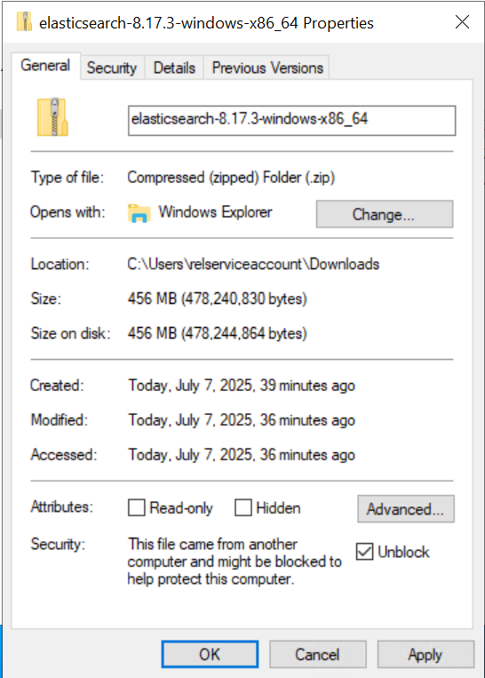
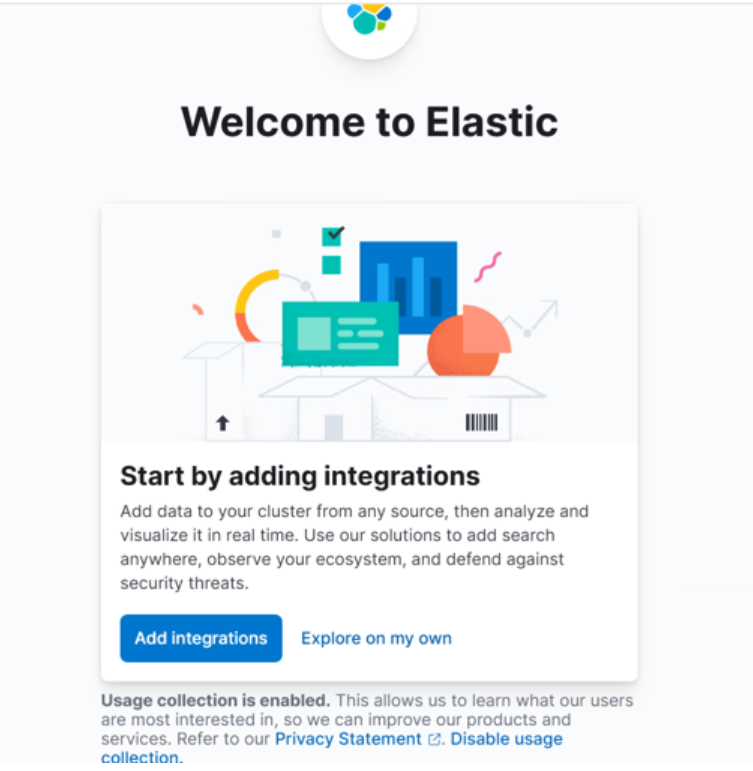
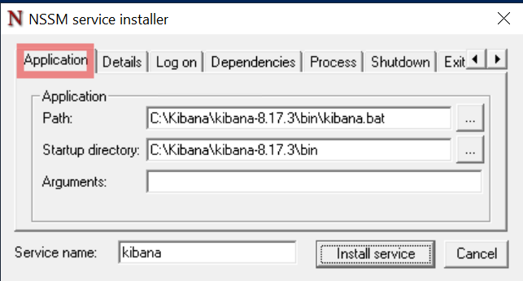
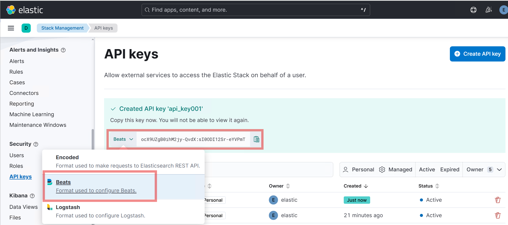
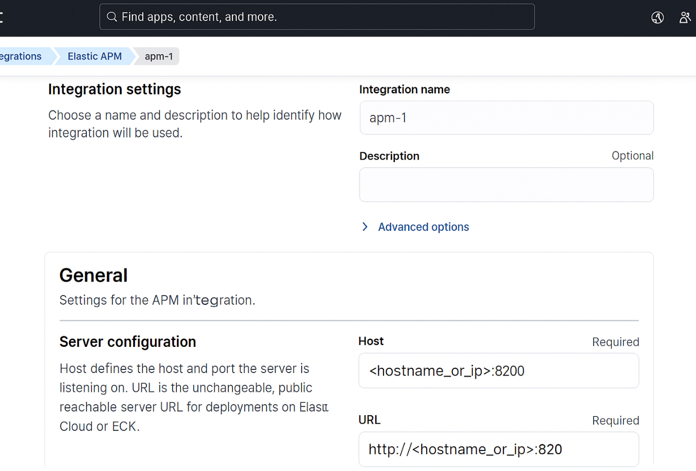

# Development Tier


## How to Unblock Downloaded Files

> [!NOTE]
If you download a .zip or other file from the internet, Windows may block the file and prevent it from running correctly. To unblock a file:

- Right-click the downloaded file and select **Properties**.
- In the **General** tab, check the box for **Unblock** at the bottom (if present).
- Click **Apply** and then **OK**.



## Step 1: Download and Install Elasticsearch 8.17.3 on One Server


**1.1 Download Elasticsearch 8.17.3**

- Visit [Elastic’s official download page](https://www.elastic.co/downloads/elasticsearch).
- Download the 8.17.3 Windows .zip version.

- Before extracting, see [How to Unblock Downloaded Files](#how-to-unblock-downloaded-files).

- Extract the files to `C:\elastic`

**1.2 Install and Configure Elasticsearch 8.17.3**

- Open an elevated PowerShell and run the following command to start Elasticsearch and perform the auto installation steps:

  ```
  C:\elastic\elasticsearch-8.17.3\bin\elasticsearch.bat
  ```

  <a id="enrollment-token-generation"></a>
> [!IMPORTANT]
  When starting Elasticsearch for the first time, security features are enabled and configured by default:
  - Authentication and authorization are enabled, and a password is generated for the elastic built-in superuser.
  - Certificates and keys for TLS are generated for the transport and HTTP layer, and TLS is enabled and configured with these keys and certificates.
  - An enrollment token is generated for Kibana, which is valid for 30 minutes.

- Save the token for future reference. Once the enrollment token is displayed, you need to stop Elasticsearch so you can proceed with the next steps. To do this, return to the PowerShell window where Elasticsearch is running and press `Ctrl+C` on your keyboard. This will safely terminate the process. The enrollment token will look similar to:

  ```
  Enrollment token for Kibana:
  eyJ2ZXIiOiI4LjE3LjMiLCJ...<rest_of_token>
  ```

> [!TIP]
> To stop Elasticsearch after you have copied the enrollment token, click inside the PowerShell window and press `Ctrl` and `C` at the same time. This will end the running process.

- Open an elevated PowerShell and run the following command to install Elasticsearch as a Windows service:

  ```
  C:\elastic\elasticsearch-8.17.3\bin\elasticsearch-service.bat install
  ```

  The output will look similar to:

  ```
  Installing service      :  "elasticsearch-service-x64"
  Using JAVA_HOME (64-bit):  C:\Program Files\Java\jdk-17
  The service 'elasticsearch-service-x64' has been installed.
  ```

**1.3 Run Elasticsearch as a Windows Service**

- Open an elevated PowerShell and run the following command to start the Elasticsearch service:

  ```
  C:\elastic\elasticsearch-8.17.3\bin\elasticsearch-service.bat start
  ```

  The output will look similar to:

  ```
  Starting service   :  "elasticsearch-service-x64"
  The service 'elasticsearch-service-x64' has been started.
  ```

**1.4 Enable Stack Monitoring**

- Navigate to the Elasticsearch configuration folder (e.g., `C:\elastic\elasticsearch-8.17.3\config`) and open the `elasticsearch.yml` file.
- Add the following line to enable Stack Monitoring:

     ```
     xpack.monitoring.collection.enabled: true
     ```

- Save the changes and restart the Elasticsearch service:

  - Open an elevated PowerShell and run the following command:
    ```
    Restart-Service -Name "elasticsearch-service-x64"
    ```

**1.5 Reset the Elastic (Admin) User Password**

- The following command resets the password for the `elastic` user, which is the default superuser (admin) account in Elasticsearch. This account is required for logging in to Kibana and for performing administrative tasks such as managing users, roles, and system settings.

   - Navigate to ElasticSearch's bin folder(`C:\elastic\elasticsearch-8.17.3\bin`)
   - Open an elevated PowerShell and run the following command:

     ```
     .\elasticsearch-reset-password -u elastic
     ```

  

- When you run this command, a new password will be generated and displayed in the console output.
> [!NOTE]
   The password is shown only once and cannot be retrieved later. Immediately record and securely store the password according to your organization’s credential management and security policies. You will need this password for future authentication to Elasticsearch and Kibana.

**1.6 Install the 'mapper-size' plugin**

- Open an elevated PowerShell and run the following command to install the 'mapper-size' plugin:
  ```
  C:\elastic\elasticsearch-8.17.3\bin\elasticsearch-plugin install mapper-size
  ```
- To verify the 'mapper-size' plugin is installed, run:
  ```
  C:\elastic\elasticsearch-8.17.3\bin\elasticsearch-plugin list
  ```

- Restart the Elasticsearch Service:   
  - To restart the Elasticsearch service, run the following in an elevated PowerShell session:

     ```
     Restart-Service -Name "elasticsearch-service-x64"
     ```

     The output will look similar to:

     ```
     WARNING: Waiting for service 'Elasticsearch 8.17.3 (elasticsearch-service-x64) (elasticsearch-service-x64)' to stop...
     ```

**1.7 Verify Elasticsearch Server**

- To verify Elasticsearch is running, open an elevated Command Prompt and run the following command (replace `<username>`, `<password>`, and `<hostname_or_ip>` with your actual values):

     ```
     curl -u <username>:<password> -k https://<hostname_or_ip>:9200
     ```

- The response should show basic cluster information in JSON format if the server is running and accessible.

   <details>
   <summary>Sample JSON response</summary>

   ```
   {
     "name" : "emttest",
     "cluster_name" : "elasticsearch",
     "cluster_uuid" : "q5VtYDCQT2iNHU9dOdqomw",
     "version" : {
       "number" : "8.17.3",
       "build_flavor" : "default",
       "build_type" : "zip",
       "build_hash" : "a091390de485bd4b127884f7e565c0cad59b10d2",
       "build_date" : "2025-02-28T10:07:26.089129809Z",
       "build_snapshot" : false,
       "lucene_version" : "9.12.0",
       "minimum_wire_compatibility_version" : "7.17.0",
       "minimum_index_compatibility_version" : "7.0.0"
     },
     "tagline" : "You Know, for Search"
   }
   ```
   </details>

## Step 2: Install and Configure Kibana

**2.1 Download Kibana 8.17.3**
    
- Download and extract the 8.17.3 Windows .zip version of Kibana from [Elastic’s official Kibana download page](https://www.elastic.co/downloads/kibana).

- Before extracting, see [How to Unblock Downloaded Files](#how-to-unblock-downloaded-files).

**2.2 Start Kibana from the command line**
    
- Navigate to Kibana's `bin` folder (e.g., `C:\elastic\kibana\bin`).
- Open an elevated PowerShell and run the following command:

     ```
     C:\Kibana\kibana-8.17.3\bin\kibana.bat
     ```

- If successful, you should see output indicating that the Kibana server has started and is listening on port 5601. Look for lines similar to:

     ```
     [INFO][server][http] http server running at http://localhost:5601
     ...
     kibana has not been configured
     Go to https://localhost:5601/?code=xyz to get started
     ```

**2.3 Enroll Kibana**
    
- In your terminal, click the generated link to open Kibana in your browser.
- In your browser, paste the enrollment token that was generated in the terminal when you started Elasticsearch, then click the Configure Elastic button to connect your Kibana instance with Elasticsearch.
  
    [See where the enrollment token is generated.](#enrollment-token-generation)
- If the token has expired, generate a new one by running the following command in the Elasticsearch's bin folder (e.g., `C:\elastic\elasticsearch-8.17.3\bin`).

     ```
     C:\elastic\elasticsearch-8.17.3\bin\elasticsearch-create-enrollment-token --scope kibana
     ```
    <details>
    <summary>Sample output</summary>
    eyJ2ZXIiOiI4LjE0LjAiLCJhZHIiOlsiMTAuMC4yLjI6OTIwMCJdLCJmZ3IiOiI4ZGE1MWZkYTExZmM1ZDAwNDBhZWZlNTJlNmRiYzQ5ZTM2NmYxYTkyOGIwY2NiMzExOGY0MWFjZTczODNkZDliIiwia2V5IjoiOGFfc1BKZ0Jra09qNlh6dngycS06bG5sWkNEMnpSbFNiZjZZclpRSHF6dyJ9
    </details>

- Log in to Kibana as the `elastic` user with the password that was generated when you started Elasticsearch.
- See the screenshot below for the login screen:

     

**2.4 Generate Kibana encryption keys**

> [!IMPORTANT]
    Skipping the steps below will cause the Relativity Server CLI to fail.

- Open an elevated PowerShell and run the following command:

  ```
  C:\Kibana\kibana-8.17.3\bin\kibana-encryption-keys generate
  ```

   - If successful, you will see output showing the generated encryption keys. For example:

     <details>
     <summary>Sample output</summary>

     ```
     xpack.encryptedSavedObjects.encryptionKey: "<randomly-generated-key-1>"
     xpack.reporting.encryptionKey: "<randomly-generated-key-2>"
     xpack.security.encryptionKey: "<randomly-generated-key-3>"
     ```
     </details>

   - Copy the generated encryption keys and paste them at the end of your `kibana.yml` file (e.g., `C:\Kibana\kibana-8.17.3\config\kibana.yml`). The configuration should look similar to:

     <details>
     <summary>Sample kibana.yml configuration</summary>

     ```yaml
     xpack.encryptedSavedObjects.encryptionKey: "<randomly-generated-key-1>"
     xpack.reporting.encryptionKey: "<randomly-generated-key-2>"
     xpack.security.encryptionKey: "<randomly-generated-key-3>"
     ```
     </details>

   - Restart the Kibana service:
     - Open an elevated PowerShell and run the following command:

       ```
       C:\Kibana\kibana-8.17.3\bin\kibana.bat
       ```

   - To verify success, check the terminal output for lines indicating that Kibana has started successfully. You can also refer to the screenshots below:

     

> [!IMPORTANT]
After Kibana has restarted, open a browser and go to `http://<hostname_or_ip>:5601`.
Log in using the `elastic` username and the password you generated earlier.
This verifies that Kibana is running and your credentials are working.

   

   - For more details, refer to the official documentation: https://www.elastic.co/guide/en/kibana/current/kibana-encryption-keys.html

**2.5 Create Kibana Windows Service**
> [!IMPORTANT]
> **Running Kibana as a Windows Service is Optional**
> Environment Watch does NOT require Kibana to run as a Windows service, nor does it require the use of NSSM. NSSM is a commonly used open-source tool to help run applications as services, but it is not mandatory. You can run Kibana manually from the command line if you prefer, and this will work perfectly for development and most production scenarios.
> 
> Only use NSSM if you want Kibana to start automatically as a service on Windows. If you do not wish to use NSSM, simply run `kibana.bat` manually.

    ```
    C:\Kibana\kibana-8.17.3\bin\kibana.bat
    ```
    
- Download the latest NSSM executable from https://nssm.cc/download and place it in the C drive (e.g., `C:\nssm-2.24`).

> [!Note]
Kibana does not install as a Windows service by default. We recommend using NSSM — a commonly used open-source tool—to run Kibana as a Windows service.

- Open an elevated PowerShell and run the following command:

     ```
     C:\nssm-2.24\win64\nssm.exe install kibana
     ```

     This will open a popup to create a Windows service for Kibana.

- In the Application tab, enter the path to `kibana.bat` and its folder as shown below:

     


> [!TIP]
> **Editing Kibana Service Properties:**
> If you accidentally install the Kibana service before completing your configuration (for example, by pressing Return too early in the NSSM dialog), you can easily edit the service properties afterward. This allows you to update the application path, log file settings, or other options without reinstalling the service.

<details>
<summary>To edit the service properties</summary>

- Open an elevated PowerShell and run the following command:

    ```
    C:\nssm-2.24\win64\nssm.exe edit kibana
    ```

</details>

- In the I/O tab, enter the full path of a log file where the service logs will be stored. For example, create a folder in the Kibana directory (e.g., `C:\Kibana\kibana-8.17.3\service_logs`) and a blank log file (e.g., `C:\Kibana\kibana-8.17.3\service_logs\kibana_service.log`). 

- Copy the full log file path into the stdout and stderr sections:

     

- In the File rotation tab, check all boxes and enter `10485760` bytes so a new log file is generated for every 10 MB of logs:

     

- Click the Install service button to create the Windows service for Kibana.

- Go to the Services app in Windows, search for the `kibana` service, right click, and start the service.

- Right click on the service and open Properties to change the startup type to Automatic, so Kibana runs automatically on system startup.

- Verify that Kibana is running by opening it in your browser.

> [!NOTE]
     It is normal for Kibana to take 1-5 minutes to become accessible after starting the service, depending on your system. Please be patient while it starts up.

**2.6 Verify Kibana Server**
- Open a browser and go to `http://<hostname_or_ip>:5601`.
- Log in using the `elastic` credential to verify successful access.

     
     

## Step 3: Install and Configure APM Server

**3.1 Prerequisites to setup APM Server**

- Elastic and Kibana should be configured and services should be up and running.

**3.2 Download APM Server 8.17.3**
   
- Visit [Elastic’s APM Server page](https://www.elastic.co/downloads/apm).
- Download and extract the 8.17.3 Windows .zip file.
- Before extracting, see [How to Unblock Downloaded Files](#how-to-unblock-downloaded-files).
- Extract the files to `C:\`.


**3.3 Configure APM Server (`C:\apm-server-8.17.3-windows-x86_64\apm-server.yml`)**

- An API key is required for configuring both APM and Beats. To create an API key:

  - Log in to Kibana (`http://<hostname_or_ip>:5601`) using the `elastic` credential.

  - Use the global search at the top of Kibana to search for "API keys" and select it from the results.

  - Click the **Create API key** button.

  - Enter a name for your API key (for example, specify if it will be used for Beats or APM).

  - Click the **Privileges** dropdown and select **Beats** to automatically apply the recommended permissions for Beats.

  - Click **Create API key**.
  
  - Copy and securely save the generated `id` and `api_key` values.

  

> [!NOTE]
Copy and save `id` and `api_key` values immediately and store them securely according to your organization’s credential management and security policies.

- Navigate to the apm-server folder (e.g., `C:\apm-server-8.17.3-windows-x86_64`) and open the `apm-server.yml` file using a text editor.

- Open the `apm-server.yml` file in a text editor and update it to match the following sample configuration. 

- Replace the placeholder values (`<apm-server-hostname_or_ip>`, `<elasticsearch-hostname_or_ip>`, `<id>`, `<api-key>`) as needed for your environment.

- Below is a sample configuration

  ```yaml
  apm-server:
    host: "<apm-server-hostname_or_ip>:8200"

  output.elasticsearch:
    hosts: ["<elasticsearch-hostname_or_ip>:9200"]
    protocol: "https"
    api_key: "<id>:<api-key>"
    ssl.enabled: true
    ssl.verification_mode: none

  instrumentation:
    enabled: true
    environment: production
    hosts:
      - "http://<apm-server-hostname_or_ip>:8200"
  ```
    
**3.4 Execute required scripts to install APM Server as a Windows service**
   
- Open an elevated PowerShell.
- Run the following command to install the APM Server as a Windows service:

  ```
  PowerShell.exe -ExecutionPolicy UnRestricted -File C:\apm-server-8.17.3-windows-x86_64\install-service.ps1
  ```

  The output will look similar to:

  ```
  Installing service apm-server...
  Service "apm-server" has been successfully installed.
  ```
     
**3.5 Start the APM Server service**

- Open an elevated PowerShell and run the following command:

  ```
  Start-Service -Name "apm-server"
  ```

- Once the instrumentation is set, you can verify it in Kibana as shown below:

  

**3.6 Verify APM Server**

- Open an elevated Command Prompt and run the following command (replace `<hostname_or_ip>` with your actual value):

  ```
  curl -k http://<hostname_or_ip>:8200
  ```

  The response should indicate `publish_ready` is `true` and will look similar to:

  ```
  {
    "build_date": "2025-02-27T18:17:35Z",
    "build_sha": "f6b917b725e1a22af433e5b52c5c6f0ff9164adf",
    "publish_ready": true,
    "version": "8.17.3"
  }
  ```

## Step 4: Additional Setup and Verification


**4.1 Add Elastic APM Integration Package**

> [!IMPORTANT]
   Skipping the steps below will cause the Relativity Server CLI to fail.

   - Login to Kibana and select the Elastic APM under Integration, or in the search bar type "Elastic APM" and select it under Integration.
     
     

   - In the top right, select the Add Elastic APM button.

     

   - Add an Integration name and for server configuration. Update apm hostname and apm url.  
     Ex: Host: <hostname_or_ip>:8200  
     URL: http://<hostname_or_ip>:8200

   - Click on Save and Continue.

     

   - Select "Add Elastic Agent later" button as Agent is not required for the initial setups.

     

**4.2 Verify APM Data View**
   

Before proceeding with EW CLI, check if the APM Data View is created in Kibana:

- Open a browser and go to http://<hostname_or_ip>:5601
- Log in using elastic credentials
- Navigate to `Discover`, or type `Discover` in the search bar.   
- Confirm the APM Data View is present:

  

**4.3 Verify Cluster Health**
    
- Open an elevated Command Prompt and run the following command (replace `username`, `password`, and `{hostname_or_ip}` with your actual values):

  ```
  curl -u <username>:<password> -k https://<hostname_or_ip>:9200/_cat/health
  ```

- You should see a response similar to:

  ```
  1690219200 10:00:00 elasticsearch green 1 1 0 0 0 0 0 0 - 100.0%
  ```

- The word `green` in the response means the cluster is healthy. The word `yellow` in the response means the cluster is partially healthy. If you see `red`, investigate further.

## Next Step

[Click here for the next step](relativity_server_cli_setup.md)