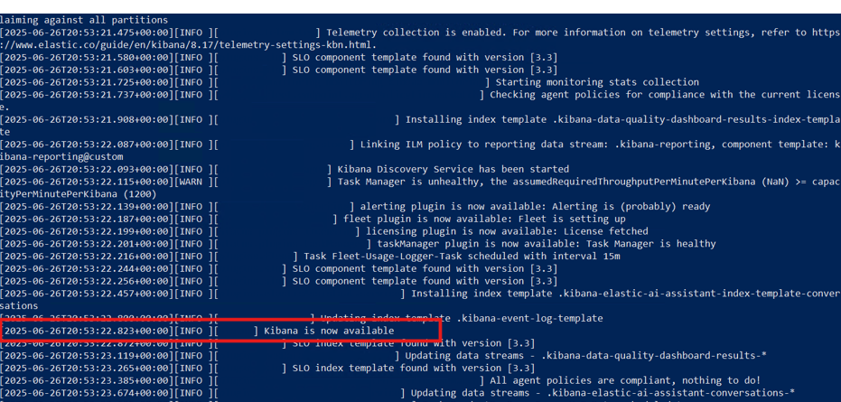

# Install Elasticsearch, Kibana and APM Server - Production Environment


> [!NOTE]
> This step is required for both Environment Watch and Data Grid Audit

## How to Unblock Downloaded Files
If you download a .zip or other file from the internet, Windows may block the file and prevent it from running correctly. To unblock a file:

1. Right-click the downloaded file and select **Properties**.
2. In the **General** tab, check the box for **Unblock** at the bottom (if present).
3. Click **Apply** and then **OK**.

    

## Download and Install Elasticsearch 8.17.3/9.1.3 on one server

**Step 1: Download Elasticsearch 8.17.3/9.1.3**

1. Visit [Elastic's official download page](https://www.elastic.co/downloads/elasticsearch).
2. Download the 8.17.3/9.1.3 Windows .zip version.
3. Before extracting, see [How to Unblock Downloaded Files](#how-to-unblock-downloaded-files).
4. Extract the files to `C:\elastic`

**Step 2: Install and Configure Elasticsearch 8.17.3/9.1.3**

1. Open an elevated PowerShell and run the following command to start Elasticsearch and perform the auto installation steps:     
        ```
        C:\elastic\elasticsearch-x.x.x\bin\elasticsearch.bat
        ```
        <a id="enrollment-token-generation"></a>

        >  When starting Elasticsearch for the first time, security features are enabled and configured by default:
        >  - Authentication and authorization are enabled, and a password is generated for the elastic built-in superuser.
        >  - Certificates and keys for TLS are generated for the transport and HTTP layer, and TLS is enabled and configured with these keys and certificates.
        >  - An enrollment token is generated for Kibana, which is valid for 30 minutes.

2. Save the token for future reference. Once the enrollment token is displayed, you need to stop Elasticsearch so you can proceed with the next steps. To do this, return to the PowerShell window where Elasticsearch is running and press `Ctrl+C` on your keyboard. This will safely terminate the process. The enrollment token will look similar to:
        ```
        Enrollment token for Kibana:
        eyJ2ZXIiOiI4LjE3LjMiLCJ...<rest_of_token>
        ```

        > [!NOTE]
        > To stop Elasticsearch after you have copied the enrollment token, click inside the PowerShell window and press `Ctrl` and `C` at the same time. This will end the running process.

3. Open an elevated PowerShell and run the following command to install Elasticsearch as a Windows service:
        ```
        C:\elastic\elasticsearch-x.x.x\bin\elasticsearch-service.bat install
        ```

        The output will look similar to:
        ```
        Installing service      :  "elasticsearch-service-x64"
        Using JAVA_HOME (64-bit):  C:\Program Files\Java\jdk-17
        The service 'elasticsearch-service-x64' has been installed.
        ```

**Step 3: Run Elasticsearch as a Windows Service**

1. Open an elevated PowerShell and run the following command to start the Elasticsearch service:
        ```
        C:\elastic\elasticsearch-x.x.x\bin\elasticsearch-service.bat start
        ```

        The output will look similar to:
        ```
        Starting service   :  "elasticsearch-service-x64"
        The service 'elasticsearch-service-x64' has been started.
        ```

**Step 4: Enable Stack Monitoring**

1. Navigate to the Elasticsearch configuration folder (e.g., `C:\elastic\elasticsearch-x.x.x\config`) and open the **elasticsearch.yml** file.
2. Add the following line to enable Stack Monitoring:
        ```
        xpack.monitoring.collection.enabled: true
        ```
3. Save the changes and restart the Elasticsearch service by opening an elevated PowerShell and running the following command:
        ```
        Restart-Service -Name "elasticsearch-service-x64"
        ```

**Step 5: Reset the Elastic (Admin) User Password**

1. The following command resets the password for the `elastic` user, which is the default superuser (admin) account in Elasticsearch. This account is required for logging in to Kibana and for performing administrative tasks such as managing users, roles, and system settings.
2. Navigate to ElasticSearch's bin folder(`C:\elastic\elasticsearch-x.x.x\bin`)
3. Open an elevated PowerShell and run the following command:
        ```
        .\.elasticsearch-reset-password -u elastic
        ```
4. When prompted, press 'Y' to confirm and reset the password

    

5. When you run this command, a new password will be generated and displayed in the console output.

> [!IMPORTANT]
> The password is shown only once and cannot be retrieved later. Immediately record and securely store the password according to your organization's credential management and security policies. You will need this password for future authentication to Elasticsearch and Kibana.

**Step 6: Configure Node roles, discovery and Network**

1. Define explicit node roles to separate master, data, ingest responsibilities. Navigate to the Elasticsearch configuration folder (e.g., `C:\elastic\elasticsearch-x.x.x\config`) and open the **elasticsearch.yml** file.

        <details>
        <summary>Sample Node Details</summary>

        ```yaml
        # ---------------------------------- Cluster -----------------------------------
        #
        # Use a descriptive name for your cluster:
        #
        cluster.name: Cluster01
        #
        # ------------------------------------ Node ------------------------------------
        #
        # Use a descriptive name for the node:
        #
        node.name: es-data-01
        node.roles: [ "data", "ingest" ]
        #
        # ---------------------------------- Network -----------------------------------
        #
        network.host: 10.0.1.12
        http.port: 9200
        #
        # --------------------------------- Discovery ----------------------------------
        #
        discovery.seed_hosts: ["es-master-01","es-data-01","es-data-02"]
        cluster.initial_master_nodes: ["es-master-01"]  # only on first cluster bootstrap
        ```

        </details>

2. For dedicated master nodes use `node.roles: ["master"]` and ensure they do not hold data (`node.data: false`) if desired.

**Step 7: Storage paths**

1. Put `path.data` and `path.logs` on dedicated, high‑performance disks (separate from OS) and configure in `elasticsearch.yml`:

        ```yaml
        path.data: C:/esdata
        path.logs: C:/eslogs
        ```

2. Save the changes and restart the Elasticsearch service by opening an elevated PowerShell and running the following command:

        ```
        Restart-Service -Name "elasticsearch-service-x64"
        ```

**Step 8: Install the 'mapper-size' plugin**

1. Open an elevated PowerShell and run the following command to install the 'mapper-size' plugin:
        ```
        C:\elastic\elasticsearch-x.x.x\bin\elasticsearch-plugin install mapper-size
        ```
2. To verify the 'mapper-size' plugin is installed, run:
        ```
        C:\elastic\elasticsearch-x.x.x\bin\elasticsearch-plugin list
        ```
3. Restart the Elasticsearch Service. To restart the Elasticsearch service, run the following in an elevated PowerShell session:
        ```
        Restart-Service -Name "elasticsearch-service-x64"
        ```
        The output will look similar to:
        ```
        WARNING: Waiting for service 'Elasticsearch x.x.x (elasticsearch-service-x64) (elasticsearch-service-x64)' to stop...
        ```

**Step 9: Configure JVM Heap Settings (Production)**

    Proper JVM heap configuration is critical for Elasticsearch performance and stability.

    - Navigate to `C:\elastic\elasticsearch-x.x.x\config\jvm.options`

    - Set heap size to 50% of available RAM, with a maximum of 31GB per node:

        ```
        # Xms represents the initial heap size
        # Xmx represents the maximum heap size
        # Both values should be equal to avoid heap resizing

        -Xms16g
        -Xmx16g
        ```

        **Production Sizing Guidelines:**
        - For 32GB RAM server: `-Xms16g -Xmx16g`
        - For 64GB RAM server: `-Xms31g -Xmx31g` (do not exceed 31GB)
        - For 128GB RAM server: `-Xms31g -Xmx31g` (leave remainder for OS and Lucene)

        > [!IMPORTANT]
        > - Never set heap size above 31GB (compressed oops threshold)
        > - Always set Xms and Xmx to the same value
        > - Reserve at least 50% of RAM for the operating system and Lucene file cache
        > - Monitor heap usage and adjust based on actual workload

    - Restart the Elasticsearch service after making changes:

        ```powershell
        Restart-Service -Name "elasticsearch-service-x64"
        ```

**Step 10: Verify Elasticsearch Server**

1. To verify Elasticsearch is running, open an elevated Command Prompt and run the following command (replace `<username>`, `<password>`, and `<hostname_or_ip>` with your actual values). In production do NOT use `-k`; validate the server certificate using the CA certificate you installed:
        ```
        curl -u <username>:<password> --cacert C:\elastic\secrets\ca\ca.crt https://<hostname_or_ip>:9200
        ```
        Or with PowerShell (validates TLS by default):
        ```powershell
        Invoke-RestMethod -Uri https://<hostname_or_ip>:9200 -Credential (Get-Credential)
        ```
2. The response should show basic cluster information in JSON format if the server is running and accessible.

        <details>
        <summary>Sample JSON response</summary>

        ```
        {
            "name" : "emttest",
            "cluster_name" : "elasticsearch",
            "cluster_uuid" : "q5VtYDCQT2iNHU9dOdqomw",
            "version" : {
                "number" : "8.17.3",
                "build_flavor" : "default",
                "build_type" : "zip",
                "build_hash" : "a091390de485bd4b127884f7e565c0cad59b10d2",
                "build_date" : "2025-02-28T10:07:26.089129809Z",
                "build_snapshot" : false,
                "lucene_version" : "9.12.0",
                "minimum_wire_compatibility_version" : "7.17.0",
                "minimum_index_compatibility_version" : "7.0.0"
            },
            "tagline" : "You Know, for Search"
        }
        ```
        
        </details>

## Install and Configure Kibana

**Step 1: Download Kibana 8.17.3**

1. Download and extract the 8.17.3 Windows .zip version of Kibana from [Elastic's official Kibana download page](https://www.elastic.co/downloads/kibana) to stable paths.
2. Ensure the Elasticsearch service is installed and running before Kibana setup.
3. Before extracting, see [How to Unblock Downloaded Files](#how-to-unblock-downloaded-files).

**Step 2: Start Kibana from the command line**

1. Navigate to Kibana's `bin` folder (e.g., `C:\elastic\kibana\bin`).
2. Open an elevated PowerShell and run the following command:
        ```
        C:\Kibana\kibana-x.x.x\bin\kibana.bat
        ```
3. If successful, you should see output indicating that the Kibana server has started and is listening on port 5601. Look for lines similar to:
        ```
        [INFO][server][http] http server running at http://localhost:5601
        ...
        kibana has not been configured
        Go to https://localhost:5601/?code=xyz to get started
        ```

**Step 3: Enroll Kibana**

1. In your terminal, click the generated link to open Kibana in your browser.
2. In your browser, paste the enrollment token that was generated in the terminal when you started Elasticsearch, then click the Configure Elastic button to connect your Kibana instance with Elasticsearch.
        [See where the enrollment token is generated.](#enrollment-token-generation)
3. If the token has expired, generate a new one by running the following command in the Elasticsearch's bin folder (e.g., `C:\elastic\elasticsearch-x.x.x\bin`).
        ```
        C:\elastic\elasticsearch-x.x.x\bin\elasticsearch-create-enrollment-token --scope kibana
        ```
        <details>
        <summary>Sample output</summary>
        eyJ2ZXIiOiI4LjE0LjAiLCJhZHIiOlsiMTAuMC4yLjI6OTIwMCJdLCJmZ3IiOiI4ZGE1MWZkYTExZmM1ZDAwNDBhZWZlNTJlNmRiYzQ5ZTM2NmYxYTkyOGIwY2NiMzExOGY0MWFjZTczODNkZDliIiwia2V5IjoiOGFfc1BKZ0Jra09qNlh6dngycS06bG5sWkNEMnpSbFNiZjZZclpRSHF6dyJ9
        </details>
4. Log in to Kibana as the `elastic` user with the password that was generated when you started Elasticsearch.
5. See the screenshot below for the login screen:

    

**Step 4: Enable TLS for Kibana**

1. Generate certificates Option A: Use elasticsearch-certutil 
    1. Open an elevated PowerShell in C:\elastic\elasticsearch\bin.
    2. Create CA:
        1. Run the following command
                ```
                elasticsearch-certutil.bat ca --silent --pem --out "C:\elastic\secrets\kibana_ca.zip"
                ```
        2. Extract zip contents into `C:\elastic\secrets\ca\ (you should have ca.crt and ca.key)`. 

        3. Create server cert for Kibana:
            1. Build SAN args with your DNS and IPs, e.g., `--dns <fqdn> --dns <shortname> --ip <server-ip>`

            2. Run the following command:
                ```
                elasticsearch-certutil.bat cert --silent --pem --ca-cert "C:\elastic\secrets\ca\ca.crt" --ca-key "C:\elastic\secrets\ca\ca.key" --name kibana [SAN args] --out "C:\elastic\secrets\kibana_server.zip"
                ```
            3. Extract zip contents into `C:\elastic\secrets\kibana\` to get kibana.crt and kibana.key

        4. Copy to Kibana certs:
            1. Create `C:\elastic\kibana\config\certs`

            2. Copy:
                ```
                C:\elastic\secrets\kibana\kibana.crt -> C:\elastic\kibana\config\certs\kibana.crt
                C:\elastic\secrets\kibana\kibana.key -> C:\elastic\kibana\config\certs\kibana.key
            	C:\elastic\secrets\ca\ca.crt -> C:\elastic\kibana\config\certs\ca.crt
                ```

        5.  Install CA to Windows trust (Local Machine Root) so browsers trust Kibana:
            1. Run mmc, add Certificates snap-in for Computer account, import ca.crt under Trusted Root Certification Authorities.

            2. Run the following command using an elevated Powershell
                ```
                certutil.exe -addstore -f Root "C:\elastic\kibana\config\certs\ca.crt".
                ```
     
2.  Use OpenSSL (if certutil missing or for self-signed)  
    1. Ensure OPENSSL_HOME is set or openssl.exe is available in PATH.

    2. Create config `C:\elastic\secrets\kibana-openssl.cnf` with SANs and server settings with
        [req], [dn], [v3_req], [alt_names] including DNS.N and IP.N entries aligned to your hostnames and IPs.
        
        <details>
        <summary>Sample kibana-openssl.cnf</summary>
        
        ```
        [ req ]
        distinguished_name = dn
        prompt = no
        req_extensions = v3_req

        [ dn ]
        CN = your.kibana.host.example.com

        [ v3_req ]
        basicConstraints = CA:FALSE
        keyUsage = critical, digitalSignature, keyEncipherment
        extendedKeyUsage = serverAuth
        subjectAltName = @alt_names

        [ alt_names ]
        DNS.1 = your.kibana.host.example.com
        IP.1 = 10.0.2.3
        IP.2 = 127.0.0.1
        ```
        
        </details>
        
        Use the exact hostname that will be browsed (FQDN preferred) as CN and include it in DNS SANS/ [alt_names]. Also include the short machine name if used, as part of DNS SANS. Ex:
        ```
        DNS.2 = your-kibana-host
        ```

        Include only stable addresses as part of IP SANs.

        3. Generate local CA:
            1. Navigate to the path where openssl is installed. Open an elevated PowerShell from the navigated path.
            2. Run the following command:

            ```
            .\openssl.exe req -x509 -newkey rsa:4096 -sha256 -days 730 -nodes -subj "/CN=Relativity Kibana Local CA" -keyout "C:\elastic\secrets\kibana-ca.key" -out "C:\elastic\secrets\kibana-ca.crt" -config "C:\elastic\secrets\kibana-openssl.cnf"
            ```

            3. Generate CSR and server key using the following command

            ```
            \openssl.exe req -new -newkey rsa:4096 -nodes -keyout "C:\elastic\kibana\config\certs\kibana.key" -out "C:\elastic\secrets\kibana.csr" -config "C:\elastic\secrets\kibana-openssl.cnf"
            ```

            4. Sign server certificate using the following command

            ```
            \openssl.exe x509 -req -in "C:\elastic\secrets\kibana.csr" -CA "C:\elastic\secrets\kibana-ca.crt" -CAkey "C:\elastic\secrets\kibana-ca.key" -CAcreateserial -CAserial "C:\elastic\secrets\kibana-ca.srl" -out "C:\elastic\kibana\config\certs\kibana.crt" -days 730 -sha256 -extensions v3_req -extfile "C:\elastic\secrets\kibana-openssl.cnf"
            ```

            5. Copy CA:

            ```
            "C:\elastic\secrets\kibana-ca.crt" -> "C:\elastic\kibana\config\certs\ca.crt"
            ```

            7. Install CA to Windows trust using the steps mentioned in the above approach.  

3.  Configure kibana.yml
    1. Open C:\elastic\kibana\config\kibana.yml and set:

            ```
            server.host: "<bind address>" (use the specific interface or hostname; avoid 0.0.0.0 unless required)
            server.port: 5601
            server.publicBaseUrl: "https://your.kibana.host:5601"
            server.ssl.enabled: true
            server.ssl.certificate: "C:/elastic/kibana/config/certs/kibana.crt"
            server.ssl.key: "C:/elastic/kibana/config/certs/kibana.key"
            ```
         
            Use forward slashes in paths (C:/...) to avoid YAML escape issues.     

**Step 5: Generate Kibana encryption keys**

> [!NOTE]
> Skipping the steps below will cause the Relativity Server CLI to fail.

1. Open an elevated PowerShell and run the following command:
        ```
        C:\Kibana\kibana-x.x.x\bin\kibana-encryption-keys generate
        ```
        
2. If successful, you will see output showing the generated encryption keys. For example:

        <details>
        <summary>Sample output</summary>
        
        ```
        xpack.encryptedSavedObjects.encryptionKey: "<randomly-generated-key-1>"
        xpack.reporting.encryptionKey: "<randomly-generated-key-2>"
        xpack.security.encryptionKey: "<randomly-generated-key-3>"
        ```
        
        </details>

3. Store encryption keys securely (production)

    > [!IMPORTANT]
        > Do NOT paste encryption keys or other secrets into `kibana.yml` in production or commit them to source control. Use the `kibana-keystore` (recommended) or an external secrets manager.

    1. Example (elevated PowerShell) to add the generated keys to the Kibana keystore:

            ```powershell
            cd C:\Kibana\kibana-x.x.x\bin

            # Create the keystore if it doesn't exist
            .\kibana-keystore.bat create

            # Add encryption keys (interactive)
            .\kibana-keystore.bat add xpack.encryptedSavedObjects.encryptionKey
            .\kibana-keystore.bat add xpack.reporting.encryptionKey
            .\kibana-keystore.bat add xpack.security.encryptionKey

            # Or add non-interactively (stdin)
            Write-Output '<randomly-generated-key-1>' | .\kibana-keystore.bat add xpack.encryptedSavedObjects.encryptionKey --stdin
            ```

    2. After adding secrets, restart Kibana so it reads the keystore.
    3. Ensure the keystore file has restrictive ACLs so only the Kibana service account can read it.

4. Restart the Kibana service, by opening an elevated PowerShell and run the following command:
        ```
        C:\Kibana\kibana-x.x.x\bin\kibana.bat
        ```
   
5. To verify success, check the terminal output for lines indicating that Kibana has started successfully. You can also refer to the screenshots below:

    

6. After Kibana has restarted, open a browser and go to `https://<hostname_or_ip>:5601`.
7. Log in using the `elastic` username and the password you generated earlier. This verifies that Kibana is running and your credentials are working.

    

8. For more details, refer to the official documentation: https://www.elastic.co/guide/en/kibana/current/kibana-encryption-keys.html

**Step 6: Create Kibana Windows Service**

> [!IMPORTANT]    
    > **Running Kibana as a Windows Service is Optional**
    > Environment Watch does NOT require Kibana to run as a Windows service, nor does it require the use of NSSM. NSSM is a commonly used open-source tool to help run applications as services, but it is not mandatory. You can run Kibana manually from the code line if you prefer, and this will work perfectly for development and most production scenarios.
    > Only use NSSM if you want Kibana to start automatically as a service on Windows. If you do not wish to use NSSM, simply run `kibana.bat` manually.
    > 
    > ```
    > C:\Kibana\kibana-x.x.x\bin\kibana.bat
    > ```
    
1. Download the latest NSSM executable from https://nssm.cc/download and place it in the C drive (e.g., `C:\nssm-2.24`).

        > [!NOTE]
        > Kibana does not install as a Windows service by default. We recommend using NSSM — a commonly used open-source tool—to run Kibana as a Windows service.

2. Open an elevated PowerShell and run the following command:

        ```
        C:\nssm-2.24\win64\nssm.exe install kibana
        ```
        
        This will open a popup to create a Windows service for Kibana.

3. In the Application tab, enter the path to `kibana.bat` and its folder as shown below:
    
    


    > **Editing Kibana Service Properties:**
    > If you accidentally install the Kibana service before completing your configuration (for example, by pressing Return too early in the NSSM dialog), you can easily edit the service properties afterward. This allows you to update the application path, log file settings, or other options without reinstalling the service.
    > To edit the service properties, open an elevated PowerShell and run the following command: `C:\nssm-2.24\win64\nssm.exe edit kibana`

4. In the I/O tab, enter the full path of a log file where the service logs will be stored. For example, create a folder in the Kibana directory (e.g., `C:\Kibana\kibana-x.x.x\service_logs`) and a blank log file (e.g., `C:\Kibana\kibana-x.x.x\service_logs\kibana_service.log`). 
    
5. Copy the full log file path into the stdout and stderr sections:
    
    
    
6. In the File rotation tab, check all boxes and enter `10485760` bytes so a new log file is generated for every 10 MB of logs:
    
   
    
7. Click the Install service button to create the Windows service for Kibana.

8. Service account (recommended)
        - Create a dedicated, least-privilege Windows service account (for example: `svc_kibana`). Do not run Kibana under LocalSystem in production.
        - In NSSM, you can set the account under the Log On tab in the GUI after installing the service, or via command:
            ```powershell
            C:\nssm-2.24\win64\nssm.exe set kibana ObjectName "DOMAIN\svc_kibana"
            C:\nssm-2.24\win64\nssm.exe set kibana Password "<service-account-password>"
            ```
        - Ensure the service account has read access to Kibana installation, config, certs and the kibana keystore, and only those privileges required.

9. Go to the Services app in Windows, search for the `kibana` service, right click, and start the service.

10. Right click on the service and open **Properties** to change the startup type to **Automatic**, so Kibana runs automatically on system startup.

11. Verify that Kibana is running by opening it in your browser.

        > [!NOTE]
        > It is normal for Kibana to take 1-5 minutes to become accessible after starting the service, depending on your system. Please be patient while it starts up.

**Step 7: Verify Kibana Server**

1. Open a browser and go to `https://<hostname_or_ip>:5601`.
2. Log in using the `elastic` credential to verify successful access.

    
    

## Install and Configure APM Server

**Step 1: Prerequisites to setup APM Server**

- Elastic and Kibana should be configured and services should be up and running.

**Step 2: Download APM Server 8.17.3**

1. Visit [Elastic's APM Server page](https://www.elastic.co/downloads/apm).
2. Download and extract the 8.17.3 Windows .zip file.
3. Before extracting, see [How to Unblock Downloaded Files](#how-to-unblock-downloaded-files).
4. Extract the files to `C:\`.

**Step 3: Enable TLS for APM**

1. Generate certificates Option A: Use elasticsearch-certutil
        1. Open an elevated PowerShell in C:\elastic\elasticsearch\bin.
        2. Create CA:
            1. Run the following command
                ```
                elasticsearch-certutil.bat ca --silent --pem --out "C:\elastic\secrets\apm_ca.zip"
                ```
            2. Extract apm_ca.zip contents into `C:\elastic\secrets\apm-ca\ (you should have ca.crt and ca.key inside the folder)`. 

        3. Create server cert for APM:
            1. Build SAN args with your DNS and IPs, e.g., `--dns <fqdn> --dns <shortname> --ip <server-ip>`

            2. Run the following command:
                ```
                elasticsearch-certutil.bat cert --silent --pem --ca-cert "C:\elastic\secrets\apm-ca\ca.crt" --ca-key "C:\elastic\secrets\apm-ca\ca.key" --name apm-server [SAN args] --out "C:\elastic\secrets\apm-server.zip"
                ```
            3. Extract zip contents into `C:\elastic\secrets\apm-server\` to get APM.crt and APM.key (you should have C:/elastic/secrets/apm-server/apm-server.crt and apm-server.key)

        4. Copy to APM certs:
            1. Create `C:\elastic\apm-server\config\certs`

            2. Copy:
                ```
                C:/elastic/secrets/apm-server/apm-server.crt -> C:/elastic/apm-server/config/certs/apm-server.crt
                C:/elastic/secrets/apm-server/apm-server.key -> C:/elastic/apm-server/config/certs/apm-server.key
                C:/elastic/secrets/apm-ca/ca.crt -> C:/elastic/apm-server/config/certs/ca.crt
                ```

        5.  Install CA to Windows trust (Local Machine Root) so browsers trust APM:
            1. Run mmc, add Certificates snap-in for Computer account, import ca.crt under Trusted Root Certification Authorities.

            2. Run the following command using an elevated Powershell
                ```
                certutil.exe -addstore -f Root "C:\elastic\apm-server\config\certs\ca.crt".
                ```
     
    2.  Use OpenSSL (if certutil missing or for self-signed)  
        1. Ensure OPENSSL_HOME is set or openssl.exe is available in PATH.

        2. Create config `C:\elastic\secrets\apm-openssl.cnf` with SANs and server settings with
        [req], [dn], [v3_req], [alt_names] including DNS.N and IP.N entries aligned to your hostnames and IPs.
        
        <details>
        <summary>Sample kibana-openssl.cnf</summary>
        
        ```
        [ req ]
        distinguished_name = dn
        prompt = no
        req_extensions = v3_req

        [ dn ]
        CN = your.kibana.host.example.com

        [ v3_req ]
        basicConstraints = CA:FALSE
        keyUsage = critical, digitalSignature, keyEncipherment
        extendedKeyUsage = serverAuth
        subjectAltName = @alt_names

        [ alt_names ]
        DNS.1 = your.kibana.host.example.com
        IP.1 = 10.0.2.3
        IP.2 = 127.0.0.1
        ```
        
        </details>
        
        Use the exact hostname that will be browsed (FQDN preferred) as CN and include it in DNS SANS/ [alt_names]. Also include the short machine name if used, as part of DNS SANS. Ex:
        ```
        DNS.2 = your-apm-server-host
        ```

        Include only stable addresses as part of IP SANs.

        3. Generate local CA:
            1. Navigate to the path where openssl is installed. Open an elevated PowerShell from the navigated path.
            2. Run the following command:

            ```
            .\openssl.exe req -x509 -newkey rsa:4096 -sha256 -days 730 -nodes -subj "/CN=Relativity APM Local CA" -keyout "C:\elastic\secrets\apm-ca.key" -out "C:\elastic\secrets\apm-ca.crt" -config "C:\elastic\secrets\apm-openssl.cnf"
            ```

            3. Generate CSR and server key using the following command

            ```
            \openssl.exe req -new -newkey rsa:4096 -nodes -keyout "C:\elastic\apm-server\config\certs\apm-server.key" -out "C:\elastic\secrets\apm-server.csr" -config "C:\elastic\secrets\apm-openssl.cnf"
            ```

            4. Sign server certificate using the following command

            ```
            \openssl.exe x509 -req -in "C:\elastic\secrets\apm-server.csr" -CA "C:\elastic\secrets\apm-ca.crt" -CAkey "C:\elastic\secrets\apm-ca.key" -CAcreateserial -CAserial "C:\elastic\secrets\apm-ca.srl" -out "C:\elastic\apm-server\config\certs\apm-server.crt" -days 730 -sha256 -extensions v3_req -extfile "C:\elastic\secrets\apm-openssl.cnf"
            ```

            5. Copy CA:

            ```
            "C:\elastic\secrets\apm-ca.crt" -> "C:\elastic\apm-server\config\certs\ca.crt"
            ```

            7. Install CA to Windows trust using the steps mentioned in the above approach.  


**Step 4: Configure APM Server (`C:\apm-server-x.x.x-windows-x86_64\apm-server.yml`)**

1. An API key is required for configuring both APM and Beats. To create an API key:
    1. Log in to Kibana (`https://<hostname_or_ip>:5601`) using the `elastic` credential.
        2. Use the global search at the top of Kibana to search for "API keys" and select it from the results.
        3. Click the **Create API key** button.
        4. Enter a name for your API key (for example, specify if it will be used for Beats or APM).
        5. Click the **Privileges** dropdown and select **Beats** to automatically apply the recommended permissions for Beats.
        6. Click **Create API key**.
        7. Copy and securely save the generated `id` and `api_key` values.
         
        

        > Copy and save `id` and `api_key` values immediately and store them securely according to your organization's credential management and security policies.

2. Navigate to the apm-server folder (e.g., `C:\apm-server-x.x.x-windows-x86_64`) and open the `apm-server.yml` file using a text editor.

3. Update the `apm-server.yml` file to match the following sample configuration. Replace the placeholder values (`<apm-server-hostname_or_ip>`, `<elasticsearch-hostname_or_ip>`, `<id>`, `<api-key>`) as needed for your environment. Below is a sample configuration (production-safe TLS settings shown):

        ```yaml
        apm-server:
          host: "<apm-server-hostname_or_ip>:8200"
     
        output.elasticsearch:
          hosts: ["https://<elasticsearch-hostname_or_ip>:9200"]
          protocol: "https"
          api_key: "<id>:<api-key>"
          ssl.enabled: true
          # Validate the Elasticsearch HTTP layer using the CA cert
          ssl.certificate_authorities: ["C:/elastic/apm-server/config/certs/ca.crt"]
          ssl.verification_mode: full
        
        instrumentation:
          enabled: true
          environment: production
          hosts:
          - "https://<apm-server-hostname_or_ip>:8200"
        ```
    
**Step 5: Execute required scripts to install APM Server as a Windows service**

1. Open an elevated PowerShell.
2. Run the following code to install the APM Server as a Windows service:
        
        ```
        PowerShell.exe -ExecutionPolicy UnRestricted -File C:\apm-server-8.17.3-windows-x86_64\install-service.ps1
        ```
        The output will look similar to:

        ```
        Installing service apm-server...
        Service "apm-server" has been successfully installed.
        ```
     
**Step 6: Start the APM Server service**

1. Open an elevated PowerShell and run the following command:
    
        ```
        Start-Service -Name "apm-server"
        ```

2. Once the instrumentation is set, you can verify it in Kibana as shown below:

    

**Step 7: Verify APM Server**

1. Open an elevated Command Prompt and run the following command (replace `<hostname_or_ip>` with your actual value). Validate TLS using the CA certificate rather than using `-k`:

        ```
        curl --cacert C:\elastic\apm-server\config\certs\ca.crt https://<hostname_or_ip>:8200
        ```
        Or with PowerShell:
        ```powershell
        Invoke-RestMethod -Uri https://<hostname_or_ip>:8200
        ```

        The response should indicate `publish_ready` is `true` and will look similar to:

        ```
        {
        "build_date": "2025-02-27T18:17:35Z",
        "build_sha": "f6b917b725e1a22af433e5b52c5c6f0ff9164adf",
        "publish_ready": true,
        "version": "8.17.3"
        }
        ```

## Additional Setup and Verification

**Step 1: Add Elastic APM Integration Package**

> [!IMPORTANT]
> Skipping the steps below will cause the Relativity Server CLI to fail.

1. Login to Kibana and select the Elastic APM under Integration, or in the search bar type "Elastic APM" and select it under Integration.
     
    

2. In the top right, select the Add Elastic APM button.

    

3. Add an Integration name and for server configuration. Update apm hostname and apm url.  
    Ex: Host: <hostname_or_ip>:8200  
    URL: https://<hostname_or_ip>:8200

4. Click on **Save** and **Continue**.

    

5. Select **Add Elastic Agent later** button as Agent is not required for the initial setups.

    

**Step 2: Verify APM Data View**
   
Before proceeding with EW CLI, check if the APM Data View is created in Kibana:

1. Open a browser and go to https://<hostname_or_ip>:5601
2. Log in using elastic credentials
3. Navigate to **Discover**, or type `Discover` in the search bar.   
4. Confirm the APM Data View is present:

    

**Step 3: Verify Cluster Health**
    
1. Open an elevated Command Prompt and run the following command (replace `username`, `password`, and `hostname_or_ip` with your actual values). In production validate TLS with the CA certificate:

        ```
        curl -u <username>:<password> --cacert C:\elastic\secrets\ca\ca.crt https://<hostname_or_ip>:9200/_cat/health
        ```
        Or with PowerShell:
        ```powershell
        Invoke-RestMethod -Uri https://<hostname_or_ip>:9200/_cat/health -Credential (Get-Credential)
        ```

2. You should see a response similar to:

    ```
    1690219200 10:00:00 elasticsearch green 1 1 0 0 0 0 0 0 - 100.0%
    ```

3. The word `green` in the response means the cluster is healthy. The word `yellow` in the response means the cluster is partially healthy. If you see `red`, investigate further.

## Next Step

[Click here for the next step](relativity_server_cli_setup.md)