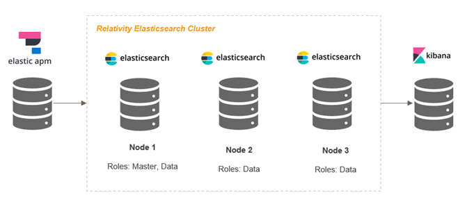

# Elasticsearch Upgrade from 7.x to 8.x across multiple DataGrid servers.

This document provides comprehensive steps to upgrade Elasticsearch from 7.x to 8.x across multiple DataGrid servers, including master and data node configurations.

> [!NOTE]
> This upgrade process should be performed when transitioning Elasticsearch from version 7.x to 8.x in a multi-node cluster environment with dedicated master and data nodes.

## Prerequisites

Before starting the upgrade process, ensure the following requirements are met:

1. **Environment Configuration**: Multiple DataGrid servers with master node on one server and data nodes on other servers
2. **Agent Management**: Disable or delete Audit Agents in Relativity before proceeding
   - Navigate to Relativity UI → Agents tab
   - Disable/Delete all Audit Agents before setup

## Pre-Installation Procedures

Perform the following steps on **all node servers** one by one:

> [!NOTE]
> The installation steps below apply to both master nodes and data nodes. Use the same installation procedure for all types of nodes in your Elasticsearch cluster.

### Step 1: Extract and Place Elasticsearch

1. Extract the Elasticsearch download archive
2. Place the extracted Elasticsearch folder on a suitable drive

   **Example**: `C:\Elastic\elasticsearch-8.x.x`

### Step 2: Environment Setup

**2.1 Configure Java Environment Variables**

Configure the Java environment variables for Elasticsearch. While Elasticsearch includes a bundled Java runtime, proper environment configuration ensures optimal performance.

For Java configuration troubleshooting and advanced setup, refer to the [Elasticsearch Troubleshooting Guide](troubleshooting/elasticsearch.md#1-windows-service-issues).

   

### Step 3: Install Elasticsearch Service

**3.1 Prepare Installation Environment**

1. Open **PowerShell** or **Command Prompt** in administrator mode
2. Navigate to Elasticsearch bin directory
   
   **Example**: `C:\Elastic\elasticsearch-8.x.x\bin`

**3.2 Remove Existing Elasticsearch Service (if present)**

1. **Identify the existing service name**:
   - Open **Services** (services.msc)
   - Look for Elasticsearch service (common names: `Elasticsearch`, `elasticsearch-service-x64`, or `Elasticsearch-7.x.x`)
   - Note the exact service name for use in removal command

2. **Stop the service**:
   - Right-click on the **Elasticsearch service** in Services
   - Select **Stop**

3. **Remove the service**:
   ```powershell
   .\elasticsearch-service.bat remove <service-name>
   ```
   
   **Examples**:
   ```powershell
   .\elasticsearch-service.bat remove elasticsearch-service-x64
   # OR
   .\elasticsearch-service.bat remove Elasticsearch
   ```

**3.3 Install New Elasticsearch Service**

Execute the following commands in sequence from the Elasticsearch bin directory:

1. **Setup Elasticsearch**:
   ```powershell
   .\elasticsearch.bat
   ```
   
   **Expected Output - Token Generation:**

    ```
   • Copy the following enrollment token and start new Elasticsearch nodes with `bin/elasticsearch --enrollment-token <token>` (valid for the next 30 minutes):
     eyJ2ZXIiOiI4LjEuNCIsImFkciI6WyIxOTIuMTY4LjEuMjQ6OTMwMCJdLCJmZ3IiOiJmOGExN2Y2NTM0Yjc...
   ```
   
   > [!NOTE]
   > Save the generated elastic enrollment token securely. Terminate execution by typing `Ctrl+C` to gracefully stop, then confirm batch job termination.

2. **Install Elasticsearch service**:
   ```powershell
   .\elasticsearch-service.bat install Elasticsearch
   ```

3. **Start Elasticsearch service**:
   ```powershell
   .\elasticsearch-service.bat start Elasticsearch
   ```
   
   > [!NOTE]
   > If the service fails to start through command, try starting manually from the Services window. If command fails with cluster unhealthy exit code 69, restart Elasticsearch Windows Service, restart PowerShell, and try again. If issues persist, restart the server and execute the command.

**3.4 Verify Service Installation**

1. Open **Local Services**
2. Verify the **Elasticsearch service** (with the recently installed version) is running
3. If not running, right-click on the Elasticsearch service and select **Start**

### Step 4: Configuration and Verification

**4.1 Configure elasticsearch.yml**

1. Navigate to the Elasticsearch config folder
   
   **Example**: `C:\Elastic\elasticsearch-8.x.x\config`

2. Open the `elasticsearch.yml` file
3. Verify the following security configuration is added at the end of the file:

   ```yaml
   # Enable security features
   xpack.security.enabled: true
   
   xpack.security.enrollment.enabled: true
   
   # Enable encryption for HTTP API client connections, such as Kibana, Logstash, and Agents
   xpack.security.http.ssl:
     enabled: true
     keystore.path: certs/http.p12
   
   # Enable encryption and mutual authentication between cluster nodes
   xpack.security.transport.ssl:
     enabled: true
     verification_mode: certificate
     keystore.path: certs/transport.p12
     truststore.path: certs/transport.p12
   
   # Create a new cluster with the current node only
   # Additional nodes can still join the cluster later
   cluster.initial_master_nodes: ["domain_server_name"]
   
   # Allow HTTP API connections from anywhere
   # Connections are encrypted and require user authentication
   http.host: 0.0.0.0
   
   # Allow other nodes to join the cluster from anywhere
   # Connections are encrypted and mutually authenticated
   #transport.host: 0.0.0.0
   ```

**4.2 Enable Stack Monitoring**

Add the following line to `elasticsearch.yml` to enable built-in Stack Monitoring dashboard:

```yaml
xpack.monitoring.collection.enabled: true
```

Save changes and restart the Elasticsearch service.

**4.3 Verify Elasticsearch Accessibility**

1. Access Elasticsearch at: `https://<insert_hostname>:9200/`

2. **Chrome Certificate Issue Resolution** :
   - Navigate to `chrome://net-internals/#hsts`
   - Type `domain_server_name` in the input field next to Delete button
   - Press **Delete** button
   - Query the domain to verify HSTS entries are removed
   - Restart browser and try accessing the URL again

**4.4 Reset Elasticsearch Password**

Reset the elastic user password using:

```powershell
.\elasticsearch-reset-password.bat -i -u elastic
```

### Step 5: JVM Heap Configuration

Configure JVM heap memory based on available system RAM:

1. **Stop** the Elasticsearch Windows service
2. Navigate to `.\config\jvm.options.d` directory in Elasticsearch installation
3. Create a new file with `.options` extension (e.g., `elasticsearch.options`)
4. Add the following content:

   **For servers with 32GB RAM**:
   ```
   -Xms16g
   -Xmx16g
   ```

   > [!NOTE]
   > Set both `-Xms` and `-Xmx` to the same value for optimal performance. For a 32GB RAM server, allocate 16GB (50% of total RAM) to Elasticsearch. Never exceed 32GB heap size due to compressed OOPs limitations.

5. **Save** the file
6. **Restart** the Elasticsearch Windows service
7. **Verify** the `java.exe` process memory usage is within the specified range


**6.3 SSL Certificate Configuration**

For each node server where Elasticsearch URL is not secure, follow the certificate import procedures detailed in the [Certificate Troubleshooting Guide](troubleshooting/pre-requisite-troubleshooting.md#certificate-troubleshooting).

## Multi-Node Cluster Configuration

> [!NOTE]
> The installation steps apply to both master nodes and data nodes. Use the same installation procedure for all types of nodes in your Elasticsearch cluster.

The cluster name must be the same across all node servers.
The value of the cluster.initial_master_nodes parameter should be the domain name of the master node server.
The discovery.seed_hosts parameter should include the domain names of all servers where Elasticsearch will be set up.

### Master Node Configuration

Update the `elasticsearch.yml` file on the master node with the following parameters:

```yaml
# Cluster configuration - must be same across all nodes
cluster.name: your-cluster-name

# Master node role
node.roles: [ master ]
node.name:  ["master_node_domain"]

# Discovery configuration
discovery.seed_hosts: ["master_node_domain", "data_node1_domain", "data_node2_domain"]
cluster.initial_master_nodes: ["master_node_domain"]

# Network configuration
http.host: 0.0.0.0
transport.host: 0.0.0.0
network.host: 0.0.0.0

```

### Data Node Configuration

Update the `elasticsearch.yml` file on each data node with the following parameters:

```yaml
# Cluster configuration - must be same across all nodes
cluster.name: your-cluster-name

# Data node role
node.roles: [ data ]
node.name:  ["data_node_domain"]

# Discovery configuration
discovery.seed_hosts: ["master_node_domain", "data_node1_domain", "data_node2_domain"]
cluster.initial_master_nodes: ["master_node_domain"]

# Network configuration
http.host: 0.0.0.0
transport.host: 0.0.0.0
network.host: 0.0.0.0

# Data and log paths (avoid C: drive or temporary storage)
path.data: X:/ElasticData
path.logs: X:/ElasticLogs


```

> [!NOTE]
> Replace `X:` with an appropriate drive letter that is not the C: drive or temporary storage drive.

## Certificate and Security Setup

Before proceeding with cluster formation, ensure Elasticsearch services are **stopped** on all node servers.

### Step 1: Create Certificate Authority (CA)

Perform on the **master node server**:

1. Open **PowerShell** in admin mode
2. Navigate to Elasticsearch bin folder
3. Run the following command:

   ```powershell
   .\elasticsearch-certutil ca
   ```

This generates `elastic-stack-ca.p12` file (root CA certificate).

### Step 2: Generate Node Certificates

1. Open **PowerShell** in admin mode
2. Navigate to Elasticsearch bin folder
3. Run the following command:

   ```powershell
   .\elasticsearch-certutil cert --ca elastic-stack-ca.p12
   ```

During execution:
- **Certificate Name**: Provide unique name for each node (e.g., node1, node2)
- **Password**: Set password (use same password for all nodes)

4. **Repeat** for each node in the cluster
5. **Copy** each certificate to its respective node server in the same directory

### Step 3: Update Certificate Paths in Configuration

After copying the certificates to each node server, update the `elasticsearch.yml` file to reference the correct certificate paths:

1. Navigate to the Elasticsearch config folder
   
   **Example**: `C:\Elastic\elasticsearch-8.x.x\config`

2. Open the `elasticsearch.yml` file
3. Update the transport SSL configuration with the correct certificate paths:

   ```yaml
   # Enable encryption and mutual authentication between cluster nodes
   xpack.security.transport.ssl:
     enabled: true
     verification_mode: certificate
     keystore.path: certs/transport.p12
     truststore.path: certs/transport.p12
   ```

   > [!NOTE]
   > Replace `transport.p12` with the actual certificate file name for each respective node.

4. Save the configuration file

### Step 4: Configure Keystore for Password Management

Perform on **all DataGrid servers** using the same password:

**Remove existing passwords**:

```powershell
.\elasticsearch-keystore remove xpack.security.transport.ssl.keystore.secure_password
.\elasticsearch-keystore remove xpack.security.transport.ssl.truststore.secure_password
```

**Add new passwords**:

```powershell
.\elasticsearch-keystore add xpack.security.transport.ssl.keystore.secure_password
.\elasticsearch-keystore add xpack.security.transport.ssl.truststore.secure_password
```

Enter the password created during certificate generation for both prompts.

### Step 5: Clean Node Data Folders

1. Navigate to Elasticsearch data folder
2. **Delete** all subfolders and files within the data directory
3. If deletion fails, restart the server and try again

### Step 6: Configure User Authentication

**Generate user credentials**:

```powershell
.\elasticsearch-setup-passwords auto
```

Type **y** when prompted and save the generated credentials securely.

### Step 7: Install Mapper Plugin

**Check existing plugins**:

```powershell
.\elasticsearch-plugin list
```

**If mapper-size plugin does not exist, install using below command**:

```powershell
.\elasticsearch-plugin install mapper-size
```

**For offline installation**:
1. Download: `https://artifacts.elastic.co/downloads/elasticsearch-plugins/mapper-size/mapper-size-8.x.x.zip`
2. Extract to: `C:\elasticsearch-8.x.x-windows-x86_64\elasticsearch-8.x.x\plugins` folder
3. Adjust version number accordingly

## Cluster Startup and Verification

### Step 1: Start Services

**Master Node**:
1. Start the Elasticsearch service via Services window
2. Access master node URL: `https://<master-node-domain>:9200`

**Data Nodes**:
1. Start each data node service one by one via Services window
2. Check status by accessing: `https://<data-node-domain>:9200`

### Step 2: Verify Cluster Formation

Run the following API on the master node to verify connected nodes:

```
https://<master-node-domain>:9200/_cat/nodes
```

This displays a list of all connected nodes in the cluster.