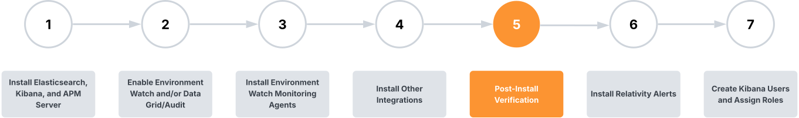

# Post-Install Verification

> [!NOTE]
> This step is required for Environment Watch.

## Prerequisites

After installation, wait 10–15 minutes before starting the verification process. This allows time for:
- All system services to fully initialize and become available
- Data collection agents to begin exporting telemetry to Elasticsearch
- Dashboard visualizations to populate with accurate status information
- Health indicators to show accurate statuses

## Overview

This documentation outlines the step-by-step procedures for verifying that the entire Relativity Environment Watch system is functioning properly after installation. The verification process confirms that the Elastic Stack cluster is healthy, all monitoring agents are exporting telemetry to Elasticsearch, and the integration with Relativity (e.g. Relativity Alerts) is working correctly.

## Verification steps

### 1. Elastic Cluster Health
This section guides through verifying the health and proper functioning of the Elasticsearch cluster.

[Click here for Elastic Cluster Health Verification](post-install-verification/elasticsearch-cluster-health.md)

### 2. Monitoring Agents
This section outlines the steps to confirm that all monitoring agents are correctly installed, running, and sending data.

[Click here for Monitoring Agents Verification](post-install-verification/monitoring-agents.md)

### 3. Relativity Alerts
This section covers how to ensure that the alerting mechanism is working as expected.

[Click here for Alerts Verification](post-install-verification/alert-overview.md)

> [!NOTE]
> All Kibana dashboards are designed and optimized for **1920x1080** screen resolution to ensure optimal viewing experience and proper layout formatting.

## Next Step

[Click here for the next step](../../docs/relativity_alerts_installation.md)
