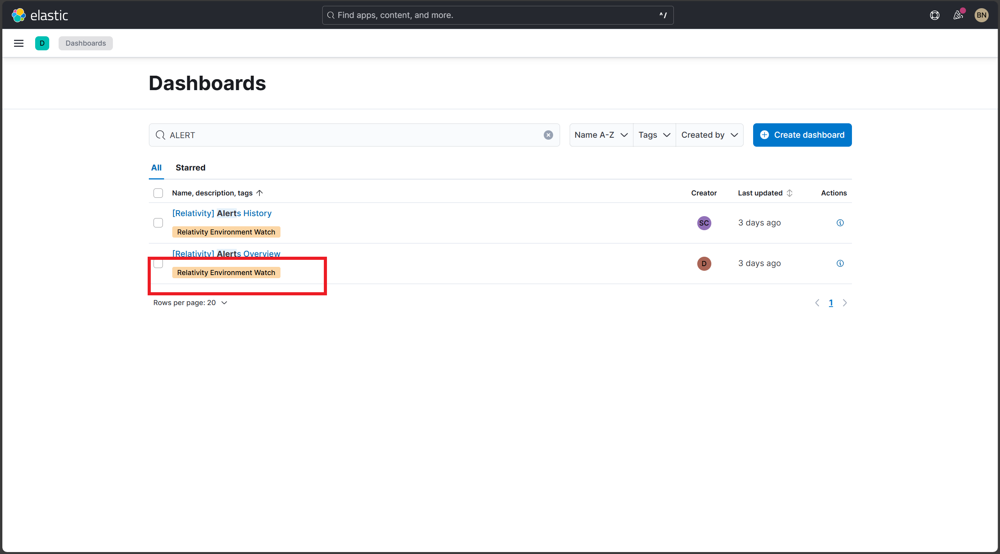
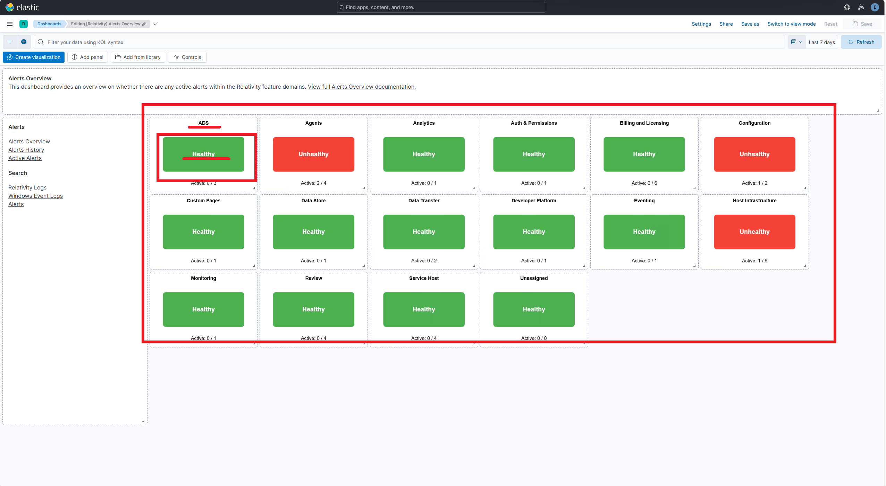
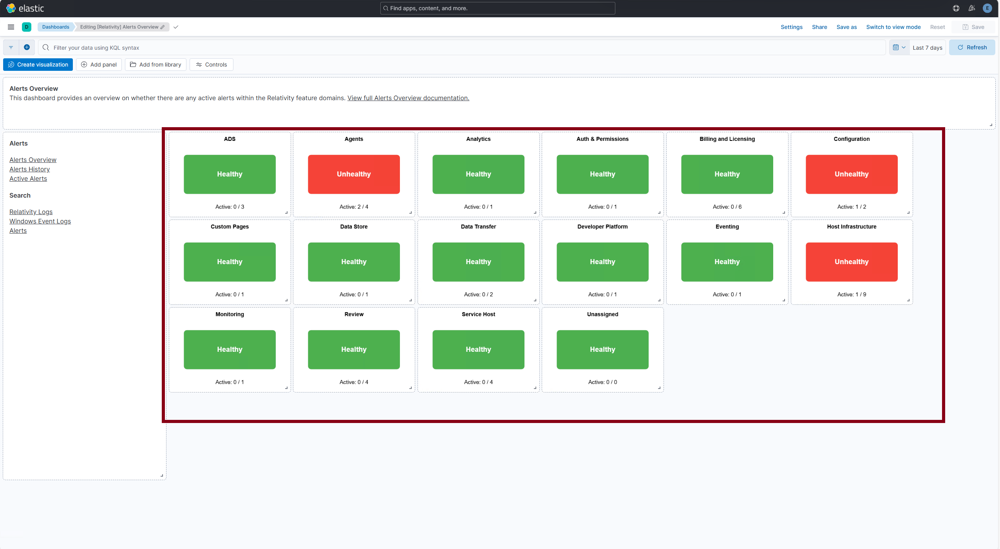
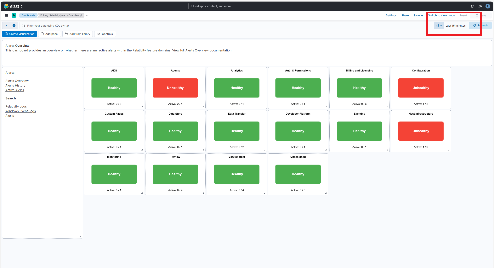

# Post-Install Verification for Alerts Overview


---

## Prerequisites

> [!IMPORTANT]
> After installation, wait 10–15 minutes before starting the verification process. This allows time for:
> - All services to fully initialize
> - Data collection to begin
> - Health indicators to show accurate statuses

---

## Table of Contents

- [Verify Dashboard Exists](#verify-dashboard-exists)  
- [Verify Dashboard Tag](#verify-dashboard-tag)  
- [Verify Health Indicators Are Displayed](#verify-health-indicators-are-displayed)  
- [Verify Individual Health Indicator Status](#verify-individual-health-indicator-status)  
- [Verify Dashboard in a Time Range](#verify-dashboard-in-a-time-range)  
- [Verify Visualization Style and Format](#verify-visualization-style-and-format)  
- [Verify Screen Resolution for the Dashboards](#verify-screen-resolution-for-the-dashboards)  
- [Example API Health Check (Optional)](#example-api-health-check-optional)

---

## Verify Dashboard Exists

**Description:**  
Ensure that the `[Relativity] Alerts Overview` dashboard is successfully installed and visible in Kibana.

**Steps:**
1. Open **Microsoft Edge**.
2. Navigate to Kibana.
3. Go to **Observability → Dashboards**.
4. Search for `[Relativity] Alerts Overview` in the dashboard list.

<details>
<summary><strong>Expected Result</strong></summary>

- `[Relativity] Alerts Overview` appears in the dashboard list.
- The dashboard is accessible without errors.
</details>

**Screenshot:**  


---

## Verify Dashboard Tag

**Description:**  
Confirm that the correct tag is applied to the dashboard for proper categorization.

**Steps:**
1. In Kibana, go to **Observability → Dashboards**.
2. Locate `[Relativity] Alerts Overview`.
3. Verify that the tag `Relativity Environment Watch` is displayed.

<details>
<summary><strong>Expected Result</strong></summary>

- The dashboard includes the `Relativity Environment Watch` tag.
</details>

**Screenshot:**  


---

## Verify Health Indicators Are Displayed

**Description:**  
Ensure that the health indicators section is visible at the top of the dashboard and follows the correct layout.

**Steps:**
1. Click into `[Relativity] Alerts Overview` dashboard.
2. Confirm that the health indicators appear at the top of the main content area.
3. Confirm all tiles include a **title**, **subtitle ("Healthy Alerts")**, and **color status**.

<details>
<summary><strong>Expected Result</strong></summary>

- Health indicators are present and aligned at the top.
- All indicators include:
  - Title (e.g., "Agents", "Monitoring")
  - Subtitle: *Healthy Alerts*
  - Color: Green or Red based on alert state.
</details>

**Screenshot:**  


---

## Verify Individual Health Indicator Status

**Description:**  
Verify the status and formatting of each health indicator tile, based on alert-driven logic and the color coding conventions.

**Steps:**
1. Open the `[Relativity] Alerts Overview` dashboard.
2. Locate each of the following indicators and confirm the title, subtitle, and color.

<details>
<summary><strong>Expected Result</strong></summary>

- **Green** = No active alerts (Healthy)
- **Red** = Active alerts present (Unhealthy)
</details>

> [!NOTE]
> All health indicators should display either Green or Red status after the initial wait period. If any health indicators aren't displaying correctly after waiting the full 10-15 minutes, verify that all related services are running properly and data collection is functioning correctly.

**Example Screenshot:**  


---

## Verify Dashboard in a Time Range

**Description:**  
Ensure that the dashboard is using a custom 15-minute time range as required for health indicators.

**Steps:**
1. On the dashboard, locate the time filter at the top right.
2. Click on the time range selector.
3. Select **"Apply custom time range"**.
4. Set the range to the **last 15 minutes**.
5. Apply changes.

<details>
<summary><strong>Expected Result</strong></summary>

- The time range reflects the last 15 minutes.
- Health indicators update dynamically based on this range.
</details>

**Screenshot:**  


---

## Verify Visualization Style and Format

**Description:**  
Confirm that all health indicator visualizations follow the required formatting and visual standards.

**Steps:**
1. Check for the following attributes:
  - Font color is **White** for text overlays.
  - Font size is **22pt for titles, 14pt for subtitles**.
  - **No decimal values** are used (set to 0).
  - Text alignment is **center** with **middle baseline**.
  - Color mapping is set to:
    - **Color by value → Dynamic**
    - Supporting visualization: **Type = None**
  - Subtitle appears using **"Titles and Text"** setting (e.g., *Healthy*).
  - Title text uses **bold font weight**.

<details>
<summary><strong>Expected Result</strong></summary>

- All tiles meet visualization standards.
- No tooltips, labels, or legends are improperly formatted.
- Visual consistency across the entire dashboard.
</details>

**Screenshot:**  


---

## Verify Screen Resolution for the Dashboards

**Description:**  
Ensure the dashboard layout and formatting are optimized for the recommended screen resolution of **1920x1080**, which ensures full visibility of all visual elements without scrollbars or layout distortion.

**Steps:**
1. Login to **Kibana**.
2. Navigate to **Observability → Dashboard**.
3. Click on `[Relativity] Alerts Overview`.
4. Press **F12** to open Developer Tools in **Chrome** or **Edge**.
5. Toggle the **Device Emulation** feature.
6. Set the device dimensions to **1920x1080**.

<details>
<summary><strong>Expected Result</strong></summary>

- The dashboard fits within a 1920x1080 resolution.
- No horizontal or vertical scrollbars are required to view core components.
- All health indicators and visualizations remain properly aligned.
</details>

**Screenshot:**  


---

## Example API Health Check (Optional)

**Description:**  
Verify dashboard backend connectivity using a direct API call to Elasticsearch/Kibana for health indicators (for technical validation).

**Steps:**  
Run the following `curl` command from a secure terminal:

```bash
curl.exe -k -u <username>:<password> -X GET "https://<hostname_or_ip>:5601/api/saved_objects/_find?type=dashboard&search_fields=title&search=%5BRelativity%5D%20Alerts%20Overview" -H 'kbn-xsrf: true'
```

<details>
<summary><strong>Expected Result</strong></summary>

- A JSON response returns the dashboard object.
- Status code `200 OK`.
</details>

---
