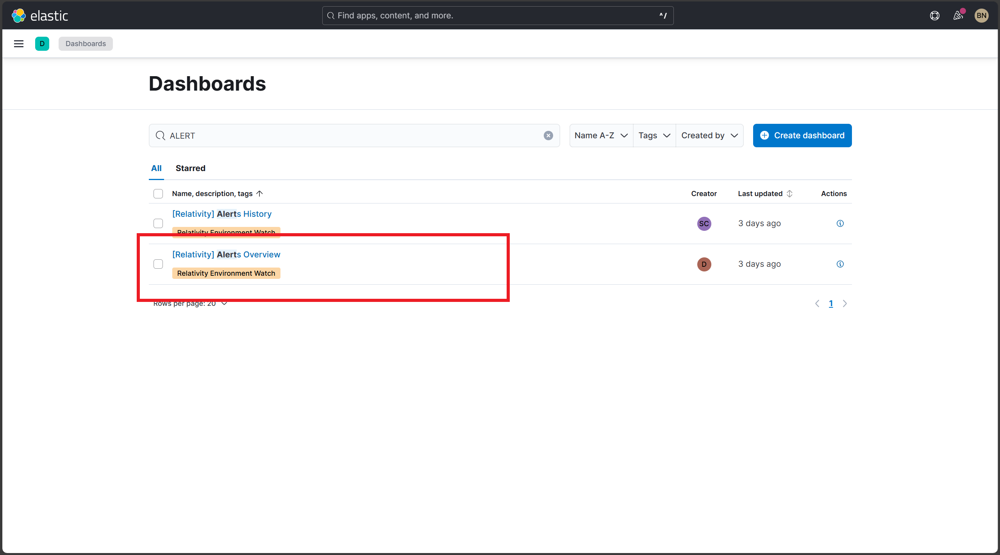
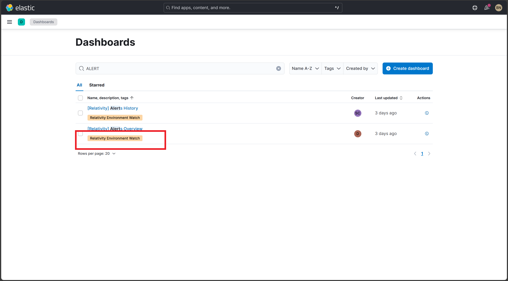
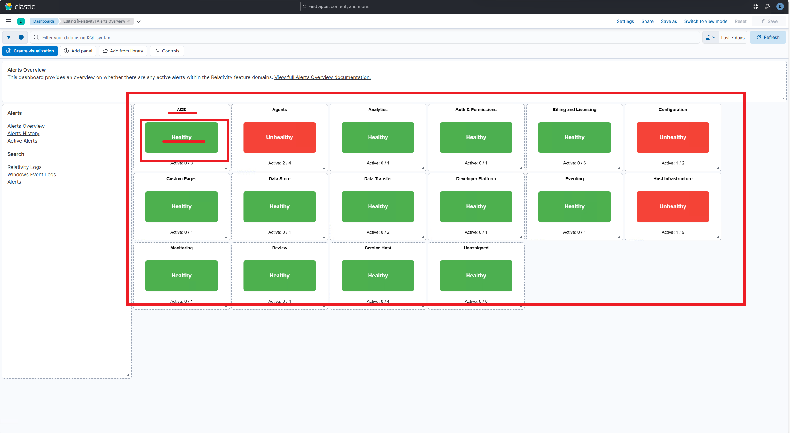
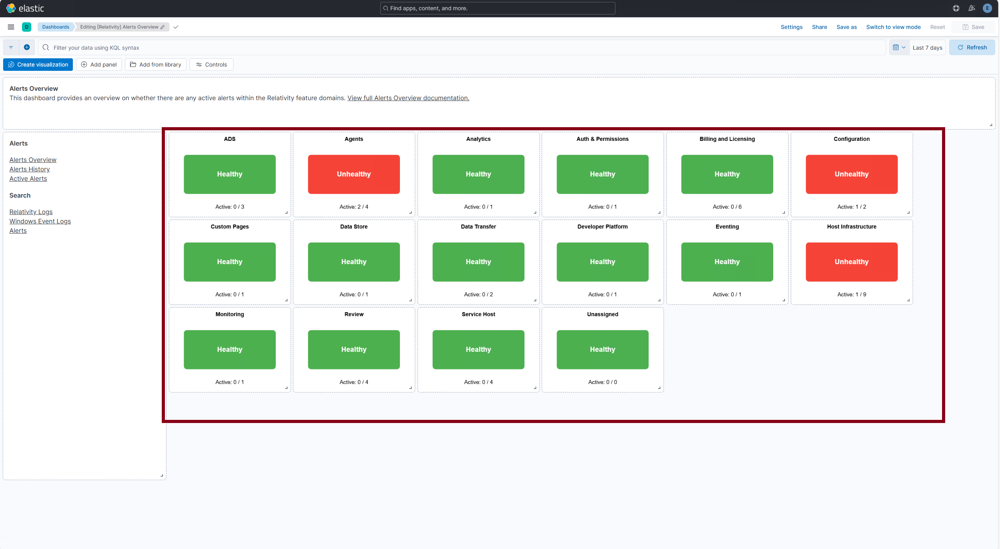
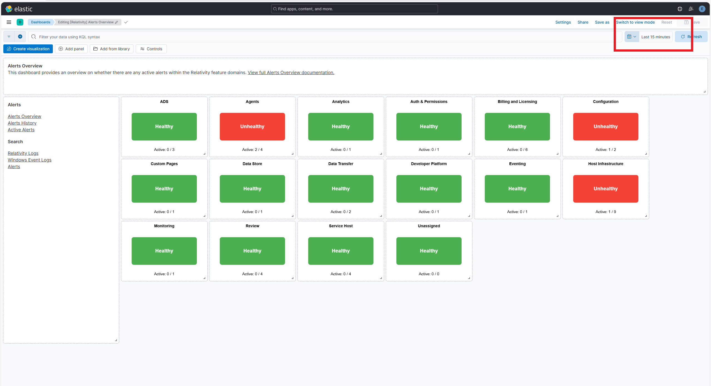

# Post-Install Verification for Alerts

## Table of Contents

- [Verify Dashboard Exists](#verify-dashboard-exists)  
- [Verify Dashboard Tag](#verify-dashboard-tag)  
- [Verify Health Indicators Are Displayed](#verify-health-indicators-are-displayed)  
- [Verify Individual Health Indicator Status](#verify-individual-health-indicator-status)  
- [Verify Dashboard in a Time Range](#verify-dashboard-in-a-time-range)

---
> [!NOTE]
> The below Health Indicators will be available from September 8th 2025 release.
## Verify Dashboard Exists

**Description:**  
Ensure that the `[Relativity] Alerts Overview` dashboard is successfully installed and visible in Kibana.

**Steps:**
1. Open **Microsoft Edge**.
2. Navigate to Kibana.
3. Go to **Observability → Dashboards**.
4. Search for `[Relativity] Alerts Overview` in the dashboard list.

<strong>Expected Result</strong>

- `[Relativity] Alerts Overview` appears in the dashboard list.
- The dashboard is accessible without errors.

**Screenshot:**  

---

## Verify Dashboard Tag

**Description:**  
Confirm that the correct tag is applied to the dashboard for proper categorization.

**Steps:**
1. In Kibana, go to **Observability → Dashboards**.
2. Locate `[Relativity] Alerts Overview`.
3. Verify that the tag `Relativity Environment Watch` is displayed.

<strong>Expected Result</strong>

- The dashboard includes the `Relativity Environment Watch` tag.

**Screenshot:**  

---

## Verify Health Indicators Are Displayed

**Description:**  
Ensure that the health indicators section is visible at the top of the dashboard and follows the correct layout.

**Steps:**
1. Click into `[Relativity] Alerts Overview` dashboard.
2. Confirm that the health indicators appear at the top of the main content area.
3. Confirm all tiles include a **title**, **subtitle ("Healthy Alerts")**, and **color status**.

<strong>Expected Result</strong>

- Health indicators are present and aligned at the top.
- All indicators include:
  - Title (e.g., "Agents", "Monitoring")
  - Subtitle: *Healthy Alerts*
  - Color: Green or Red based on alert state.

**Screenshot:**  

---

## Verify Individual Health Indicator Status

**Description:**  
Verify the status and formatting of each health indicator tile, based on alert-driven logic and the color coding conventions.

**Steps:**
1. Open the `[Relativity] Alerts Overview` dashboard.
2. Locate each of the following indicators and confirm the title, subtitle, and color.

<strong>Expected Result</strong>

- **Green** = No active alerts (Healthy)
- **Red** = Active alerts present (Unhealthy)

> [!NOTE]
> All health indicators should display either Green or Red status after the initial wait period. If any health indicators aren't displaying correctly after waiting the full 10-15 minutes, verify that all related services are running properly and data collection is functioning correctly.

**Example Screenshot:**  

---

## Verify Dashboard in a Time Range

**Description:**  
Ensure that the dashboard is using a custom 15-minute time range as required for health indicators.

**Steps:**
1. On the dashboard, locate the time filter at the top right.
2. Click on the time range selector.
3. Select **"Apply custom time range"**.
4. Set the range to the **last 15 minutes**.
5. Apply changes.

<strong>Expected Result</strong>

- The time range reflects the last 15 minutes.
- Health indicators update dynamically based on this range.

**Screenshot:**  

---
