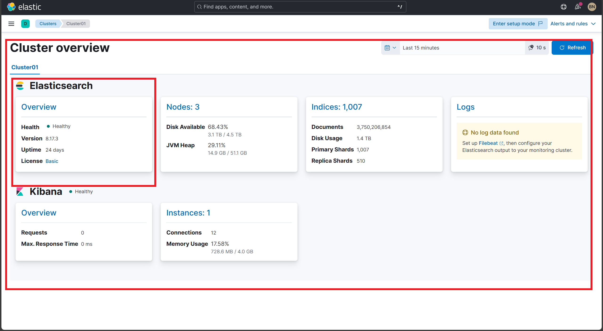
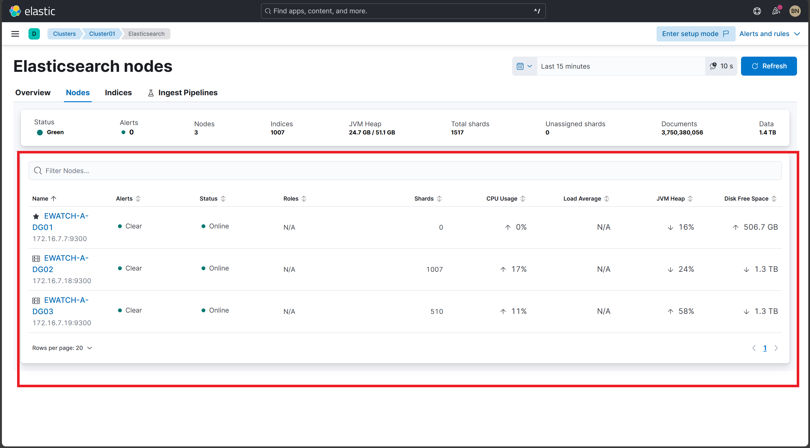
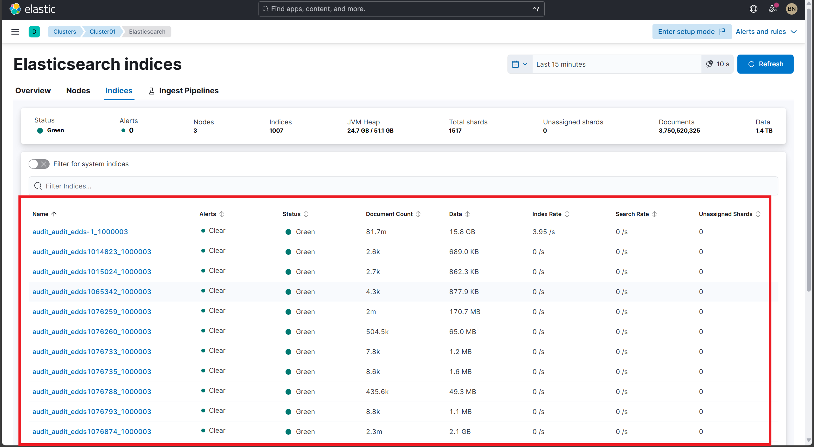
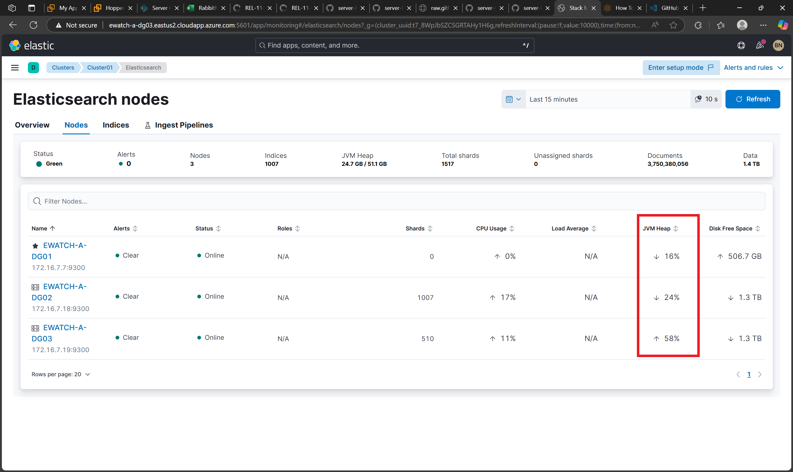
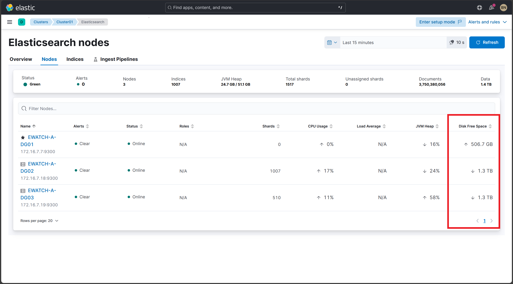
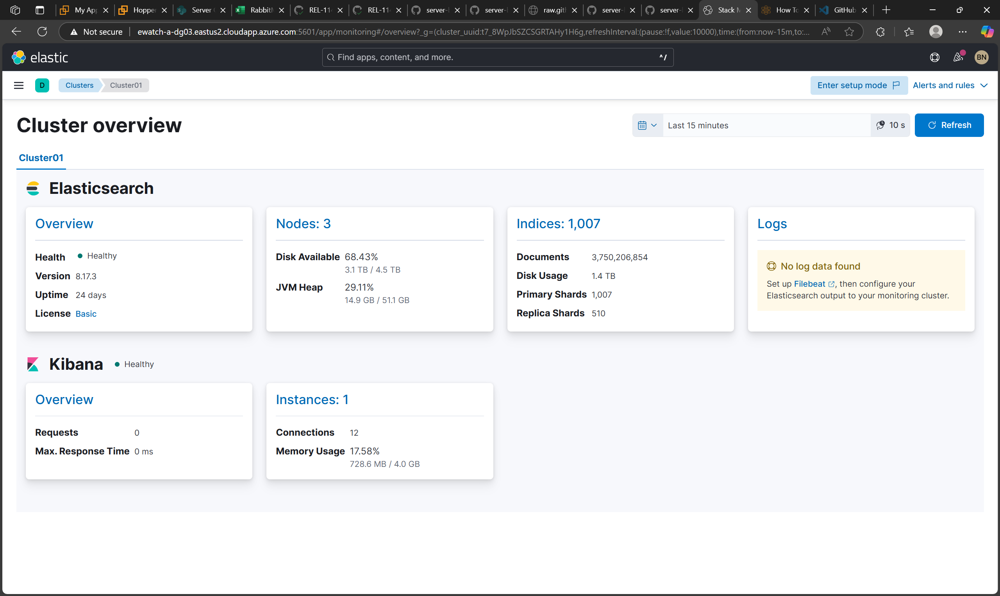

# Elastic Cluster Health  
---

> [!IMPORTANT]  
> After installation, wait 10–15 minutes before starting verification to allow services to fully initialize and collect accurate data.

---

## Navigation

* [Verify Cluster Health Summary](#verify-cluster-health-summary)  
* [Verify Node Metrics](#verify-node-metrics)  
* [Verify Index Statistics](#verify-index-statistics)  
* [Verify JVM and GC Metrics](#verify-jvm-and-gc-metrics)  
* [Verify Disk and Storage Utilization](#verify-disk-and-storage-utilization)   
* [Verify Dashboard Visualization Style and Format](#verify-dashboard-visualization-style-and-format)  
* [API-Based Cluster Health Check](#api-based-cluster-health-check)  

---

## Verify Cluster Health Summary

**Description:**  
Confirm cluster health status, total nodes, shards, indices, and document count are displayed and accurate.

**Steps:**  
1. Open the `Elastic Cluster Dashboard`.  
2. Locate the **Cluster Overview** or **Cluster Health Summary** panel.  
3. Validate:  
   - Cluster status (Green, Yellow, Red) — expect Green for healthy cluster.  
      - Number of nodes.  
      - Number of indices.  
      - Total shards and unassigned shards.  
      - Total documents.  
      - Data size.

<details>  
<summary><strong>Expected Result</strong></summary>  

- Cluster health is **Green (Healthy)**.  
- Nodes, shards, indices, and documents display current, non-zero values.  
- No unassigned shards.  
- Data size is displayed accurately.  
</details>  

**Screenshot:**  


---

## Verify Node Metrics

**Description:**  
Ensure node-level metrics such as CPU usage, JVM heap usage, and disk space are reported per node.

**Steps:**  
1. Open the **Node Metrics** or **Elasticsearch Nodes** panel.  
2. Confirm each node shows:  
   - Status (Online).  
   - CPU usage (percentage).  
   - JVM heap usage (percentage).  
   - Disk free space.  
   - Load Average (may be unavailable, verify if data present).

<details>  
<summary><strong>Expected Result</strong></summary>  

- All nodes listed (3 nodes).  
- CPU, JVM heap %, and disk free space values present.  
- Load average may show as N/A if unsupported but should be monitored for future inclusion.  
</details>  

**Screenshot:**  


---

## Verify Index Statistics

**Description:**  
Validate index-level metrics including document counts, data size, indexing rate, and search rate.

**Steps:**  
1. Open the **Indices** panel.  
2. Review per-index data such as:  
   - Document count.  
   - Data size.  
   - Indexing rate (docs per second).  
   - Search rate (queries per second).  
   - Unassigned shards (should be zero).  
3. Check for any alerts or warnings on indices.

<details>  
<summary><strong>Expected Result</strong></summary>  

- Per-index document counts and data sizes are populated.  
- Indexing and search rates update regularly.  
- No unassigned shards.  
- Alerts show clear or no issues on indices.  
</details>  

**Screenshot:**  


---

## Verify JVM and GC Metrics

**Description:**  
Confirm JVM heap usage is visible; garbage collection (GC) metrics may be limited or unavailable.

**Steps:**  
1. Locate the **JVM Heap Usage** on node or cluster overview panels.  
2. Verify JVM heap usage numbers for each node or cluster aggregate.  
3. If GC metrics are missing, note and plan for future monitoring improvement.

<details>  
<summary><strong>Expected Result</strong></summary>  

- JVM heap usage visible per node (e.g., 18.5 GB / 51.1 GB).  
- GC metrics may not be shown; absence acceptable for current setup.  
</details>  

**Screenshot:**  


---

## Verify Disk and Storage Utilization

**Description:**  
Ensure disk free space and usage metrics are visible for each node.

**Steps:**  
1. Check disk free space shown per node in the **Node Metrics** panel.  
2. Confirm reported disk free space aligns with expectations (e.g., 506.7 GB, 1.3 TB).  

<details>  
<summary><strong>Expected Result</strong></summary>  

- Disk free space values displayed for all nodes.  
- No fields marked as N/A for disk metrics.  
</details>  

**Screenshot:**  


---

## Verify Dashboard Visualization Style and Format

**Description:**  
Verify that dashboard panels display correctly for post-installation validation.

**Steps:**  
1. Access the `Elastic Cluster Dashboard` in your browser.  
2. Review each panel for proper data display:  
   - Cluster Health Summary  
   - Node Metrics  
   - Index Statistics  
   - JVM and GC Metrics  
   - Disk and Storage Utilization  
3. Verify dashboard functionality:  
   - All panels load without errors.  
   - Data refreshes appropriately.  
   - Navigation between sections works smoothly.  
4. Validate that all visualizations render correctly and show expected data.

<details>  
<summary><strong>Expected Result</strong></summary>  

- All dashboard panels display data correctly.  
- No missing visualizations or error messages.  
- Dashboard is responsive and functions as expected.  
- All monitoring components are operational and displaying real-time data.  
</details>  

**Screenshot:**  


---

## API-Based Cluster Health Check

**Description:**  
Verify Elasticsearch cluster health directly via API for technical confirmation.

**Steps:**  
Run this command from a secure terminal:

```bash
curl -u <username>:<password> -X GET "https://<hostname_or_ip>:9200/_cluster/health" -H "Content-Type: application/json"
```

<details>
<summary><strong>Expected Result</strong></summary>

- Status code: `200 OK`
- A JSON response with cluster health details
- Key fields to look for:
  - `"status"` should be `green` (ideal), `yellow` (acceptable), or `red` (problem).
  - `"number_of_nodes"` and `"active_shards"` confirm data nodes are active and functioning.
</details>

**Screenshot:**  


---

