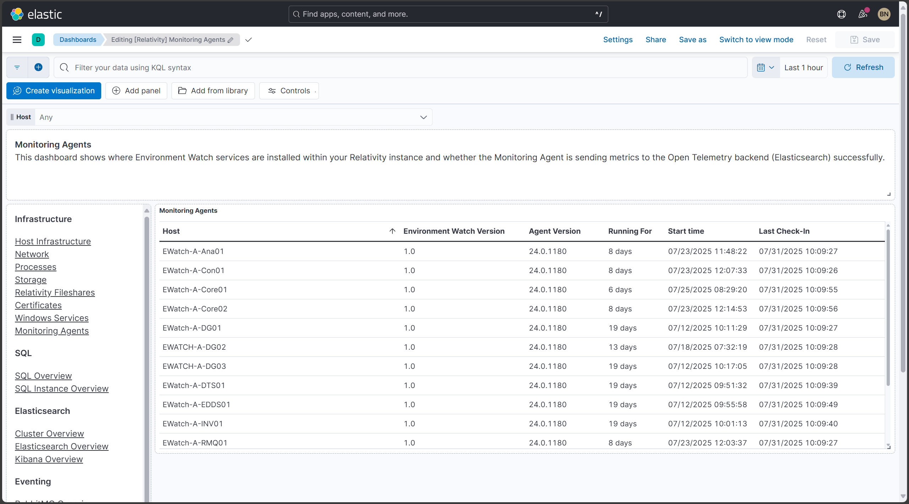
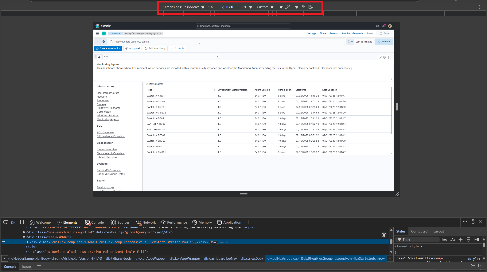

# Post-Install Verification for Monitoring Agents


---

## Prerequisites

> [!IMPORTANT]
> After installation, wait 10–15 minutes before starting the verification process. This allows time for:
> - All system services to fully initialize and become available
> - Data collection agents to begin gathering and transmitting metrics
> - Dashboard visualizations to populate with accurate status information

---

## Table of Contents

* [Verify Monitoring Agent Dashboard Exists](#verify-monitoring-agent-dashboard-exists)
* [Verify Monitoring Agents Dashboard Tags](#verify-monitoring-agents-dashboard-tags)
* [Verify Dashboard Filters Populate with Data](#verify-dashboard-filters-populate-with-data)
* [Verify Visualization Order](#verify-visualization-order)
* [Verify Data Population by Changing Filters and Time Ranges](#verify-data-population-by-changing-filters-and-time-ranges)
* [Verify Hosts and Agent Versions](#verify-hosts-and-agent-versions)
* [Verify Data in Discover](#verify-data-in-discover)
* [Verify Screen Resolution for the Dashboards](#verify-screen-resolution-for-the-dashboards)
* [Example API Health Check (Optional)](#example-api-health-check-optional)

---

## Verify Monitoring Agent Dashboard Exists

**Description:**
Ensure the Monitoring Agent dashboard is present.

**Steps:**
1. Login to Kibana.
2. Navigate to **Analytics → Dashboard**.

<details>
<summary><strong>Expected Result</strong></summary>

* "Monitoring Agent" is listed.
</details>

**Screenshot:**


---

## Verify Monitoring Agents Dashboard Tags

**Description:**
Ensure the correct tags are assigned to the dashboard.

**Steps:**
1. Login to Kibana.
2. Navigate to **Observability → Dashboard**.
3. Open the Monitoring Agents dashboard.

<details>
<summary><strong>Expected Result</strong></summary>

* Tags:
  * `Relativity Environment Watch`
  * `FeatureDomain: Monitoring`
</details>

**Screenshot:**


---

## Verify Dashboard Filters Populate with Data

**Description:**
Ensure filter dropdowns are populated with available data.

**Steps:**
1. Login to Kibana.
2. Navigate to **Observability → Dashboard**.
3. Click on the dashboard and open each filter dropdown.

<details>
<summary><strong>Expected Result</strong></summary>

* Filter dropdowns show available values.
</details>

> [!NOTE]
> Filters may take a few minutes to populate after initial data collection begins.

**Screenshot:**


---

## Verify Visualization Order

**Description:**
Confirm the visualizations appear in the correct order.

**Steps:**
1. Login to Kibana.
2. Navigate to **Observability → Dashboard**.
3. Open the dashboard.

<details>
<summary><strong>Expected Result</strong></summary>

* Visualizations should appear in this order:
  * Top: Filter navigation controls
  * Left: Main dashboard navigation
  * Center/Main body: Table visualization showing monitoring agent data
</details>

**Screenshot:**



---

## Verify Data Population by Changing Filters and Time Ranges

**Description:**
Ensure the dashboard data is loading correctly.

**Steps:**
1. Login to Kibana.
2. Open the "Monitoring Agent" dashboard.
3. Change the time range to 15 minutes, 1 hour, 12 hours, and 24 hours.
4. Adjust filters to see if data updates accordingly.

1. Login to Kibana.
2. Open the "Monitoring Agent" dashboard.

<details>
<summary><strong>Expected Result</strong></summary>

* All panels are populated with data.
</details>

**Screenshot:**


---

## Verify Hosts and Agent Versions

**Description:**
Ensure hosts and agent versions are correctly displayed.

**Steps:**
1. Login to Kibana.
2. Open the "Monitoring Agent" dashboard.

<details>
<summary><strong>Expected Result</strong></summary>

* Host column lists multiple hosts.
* Agent Version is the same for all hosts.
* Last Modified Date column shows timestamp to verify installation time.
</details>

**Screenshot:**


---

## Verify Data in Discover

**Description:**
Ensure dashboard data is reflected in Discover.

**Steps:**
1. Login to Kibana.
2. Open the dashboard → Monitoring Agents table → Three dots → Explore in Discover.

<details>
<summary><strong>Expected Result</strong></summary>

* Data is visible in Discover.
</details>

**Screenshot:**


---

## Verify Screen Resolution for the Dashboards

**Description:**  
Ensure the dashboard layout and formatting are optimized for the recommended screen resolution of **1920x1080**, which ensures full visibility of all visual elements without scrollbars or layout distortion.

**Steps:**
1. Login to **Kibana**.
2. Navigate to **Observability → Dashboard**.
3. Click on the "Monitoring Agent" dashboard.
4. Press **F12** to open Developer Tools in **Chrome** or **Edge**.
5. Toggle the **Device Emulation** feature.
6. Set the device dimensions to **1920x1080**.

<details>
<summary><strong>Expected Result</strong></summary>

- The dashboard fits within a 1920x1080 resolution.
- No horizontal or vertical scrollbars are required to view core components.
- All visualizations remain properly aligned.
</details>

**Screenshot:**  


---

## Example API Health Check (Optional)

**Description:**  
Verify dashboard backend connectivity using a direct API call to Elasticsearch/Kibana for health indicators (for technical validation).

**Steps:**  
Run the following `curl` command from a secure terminal:

```bash
curl.exe -k -u <username>:<password> -X GET "https://<hostname>:5601/api/saved_objects/_find?type=dashboard&search_fields=title&search=Monitoring%20Agent" -H "kbn-xsrf: true"
```

<details>
<summary><strong>Expected Result</strong></summary>

- A JSON response returns the dashboard object.
- Status code `200 OK`.
</details>

---
