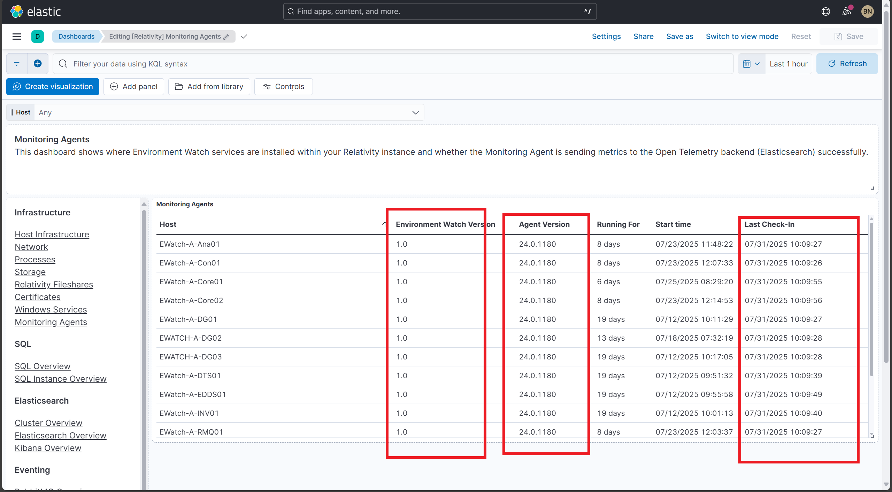

# Post-Install Verification for Monitoring Agents

## Table of Contents

* [Verify Monitoring Agent Dashboard Exists](#verify-monitoring-agent-dashboard-exists)
* [Verify Monitoring Agents Dashboard Tags](#verify-monitoring-agents-dashboard-tags)
* [Verify Dashboard Filters Populate with Data](#verify-dashboard-filters-populate-with-data)
* [Verify Data Population by Changing Filters and Time Ranges](#verify-data-population-by-changing-filters-and-time-ranges)
* [Verify Hosts and Agent Versions](#verify-hosts-and-agent-versions)
* [Verify Data in Discover](#verify-data-in-discover)

---

## Verify Monitoring Agent Dashboard Exists

**Description:**
Ensure the Monitoring Agent dashboard is present.

**Steps:**
1. Login to Kibana.
2. Navigate to **Analytics → Dashboard**.

<strong>Expected Result</strong>

* "Monitoring Agent" is listed.

**Screenshot:**

---

## Verify Monitoring Agents Dashboard Tags

**Description:**
Ensure the correct tags are assigned to the dashboard.

**Steps:**
1. Login to Kibana.
2. Navigate to **Observability → Dashboard**.
3. Open the Monitoring Agents dashboard.

<strong>Expected Result</strong>

* Tags:
  * `Relativity Environment Watch`
  * `FeatureDomain: Monitoring`

**Screenshot:**

---

## Verify Dashboard Filters Populate with Data

**Description:**
Ensure filter dropdowns are populated with available data.

**Steps:**
1. Login to Kibana.
2. Navigate to **Observability → Dashboard**.
3. Click on the dashboard and open each filter dropdown.

<strong>Expected Result</strong>

* Filter dropdowns show available values.

> [!NOTE]
> Filters may take a few minutes to populate after initial data collection begins.

**Screenshot:**

---

## Verify Data Population by Changing Filters and Time Ranges

**Description:**
Ensure the dashboard data is loading correctly.

**Steps:**
1. Login to Kibana.
2. Open the "Monitoring Agent" dashboard.
3. Change the time range to 15 minutes, 1 hour, 12 hours, and 24 hours.
4. Adjust filters to see if data updates accordingly.

1. Login to Kibana.
2. Open the "Monitoring Agent" dashboard.

<strong>Expected Result</strong>

* All panels are populated with data.

**Screenshot:**

---

## Verify Hosts and Agent Versions

**Description:**
Ensure hosts and agent versions are correctly displayed.

**Steps:**
1. Login to Kibana.
2. Open the "Monitoring Agent" dashboard.

<strong>Expected Result</strong>

* Host column lists multiple hosts.
* Agent Version is the same for all hosts.
* Last Modified Date column shows timestamp to verify installation time.

> [!NOTE]
> Verify that the agent version is consistent across all nodes to ensure uniform monitoring capabilities.

**Screenshot:**

---

## Verify Data in Discover

**Description:**
Ensure dashboard data is reflected in Discover.

**Steps:**
1. Login to Kibana.
2. Open the dashboard → Monitoring Agents table → Three dots → Explore in Discover.

<strong>Expected Result</strong>

* Data is visible in Discover.

**Screenshot:**

---
