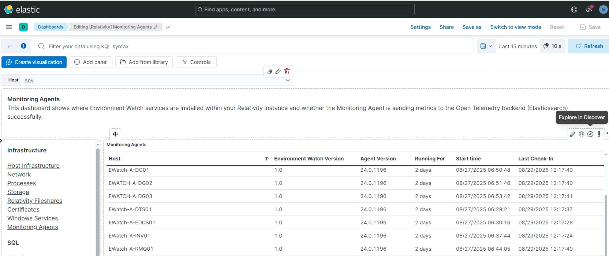

# Post-Install Verification for Monitoring Agents

## Verify Monitoring Agent dashboard exists

Ensure the Monitoring Agent dashboard is present.

**Steps:**
1. Login to Kibana.
2. Navigate to **Dashboards** 
3. Use the search bar to search for `Monitoring Agents`.

**Expected Result:**
- **Monitoring Agent** is listed.

**Screenshot:**

## Verify Monitoring Agents dashboard tags

Ensure the correct tags are assigned to the dashboard.

**Steps:**
1. Login to Kibana.
2. Navigate to **Dashboards**.
3. Use the search bar to search for `Monitoring Agents` and open the dashboard.

**Expected Result:**
- Tags:
  - **Relativity Environment Watch**
  - **FeatureDomain: Monitoring**

**Screenshot:**

## Verify dashboard filters populate with data

Ensure filter dropdowns are populated with available data.

**Steps:**
1. Login to Kibana.
2. Navigate to **Observability → Dashboard**.
3. Click on the dashboard and open each filter dropdown.

**Expected Result:**
- Filter dropdowns show available values.

> Filters may take a few minutes to populate after initial data collection begins.

**Screenshot:**

## Verify data population by changing filters and time ranges

Ensure the dashboard data is loading correctly.

**Steps:**
1. Login to Kibana.
2. Open the **Monitoring Agent** dashboard.
3. To change the time range, use the time filter at the top right, select the desired range (e.g., 15 minutes, 1 hour, 12 hours, 24 hours), and apply changes.
4. Adjust filters to see if data updates accordingly.

**Expected Result:**
* All panels are populated with data.

**Screenshot:**

## Verify Hosts and Agent versions

Ensure hosts and agent versions are correctly displayed.

**Steps:**
1. Login to Kibana.
2. Open the "Monitoring Agent" dashboard.

**Expected Result:**
- Host column lists multiple hosts.
- Agent Version is the same for all hosts.
- Last Modified Date column shows timestamp to verify installation time.

> Verify that the agent version is consistent across all nodes to ensure uniform monitoring capabilities.

**Screenshot:**

## Verify data in Discover

Ensure dashboard data is reflected in Discover.

**Steps:**
1. Login to Kibana.
2. Open the dashboard and hover over the top right corner of the Monitoring Agents table to reveal the **Explore in Discover** option.
3. Click **Explore in Discover**.

**Expected Result:**
- Data is visible in Discover.

**Screenshot:**

