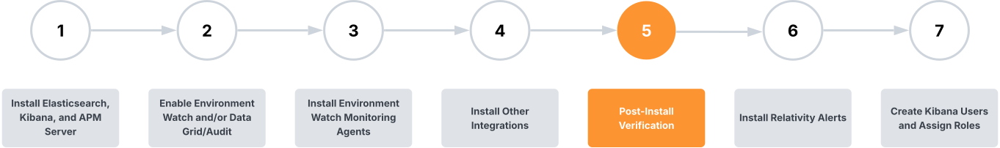

# Relativity Environment Watch Post-Install Verification

## Prerequisites

> [!IMPORTANT]
> After installation, wait 10–15 minutes before starting the verification process. This allows time for:
> - All system services to fully initialize and become available
> - Data collection agents to begin exporting telemetry to Elasticsearch
> - Dashboard visualizations to populate with accurate status information
> - Health indicators to show accurate statuses

## Overview

This documentation outlines the step-by-step procedures for verifying that the entire Relativity Environment Watch system is functioning properly after installation. The verification process confirms that the Elastic Stack cluster is healthy, all monitoring agents are exporting telemetry to Elasticsearch, and the integration with Relativity (e.g. Relativity Alerts) is working correctly.

> [!NOTE]
> All Kibana dashboards are designed and optimized for **1920x1080** screen resolution to ensure optimal viewing experience and proper layout formatting.

## Post-Install Verification Navigation

- [Verify Elastic Cluster Health](post-install-verification/elasticsearch-cluster-health.md)
- [Verify Monitoring Agents](post-install-verification/monitoring-agents.md)
- [Verify Alerts Dashboard](post-install-verification/alerts.md)

Next Step: [Install Relativity Application](https://help.relativity.com/Server2024/Content/Relativity/Audit/Audit.htm#InstallingandconfiguringAudit)
