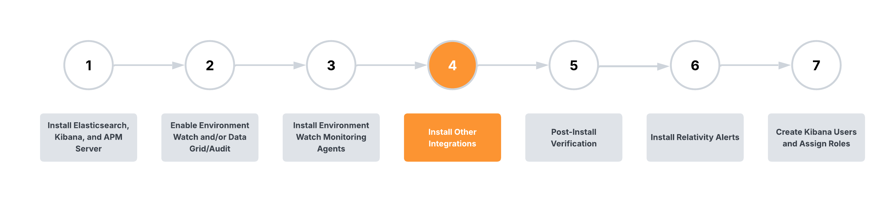

# Install Other Integrations

This section applies to Environment Watch Only.

 

This guide provides information on integrating various Relativity components with Environment Watch. These integrations extend observability capabilities across your environment, enabling comprehensive monitoring and performance analysis.

## Available Integrations

### Relativity Analytics Engine (CAAT) Integration 

The Relativity Analytics Engine (CAAT) integration provides observability into Analytics operations by implementing OpenTelemetry instrumentation.

- [Setting Up OpenTelemetry Java Agent for Relativity Analytics Engine](analytics/caat_environment_watch_setup.md)

### RabbitMQ Integration

The RabbitMQ integration enables monitoring of RabbitMQ queues, exchanges, and nodes.

- [Setting Up RabbitMQ Integration](rabbitmq/rabbitmq_integration.md)

## Next Step

[Click here for the next step](./environment-watch/post-install-verification.md)