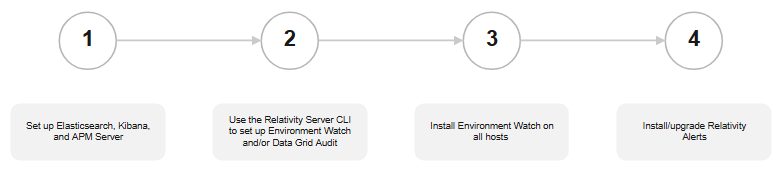

# Environment Watch and Data Grid Audit Installation

## Installation Overview

Environment Watch and Data Grid Audit require installation and configuration of third-party and Relativity software. This installation guide covers the full set up for Environment Watch but only the Elasticsearch and Kibana set up for Data Grid Audit. Additional steps for configuring the Audit application within Relativity are covered [here](https://help.relativity.com/Server2024/Content/Relativity/Audit/Audit.htm#InstallingandconfiguringAudit).

The Relativity applications and components that are referenced in this installation guide are packaged together in the Server bundle release. You can find the latest bundle on GitHub [here](https://github.com/relativitydev/server-bundle-release/releases). Environment Watch and Data Grid Audit also require Relativity applications that are available in the Relativity Application Library and not packaged in the bundle or covered in this installation guide (e.g. Pagebase and Telemetry for Environment Watch, Audit for Data Grid Audit, and InfraWatch Services for both). These applications are identified as pre-requisites in relevant sections of this installation guide.

The Server bundle is generally released quarterly but hot fixes are provided for critical issues on an ad hoc basis.

Environment Watch installation is comprised of the following four stages. **Stages 1 and 2 are also used to set up Elasticsearch and Kibana for using Data Grid Audit. Stages 3 and 4 are only relevant for Environment Watch.**

<table><tbody><tr><th>
<strong>Stage</strong>
</th><th>
<strong>Name</strong>
</th><th>
<strong>Applicable For</strong>
</th><th>
<strong>Description</strong>
</th><th>
<strong>Environment Watch Bundle Assets</strong>
</th></tr><tr><td>
1
</td><td>
Elasticsearch, Kibana, and APM Server
</td><td>
Environment Watch and Data Grid Audit
</td><td>
During this step you will install the Elastic stack software that is used for Environment Watch and/or Kibana (Elasticsearch, Kibana, and APM Server).

APM Server is only used for Environment Watch.
</td><td><ul> N/A</ul></td></tr><tr><td>
2
</td><td>
Use the Relativity Server CLI to set up Environment Watch and/or Data Grid Audit
</td><td>
Environment Watch and Data Grid Audit
</td><td>
During this step you will configure the integration between Elastic and Relativity for Environment Watch and/or Data Grid Audit.

If you are setting up Environment Watch, the Relativity Server CLI also imports all of the Kibana objects (indexes, alerts, saved searches, dashboards, etc.) that Relativity has created and packaged as part of Environment Watch.
</td><td><ul><li>Relativity.Server.CLI</li></ul></td></tr><tr><td>
3
</td><td>
Install Environment Watch on all hosts
</td><td>
Environment Watch only
</td><td>
During this step you will install and verify Environment Watch on SQL Primary. Once verified, proceed with installing EW on all hosts that you want to monitor in your Relativity Server environment. The installer package contains a monitoring agent (rel-infrawatch-agent.exe) that collects and transmits telemetry data to Elastic and a Windows service (rel-envwatch-service.exe) that enables the monitoring agent upgrade process.
</td><td><ul><li>Relativity.EnvironmentWatch.Installer</li><li>Rel-infrawarch-agent</li></ul></td></tr><tr><td>
4
</td><td>
Install/upgrade the Relativity Alerts application
</td><td>
Environment Watch only
</td><td>
During this step you will install or upgrade the Relativity Alert application (RAP) that provides the Environment Watch in-app alert notifications within Relativity.
</td><td><ul><li>Relativity.Alerts.VERSION.rap</li></ul></td></tr></tbody></table>

## Next 
Proceed to stage 1: [Installing Elasticsearch, Kibana, and APM Server](elasticsearch_setup.md)