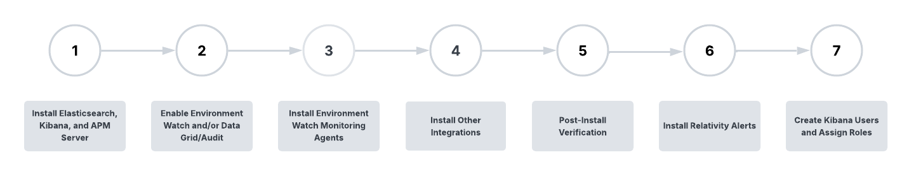

# Environment Watch and Data Grid Audit Installation

## Installation Overview

Environment Watch and Data Grid Audit require installation and configuration of third-party and Relativity software. This installation guide covers the full set up for Environment Watch but only the Elasticsearch and Kibana set up for Data Grid Audit. Additional steps for configuring the Audit application within Relativity are covered [here](https://help.relativity.com/Server2024/Content/Relativity/Audit/Audit.htm#InstallingandconfiguringAudit).

The Relativity applications and components that are referenced in this installation guide are packaged together in the Server bundle release. You can find the latest bundle on GitHub [here](https://github.com/relativitydev/server-bundle-release/releases). Environment Watch and Data Grid Audit also require Relativity applications that are available in the Relativity Application Library and not packaged in the bundle or covered in this installation guide (e.g. Pagebase and Telemetry for Environment Watch, Audit for Data Grid Audit, and InfraWatch Services for both). These applications are identified as pre-requisites in relevant sections of this installation guide.

The Server bundle is generally released quarterly, with hotfixes provided for critical issues as needed.

Environment Watch installation is comprised of the following seven steps. **Steps 1 and 2 are also used to set up Elasticsearch and Kibana for Data Grid Audit. Steps 3-7 are only relevant for Environment Watch.**

<table>
<thead>
  <tr>
    <th><strong>Step</strong></th>
    <th><strong>Name</strong></th>
    <th><strong>Description</strong></th>
    <th><strong>Environment Watch</strong></th>
    <th><strong>Data Grid Audit</strong></th>
  </tr>
</thead>
<tbody>
  <tr>
    <td>1</td>
    <td>Install Elasticsearch, Kibana, and APM Server</td>
    <td>Install the Elastic stack software required for Environment Watch and/or Data Grid Audit (Elasticsearch, Kibana, and APM Server). Note: APM Server is only used for Environment Watch.</td>
    <td>✓</td>
    <td>✓</td>
  </tr>
  <tr>
    <td>2</td>
    <td>Enable Environment Watch and/or Data Grid/Audit</td>
    <td>Configure security, monitoring, and API key generation for Elasticsearch, Kibana, and APM Server. Ensure all Elastic components are ready for integration.</td>
    <td>✓</td>
    <td>✓</td>
  </tr>
  <tr>
    <td>3</td>
    <td>Install Environment Watch Monitoring Agents</td>
    <td>Use Relativity Server CLI to set up integration between Elastic and Relativity. Import Kibana objects for Environment Watch and Data Grid Audit.</td>
    <td>✓</td>
    <td>✓</td>
  </tr>
  <tr>
    <td>4</td>
    <td>Install Other Integrations</td>
    <td>Install and configure required integrations and supporting services for Environment Watch, including InfraWatch Services.</td>
    <td>✓</td>
    <td></td>
  </tr>
  <tr>
    <td>5</td>
    <td>Post-Install Verification</td>
    <td>Install Environment Watch agents on all hosts to be monitored in your Relativity Server environment.</td>
    <td>✓</td>
    <td></td>
  </tr>
  <tr>
    <td>6</td>
    <td>Install Relativity Alerts</td>
    <td>Install or upgrade the Relativity Alerts application (RAP) for in-app alert notifications within Relativity.</td>
    <td>✓</td>
    <td></td>
  </tr>
  <tr>
    <td>7</td>
    <td>Create Kibana Users and Assign Roles</td>
    <td>Verify all components, integrations, and monitoring are working as expected. Finalize configuration and perform any required troubleshooting.</td>
    <td>✓</td>
    <td>✓</td>
  </tr>
</tbody>
</table>

## Next Step
[Click here for the next step](elasticsearch_pre_installation_overview.md)