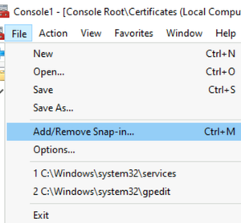
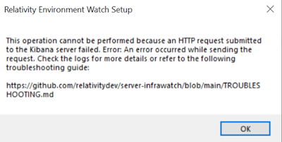
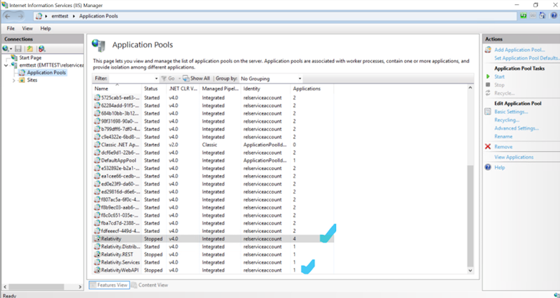

# Environment Watch Troubleshooting

## Elastic Search

#### Issue 1: Insufficient Memory

- Running the .\elasticsearch.bat command occasionally triggers errors related to insufficient memory.

**Troubleshooting Steps:**

1. Disk Space: Ensure that there is sufficient disk space available. Elasticsearch requires adequate disk space for indexing and storing data. 

#### Issue 2: Elastic search service issues

**Troubleshooting Steps:**

1. Verify if Elasticsearch running
	a.\- Open powershell and use the command '**Get-Service -Name elasticsearch'** to check the status of the Elasticsearch service.

      > Get-Service -Name elasticsearch 
	  
	  | Status  | Name         | DisplayName                   |
      |-------- |--------------|-------------------------------|
      | Running | elasticsearch| Elasticsearch (Elasticsearch) |
 
2. Verify if Elasticsearch accessible from a given host:
	
	a. Check if elasticsearch is accessible by accessing https://emttest:9200/<br/>
		

    b. If the service is not running, elasticsearch can be started using
	
		.\\elasticsearch-service.bat start Elasticsearch
		
3. Verify the SSL/TLS URL
    
	a. Check if the URL is correct for accessing Elasticsearch with SSL enabled. The URL should start with https:// if SSL is configured.
   
    b. Check Elasticsearch elasticsearch.yml configuration and verify that SSL/TLS settings are correctly defined.<br/>
        

#### Issue 3: SSL certificate issue

   

**Troubleshooting Steps:**

1. While logging into ElasticSearch URL, if it shows not secure. Export that certificate of the highest hierarchy and save to your local directory.
2. Go to that directory where you saved the certificate. Double click on the certificate and then click Install Certificate<br/>
	
3. Select Local Machine<br/>
	
4. Select Next, Click yes
5. Select Place all the certificates in the following store
6. Click on Browse, select Enterprise Trust
7. Select Next, It should get imported
8. Open MMC, go to files and click on Add/Remove Snap-IN<br/>
	
9.  Add Certificates<br/>
	
10. Click Computer Account<br/>
	
11. Click Next -> Finish
12. On the left side bar click the dropdown under Certificates
13. Right Click on Trusted Root Certification Authorities, All Task → Import<br/>
	
14. Select the Certificate which being saved few steps earlier under browse and click on Finish
15. Import certificate for all the selected folders below.<br/>
	
16.  Close all search engine and re-login to ElasticSearch URL<br/>
	

#### Issue 4: Issues while extracting the `kibana-8.xx.x-windows-x86_64.zip`

**Troubleshooting Steps:**

1. Windows must be updated to support Long Paths to enable the Local Group Policy Editor
	
	a. Run the "gpedit.msc" to navigate into Local Group Policy Editor<br/>
	

	b. Select Computer Configuration → Administrative Template → System → Filesystem.<br/>
	

	c. Double click on enable the Long path.<br/>
   

#### Issue 5: Kibana service issues

**Troubleshooting Steps:**

1. Verify Kibana Service Status:
   
    a. Run the service and verify if service is up and running<br/>
	

    b. If Windows service fails to start is likely due to a configuration or environmental problem. Verify kibana configuration by following [ElasticSearch setup](elasticsearch_setup.md)

    c. Check if Kibana is running by navigating to Kibana URL

#### Issue 6: Kibana authentication issue

**Troubleshooting Steps:**
 
Update your Kibana config file with below steps:
1. Generate encryption key by executing below command 
   ```
   ./kibana-encryption-keys generate
   ```
2. In the kibana.yml configuration file, add the xpack.encryptedSavedObjects.encryptionKey setting.<br/>
	
3. Restart Kibana

#### Issue 7: APM service issues   

**Troubleshooting Steps:**
1. Verify APM Service Status
   
	a. Check if APM server is running using the PowerShell command
	```
	Get-Service -Name apm-server
	```
	| Status  | Name       | DisplayName  |
	| ------- | ---------- | ------------ |
	| Running | apm-server | {.BeatName}  |

    b. If the service is not running, start service using 
    ```
	Start-Service -Name apm-server
	```

    c. Check if APM is running by navigating to APM URL http://emttest:8200/ in any supported Web browser.<br/>
	

2. If Windows service fails to start is likely due to a configuration or environmental problem<br/>
   
   a. Verify APM configuration by following [ElasticSearch setup](elasticsearch_setup.md)<br/>
   b. Verify the "publish_ready" property is true/false.<br/>
   c. If the value of publish_ready is still false and elasticsearch is configured to use https, perform the below changes under "Elasticsearch output"<br/>
      i. Update protocol to https and uncomment the line<br/>
      ii. Update ssl.enabled to true and uncomment the line<br/>
      iii. Update ssl.verification_mode to none and uncomment the line<br/>
      iv. Restart the apm service ({.BeatName | title})<br/>

## Relativity Server CLI - Environment Watch Setup

#### Issue 1: Unauthorized issue:
  
  
  
  

**Troubleshooting Steps:**
1. Verify your Relativity admin username and password, and provide valid credentials.
2. Verify your Elasticsearch admin username and password, and provide valid credentials.

#### Issue 2: Server URLs are incorrect:
  
  
  
  
  
  
  
  

**Troubleshooting Steps:**
1. Verify your Relativity/Elastic/APM/kibana URL, and provide valid URLs.

#### Issue 3: ElasticSearch server credentials are incorrect


**Troubleshooting Steps:**
1. The user should verify the Elasticsearch admin username and password and provide valid credentials

#### Issue 4: Retry limit reached:
  
  
  
  
  
  
  
  

**Troubleshooting Steps:**
1. The user reached the maximum number of attempts. Please rerun the Relativity.Server.Cli with the setup command `relsvr.exe setup` using Command Terminal.

## Relativity Server CLI - DataGrid/Audit Setup

#### Issue 1: Unauthorized issue:


**Troubleshooting Steps:**
1. Verify your Elasticsearch admin username and password, and provide valid credentials.

#### Issue 2: Elasticsearch server credentials are incorrect:


**Troubleshooting Steps:**
1. Verify your Elasticsearch admin username, password, and URL, and provide valid credentials.

#### Issue 3: Retry limit reached:


**Troubleshooting Steps:**
1. The user reached the maximum number of attempts. Please rerun the Relativity.Server.Cli with the setup command `relsvr.exe setup` using Command Terminal.

## Troubleshooting Environment Watch installer on Windows

#### Issue 1: Product cannot be installed because user is not added in Local security policy


**Troubleshooting Steps:**
1. Add user to Local security policy.<br/>
	

#### Issue 2: Product cannot be installed because relativity secret store is not accessible.


**Troubleshooting Steps:**
1. Start the Relativity Secret store service 
2. To view whitelisted machines, run this command:
	```
	.\secretstore whitelist read
	```
3. If server is not whitelisted, whitelist servers on secret store to grant permission by running the below command:
	```
	.\secretstore whitelist write (server-name)
	```
	For more details refer to: https://help.relativity.com/Server2024/Content/System_Guides/Secret_Store/Secret_Store.htm

#### Issue 3: Product cannot be installed, once or more secrets are invalid 

**Troubleshooting Steps:**
1. Verify if the one-time setup using the relsvr.exe CLI was executed properly and ensure that it has been completed as required.<br/>
	

#### Issue 4: Product cannot be installed because Elasticsearch service is not running

**Troubleshooting Steps:** 
1. Verify elasticsearch is running or not by following steps under [Elastic search service]

#### Issue 5: Product cannot be installed because Kibana server is not running


**Troubleshooting Steps:** 
1. Verify kibana is running or not by following steps under [kibana service](#issue-5-kibana-service-issues)

#### Issue 6: Product cannot be installed because APM server is not running

**Troubleshooting Steps:**
1. Verify APM server is running or not by following steps under [apm service](#issue-7-apm-service-issues)

#### Issue 7: Relativity service is inaccessible


**Troubleshooting Steps:**
1. Verify user is able to successfully login to Relativity
2. If unable to login to relativity, Check the Relativity services in IIS and start them<br/>
	
3. Verify whether the version matches the minimum required version as per the Environment Watch release. Also verify Service Host is running within the web server
4. If there are any issues, refer https://help.relativity.com/Server2024/Content/System_Guides/Service_Host_Manager.htm: