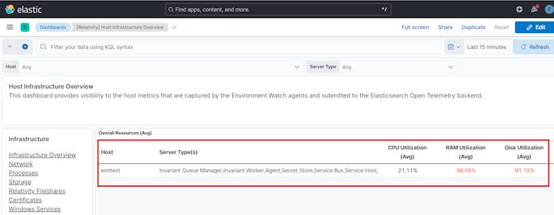

# Upgrade Environment Watch

This document provides the necessary steps to upgrade the Environment Watch components in a Relativity environment. It includes upgrading the Environment Watch using the CLI and upgrading the Environment Watch Installer.

## Upgrade CLI

This section guides you through upgrading Environment Watch using the Relativity Server CLI. It is recommended to run the CLI from the Primary SQL Server.

> [!NOTE]
> The Environment Watch upgrade via CLI should be run only once per environment. The upgrade performs tasks such as importing and updating Kibana resources including alerts, dashboards, saved searches and defect fixes.

### Prerequisites

1. The new Server-bundle zip file has been downloaded and extracted to `C:\Server.Bundle.x.y.z`

### Upgrade Instructions

**Step 1** - Open elevated command prompt/powershell. Run the below command. Select Environment Watch.

```
C:\Server.Bundle.x.y.z\relsvr.exe setup

Relativity Server CLI - 24.0.1196
Copyright (c) 2025, Relativity ODA LLC

What would you like to setup?
  DataGrid
> Environment watch
  Exit
```

**Step 2** - Enter 'y' to proceed.
```
Confirm you would like to perform the 'Environment Watch' setup [y/n] (y): y
```

**Step 3** - The CLI will detect that setup has already been performed. Select the **Upgrade** option to proceed.

```
Setup is already performed. Select an option to proceed:
> Upgrade
  Rerun Setup
  Exit
```

**Step 4** - The CLI will retrieve the existing settings and perform the upgrade. Please wait for the process to finish.

```
Retrieved existing settings
The Relativity Environment Watch Kibana Upgrade setup is executing in silent or unattended mode.
API Key creation and validation completed ------------------------- 100%
OAuth2 client exists ---------------------------------------------- 100%
Relativity secret store updated ----------------------------------- 100%
Relativity logging updated ---------------------------------------- 100%
Relativity toggles updated ---------------------------------------- 100%
Relativity AppDomain monitoring enabled --------------------------- 100%
APM settings updated ---------------------------------------------- 100%
Elasticsearch indexes updated ------------------------------------- 100%
Kibana Tag imported ----------------------------------------------- 100%
Kibana IndexPattern imported -------------------------------------- 100%
Kibana SavedSearch imported --------------------------------------- 100%
Kibana Dashboard imported ----------------------------------------- 100%
Kibana Alert imported --------------------------------------------- 100%
Kibana Custom Role created. --------------------------------------- 100%
Relativity installation SQL record updated ------------------------ 100%

The Environment Watch setup has been completed. The Relativity Environment Watch installer package should now be installed within each server contained within this Relativity instance. As each server is setup for monitoring, restart all Relativity services within the machine including "kCura Edds Agent Manager," "kCura Edds Web Processing Manager," and "kCura Service Host Manager" to begin sending telemetry to Elasticsearch.
```

Successful completion indicates that Environment Watch is configured for the new version.

Refer to the [Troubleshooting Guide](troubleshooting/relativity-server-cli.md) if you encounter any issues.

---

## Upgrade Environment Watch Installer

> [!NOTE]
> The Environment Watch installer upgrade should start on the SQL Primary server and then be applied to other servers in the environment. This ensures proper upgrade sequence and validation before deploying across all servers.

This document outlines the steps to upgrade the Environment Watch monitoring agent.

### Prerequisites

1. The Environment Watch CLI upgrade has been completed.
2. The new Server-bundle zip file has been downloaded and extracted.

### Step 1: Install the Upgraded Monitoring Agent

1.  From the new extracted Server Bundle, run `Relativity.EnvironmentWatch.Installer.xx.x.xxxx.exe`.
2.  Accept the license terms and click **Install**.
3.  Once the installation is complete, click **Close**.

### Step 2: Verify the Installation

1.  Open **Services** and confirm the **Relativity Environment Watch** service is running.
2.  Open **Task Manager** and verify the following processes are running:
    *   `rel-envwatch-service.exe`
    *   `rel-infrawatch-agent.exe`
    *   `otelcol-relativity.exe`
3.  Check for new log files in `C:\ProgramData\Relativity\EnvironmentWatch\Services\InfraWatchAgent\Logs`.
4.  Verify that the `otelcol-config-auto-generated.yaml` configuration file is updated in:
    `C:\ProgramData\Relativity\EnvironmentWatch\Services\InfraWatchAgent\`

### Step 3: Verify Metrics in Kibana

1.  In Kibana, navigate to **Dashboards** and open the **[Relativity] Host Infrastructure Overview** dashboard.
2.  Confirm that CPU, RAM, and Disk metrics are visible for the upgraded host.
    
3.  Navigate to the **[Relativity] Monitoring Agent** dashboard to verify:
    - The monitoring agent version is updated to the new version.
    - Host information and other important fields are properly reflected.
    - Agent status and health metrics are showing current data.

### Step 4: Repeat Installation for Other Servers

After verifying the first upgrade, repeat these steps for the remaining servers in the following order:
1.  SQL Distributed Servers
2.  Web Servers
3.  Agent Servers
4.  Other Servers (e.g., File Share, Analytics, Worker)

> [!NOTE]
> For troubleshooting, refer to the installer logs in the `%TEMP%` directory or see the [Monitoring Agent Troubleshooting Guide](troubleshooting/monitoring-agent-and-otel-collector.md).

