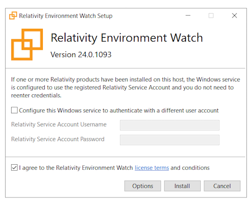
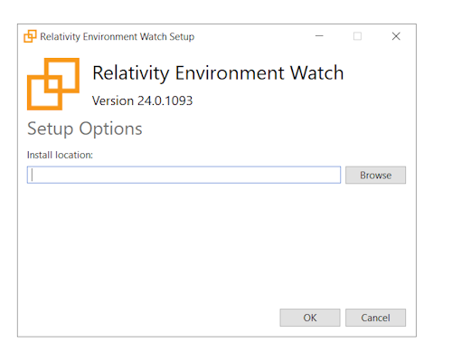
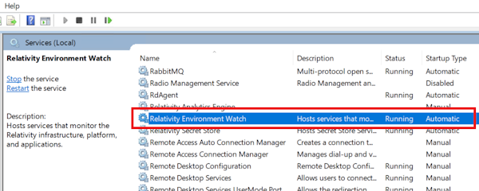
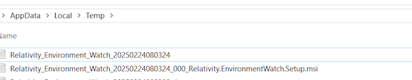

# Install Environment Watch Monitoring Agents

## Summary
The Relativity Environment Watch installer package contains a monitoring agent (rel-infrawatch-agent.exe) that collects and transmits telemetry data to Elastic and a Windows service (rel-envwatch-service.exe) that is responsible for launching the monitoring agent process and enables monitoring agent auto-upgrade process. You will install this package on all hosts in your environment that you want to monitor.

## Prerequisites

- The Environment Watch monitoring agent must be installed on a supported Windows Server OS including Windows Server 2022, Windows Server 2019, Windows Server 2016. Please see [here](https://help.relativity.com/Server2024/Content/Installing_and_Upgrading/System_requirements/Compatibility_matrix.htm#Relativitysystemrequirementsmatrix) for information on Windows Server compatibility for Relativity Server. 
- Whitelisted for Secret Store access. Please see [here](https://help.relativity.com/Server2024/Content/System_Guides/Secret_Store/Secret_Store.htm#Configuringclients) for information on whitelisting. 
- SQL Primary and Distributed access. 
- Relativity access. 

## Setup

### Downloading the Environment Watch installer

Download the [Server.Bundle.v20xx.yy.zz.gold.zip](https://github.com/relativitydev/server-bundle-release/releases) and extract the ZIP contents to a local directory if this hasn't been done already.

### Install the Environment Watch monitoring agent and Windows service on each host

The objective is to first ensure that SQL Primary monitoring is working and confirming metrics are being transmitted to the telemetry backend. After verifying, proceed with installing on all hosts within your Relativity environment that needs to be monitored.

### Steps to install Environment Watch

1. Navigate directly to the network (UNC) path where the installer is located (e.g., \\fileserver\share\Relativity.EnvironmentWatch.Installer.xx.x.xxxx.exe) using File Explorer, and double-click the installer to launch it. 

	

2. Provide Relativity Service Account details 
   
	a. If any Relativity product(s) have already been installed on the host, existing Relativity Service Account details can be used. In this case, entering the details can be skipped. 

3. To specify an installation location, follow the below steps 
	a. Click on **Options** 
	
	
	b. Click **Browse** to select a directory for the application installation 
	c. Click **OK**. 

4. Agree Relativity Environment Watch **license terms and conditions** 
5. Click **Install** on the setup wizard to start the installation. 
6. Click **Close** when the installation has been completed. ## Verification
Upon successful installation, it will create a Relativity Environment Watch windows service and it will start automatically.

  1. The service status should be Running.
  2. The service runs using the supplied Relativity Service Account. 

  3. The following processes should be running:
	- rel-envwatch-service.exe
	- rel-infrawatch-agent.exe
	- otelcol-relativity.exe
  
  4. Logfiles should appear within C:\ProgramData\Relativity\EnvironmentWatch\Services\InfraWatchAgent\Logs

### Verify metrics are flowing to the Elasticsearch Open Telemetry backend 

 **Step 1**: Go to Kibana --> Dashboards 

 **Step 2**: Open [Relativity] Host Infrastructure Overview dashboard 

 **Step 3**: Verify CPU/RAM/Disk metrics are visible for this host 
	

After successful verification, proceed with the same installation steps for the next server and continue until all servers to be monitored are available with metrics in the above dashboard

The following sequence is suggested:
1. SQL Distributed
2. Web Servers
3. Agent servers
4. Other (Fileshare, Analytics, Message Broker, Worker, etc.)

> [!NOTE]
> Any Windows-based OS can be monitored, regardless of whether a Relativity product is installed, as long as the prerequisites have been met.

## Repairing or removing Environment Watch installation
The installer can also be run to repair or remove an existing installation of Environment Watch. Run the installer on a machine where the application is installed. Select one of the following options:
- Repair - attempts to fix errors in the most recent installation.
- Uninstall - removes Relativity Environment Watch from the machine.

## Installer logfile
During the installation process, two log files are created in the `%TEMP%` directory that can assist with troubleshooting:
  1. Bundle logfile (Relativity_Environment_Watch_{timestamp}.log)
	- This log file contains information about the overall installation process handled by the installer bundle. It generally doesn't disclose specific problems and is often less useful when troubleshooting individual installation issues.
  2. MSI logfile (Relativity_Environment_Watch_{timestamp}_000_Relativity.EnvironmentWatch.Setup.msi.log)
	- This log file records detailed information about the Windows Installer (MSI) execution. It is typically the most useful log for diagnosing issues, as it provides granular details about the installation process, including any errors or failures. 
	

## Handling errors
If any errors are encountered during the installation process, please refer to the [troubleshooting guide](../docs/troubleshooting/monitoring-agent-and-otel-collector.md) to resolve the issues.

## Next Step
[Click here for the next step](environment_watch_install_other_integrations.md)