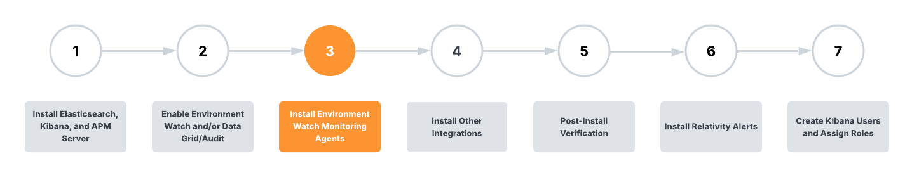

# Install Environment Watch Monitoring Agents

> [!NOTE]
> This step is required for Environment Watch.

This document outlines the steps to install the Environment Watch monitoring agent. It is recommended to first install the agent on the SQL Primary server, verify the installation, and then repeat the steps for all other servers in the environment.

### Prerequisites

1. Elastic Stack Certificates are installed on all Servers
2. Access to Elastic Stack, Primary SQL Server, and Secret Store (Whitelisted for     Secret Store access. Please see [here](https://help.relativity.com/Server2024/Content/System_Guides/Secret_Store/Secret_Store.htm#Configuringclients) for information on whitelisting.)
3. The Server-bundle zip file has been downloaded and extracted to `C:\Server.Bundle.x.y.z'
4. Environment Watch has been set up using the Relativity Server CLI 
5. The Environment Watch monitoring agent must be installed on a supported Windows Server OS including Windows Server 2022, Windows Server 2019, Windows Server 2016. Please see [here](https://help.relativity.com/Server2024/Content/Installing_and_Upgrading/System_requirements/Compatibility_matrix.htm#Relativitysystemrequirementsmatrix) for information on Windows Server compatibility for Relativity Server.

### Step 1: Install the Monitoring Agent

1.  From the extracted Server Bundle, run `Relativity.EnvironmentWatch.Installer.xx.x.xxxx.exe`.
2.  If prompted, enter the Relativity Service Account credentials as:
    - **Username:** `domain\Username`
    - **Password:** <password>
    
    This step may be skipped if other Relativity products are already installed.
3.  (Optional) To specify a custom installation path, click **Options**, browse to your desired directory, and click **OK**.
4.  Accept the license terms and click **Install**.
5.  Once the installation is complete, click **Close**.

### Step 2: Verify the Installation

1.  Open **Services** and confirm the **Relativity Environment Watch** service is running.
2.  Open **Task Manager** and verify the following processes are running:
    *   `rel-envwatch-service.exe`
    *   `rel-infrawatch-agent.exe`
    *   `otelcol-relativity.exe`
3.  Check for new log files in `C:\ProgramData\Relativity\EnvironmentWatch\Services\InfraWatchAgent\Logs`.
4.  Verify that the `otelcol-config-auto-generated.yaml` configuration file is generated in:
    `C:\ProgramData\Relativity\EnvironmentWatch\Services\InfraWatchAgent\`

### Step 3: Verify Metrics in Kibana

1.  In Kibana, navigate to **Dashboards** and open the **[Relativity] Host Infrastructure Overview** dashboard.
2.  Confirm that CPU, RAM, and Disk metrics are visible for the newly added host.
    
3.  Navigate to the **[Relativity] Monitoring Agent** dashboard to verify:
    - The installed monitoring agent version is displayed correctly
    - Host information and other important fields are properly reflected
    - Agent status and health metrics are showing current data

### Step 4: Repeat Installation

After verifying the first installation, repeat these steps for the remaining servers in the following order:
1.  SQL Distributed Servers
2.  Web Servers
3.  Agent Servers
4.  Other Servers (e.g., File Share, Analytics, Worker)

> [!NOTE]
> For troubleshooting, refer to the installer logs in the `%TEMP%` directory or see the [Monitoring Agent Troubleshooting Guide](troubleshooting/monitoring-agent-and-otel-collector.md).

## Next Step
[Click here for the next step](environment_watch_install_other_integrations.md)