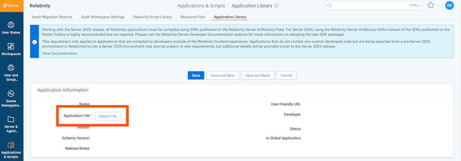
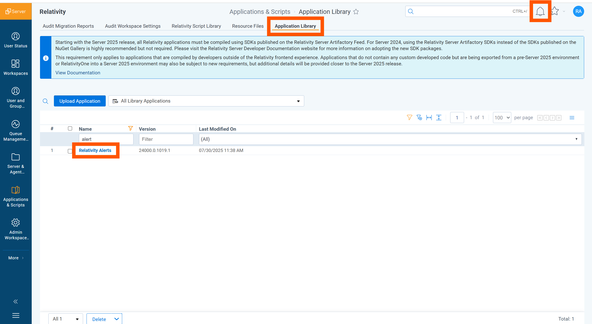
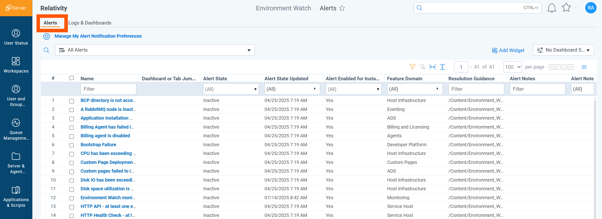
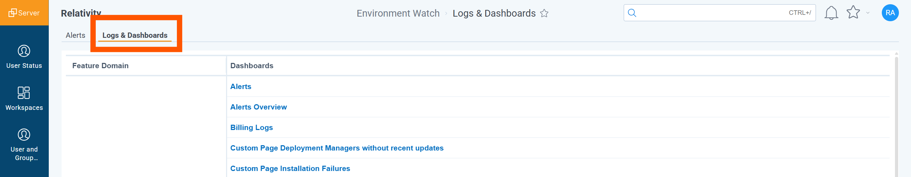
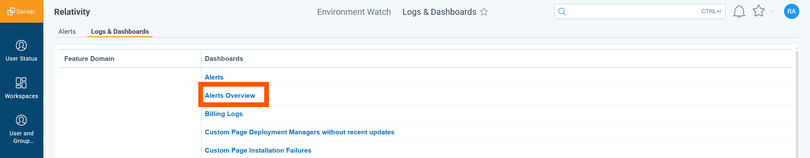
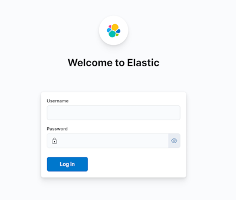
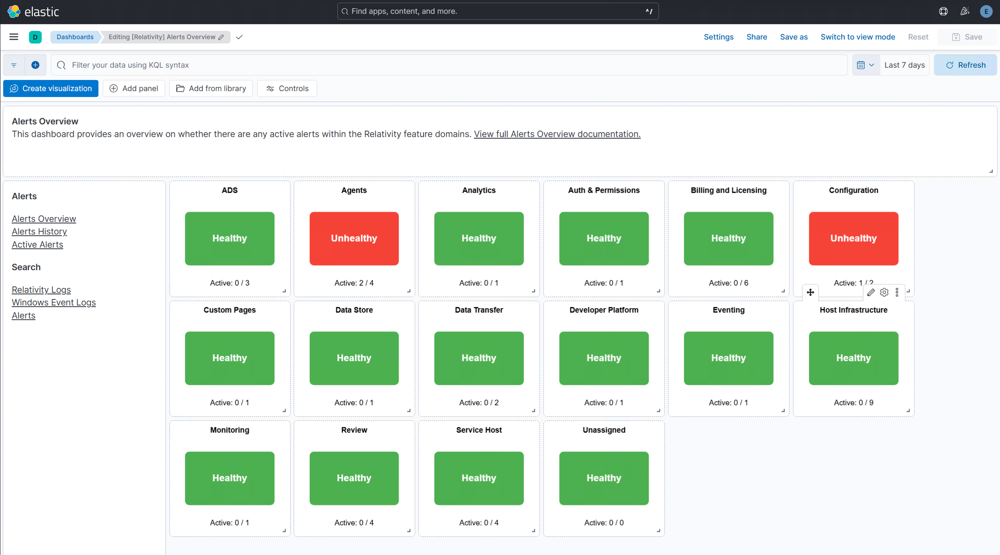

# Relativity Alerts Application Installation

## Summary
The Relativity Alerts application is a new application as part of the Relativity Environment Watch suite. Its main functionality is to alert Relativity System Administrators to a variety of Environmental and Application related issues on a Relativity instance within Relativity web interface. It replaces a previous "Legacy Alerts" functionality with a new OTEL based implementation with ELK backend. It allows in real time to notify Relativity System Administrators about issues, redirect them to easily readable dashboards with performance and health information, as well as accompanied by a comprehensive resolution guidelines.

## Prerequisites
Requirements for installation of the Relativity Alerts Application:  
- Relativity Server 2024 Patch 1 release.  
- Configure [Elasticsearch, Kibana, and APM server](elasticsearch_setup.md) in an environment.  
- Run the one-time [CLI setup](relativity_server_cli_setup.md) for Environment Watch.  
- Install [Relativity Environment Watch Agent](environment_watch_installer.md) in an environment.

## Permissions
- To install the application, access it, and receive alerts, the user must be part of the Relativity System Administrators Group.
- To access Kibana dashboards and saved searches a new account must be created for each user and be assigned to the custom Kibana role which is installed during the Environment Watch CLI setup.

## Installation
To install the Relativity Alerts application on your Relativity instance:
1. Log in to Relativity as a System Administrator.
2. Navigate to the Application Library tab.
3. Click Upload Application. 
	
4. Click Select File. 
	
5. Navigate to and select your local copy of Relativity Alerts RAP file which was downloaded from the latest [Environment Watch Bundle](https://github.com/relativitydev/server-bundle-release/releases), and then click Open. 
	
6. Click Save to upload the file to the Application Library. 
	

A list of common install issues and their resolutions are available at the [troubleshooting guide](relativity_alerts_troubleshooting.md).

## Verification
1. Navigate to the Alerts tab, you should see all alerts available in Kibana. 
    
2. Navigate to "Logs & Dashboards" tab, you should see all Environment Watch dashboards and saved searches available in Kibana. 
    
3. When on "Logs & Dashboards" tab, find "Alerts Overview" dashboard and click the link. A new web browser tab will be created and you should be redirected to "Alerts Overview" dashboard in Kibana. If you have not logged in into Kibana yet, you will be prompted with a Kibana login page. Please login with your Kibana user account with privileges. 
    
    
    
4. To confirm that the alerting functionality is operational, please do the following:
	a. Go to the Agents tab
	b. Select "File Deletion Manager" agent and disable it. 
	
	c. Within the next 30-60 seconds, the bell icon, in the top-right corner, will indicate that there is a new Alert. 
	
    d. Click on the bell icon, and you should be able to see the active 'One or more agents are disabled' alert in the alert flyout. 
	
	e. Click on the question mark icon next to the 'One or more agents are disabled' alert, and you will be redirected to the resolution guidance for this alert in a new tab of your web browser. 
     
    
	f. Return to the previous tab in Relativity, then click on the bell icon in the top-right corner. When the alert flyout opens, click on the 'One or more agents are disabled' alert, and you will be redirected to a filtered list of disabled agents in the Agents tab within Relativity. 
	
	g. While on Agents tab, please remember to enable the "File Deletion Manager" agent.

If any of the previous steps have failed, or any errors were displayed, please see [troubleshooting guide](relativity_alerts_troubleshooting.md) for more information.