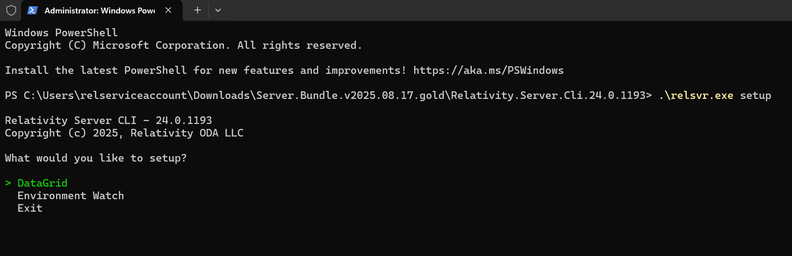
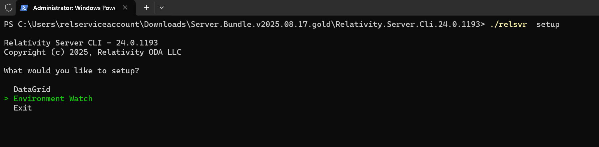
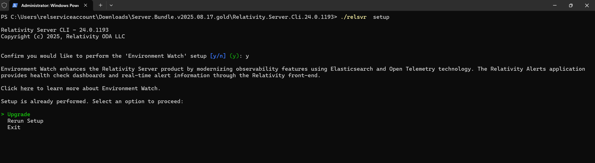
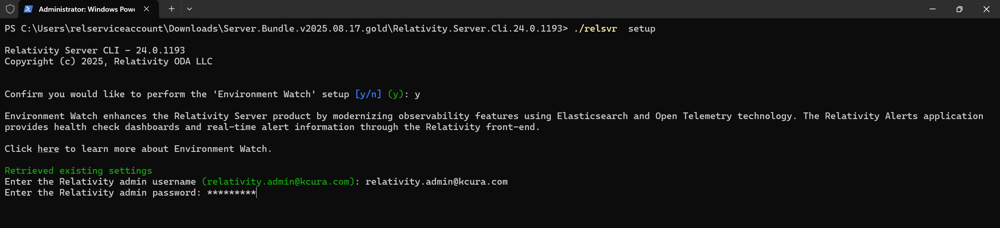
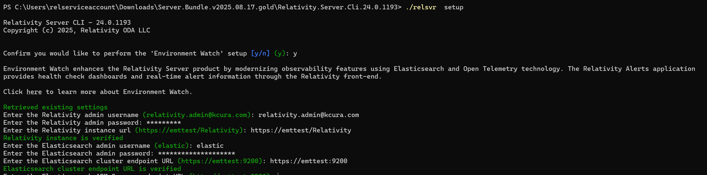
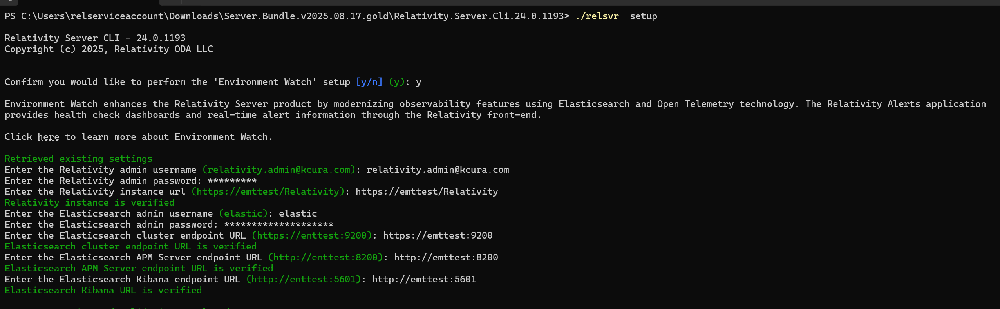
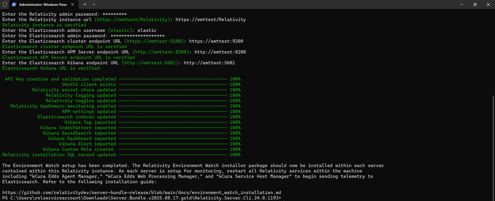

# Enable Environment Watch


Now that you have installed the required Elastic components for Environment Watch, you will configure the integration between Elastic and Relativity by running the Relativity Server CLI on your Primary SQL Server. The Relativity Server CLI will also import all of the indexes, alerts, and dashboards that Relativity has developed and shipped as part of the Environment Watch product.

### Before you start

Before entering the Environment Watch setup workflows, perform or check the following:

1. Confirm that all Elastic components are installed and verified from steps 1 and 2 of this installation guide. This includes ensuring that the minimum versions of Elasticsearch, Kibana, and APM Server that are specified in the Environment Watch release bundle that you are using are installed and that Elastic certificates have been installed on all Elastic hosts.<br/>
2. At least the minimum Relativity major version and patch specified in the Environment Watch bundle you intend to deploy is installed on all servers in the environment. See the [release bundle](https://github.com/relativitydev/server-bundle-release/releases) requirements for the minimum version required.<br/>
3. Verify that the InfraWatch Services application is installed in your Relativity instance (this RAP is delivered as part of the base Relativity Server 2024 installation package).<br/>
4. Follow [these instructions](https://help.relativity.com/Server2024/Content/System_Guides/Secret_Store/Secret_Store.htm#Configuringclients) to whitelist all hosts with Elastic installed for Secret Store access.<br/>
5. Ensure that you have access to Relativity, as well as the Primary and Distributed SQL Servers<br/>
6. The user must have Command Prompt installed to run the CLI executable.<br/>

# Set up Environment Watch

Follow these steps to configure Environment Watch using the Relativity Server CLI.

This only needs to be done on your SQL Primary Server.

1. Install Elastic certificates on your SQL Primary Server
2. Download the CLI from [here](https://github.com/relativitydev/server-bundle-release/releases), download the release bundle.
3. Open Command Terminal by launching Command Prompt v7 from the Start menu.
4. Extract the CLI by navigating to the directory where the gold release bundle was downloaded to, extract the bundle and then extract Relativity.Server.Cli.YY.x.xxxx.zip.
5. Run the Setup Command from Command Prompt, execute the following command to enter the setup workflow:
    ```
    ./relsvr.exe setup
    ```
    
6. Select Environment Watch
    
7. [Only applicable if Environment Watch has been set up previously] Choose setup type – If Environment Watch has been set up on this host previously, you will be prompted to select "Upgrade" or "Rerun Setup". If you are setting up Environment Watch for the first time, you will not be prompted to make this selection and the setup process will continue to the next step.
    
8. Provide Relativity parameters - Enter the Relativity admin username and password and Relativity URL.
    
9.  Provide Elasticsearch parameters - Enter the Elasticsearch admin username and password and Elasticsearch cluster endpoint URL (any node in your cluster will work, but we recommend providing the node URL for the master node where you first installed Elasticsearch in step 1 of this installation guide).
    
10.   Provide APM Server parameters - Enter your Elasticsearch APM Server Endpoint URL.
11.   Provide Kibana parameters – Enter your Elasticsearch Kibana server Endpoint URL.
    
12.   Verify the setup is completed successfully
    
13.   Install Elastic certificates on all Web Servers in your environment. Restart services on each host after installing the certificates
14.   Install Elastic certificates on all Agent Servers in your environment. Restart services on each host after installing the certificates

If the setup completes successfully, Environment Watch is now configured for your environment. If you encountered any errors while entering Relativity or Elastic parameters, you will have three retry attempts before the CLI forces an exit and you must restart the setup process.

Refer to the [Troubleshooting Guide](environment_watch_troubleshooting.md) if you encounter any issues.

[Click here to set up Data Grid Audit](datagrid_audit_setup.md)

### Elastic relativity_dashboard_user role

After you complete all five steps of this installation guide and have Environment Watch fully set up in your environment, you need to provide any user that should have access to the alerts and dashboards in Kibana with Elastic access credentials. You will do this by creating users in Kibana. When you create users in Kibana, you will need to assign them a ‘role’. When you run the Environment Watch or Data Grid setup workflow, the Relativity Server CLI will create a security role called ‘relativity_dashboard_user’. We recommend using this role for any users in your organization that should be able to access alerts and dashboards. The role has least privileges to ensure they can see all dashboards and alerts but with permissions restrictions to prevent them from creating or editing alerts, dashboards, and indexes.

You can see the privileges associated with the relativity_dashboard_user role by navigating to Stack Management > Roles > relativity_dashboard_user in Kibana.

**Note:** In order to extend the ability to export saved searches, go to the kibana.yml file on the server where Kibana is installed, update **xpack.reporting.roles.enabled** to "false", and then restart the Kibana service.

## Next

[Click here for the next step](install_environment_watch_monitoring_agents.md)


