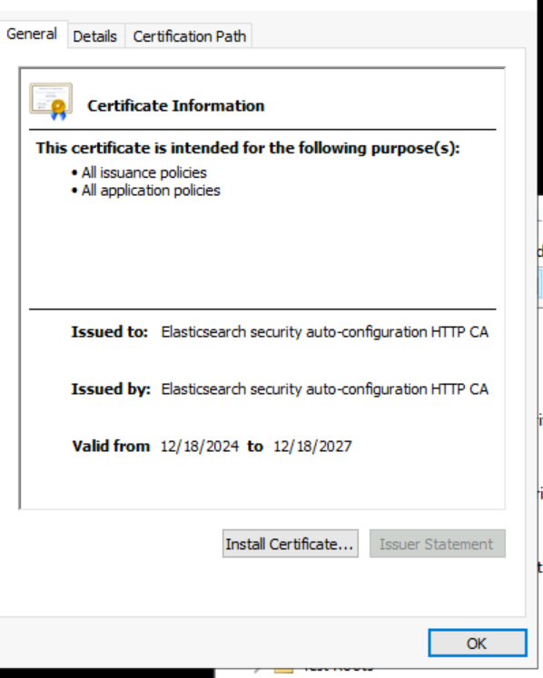
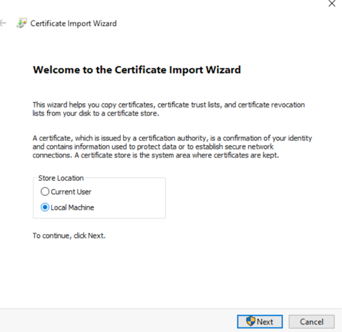
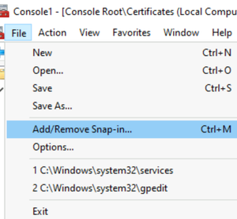
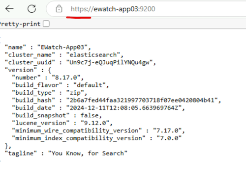

# Elasticsearch Troubleshooting

This document provides troubleshooting guidance for common Elasticsearch issues encountered during installation, configuration, and operation in Relativity Server environments.

> [!NOTE]
> This guide assumes a default Elasticsearch installation path of `C:\elastic\elasticsearch`. Adjust paths according to your actual installation directory.

## Table of Contents

- [Elasticsearch Troubleshooting](#elasticsearch-troubleshooting)
  - [1. Windows Service Issues](#1-windows-service-issues)
    - [1.1 Elasticsearch Service Not Starting](#11-elasticsearch-service-not-starting)
    - [1.2 Service Crashes or Stops Unexpectedly](#12-service-crashes-or-stops-unexpectedly)
  - [2. Memory Issues](#2-memory-issues)
    - [2.1 Insufficient Memory Allocation](#21-insufficient-memory-allocation)
  - [3. Authentication Issues](#3-authentication-issues)
    - [3.1 Username/Password Authentication Problems](#31-usernamepassword-authentication-problems)
    - [3.2 SSL/TLS Certificate Issues](#32-ssltls-certificate-issues)
  - [4. Service Verification](#4-service-verification)
    - [4.1 Verifying Elasticsearch Health](#41-verifying-elasticsearch-health)

---


## 1. Windows Service Issues

> [!IMPORTANT]
> Before troubleshooting Elasticsearch, verify that all required Elastic Stack services are running. If any of these are not running, other troubleshooting steps may be irrelevant.
>
> **Check all required services:**
> ```powershell
> Get-Service -Name elasticsearch-service-x64, kibana, apm-server | Format-Table -AutoSize
> ```
> **OR**
> ```powershell
> Get-Service -Name elasticsearch, kibana, apm-server | Format-Table -AutoSize
> ```
> <details>
> <summary>Expected output</summary>
>
> ```
> Status   Name           DisplayName
> ------   ----           -----------
> Running  elasticsearch  elasticsearch
> Running  kibana         kibana
> Running  apm-server     apm-server
> ```
> </details>
>
> - The `kibana` Windows service may not exist if Kibana was not installed as a Windows service (e.g., via NSSM). NSSM is not required; Kibana can be run manually or as a scheduled task. Only check for the `kibana` service if you have installed it as a service.
> - If Kibana is not in running state, [click here for Kibana troubleshooting](../troubleshooting/kibana.md).
> - If APM is not in running state, [click here for APM troubleshooting](apm-server.md)

### 1.1 Elasticsearch Service Not Starting

**Symptoms:**
- Elasticsearch service fails to start
- Service stops immediately after starting
- Error messages in Elasticsearch logs

**Troubleshooting Steps:**

* **Check Service Status:**
   ```powershell
   Get-Service -Name elasticsearch-service-x64 | Select-Object Status, StartType, Name
   ```
   **OR**
   ```powershell
   Get-Service -Name elasticsearch | Select-Object Status, StartType, Name
   ```
   <details>
   <summary>Expected output</summary>

   ```
   Status   StartType Name
   ------   --------- ----
   Running  Automatic elasticsearch
   ```
   </details>

* **Verify Service Configuration:**
   ```powershell
   (Get-CimInstance Win32_Service -Filter "Name = 'elasticsearch-service-x64'").StartName
   ```
   **OR**
   ```powershell
   (Get-CimInstance Win32_Service -Filter "Name = 'elasticsearch'").StartName
   ```
   <details>
   <summary>Expected output</summary>

   ```
   LocalSystem
   ```
   </details>

* **Check Elasticsearch Logs:**
  - Navigate to the log directory (default: `C:\elastic\elasticsearch-8.17.3\logs\`).
  - Review the Elasticsearch log file (`elasticsearch.log`) for error messages.
  - Check the slow logs and garbage collection logs if present.
  - For every error in the Elasticsearch log, provide troubleshooting for that specific error.

> [!TIP]
> For detailed logging information, refer to the [official Elasticsearch logging documentation](https://www.elastic.co/guide/en/elasticsearch/reference/8.17/logging.html)

> [!NOTE]
> - Elasticsearch includes a bundled Java runtime, so a separate Java installation is not required.
> - If the `JAVA_HOME` environment variable is defined, Elasticsearch will use the specified Java version instead of the bundled one.
> - If you want to use a specific Java version, ensure `JAVA_HOME` is set correctly.

* **Start Service Manually:**
   ```powershell
   Start-Service elasticsearch-service-x64
   ```
   **OR**
   ```powershell
   Start-Service elasticsearch
   ```
   <details>
   <summary>Expected output</summary>
   
   ```
   (No output if successful. Service status will be "Running" after execution.)
   ```
   </details>

### 1.2 Service Crashes or Stops Unexpectedly

**Symptoms:**
- Elasticsearch service starts but stops after a short period
- Service status shows "Stopped" unexpectedly

**Troubleshooting Steps:**

* **Check Elasticsearch Logs:**
  - Navigate to `C:\elastic\elasticsearch\logs\`
  - Review the Elasticsearch log file (`elasticsearch.log`) for errors
  - For every error in the Elasticsearch log, provide troubleshooting for that specific error.
> [!NOTE] 
> Always check the latest error in the Elasticsearch log and troubleshoot accordingly. This approach should be followed everywhere.

* **Verify Disk Space:**
  - Ensure sufficient disk space on data and log directories (minimum 15% free)
  - Verify data and log files are on separate drives from the Operating System drive. If you store Elasticsearch data on a network share, ensure the share is accessible and has sufficient free space. Some environments may not use mapped drives.
  ```powershell
  # Check disk space
  Get-WmiObject -Class Win32_LogicalDisk | Select-Object DeviceID, @{Name="FreeSpace(%)";Expression={[math]::Round(($_.FreeSpace/$_.Size)*100,2)}}
  ```
   <details>
   <summary>Expected output</summary>

   ```
   DeviceID FreeSpace(%)
   -------- ------------
   C:       22.15
   D:       48.92
   ```
   </details>

> [!NOTE]
> For port-related issues, see the [Port Configuration Troubleshooting](port-troubleshooting.md) guide.

---

## 2. Memory Issues

### 2.1 Insufficient Memory Allocation

**Symptoms:**
- OutOfMemoryError in Elasticsearch logs
- Poor performance or slow queries
- Node becomes unresponsive

**Troubleshooting Steps:**

* **Check Current Memory Usage:**
   ```powershell
   Get-WmiObject -Class Win32_PhysicalMemory | Measure-Object -Property Capacity -Sum
   ```
   <details>
   <summary>Expected output</summary>

   ```
   Count    : 2
   Average  :
   Sum      : 34359738368
   Property : Capacity
   ```
   </details>
> [!NOTE]
> `Sum` is the total RAM in bytes (e.g., 34359738368 bytes = 32 GB).

* **Review JVM Heap Settings:**
  - Edit `C:\elastic\elasticsearch\config\jvm.options` file:
  - If the file does not exist, create it.
  ```
  # Recommended: Set Xms and Xmx to same value
  # Example for system with 8GB+ RAM:
  -Xms4g
  -Xmx4g
  ```
> [!IMPORTANT]
> Set heap to 50% of available RAM, maximum 32GB. Monitor current memory usage before making changes.

* **Check for Memory Leaks:**
  - Monitor heap usage over time
  - Look for continuously increasing memory consumption
  - Review application logs for memory-related warnings

---

## 3. Authentication Issues

### 3.1 Username/Password Authentication Problems

**Symptoms:**
- Login failures
- "authentication failed" errors
- Cannot access Elasticsearch with credentials

**Troubleshooting Steps:**

* **Verify User Exists:**
   ```powershell
   curl.exe -k -X GET "https://<hostname_or_ip>:9200/_security/user/<username>" -u <username>:<password>
   ```
   <details>
   <summary>Expected output</summary>

   ```json
   {
     "<username>": {
       "username": "<username>",
       "roles": [
         "superuser"
       ],
       ...
     }
   }
   ```
   </details>

* **Reset Password:**
   ```powershell
   C:\elastic\elasticsearch\bin\elasticsearch-reset-password.bat -u <username>
   ```
   <details>
   <summary>Expected output</summary>

   ```
   Password for the [<username>] user successfully reset.
   ```
   </details>

* **Verify Security Configuration:**
  - Check `C:\elastic\elasticsearch\config\elasticsearch.yml`:
    ```yaml
    xpack.security.enabled: true
    ```
> [!NOTE]
> Also verify that the URL you are using is `https://<username>:9200/`

### 3.2 SSL/TLS Certificate Issues

**Symptoms:**
- SSL handshake failures
- "certificate verify failed" errors
- Unable to establish secure connections
- Browser shows "not secure" warning for Elasticsearch URL

**Troubleshooting Steps:**

* **Install SSL Certificate in Trusted Store**

   If your browser shows a "not secure" warning when accessing the Elasticsearch URL, you may need to install the certificate into your trusted store.

    a. In your browser, view the certificate details and export the root certificate authority (CA) certificate. Save it to a local directory.
    
    b. Double-click the downloaded certificate file and click **Install Certificate**.
    
    

    c. Select **Local Machine** and click **Next**.
    
    

    d. Select **Place all certificates in the following store**, click **Browse**, and select **Trusted Root Certification Authorities**. Click **OK**, then **Next**, and **Finish**.
    
    e. To confirm, open the Microsoft Management Console (MMC):
        i. Run `mmc.exe`.
        ii. Go to **File > Add/Remove Snap-in...**.
        iii. Select **Certificates** and click **Add**.
    
    
    
    

    f. Choose **Computer account** and click **Next**, then **Finish**, and **OK**.
    
    

    g. Expand **Certificates (Local Computer) > Trusted Root Certification Authorities > Certificates** and verify your certificate is listed.

    h. Close your browser and reopen the Elasticsearch URL. It should now show as secure.

    

* **Verify Certificate Path in `elasticsearch.yml`**

  Ensure the `elasticsearch.yml` file points to the correct certificate files.

  - Check `C:\elastic\elasticsearch\config\elasticsearch.yml`:
    ```yaml
    xpack.security.transport.ssl:
      keystore.path: certs/transport.p12
      truststore.path: certs/transport.p12
    ```

* **Check Elasticsearch Logs for SSL Errors**
  - Navigate to `C:\elastic\elasticsearch\logs\`.
  - Review the `elasticsearch.log` file for any SSL-related errors.
  - For every error in the Elasticsearch log, provide troubleshooting for that specific error.

---

## 4. Service Verification

### 4.1 Verifying Elasticsearch Health

**Symptoms:**
- Uncertainty about cluster status
- Need to confirm proper operation
- Performance monitoring

**Troubleshooting Steps:**

* **Check Cluster Health:**
   ```powershell
   curl.exe -k -u <username>:<password> -X GET "https://<hostname_or_ip>:9200/_cluster/health?pretty"
   ```
   <details>
   <summary>Expected response for healthy cluster</summary>

   ```json
   {
     "cluster_name": "elasticsearch",
     "status": "green",
     "timed_out": false,
     "number_of_nodes": 3,
     "number_of_data_nodes": 3
   }
   ```
   </details>

* **Verify Node Status:**
   ```powershell
   curl.exe -k -u <username>:<password> -X GET "https://<hostname_or_ip>:9200/_cat/nodes?v"
   ```
   <details>
   <summary>Expected output</summary>

   ```
   ip            heap.percent ram.percent cpu load_1m load_5m load_15m     node.role      master name
   <ip address>            14          95  28                          cdfhilmrstw *      <node name>
   ```
   </details>

* **Check Index Health:**
   ```powershell
   curl.exe -k -u <username>:<password> -X GET "https://<hostname_or_ip>:9200/_cat/indices?v"
   ```
   <details>
   <summary>Expected output</summary>

   ```
   health status index    uuid                   pri rep docs.count docs.deleted store.size pri.store.size
   green  open   myindex  1a2b3c4d5e6f7g8h9i0j   1   1   1000       0            1.2mb      600kb
   ```
   </details>

* **Monitor Performance:**
   ```powershell
   curl.exe -k -u <username>:<password> -X GET "https://<hostname_or_ip>:9200/_nodes/stats?pretty"
   ```
   <details>
   <summary>Expected output</summary>

   ```json
   {
     "nodes": {
       "node_id": {
         "name": "node-1",
         "host": "10.0.0.1",
         ...
       }
     }
   }
   ```
   </details>


---
