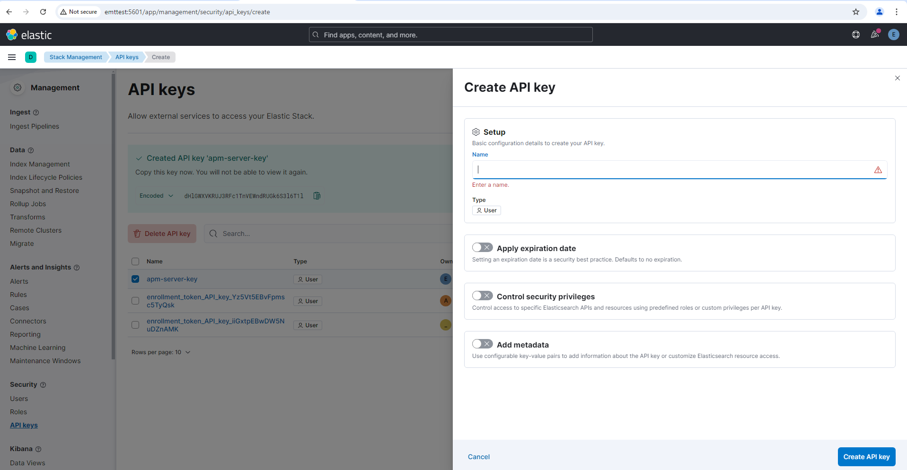

# Kibana Troubleshooting

This document provides troubleshooting guidance for common Kibana issues encountered during installation, configuration, and operation in Relativity environments.

> [!NOTE]
> This guide assumes a default Kibana installation path of `C:\elastic\kibana`. Adjust paths according to your actual installation directory.

## Table of Contents

- [Windows Service Issues](#windows-service-issues)
  - [Kibana Service Not Starting](#kibana-service-not-starting)
  - [Service Crashes or Stops Unexpectedly](#service-crashes-or-stops-unexpectedly)
- [Authentication Issues](#authentication-issues)
  - [Username/Password Authentication Issues](#usernamepassword-authentication-issues)
  - [API Key Authentication Problems](#api-key-authentication-problems)
- [Port Configuration Issues](#port-configuration-issues)
  - [Port Conflicts](#port-conflicts)
  - [Network Binding Problems](#network-binding-problems)
- [Memory Issues](#memory-issues)
  - [Insufficient Memory Allocation](#insufficient-memory-allocation)
- [Kibana Encryption Keys Configuration](#kibana-encryption-keys-configuration)
  - [Missing or Invalid Encryption Keys](#missing-or-invalid-encryption-keys)
- [Service Verification](#service-verification)
  - [Verifying Kibana Health and Status](#verifying-kibana-health-and-status)
- [Additional Diagnostic Commands](#additional-diagnostic-commands)

---

## Windows Service Issues

> [!CAUTION]
> When the Kibana distribution is extracted, it can exceed the maximum Windows path. To prevent this from occurring, Relativity recommends enabling the long path feature.
>
> - Run `gpedit.msc` to open the Local Group Policy Editor.
> - Navigate to **Computer Configuration** → **Administrative Template** → **System** → **Filesystem**.
> - Double click on **Enable Win32 long paths** and set it to **Enabled**.

### Kibana Service Not Starting

**Symptoms:**
- Kibana service fails to start
- Service stops immediately after starting

**Troubleshooting Steps:**

- **Check Service Status and Configuration:**
   ```powershell
   Get-Service -Name kibana
   ```
   <details>
   <summary>Expected output</summary>

   ```
   Status   Name   DisplayName
   ------   ----   -----------
   Running  kibana Kibana
   ```
   </details>

   Get-CimInstance -ClassName Win32_Service -Filter "Name='kibana'" | Select-Object Name, State, StartMode, StartName
   ```
   - Verify the service is running under Local System account (default configuration).

- **Check Kibana Logs:**
   - Navigate to `C:\elastic\kibana\logs\`
   - Review the latest log files (`kibana.log`) for error messages.
   - Look for configuration errors or Elasticsearch connection issues (for example: `Unable to connect to Elasticsearch at https://<host or ip address>:9200`).

- **Start Service Manually:**
   ```powershell
   Start-Service kibana
   ```
   <details>
   <summary>Expected output</summary>

   ```
   (No output if successful. Service status will be "Running" after execution.)
   ```
   </details>

### Service Crashes or Stops Unexpectedly

**Symptoms:**
- Kibana service starts but stops after a short period
- Service status shows "Stopped" unexpectedly
- Users lose access to Kibana interface

**Troubleshooting Steps:**

1. **Check Kibana Logs:**
   - Navigate to `C:\elastic\kibana\logs\`
   - Review the latest log files (`kibana.log`) for crash details
   - Look for memory issues or connection failures

2. **Review Kibana Configuration:**
   - Check `C:\elastic\kibana\config\kibana.yml` file
   - Verify Elasticsearch connection settings
   - Ensure all required configuration parameters are present

3. **Verify Elasticsearch Connectivity:**
   ```powershell
   curl.exe -k -u <username>:<password> -X GET "https://<hostname_or_ip>:9200/"
   ```
   <details>
   <summary>Expected output</summary>

   ```json
   {
      "name" : "EMTTEST",
      "cluster_name" : "elasticsearch",
      "cluster_uuid" : "PwBZoINKQjGZ53WH4gFfBg",
      "version" : {
         "number" : "8.17.3",
         "build_flavor" : "default",
         "build_type" : "zip",
         "build_hash" : "a091390de485bd4b127884f7e565c0cad59b10d2",
         "build_date" : "2025-02-28T10:07:26.089129809Z",
         "build_snapshot" : false,
         "lucene_version" : "9.12.0",
         "minimum_wire_compatibility_version" : "7.17.0",
         "minimum_index_compatibility_version" : "7.0.0"
      },
      "tagline" : "You Know, for Search"
   }
   ```
   </details>

4. **Check Memory Usage:**
   - Monitor Kibana process memory consumption using Task Manager or Resource Monitor.
   - Verify sufficient system memory is available.

---

## Authentication Issues

### Username/Password Authentication Issues

**Symptoms:**
- Login failures at Kibana interface
- "Invalid username or password" errors
- Users cannot access Kibana dashboards

**Troubleshooting Steps:**

1. **Verify User Configuration:**
   - Ask the user to log in using the `elastic` username credentials.
   - Check `C:\elastic\kibana\config\kibana.yml`:
   ```yaml
   elasticsearch.username: "<username>"
   elasticsearch.password: "<password>"
   ```

2. **Test Elasticsearch Credentials Independently:**
   - Use the `elastic` username and password from `kibana.yml` to verify connectivity to Elasticsearch:
   ```powershell
   curl.exe -k -u <username>:<password> -X GET "https://<hostname_or_ip>:9200/"
   ```
   <details>
   <summary>Expected output</summary>

   ```json
   {
      "name" : "EMTTEST",
      "cluster_name" : "elasticsearch",
      ...
   }
   ```
   </details>

3. **Test User Authentication:**
   ```powershell
   curl.exe -k -X GET "https://<hostname_or_ip>:9200/_security/user/<username>" -u <username>:<password>
   ```
   <details>
   <summary>Expected output</summary>

   ```json
   {
     "kibana_system": {
       "username": "kibana_system",
       "roles": [
         "kibana_system"
       ],
       ...
     }
   }
   ```
   </details>

4. **Reset Kibana System User Password:**
   ```powershell
   C:\elastic\elasticsearch\bin\elasticsearch-reset-password.bat -u kibana_system
   ```
   <details>
   <summary>Expected output</summary>

   ```
   Password for the [kibana_system] user successfully reset.
   ```
   </details>

---

## API Key Authentication Problems

**Symptoms:**
- Authentication failures between Kibana and Elasticsearch
- "Unable to retrieve version information" errors
- 401 Unauthorized responses in Kibana logs

**Troubleshooting Steps:**

- **Verify API Key Configuration:**
   - Check `C:\elastic\kibana\config\kibana.yml`:
   ```yaml
   elasticsearch.apiVersion: "8.x"
   elasticsearch.hosts: ["https://<hostname_or_ip>:9200"]
   elasticsearch.apiKey: "your-api-key-here"
   ```

- **Test API Key Validity:**
   ```powershell
   curl.exe -k -X GET "https://<hostname_or_ip>:9200/_security/api_key" -H "Authorization: ApiKey your-api-key"
   ```
   <details>
   <summary>Expected output</summary>

   ```json
   {
     "api_keys": [
       {
         "id": "api_key_id",
         "name": "api_key_name",
         ...
       }
     ]
   }
   ```
   </details>

- **Create API Key via Kibana Frontend:**
   1. Log in to Kibana at `http://<hostname_or_ip>:5601/` with an account that has sufficient privileges.
   2. Go to **Stack Management** > **API Keys**.
   3. Click **Create API key**.
   4. Enter a name, set privileges as needed, and click **Create API key**.
   5. Copy the generated API key for use in your `kibana.yml`.
   
   

---

## Port Configuration Issues

### Port Conflicts

**Symptoms:**
- Kibana fails to bind to default port
- "EADDRINUSE" errors in logs
- Cannot access Kibana web interface

**Troubleshooting Steps:**

- **Check Default Port:**
   - Default Kibana port: 5601
   - Verify port availability:
   ```powershell
   netstat -an | findstr ":5601"
   ```
   <details>
   <summary>Expected output</summary>

   ```
   TCP    0.0.0.0:5601           0.0.0.0:0              LISTENING
   ```
   </details>

- **Test Kibana Connectivity:**
   ```powershell
   (curl.exe -s -k -u <username>:<password> -X GET "http://<hostname_or_ip>:5601/api/status" | ConvertFrom-Json).status.overall | ConvertTo-Json -Depth 10
   ```
   <details>
   <summary>Expected output</summary>

   ```json
   {
     "level": "available",
     "summary": "All services and plugins are available"
   }
   ```
   </details>

- **Configure Alternative Port (if needed):**
> [!WARNING]
> At present, you cannot use alternative ports without introducing several side effects. If you must use a different port, ensure the other application using port 5601 is removed before changing the port.
   - Edit `C:\elastic\kibana\config\kibana.yml`:
   ```yaml
   server.port: 5602
   ```

- **Update Firewall Rules:**
   ```powershell
   New-NetFirewallRule -DisplayName "Kibana Web Interface" -Direction Inbound -Protocol TCP -LocalPort 5601 -Action Allow
   ```
   <details>
   <summary>Expected output</summary>

   ```
   (No output if successful. Rule will appear in Windows Firewall.)
   ```
   </details>

### Network Binding Problems

**Symptoms:**
- Cannot access Kibana from remote hosts
- Connection refused errors
- Kibana only accessible from localhost

**Troubleshooting Steps:**

- **Verify Network Configuration:**
   - Check `C:\elastic\kibana\config\kibana.yml` configuration:
   ```yaml
   server.host: "0.0.0.0"  # For all interfaces
   # or
   server.host: "<hostname_or_ip>"
   ```

- **Test Local and Remote Access:**
   ```powershell
   curl.exe -k -u <username>:<password> -X GET "http://<hostname_or_ip>:5601/"
   ```
   <details>
   <summary>Expected output</summary>

   ```html
   <!DOCTYPE html>
   <html>
   <head>
     <title>Kibana</title>
     ...
   </head>
   <body>
     ...
   </body>
   </html>
   ```
   </details>
   - Run this command from the server hosting Kibana (local) and from a remote machine (remote).

---

## Memory Issues

### Insufficient Memory Allocation

**Symptoms:**
- Kibana becomes unresponsive
- Slow loading of dashboards and visualizations
- Out of memory errors in logs

**Troubleshooting Steps:**

1. **Check Current Memory Usage:**
   ```powershell
   Get-Process -Name node | Where-Object {$_.ProcessName -eq "node"} | Select-Object WorkingSet, VirtualMemorySize
   ```
   <details>
   <summary>Expected output</summary>

   ```
   WorkingSet VirtualMemorySize
   ---------- ----------------
   12345678   23456789
   ```
   </details>

---

## Kibana Encryption Keys Configuration

### Missing or Invalid Encryption Keys

**Symptoms:**
- Kibana fails to start with encryption-related errors
- "Saved objects encryption key is missing" warnings
- Unable to save or retrieve saved objects

**Troubleshooting Steps:**

1. **Generate Encryption Keys:**
   ```powershell
   cd C:\elastic\kibana\bin
   .\kibana-encryption-keys.bat generate
   ```
   <details>
   <summary>Expected output</summary>

   ```
   xpack.encryptedSavedObjects.encryptionKey: "<randomly-generated-key-1>"
   xpack.reporting.encryptionKey: "<randomly-generated-key-2>"
   xpack.security.encryptionKey: "<randomly-generated-key-3>"
   ```
   </details>

2. **Configure Required Encryption Keys in kibana.yml:**
   - Copy the generated lines above and paste them into your `C:\elastic\kibana\config\kibana.yml` file.

---

## Service Verification

### Verifying Kibana Health and Status

**Symptoms:**
- Need to confirm Kibana is operating correctly
- Performance monitoring requirements
- Health check automation

**Troubleshooting Steps:**

- **Check Kibana Status:**
   ```powershell
   curl.exe -k -u <username>:<password> -X GET "http://<hostname_or_ip>:5601/api/status"
   ```
   <details>
   <summary>Expected output</summary>

   ```json
   {
     "name": "kibana",
     "version": {
       "number": "8.x.x"
     },
     "status": {
       "overall": {
         "level": "available"
       }
     }
   }
   ```
   </details>

---

## Additional Diagnostic Commands

### Configuration Validation

```powershell
# Validate YAML syntax
C:\elastic\kibana\bin\kibana.bat --validate-config
```
<details>
<summary>Expected output</summary>

```
Configuration is valid
```
</details>

```powershell
# Check current configuration
C:\elastic\kibana\bin\kibana.bat --config-path="C:\elastic\kibana\config\kibana.yml" --dry-run
```
<details>
<summary>Expected output</summary>

```
Configuration loaded successfully
```
</details>
```powershell
# Check current configuration
C:\elastic\kibana\bin\kibana.bat --config-path="C:\elastic\kibana\config\kibana.yml" --dry-run
```
<details>
<summary>Expected output</summary>

```
Configuration loaded successfully
```
</details>
