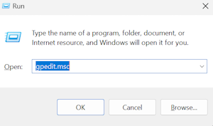
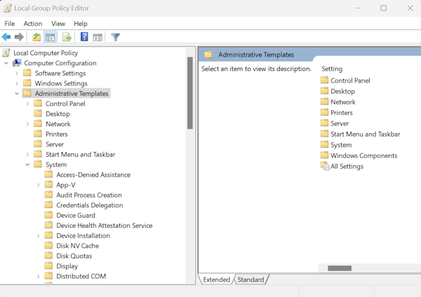

# Kibana Troubleshooting

This document provides troubleshooting guidance for common Kibana issues encountered during installation, configuration, and operation in Relativity environments.

> [!NOTE]
> This guide assumes a default Kibana installation path of `C:\elastic\kibana`. Adjust paths according to your actual installation directory.

## Windows service issues

> [!IMPORTANT]
> The following troubleshooting steps apply **only if Kibana was set up as a Windows service** (e.g., using NSSM or a similar tool). If you did not install Kibana as a Windows service, you must ensure that `kibana.bat` is running in a command prompt or as a scheduled task.

### Kibana service not starting

**Symptoms:**
- Kibana service fails to start
- Service stops immediately after starting

**Troubleshooting Steps:**

1. Check Service Status and Configuration:
    ```powershell
    Get-Service -Name kibana
    ```
   
    Expected output:
    ```
    Status   Name   DisplayName
    ------   ----   -----------
    Running  kibana Kibana
    ```

    ```powershell
    Get-CimInstance -ClassName Win32_Service -Filter "Name='kibana'" | Select-Object Name, State, StartMode, StartName
    ```
2. Verify the service is running under Local System account (default configuration).

3. Check Kibana Logs:
    1. Navigate to `C:\elastic\kibana\logs\`
    2. Review the latest log files (`kibana.log`) for error messages.
    3. Look for configuration errors or Elasticsearch connection issues (for example: `Unable to connect to Elasticsearch at https://<host or ip address>:9200`).

4. Start Service Manually:
    ```powershell
    Start-Service kibana
    ```
 
    Expected output
    ```
    (No output if successful. Service status will be "Running" after execution.)
    ```

### Service crashes or stops unexpectedly

**Symptoms:**
- Kibana service starts but stops after a short period
- Service status shows "Stopped" unexpectedly
- Users lose access to Kibana interface

**Troubleshooting Steps:**

1. Check Kibana Logs:
    1. Navigate to `C:\elastic\kibana\logs\`
    2. Review the latest log files (`kibana.log`) for crash details
    3. Look for memory issues or connection failures

2. Review Kibana Configuration:
    1. Check `C:\elastic\kibana\config\kibana.yml` file
    2. Verify Elasticsearch connection settings
    3. Ensure all required configuration parameters are present

3. Verify Elasticsearch Connectivity:
    ```powershell
    curl.exe -k -u <username>:<password> -X GET "https://<hostname_or_ip>:9200/"
    ```
   
    Expected output: 

    ```json
    {
       "name" : "EMTTEST",
       "cluster_name" : "elasticsearch",
       "cluster_uuid" : "PwBZoINKQjGZ53WH4gFfBg",
       "version" : {
          "number" : "8.17.3",
          "build_flavor" : "default",
          "build_type" : "zip",
          "build_hash" : "a091390de485bd4b127884f7e565c0cad59b10d2",
          "build_date" : "2025-02-28T10:07:26.089129809Z",
          "build_snapshot" : false,
          "lucene_version" : "9.12.0",
          "minimum_wire_compatibility_version" : "7.17.0",
          "minimum_index_compatibility_version" : "7.0.0"
       },
       "tagline" : "You Know, for Search"
    }
    ```

4. Check Memory Usage:
    1. Monitor Kibana process memory consumption using Task Manager or Resource Monitor.
    2. Verify sufficient system memory is available.

## Authentication issues

### Username/Password authentication issues

**Symptoms:**
- Login failures at Kibana interface
- "Invalid username or password" errors
- Users cannot access Kibana dashboards

**Troubleshooting Steps:**

1. Verify User Configuration:
    1. Ask the user to log in using the `elastic` username credentials.
    2. Check `C:\elastic\kibana\config\kibana.yml`:
        ```yaml
        elasticsearch.username: "<username>"
        elasticsearch.password: "<password>"
        ```

2. Test Elasticsearch Credentials Independently:
    1. Use the `elastic` username and password from `kibana.yml` to verify connectivity to Elasticsearch:
        ```powershell
        curl.exe -k -u <username>:<password> -X GET "https://<hostname_or_ip>:9200/"
        ```

        Expected output:

        ```json
        {
           "name" : "EMTTEST",
           "cluster_name" : "elasticsearch",
           ...
        }
        ```

> [!NOTE]
> For port-related issues, see the [Port Configuration Troubleshooting](pre-requisite-troubleshooting.md) guide.


## Memory issues

### Insufficient memory allocation

**Symptoms:**
- Kibana becomes unresponsive
- Slow loading of dashboards and visualizations
- Out of memory errors in logs

**Troubleshooting Steps:**

1. Check Current Memory Usage:
    ```powershell
    Get-Process -Name node | Where-Object {$_.ProcessName -eq "node"} | Select-Object WorkingSet, VirtualMemorySize
    ```
   
    Expected output:
    ```
    WorkingSet VirtualMemorySize
    ---------- ----------------
    12345678   23456789
    ```

2. Review Out of Memory Errors in Logs:

* **Review Out of Memory Errors in Logs:**
  - Check for "out of memory" or "heap" errors in `C:\elastic\kibana\logs\kibana.log`.
> [!NOTE]
> Out of memory errors typically indicate insufficient system memory or improper Node.js heap settings. Review the error details in the log for specific causes and recommended actions.

3. Verify Disk Space:
    1. Insufficient disk space can also cause memory-related failures.
    2. For disk space troubleshooting steps, see [Verify Disk Space](elasticsearch.md#verify-disk-space).


## Kibana encryption keys configuration

### Missing or invalid encryption keys

**Symptoms:**
- Kibana fails to start with encryption-related errors
- "Saved objects encryption key is missing" warnings
- Unable to save or retrieve saved objects

**Troubleshooting Steps:**

1. Generate Encryption Keys:
    ```powershell
    cd C:\elastic\kibana\bin
    .\kibana-encryption-keys.bat generate
    ```

    Expected output:
    ```
    xpack.encryptedSavedObjects.encryptionKey: "<randomly-generated-key-1>"
    xpack.reporting.encryptionKey: "<randomly-generated-key-2>"
    xpack.security.encryptionKey: "<randomly-generated-key-3>"
    ```

2. Configure Required Encryption Keys in kibana.yml:
    1. Copy the generated lines above and paste them into your `C:\elastic\kibana\config\kibana.yml` file.


## Service verification

### Verifying Kibana health and status

**Symptoms:**
- Need to confirm Kibana is operating correctly
- Performance monitoring requirements
- Health check automation

**Troubleshooting Steps:**

1. Check Kibana Status:
    ```powershell
    curl.exe -k -u <username>:<password> -X GET "http://<hostname_or_ip>:5601/api/status"
    ```
   
    Expected output:
    ```json
    {
      "name": "kibana",
      "version": {
        "number": "8.x.x"
      },
      "status": {
        "overall": {
          "level": "available"
        }
      }
    }
    ```

## Additional diagnostic commands

### Configuration validation

1. Validate YAML syntax
    ```powershell
    C:\elastic\kibana\bin\kibana.bat 
    ```
  
    Expected output:

    ```
    # There is no built-in --validate-config option in Kibana 8.x.
    # Configuration is validated when Kibana starts.
    # If there are errors in kibana.yml, they will be shown in the console output and Kibana will fail to start.
    ```

## Installation issues

### Long path issues during extraction

**Symptoms:**
- Errors when extracting the `kibana-8.xx.x-windows-x86_64.zip` file.
- The extraction process fails due to file paths exceeding the Windows default limit.

**Troubleshooting Steps:**

1.  Enable Long Paths in Windows:
    Windows must be configured to support long file paths. This can be enabled via the Local Group Policy Editor.
    1. Run `gpedit.msc` to open the Local Group Policy Editor.

        
    2. Navigate to `Computer Configuration` → `Administrative Templates` → `System` → `Filesystem`.

        

    3. Double-click on `Enable Win32 long paths` and set it to **Enabled**.

        

2.  Re-extract the Kibana zip file:

    1. After enabling long path support, attempt to extract the `kibana-8.xx.x-windows-x86_64.zip` file again.
