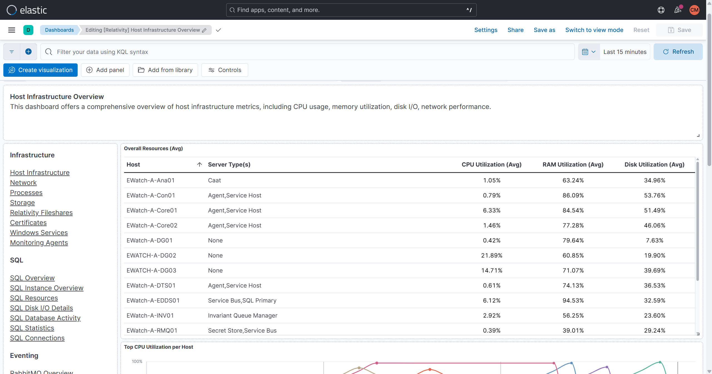
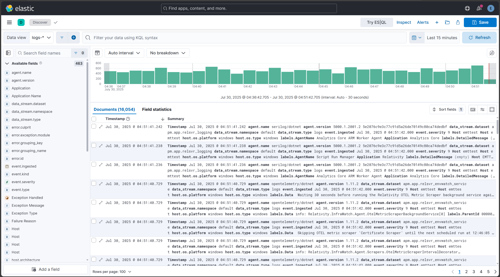

# Environment Watch Monitoring Agent and Open Telemetry Collector Troubleshooting

This document provides troubleshooting guidance for the Relativity Environment Watch Windows service and the Open Telemetry Collector in Relativity environments.

> [!NOTE]
> The Relativity Environment Watch Windows service is responsible for auto-configuring and managing the Open Telemetry Collector on each server. There are no expectations for the user to configure the collector directly.

## Table of Contents

- [Windows Service Troubleshooting](#windows-service-troubleshooting)
- [Port Configuration Issues](#port-configuration-issues)
- [Error Handling and Diagnostics](#error-handling-and-diagnostics)
- [Pre-requisite Access Checks](#pre-requisite-access-checks)
  - [BCP Share Access Verification](#bcp-share-access-verification)
  - [Secret Server Access Verification](#secret-server-access-verification)
  - [Kepler (SSL Certificate) Verification](#kepler-ssl-certificate-verification)
  - [Elasticsearch Access Verification](#elasticsearch-access-verification)
  - [Kibana Access Verification](#kibana-access-verification)
  - [APM Server Access Verification](#apm-server-access-verification)
  - [Relativity Service Account Verification](#relativity-service-account-verification)
- [Open Telemetry YAML File Auto-Generation](#open-telemetry-yaml-file-auto-generation)
- [Monitoring Agent Validation](#monitoring-agent-validation)

---

## Windows Service Troubleshooting

- **Check if the service is running:**
  ```powershell
  Get-Service 'Relativity Environment Watch'
  ```
  <details>
  <summary>Expected output</summary>

  ```
  Status   Name                          DisplayName
  ------   ----                          -----------
  Running  Relativity Environment Watch  Relativity Environment Watch
  ```
  </details>

  If the service is not running, restart it:
  ```powershell
  Restart-Service -Name "Relativity Environment Watch"
  ```
  <details>
  <summary>Expected output</summary>

  ```
  (No output if successful. Service status will be "Running" after execution.)
  ```
  </details>

- **Check in Task Manager whether `otelcol-relativity.exe` is running:**
  - Open Task Manager and look for `otelcol-relativity.exe` under the Processes tab.
  - Alternatively, use PowerShell:
    ```powershell
    Get-Process -Name otelcol-relativity
    ```
    <details>
    <summary>Expected output</summary>

    ```
    Handles  NPM(K)    PM(K)      WS(K)     CPU(s)     Id  SI ProcessName
    -------  ------    -----      -----     ------     --  -- -----------
    ...      ...       ...        ...       ...        ... ... otelcol-relativity
    ```
    *(If not running, no output.)*
    </details>

- **Verify logs are being generated:**
  - Check the directory:  
    `C:\ProgramData\Relativity\EnvironmentWatch\Services\InfraWatchAgent\Logs`
  - Ensure files like `otelcol-relativity-stderr.log` and `otelcol-relativity-stdout.log` are present and updating.

- **Check if the auto-generated YAML file exists:**
  - Verify the file:  
    `C:\ProgramData\Relativity\EnvironmentWatch\Services\InfraWatchAgent\otelcol-config-auto-generated.yaml`
  - The file should exist and contain configuration details for the Open Telemetry Collector.

- **Check port status:**
  ```powershell
  netstat -an | findstr ":4318"
  Get-NetTCPConnection -LocalPort 4318 -State Listen
  ```
  <details>
  <summary>Expected output</summary>

  ```
  TCP    0.0.0.0:4318           0.0.0.0:0              LISTENING
  ```
  *(Only present when service is running; no output if stopped.)*
  </details>

> [!NOTE]
When running, both `rel-envwatch-service` and `otelcol-relativity` processes are present. When stopped, neither process is present. Port 4318 is listening only when service is running.

---

## Port Configuration Issues

> [!NOTE]
Only one Open Telemetry Collector can run per environment. Default port: OTLP HTTP 4318.

- Check port:
  ```powershell
  netstat -an | findstr ":4318"
  Get-NetTCPConnection -LocalPort 4318 -State Listen
  ```
  <details>
  <summary>Expected output</summary>

  ```
  TCP    0.0.0.0:4318           0.0.0.0:0              LISTENING
  ```
  *(Only present when service is running; no output if stopped.)*
  </details>

---

## Error Handling and Diagnostics

- All logs are written to:
  - `C:\ProgramData\Relativity\EnvironmentWatch\Services\InfraWatchAgent\Logs\otelcol-relativity-stderr.log` (errors)
  - `C:\ProgramData\Relativity\EnvironmentWatch\Services\InfraWatchAgent\Logs\otelcol-relativity-stdout.log` (general logs)
- All information and error log entries are also written to the Windows event log:
  - `Relativity.EnvironmentWatch`
- Use PowerShell to check logs:
  ```powershell
  Get-EventLog Relativity.EnvironmentWatch | Where { $_.EntryType -eq "Error" }
  Get-EventLog Relativity.EnvironmentWatch | Where { $_.EntryType -eq "Information" }
  Get-EventLog Relativity.EnvironmentWatch | Where { $_.Message -like "*Everything is ready*" }
  ```
  <details>
  <summary>Expected output (for last command)</summary>

  ```
  Index Time          EntryType   Source                        InstanceID Message
  ----- ----          ---------   ------                        ---------- -------
  123   7/29/2025     Information Relativity.EnvironmentWatch   ...        Everything is ready
  ```
  </details>

---

## Pre-requisite Access Checks

### BCP Share Access Verification

> [!NOTE]
If you are not logged in as the Relativity Service Account, use the commands below.

- Test as the Relativity Service Account:
  ```powershell
  $cred = Get-Credential # use the Relativity Service Account
  Start-Process "powershell.exe" -Credential $cred -ArgumentList '-NoExit'
  # In the new PowerShell session window, run:
  Test-Path "\\bcp-share\relativity-data"
  ```
  <details>
  <summary>Expected output</summary>

  ```
  True
  ```
  *(If the path is accessible; otherwise, False.)*
  </details>

### Secret Server Access Verification

- Test connectivity:
  ```powershell
  Test-NetConnection -ComputerName <hostname_or_ip> -Port 443
  ```
  <details>
  <summary>Expected output</summary>

  ```
  ComputerName     : <hostname_or_ip>
  RemoteAddress    : <ip>
  RemotePort       : 443
  TcpTestSucceeded : True
  ```
  </details>

- Test API access:
  ```powershell
  curl.exe -k -u <username>:<password> -X GET "https://<hostname_or_ip>/api/v1/secrets"
  ```
  <details>
  <summary>Expected response</summary>

  ```json
  {
    "secrets": [
      {
        "id": "secret_id",
        "name": "secret_name",
        ...
      }
    ]
  }
  ```
  </details>

### Kepler (SSL Certificate) Verification

- The required web certificate must be installed on the server.
  (Check with your certificate management process or MMC snap-in for Certificates.)
- To verify Kepler API status:
  ```powershell
  curl.exe -k -u <username>:<password> -X GET "https://<hostname_or_ip>/relativity.rest/api/relativity-infrawatch-services/v1/infrawatch-manager/getkeplerstatusasync"
  ```
  <details>
  <summary>Expected response</summary>

  ```json
  {
    "status": "Healthy",
    ...
  }
  ```
  </details>

### Elasticsearch Access Verification

> [!NOTE]
For connectivity and troubleshooting, [ElasticSearch Troubleshooting](elasticsearch.md)

### Kibana Access Verification

- Ensure you can access the Kibana dashboard in your environment.
- Open a browser and navigate to your Kibana instance, e.g.:  
  `https://<kibana-hostname-or-ip>:5601`
- You should see the Kibana login page or dashboard.
- For more information, see [Kibana documentation](https://www.elastic.co/guide/en/kibana/current/index.html).
- For connectivity and troubleshooting, [Kibana Troubleshooting](kibana.md)

### APM Server Access Verification

> [!NOTE]
For connectivity and troubleshooting, [APM-Server Troubleshooting](apm-server.md)

### Relativity Service Account Verification

> [!NOTE]
For service account requirements and troubleshooting, [Environment_Watch_Installer](../environment_watch_installer.md)

---

## Open Telemetry YAML File Auto-Generation

> [!NOTE]
The Open Telemetry YAML file is automatically created by the Environment Watch Windows service at:  
C:\ProgramData\Relativity\EnvironmentWatch\Services\InfraWatchAgent\otelcol-config-auto-generated.yaml

---

## Monitoring Agent Validation

To verify that metrics, logs, and traces are flowing from the Open Telemetry Collector:

1. **Monitoring Agents Dashboard**
   - Open Kibana and navigate to the **Monitoring Agents** dashboard.
   - Confirm the "Last Check-In" field is updating for each monitored server.
   - **Expected:** The "Last Check-In" timestamp updates regularly.
   - Confirm the **Version Installed** column is displayed for all hosts and shows the same version for every host.
   - **Expected:** The "Version Installed" value should be the same for all hosts and visible for each host.
   

2. **Host Infrastructure Overview**
   - Open Kibana and navigate to the **Host Infrastructure Overview** dashboard.
   - Confirm metrics are present for each host.
   - **Expected:** Metrics and graphs are populated for the host.
   

3. **Discover Query**
   - Open Kibana, go to **Discover**.
   - Select the APM data view.
   - Run the following query:
     ```
     service.name: "relsvr_infrawatch_agent" and host.hostname: "<hostname_or_ip>"
     ```
   - **Expected result:** You should see logs, metrics, and traces from the Open Telemetry Collector for the specified host.
   

---

For additional troubleshooting, refer to the main documentation:  
[Environment_Watch_Installer](../environment_watch_installer.md)

