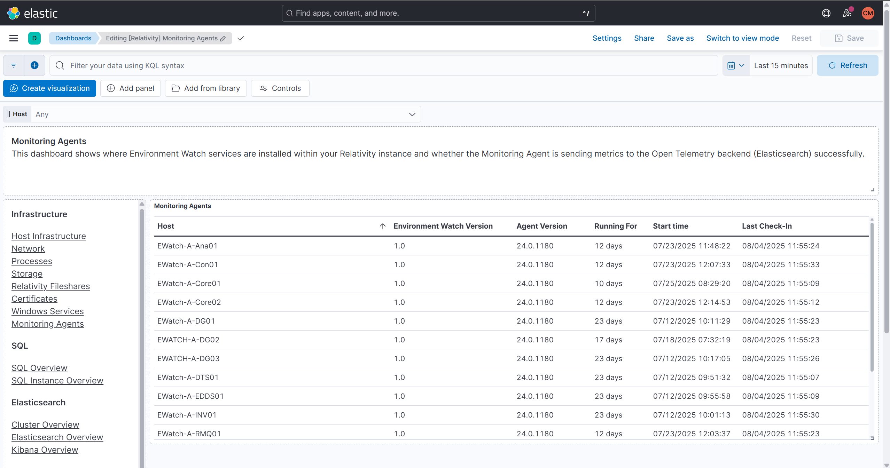

# Environment Watch Monitoring Agent and Open Telemetry Collector Troubleshooting

This document provides a stepwise troubleshooting guide for the Relativity Environment Watch Windows service and the Open Telemetry Collector in Relativity environments.

> [!NOTE]
> The Relativity Environment Watch Windows service is responsible for auto-configuring and managing the Open Telemetry Collector on each server. There are no expectations for the user to configure the collector directly.


## Table of Contents

- [Verify the Elastic Stack Servers are Running](#verify-the-elastic-stack-servers-are-running)
- [Verify the Monitoring Agent Hosts are Present and Sending Metrics](#verify-the-monitoring-agent-hosts-are-present-and-sending-metrics)
- [Verify the Environment Watch Service and Open Telemetry Collector](#verify-the-environment-watch-service-and-open-telemetry-collector)
- [Verify the Open Telemetry Collector Logs](#verify-the-open-telemetry-collector-logs)
- [Additional Pre-requisite Access Checks](#additional-pre-requisite-access-checks)
- [Open Telemetry YAML File Auto-Generation](#open-telemetry-yaml-file-auto-generation)

---


## Verify the Elastic Stack Servers are Running

First, ensure that the core Elastic Stack components (Elasticsearch, Kibana, and APM Server) are running and accessible. If you are not seeing any data in dashboards, this strongly suggests a problem with the Elastic Stack itself.

- For connectivity and troubleshooting, see:
  - [ElasticSearch Troubleshooting](elasticsearch.md)
  - [Kibana Troubleshooting](kibana.md)
  - [APM-Server Troubleshooting](apm-server.md)

---

## Verify the Monitoring Agent Hosts are Present and Sending Metrics

If the Elastic Stack is running, check that your monitoring agent hosts are present in Kibana and are sending metrics. If hosts are missing or not updating, the issue may be with the agent or host configuration.

**How to check:**

1. **Monitoring Agents Dashboard**
   - Open Kibana and navigate to the **Monitoring Agents** dashboard.
   - Confirm the "Last Check-In" field is updating for each monitored server.
   - **Expected:** The "Last Check-In" timestamp updates regularly.
   - Confirm the **Version Installed** column is displayed for all hosts and shows the same version for every host.
   - **Expected:** The "Version Installed" value should be the same for all hosts and visible for each host.
   

2. **Host Infrastructure Overview**
   - Open Kibana and navigate to the **Host Infrastructure Overview** dashboard.
   - Confirm metrics are present for each host.
   - **Expected:** Metrics and graphs are populated for the host.
   

3. **Discover Query**
   - Open Kibana, go to **Discover**.
   - Select the APM data view.
   - Run the following query:
     ```
     service.name: "relsvr_infrawatch_agent" and host.hostname: "<hostname_or_ip>"
     ```
   - **Expected result:** You should see logs, metrics, and traces from the Open Telemetry Collector for the specified host.
   

---


## Verify the Environment Watch Service and Open Telemetry Collector

If a specific host is not reporting, check that the Environment Watch Windows service is running on that host. This service is responsible for managing the Open Telemetry Collector. Also verify that the Open Telemetry Collector process is running, its port is listening, logs are being generated, and the auto-generated YAML file exists.

**How to check:**

1. Open PowerShell and run:
   ```powershell
   Get-Service 'Relativity Environment Watch'
   ```
   <details>
   <summary>Expected output</summary>

   ```
   Status   StartType Name
   ------   --------- ----
   Running  Automatic Relativity Environment Watch
   ```
   </details>
2. If not running, restart the service:
   ```powershell
   Restart-Service -Name "Relativity Environment Watch"
   ```
   <details>
   <summary>Expected output</summary>

   No output if successful. Service status will be "Running" after execution.
   </details>
3. Open Task Manager and look for `otelcol-relativity.exe` under the Processes tab.
   - Alternatively, use PowerShell:
     ```powershell
     Get-Process -Name otelcol-relativity
     ```
     <details>
     <summary>Expected output</summary>

     ```
     Handles  NPM(K)    PM(K)      WS(K)     CPU(s)     Id  SI ProcessName
     -------  ------    -----      -----     ------     --  -- -----------
     ...      ...       ...        ...       ...        ... ... otelcol-relativity
     ```
     *(If not running, no output.)*
     </details>
4. Check port status:
   ```powershell
   netstat -an | findstr ":4318"
   Get-NetTCPConnection -LocalPort 4318 -State Listen
   ```
   <details>
   <summary>Expected output</summary>

   ```
   TCP    0.0.0.0:4318           0.0.0.0:0              LISTENING
   ```
   (Only present when service is running; no output if stopped.)
   </details>
5. Verify logs are being generated:
   - Check the directory:  
     `C:\ProgramData\Relativity\EnvironmentWatch\Services\InfraWatchAgent\Logs`
   - Ensure files like `otelcol-relativity-stderr.log` and `otelcol-relativity-stdout.log` are present and updating.
     <details>
     <summary>Expected output</summary>

     Log files are present and their timestamps are updating as new data is written.
     </details>
6. Check if the auto-generated YAML file exists:
   - Verify the file:  
     `C:\ProgramData\Relativity\EnvironmentWatch\Services\InfraWatchAgent\otelcol-config-auto-generated.yaml`
   - The file should exist and contain configuration details for the Open Telemetry Collector.
     <details>
     <summary>Expected output</summary>

     The YAML file exists and contains valid configuration for the Open Telemetry Collector.
     </details>

> [!NOTE]
> When running, both `rel-envwatch-service` and `otelcol-relativity` processes are present. When stopped, neither process is present. Port 4318 is listening only when service is running.

---


## Verify the Open Telemetry Collector Logs

If the service and collector are running but data is still missing, check the logs for errors or misconfiguration.

**How to check:**

> [!NOTE]
> The below log files will be available starting with the September Patch 2 release.
* All logs are written to:
  - `C:\ProgramData\Relativity\EnvironmentWatch\Services\InfraWatchAgent\Logs\otelcol-relativity-stderr.log` (errors)
  - `C:\ProgramData\Relativity\EnvironmentWatch\Services\InfraWatchAgent\Logs\otelcol-relativity-stdout.log` (general logs)
* All information and error log entries are also written to the Windows event log:
  - `Relativity.EnvironmentWatch`
* Use PowerShell to check logs:
  ```powershell
  Get-EventLog Relativity.EnvironmentWatch | Where { $_.EntryType -eq "Error" }
  Get-EventLog Relativity.EnvironmentWatch | Where { $_.EntryType -eq "Information" }
  Get-EventLog Relativity.EnvironmentWatch | Where { $_.Message -like "*Everything is ready*" }
  ```
  <details>
  <summary>Expected output</summary>

  ```
  Index Time          EntryType   Source                        InstanceID Message
  ----- ----          ---------   ------                        ---------- -------
  123   7/29/2025     Information Relativity.EnvironmentWatch   ...        Everything is ready
  ```
  </details>
* You can also check the Event Viewer logs for `Relativity.EnvironmentWatch`:
  - Open **Event Viewer** (eventvwr.msc)
  - Navigate to **Application and Service Logs** > **Relativity.EnvironmentWatch**
  - Review any Error or Warning entries for troubleshooting details
  
  
  
---


## Open Telemetry YAML File Auto-Generation

> [!NOTE]
> The Open Telemetry YAML file is automatically created by the Environment Watch Windows service at:  
> C:\ProgramData\Relativity\EnvironmentWatch\Services\InfraWatchAgent\otelcol-config-auto-generated.yaml

---

## Additional Pre-requisite Access Checks

If the above steps do not resolve the issue, verify the following access and configuration requirements:

### BCP Share Access Verification
> [!NOTE]
> If you are not logged in as the Relativity Service Account, use the commands below.

```powershell
$cred = Get-Credential # use the Relativity Service Account
Start-Process "powershell.exe" -Credential $cred -ArgumentList '-NoExit'
# In the new PowerShell session window, run:
Test-Path "\\bcp-share\relativity-data"
```
<details>
<summary>Expected output</summary>

True

*(If the path is accessible; otherwise, False.)*
</details>

### Secret Server Access Verification
```powershell
Test-NetConnection -ComputerName <hostname_or_ip> -Port 443
```
<details>
<summary>Expected output</summary>

```
ComputerName     : <hostname_or_ip>
RemoteAddress    : <ip>
RemotePort       : 443
TcpTestSucceeded : True
```
</details>

Test API access:
```powershell
curl.exe -k -u <username>:<password> -X GET "https://<hostname_or_ip>/api/v1/secrets"
```
<details>
<summary>Expected output</summary>

JSON response with secrets.
</details>

### Kepler (SSL Certificate) Verification
- The required web certificate must be installed on the server (check with your certificate management process or MMC snap-in for Certificates).
- Verify Kepler API status:
  ```powershell
  curl.exe -k -u <username>:<password> -X GET "https://<hostname_or_ip>/relativity.rest/api/relativity-infrawatch-services/v1/infrawatch-manager/getkeplerstatusasync"
  ```
  <details>
  <summary>Expected output</summary>

  JSON response with "status": "Healthy".
  </details>

### Relativity Service Account Verification
> [!NOTE]
> For service account requirements and troubleshooting, see [Environment_Watch_Installer](../environment_watch_installer.md)

---

For additional troubleshooting, refer to the main documentation:  
[Environment_Watch_Installer](../environment_watch_installer.md)

