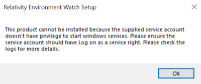

# Environment Watch Monitoring Agent and Open Telemetry Collector Troubleshooting

This document provides a stepwise troubleshooting guide for the Relativity Environment Watch Windows service and the Open Telemetry Collector in Relativity environments.

> [!NOTE]
> The Relativity Environment Watch Windows service is responsible for auto-configuring and managing the Open Telemetry Collector on each server. There are no expectations for the user to configure the collector directly.


## Table of Contents

- [Environment Watch Monitoring Agent and Open Telemetry Collector Troubleshooting](#environment-watch-monitoring-agent-and-open-telemetry-collector-troubleshooting)
  - [Verify the Elastic Stack Servers are Running](#verify-the-elastic-stack-servers-are-running)
  - [Verify the Monitoring Agent Hosts are Present and Sending Metrics](#verify-the-monitoring-agent-hosts-are-present-and-sending-metrics)
  - [Verify the Environment Watch Service and Open Telemetry Collector](#verify-the-environment-watch-service-and-open-telemetry-collector)
  - [Verify the Open Telemetry Collector Logs](#verify-the-open-telemetry-collector-logs)
  - [Additional Pre-requisite Access Checks](#additional-pre-requisite-access-checks)
    - [BCP Share Access Verification](#bcp-share-access-verification)
    - [Secret Store Access Verification](#secret-store-access-verification)
    - [Kepler (SSL Certificate) Verification](#kepler-ssl-certificate-verification)
    - [Relativity Service Account Verification](#relativity-service-account-verification)
  - [Installer and Service Errors](#installer-and-service-errors)
    - [User Not in Local Security Policy](#user-not-in-local-security-policy)
    - [Invalid Secrets](#invalid-secrets)

---


## Verify the Elastic Stack Servers are Running

First, ensure that the core Elastic Stack components (Elasticsearch, Kibana, and APM Server) are running and accessible. If you are not seeing any data in dashboards, this strongly suggests a problem with the Elastic Stack itself.

- For port-related issues, see the [Port Configuration Troubleshooting](port-troubleshooting.md) guide.
  - [ElasticSearch Troubleshooting](elasticsearch.md)
  - [Kibana Troubleshooting](kibana.md)
  - [APM-Server Troubleshooting](apm-server.md)

---

## Verify the Monitoring Agent Hosts are Present and Sending Metrics

If the Elastic Stack is running, check that your monitoring agent hosts are present in Kibana and are sending metrics. If hosts are missing or not updating, the issue may be with the agent or host configuration.

**How to check:**

1. **Monitoring Agents Dashboard**
   - Open Kibana and navigate to the **Monitoring Agents** dashboard.
   - Confirm the "Last Check-In" field is updating for each monitored server.
   - **Expected:** The "Last Check-In" timestamp updates regularly.
   - Confirm the **Agent Version** column value is displayed for all hosts and shows the same version for every host.
   - **Expected:** The "Agent Version" column value should be the same for all hosts and visible for each host.
   

2. **Host Infrastructure Overview**
   - Open Kibana and navigate to the **Host Infrastructure Overview** dashboard.
   - Confirm CPU Utilization, RAM Utilization and Disk Utilization column values are present for each host.
   - **Expected result:** CPU Utilization, RAM Utilization and Disk Utilization column values are populated for the host.
   

3. **Discover Query**
   - Open Kibana, go to **Discover**.
   - Select the APM data view.
   - Run the following query:
     ```
     service.name: "relsvr_infrawatch_agent" and host.hostname: "<hostname_or_ip>"
     ```
   - **Expected result:** You should see logs, data, and traces from the Open Telemetry Collector for the specified host.
   

---


## Verify the Environment Watch Service and Open Telemetry Collector

If a specific host is not reporting, check that the Environment Watch Windows service is running on that host. This service is responsible for managing the Open Telemetry Collector. Also verify that the Open Telemetry Collector process is running, its port is listening, logs are being generated, and the auto-generated YAML file exists.

**How to check:**

1. Open PowerShell and run:
    - ```powershell
      Get-Service 'Relativity Environment Watch'
      ```
      <details>
      <summary>Expected output</summary>

      ```
      Status   Name               Display Name
      ------   ----               ---------
      Running  Relativity Envi... Relativity Environment Watch
      ```
      </details>
2. If status is not running, restart the service:
    - ```powershell
      Restart-Service -Name "Relativity Environment Watch"
      ```
      <details>
      <summary>Expected output</summary>

      No output if successful. Service status will be "Running" after execution.
      </details>
3. Verify logs are being generated:
   - Check the directory:  
     `C:\ProgramData\Relativity\EnvironmentWatch\Services\InfraWatchAgent\Logs`
   - Ensure files like `otelcol-relativity-stderr.log` and `otelcol-relativity-stdout.log` are present and updating.
     <details>
     <summary>Expected output</summary>

     Log files are present and their timestamps are updating as new data is written.
     </details>
4. Open Task Manager and look for `otelcol-relativity.exe` under the Processes tab.
   - Alternatively, use PowerShell:
     ```powershell
     Get-Process -Name otelcol-relativity
     ```
     <details>
     <summary>Expected output</summary>

     ```
     Handles  NPM(K)    PM(K)      WS(K)     CPU(s)     Id  SI ProcessName
     -------  ------    -----      -----     ------     --  -- -----------
     ...      ...       ...        ...       ...        ... ... otelcol-relativity
     ```
     *(If not running, no output.)*
     </details>
5. Check port status in the [Port Configuration Troubleshooting](port-troubleshooting.md) guide.

> [!NOTE]
> When running, both `rel-envwatch-service` and `otelcol-relativity` processes are present. When stopped, neither process is present. Port 4318 is listening only when service is running.

---


## Verify the Open Telemetry Collector Logs

If the service and collector are running but data is still missing, check the logs for errors or misconfiguration.

> [!IMPORTANT]
> The most important log entry to confirm successful operation is
> "**Everything is ready**"
> If you do not see this message in the logs or Windows Event Viewer, the Open Telemetry Collector is almost certainly not working correctly.

> [!WARNING]
> The Windows Event Log for `Relativity.EnvironmentWatch` uses a very small default size (1 MB). This can quickly fill up and cause important log entries (like "Everything is ready") to be lost. Increase the log size to at least 500 MB in Event Viewer to ensure you do not miss critical events.

**How to check:**

> [!NOTE]
> The below log files will be available in v2025.08.27 EW BUNDLE RELEASE.
* All logs are written to:
  - `C:\ProgramData\Relativity\EnvironmentWatch\Services\InfraWatchAgent\Logs\otelcol-relativity-stderr.log` (errors)
  - `C:\ProgramData\Relativity\EnvironmentWatch\Services\InfraWatchAgent\Logs\otelcol-relativity-stdout.log` (general logs)
* All information and error log entries are also written to the Windows event log:
  - `Relativity.EnvironmentWatch`
* Use PowerShell to check error logs:
  ```powershell
  Get-EventLog Relativity.EnvironmentWatch | Where { $_.EntryType -eq "Error" }
  ```
  <details>
  <summary>Expected output</summary>

  ```
  Index Time          EntryType   Source                        InstanceID Message
  ----- ----          ---------   ------                        ---------- -------
  123   7/29/2025     Error       Relativity.EnvironmentWatch   ...        [Error details]
  ```
  (No output if no errors are present.)
  </details>

* Use PowerShell to check information logs:
  ```powershell
  Get-EventLog Relativity.EnvironmentWatch | Where { $_.EntryType -eq "Information" }
  ```
  <details>
  <summary>Expected output</summary>

  ```
  Index Time          EntryType   Source                        InstanceID Message
  ----- ----          ---------   ------                        ---------- -------
  124   7/29/2025     Information Relativity.EnvironmentWatch   ...        [Info details]
  ```
  </details>

* Use PowerShell to check for "Everything is ready" message:
  ```powershell
  Get-EventLog Relativity.EnvironmentWatch | Where { $_.Message -like "*Everything is ready*" }
  ```
  <details>
  <summary>Expected output</summary>

  ```
  Index Time          EntryType   Source                        InstanceID Message
  ----- ----          ---------   ------                        ---------- -------
  123   7/29/2025     Information Relativity.EnvironmentWatch   ...        Everything is ready
  ```
  </details>
* You can also check the Event Viewer logs for `Relativity.EnvironmentWatch`:
  - Open **Event Viewer** (eventvwr.msc)
  - Navigate to **Application and Service Logs** > **Relativity.EnvironmentWatch**
  - Review any Error or Warning entries for troubleshooting details
  
  
  
---

---

## Additional Pre-requisite Access Checks

If the above steps do not resolve the issue, verify the following access and configuration requirements:

### BCP Share Access Verification
> [!NOTE]
> If you are not logged in as the Relativity Service Account, use the commands below.

```powershell
$cred = Get-Credential # use the Relativity Service Account
Start-Process "powershell.exe" -Credential $cred -ArgumentList '-NoExit'
# In the new PowerShell session window, run:
# Example: Replace with your actual BCP share path
Test-Path "\\bcp-share\relativity-data"
```
<details>
<summary>Expected output</summary>

True

*(If the path is accessible; otherwise, False.)*
</details>

### Secret Store Access Verification

```powershell
Test-NetConnection -ComputerName <hostname_or_ip> -Port 443
```

**Expected output:**

```
ComputerName     : <hostname_or_ip>
RemoteAddress    : <ip>
RemotePort       : 443
TcpTestSucceeded : True
```

**Test API access:**

- Open in an elevated PowerShell and run the following command:

  ```powershell
  C:\Program Files\Relativity Secret Store\Client\secretstore.exe secret list /
  ```

  The output will look similar to:
  ```
  Secret Store URL: https://<hostname_or_ip>:9090/
  Client Certificate Thumbprint: 20F8F2516EC86EBF993075F64B0C6EA6777A4F83
  ```

- Copy the Client Certificate Thumbprint and Secret Store URL.

- To check the seal status, open in an elevated PowerShell ISE  and run the following script:

  ```powershell
  $thumbprint = "<insert-secret-store-client-certificate-thumbprint-here>"
  $store = New-Object System.Security.Cryptography.X509Certificates.X509Store("My", "LocalMachine")
  $store.Open("ReadOnly")
  $cert = $store.Certificates | Where-Object { $_.Thumbprint -eq $thumbprint }

  if (-not $cert) {
    Write-Error "Certificate with thumbprint $thumbprint not found."
    $store.Close()
    return
  }

  if (-not $cert.HasPrivateKey) {
    Write-Error "Certificate does not have a private key."
    $store.Close()
    return
  }

  $uri = "https://<insert-secret-store-url>:9090/v1/system/seal-status"
  try {
    $response = Invoke-RestMethod -Uri $uri -Method Get -Certificate $cert
    Write-Output "Seal status: $response"
  } catch {
    Write-Error "API call failed: $($_.Exception.Message)"
  }
  finally {
    $store.Close()   
  }
  ```

  The output will look similar to:
  ```
  Seal status: False
  ```

### Kepler & Web (SSL Certificate) Verification
- The required web certificate must be installed on the server (check with your certificate management process or MMC snap-in for Certificates).
- Verify Kepler API status:
  ```powershell
  curl.exe -k -u <username>:<password> -X GET "https://<hostname_or_ip>/relativity.rest/api/relativity-infrawatch-services/v1/infrawatch-manager/getkeplerstatusasync"
  ```
  <details>
  <summary>Expected Result</summary>

  JSON response with `"status": "OK"`.
  </details>

### Relativity Service Account Verification
> [!NOTE]
> For service account requirements and troubleshooting, see [Environment_Watch_Installer](../environment_watch_installation.md)

---

## Installer and Service Errors

This section covers issues related to the Environment Watch installer and the underlying Windows services it manages.

### User Not in Local Security Policy

**Symptoms:**
- The product installation fails with an error indicating the user is not added to the Local Security Policy.

  

**Troubleshooting Steps:**
1.  **Add User to Local Security Policy:**
    - Open the **Local Security Policy** editor (`secpol.msc`).
    - Navigate to `Local Policies` -> `User Rights Assignment`.
    - Ensure the user account running the installer has the necessary permissions, such as "Log on as a service".

    

### Invalid Secrets

**Symptoms:**
- The installation fails with an error message "one or more secrets are invalid".

  

**Troubleshooting Steps:**
1.  **Verify CLI Setup:** Ensure that the one-time setup using the `relsvr.exe setup` command was executed successfully and completed without errors. This step is required to generate the necessary secrets.

---

For additional troubleshooting, refer to the main documentation:  
[Environment Watch Installer](../environment_watch_installation.md)

