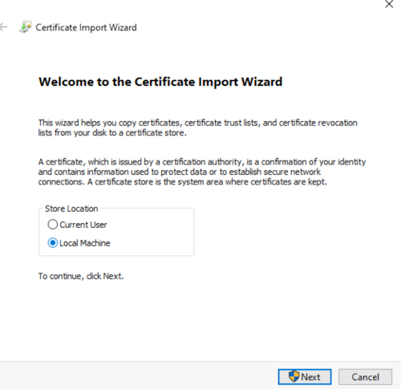

# Pre-requisite Troubleshooting

This document provides troubleshooting steps for common pre-requisites like port configuration and Secret Store access.

## Port Configuration Troubleshooting

### Default Port Reference
The following table summarizes the default ports used by the Elastic Stack and Environment Watch components.

| Component | Port | Protocol | Inbound | Outbound | Purpose |
| :--- | :--- | :--- | :---: | :---: | :--- |
| Elasticsearch | 9200 | HTTP/HTTPS | ✅ |  | Client communication and REST API |
| | 9300 | TCP | ✅ | ✅ | Inter-node communication |
| Kibana | 5601 | HTTP/HTTPS | ✅ | | Kibana web interface |
| APM Server | 8200 | HTTP/HTTPS | ✅ | | APM agent data ingestion |
| OTEL Collector | 4318 | HTTP | | | OTLP data reception (HTTP) for local traffic (localhost). This deployment uses the agent model, with a collector on each server. See the [OpenTelemetry agent documentation](https://opentelemetry.io/docs/collector/deployment/agent/) for more details. |


### Elasticsearch Port Issues

**Symptoms:**
- Elasticsearch fails to bind to default ports.
- "Address already in use" errors in logs.
- Cannot access Elasticsearch via HTTP/HTTPS.

**Troubleshooting Steps:**

1. Check if Ports are in use:
    Verify that ports 9200 and 9300 are listening.
    ```powershell
    netstat -an | findstr ":9200"
    netstat -an | findstr ":9300"
    ```

    Expected output:
    ```
    TCP    0.0.0.0:9200           0.0.0.0:0              LISTENING
    TCP    0.0.0.0:9300           0.0.0.0:0              LISTENING
    ```

2. Identify Conflicting Processes. If a port is in use by another application, identify the process.
    ```powershell
    Get-NetTCPConnection -LocalPort 9200 -State Listen
    Get-NetTCPConnection -LocalPort 9300 -State Listen
    ```

3. Test Elasticsearch Connectivity:
    ```powershell
    curl.exe -k -u <username>:<password> -X GET "https://<hostname_or_ip>:9200/"
    ```

4. Verify Network Binding:
    Check `C:\elastic\elasticsearch\config\elasticsearch.yml` configuration:
    ```yaml
    network.host: 0.0.0.0  # For all interfaces
    ```

### Kibana Port Issues

**Symptoms:**
- Kibana fails to bind to the default port.
- "EADDRINUSE" errors in logs.
- Cannot access Kibana web interface.

**Troubleshooting Steps:**

1. Check if Port is in Use:
    ```powershell
    netstat -an | findstr ":5601"
    ```
      
    Expected output:
    ```
    TCP    0.0.0.0:5601           0.0.0.0:0              LISTENING
    ```

2. Test Kibana Connectivity:
    ```powershell
    (curl.exe -s -k -u <username>:<password> -X GET "http://<hostname_or_ip>:5601/api/status" | ConvertFrom-Json).status.overall | ConvertTo-Json -Depth 10
    ```

3. Verify Network Binding. Check `C:\elastic\kibana\config\kibana.yml` configuration:
    ```yaml
    server.host: "0.0.0.0"  # For all interfaces
    ```


### APM Server Port Issues

**Symptoms:**
- APM Server fails to bind to the default port.
- "Address already in use" errors in logs.
- APM agents cannot connect to the server.

**Troubleshooting Steps:**

1. Check if Port is in Use:
    ```powershell
    netstat -an | findstr ":8200"
    ```
  
    Expected output:
    ```
    TCP    0.0.0.0:8200           0.0.0.0:0              LISTENING
    ```
  
2. Test APM Server Connectivity:
    ```powershell
    curl.exe -k "http://<hostname_or_ip>:8200/"
    ```
  
    Expected output:

    ```json
    {
      "build_date": "...",
      "build_sha": "...",
      "publish_ready": true,
      "version": "8.17.3"
    }
    ```

3. Verify Network Binding. Check `C:\elastic\apm-server\apm-server.yml` configuration:
    ```yaml
    host: "0.0.0.0:8200"
    ```

### OpenTelemetry Collector Port Issues

**Symptoms:**
- The `otelcol-relativity.exe` process is running, but no data is being sent.
- Port 4318 is not in a listening state.

**Troubleshooting Steps:**

1. Check if Port is in Use. This port is used by the OpenTelemetry Collector to receive data. The `Relativity Environment Watch` service must be running.
    ```powershell
    netstat -an | findstr ":4318"
    ```
  
    Expected output:
    ```
    TCP    0.0.0.0:4318           0.0.0.0:0              LISTENING
    ```

    You can also use `Get-NetTCPConnection`:
    ```powershell
    Get-NetTCPConnection -LocalPort 4318 -State Listen
    ```


### General Port Troubleshooting

#### Firewall Rules
  Ensure that Windows Firewall or any other network security software is not blocking the required ports. You may need to create inbound rules to allow traffic on these ports.

  **Example for Kibana (port 5601):**
  ```powershell
  New-NetFirewallRule -DisplayName "Kibana Web Interface" -Direction Inbound -Protocol TCP -LocalPort 5601 -Action Allow
  ```

#### Network Connectivity
  Use `Test-NetConnection` to verify that a remote server can reach the port.
  ```powershell
  Test-NetConnection -ComputerName <hostname_or_ip> -Port <port_number>
  ```
  
  Expected output:
  ```
  ComputerName     : <hostname_or_ip>
  RemoteAddress    : <ip>
  RemotePort       : <port_number>
  TcpTestSucceeded : True
  ```


## Secret Store Troubleshooting

### Secret Store Access Verification

#### Network Connectivity Test

Verify that the Secret Store host is reachable on port 443.

```powershell
Test-NetConnection -ComputerName <hostname_or_ip> -Port 443
```

Expected output:

```
ComputerName     : <hostname_or_ip>
RemoteAddress    : <ip>
RemotePort       : 443
TcpTestSucceeded : True
```

#### API Access Test

1.  Open an elevated PowerShell and run the following command to list secrets and retrieve connection details:

    ```powershell
    C:\Program Files\Relativity Secret Store\Client\secretstore.exe secret list /
    ```

    The output will look similar to:
    ```
    Secret Store URL: https://<hostname_or_ip>:9090/
    Client Certificate Thumbprint: 20F8F2516EC86EBF993075F64B0C6EA6777A4F83
    ```

2.  Copy the **Client Certificate Thumbprint** and **Secret Store URL** from the output.

#### Seal Status Check

To check the seal status of the Secret Store, run the following script in an elevated PowerShell ISE.

- Replace `<insert-secret-store-client-certificate-thumbprint-here>` with the thumbprint you copied.
- Replace `<insert-secret-store-url-here>` with the URL you copied.

```powershell
$thumbprint = "<insert-secret-store-client-certificate-thumbprint-here>"
$url = "<insert-secret-store-url-here>"

# Find the client certificate
$store = New-Object System.Security.Cryptography.X509Certificates.X509Store("My", "LocalMachine")
$store.Open("ReadOnly")
$cert = $store.Certificates | Where-Object { $_.Thumbprint -eq $thumbprint }

if (-not $cert) {
    Write-Error "Certificate with thumbprint $thumbprint not found."
    return
}

# Check the seal status
$response = Invoke-RestMethod -Uri "$url/v1/sys/seal-status" -Certificate $cert
$response | ConvertTo-Json
```

Expected output (for a healthy, unsealed store):

```json
{
    "type": "shamir",
    "initialized": true,
    "sealed": false,
    "t": 3,
    "n": 5,
    "progress": 0,
    "nonce": "",
    "version": "1.6.2",
    "migration": false,
    "cluster_name": "secret-store",
    "cluster_id": "...",
    "recovery_seal": false,
    "storage_type": "raft"
}
```


## Certificate Troubleshooting

### SSL/TLS Certificate Issues

**Symptoms:**
- SSL handshake failures
- "certificate verify failed" errors
- Unable to establish secure connections
- Browser shows "not secure" warning for Elasticsearch URL

**Troubleshooting Steps:**

1. Verify Secure URL
    1. The master node domain name URL should be secure for Elasticsearch node servers, agent servers, and web servers.
    2. The data node domain name URL should be secured for Elasticsearch node servers.

2. Install SSL Certificate in Trusted Store

   If your browser shows a "not secure" warning when accessing the Elasticsearch URL, you may need to install the certificate into your trusted store.

    1. In your browser, view the certificate details and export the root certificate authority (CA) certificate. Save it to a local directory.
    
    2. Double-click the downloaded certificate file and click **Install Certificate**.
    
        

    3. Select **Local Machine** and click **Next**.
    
        

    4. Select **Place all certificates in the following store**, click **Browse**, and select **Trusted Root Certification Authorities**. Click **OK**, then **Next**, and **Finish**.
    
    5. To confirm, open the Microsoft Management Console (MMC):
        i. Run `mmc.exe`.
        ii. Go to **File > Add/Remove Snap-in...**.
        iii. Select **Certificates** and click **Add**.
    
            
    
            

    6. Choose **Computer account** and click **Next**, then **Finish**, and **OK**.
    
        

    7. Expand **Certificates (Local Computer) > Trusted Root Certification Authorities > Certificates** and verify your certificate is listed.

    8. Close your browser and reopen the Elasticsearch URL. It should now show as secure.

        

3. Verify Certificate Path in `elasticsearch.yml`.
    1. Ensure the `elasticsearch.yml` file points to the correct certificate files.

    2. Check `C:\elastic\elasticsearch\config\elasticsearch.yml`:
        ```yaml
        xpack.security.transport.ssl:
        keystore.path: certs/transport.p12
        truststore.path: certs/transport.p12
        ```

4. Check Elasticsearch Logs for SSL Errors
    1. Navigate to `C:\elastic\elasticsearch\logs\`.
    2. Review the `elasticsearch.log` file for any SSL-related errors.
    3. For every error in the Elasticsearch log, provide troubleshooting for that specific error.


### TLS Version Mismatch

**Symptoms:**
- **Connection Failure**: During installation of Environment Watch Installer, an error pop-up may appear with a message like:
  > The HTTP request submitted to the server `https://<hostname>:9200/` failed because of an unexpected error. Verify the server is accessible and URL is correct. Check the logs for more details or refer to the following troubleshooting guide.
- **Log Errors**: Logs on the application's server indicate a failure to establish a secure connection or mention outdated TLS versions (like TLSv1.0 or TLSv1.1).
- "SSLHandshakeException: client requested protocol TLSv1 is not enabled or supported in server context"

**Cause:**
The machine's .NET Framework is not configured to use strong cryptography, preventing it from negotiating a secure connection with modern servers that require TLS 1.2 or higher. By default, some .NET applications may attempt to use older, insecure TLS versions. Default TLS version supported by Elasticsearch is TLSv1.2 and TLSv1.3, hence causing issue

**Troubleshooting Steps:**

To resolve this, the .NET Framework on the machine must be configured to use the system's default security protocols, which allows it to use newer versions like TLS 1.2/1.3.

1.  **Verify TLS Settings**: 
    1. Navigate to **Control Panel > Network and Internet > Internet Options > Advanced**, ensure that **Use TLS 1.2** and **Use TLS 1.3** are checked.

2.  **Open Registry Editor**:
    1. Press `Win + R`, type `regedit`, and press Enter.

3.  **Navigate to .NET Framework Registry Keys**:
    A new value will need to be added in two locations.

    1. **For 64-bit applications:**
          ```
          HKEY_LOCAL_MACHINE\SOFTWARE\Microsoft\.NETFramework\v4.0.30319
          ```
    2. **For 32-bit applications running on a 64-bit machine:**
          ```
          HKEY_LOCAL_MACHINE\SOFTWARE\Wow6432Node\Microsoft\.NETFramework\v4.0.30319
          ```

4.  **Create the `SchUseStrongCrypto` Value**:
    1. In each of the keys mentioned above, right-click in the right-hand pane and select **New > DWORD (32-bit) Value**.
    2. Name the new value `SchUseStrongCrypto`.
    3. Double-click the new value and set its **Value data** to `1`. Click **OK**.

    > This registry key forces .NET 4.x applications to use strong cryptography, enabling support for newer TLS versions.

5.  **Reboot the System**. A system reboot is required for the changes to take effect.

6.  **Verify the Fix**:
    1. After rebooting, re-run the Environment Watch installer or restart the application. The connection to Elasticsearch should now succeed.