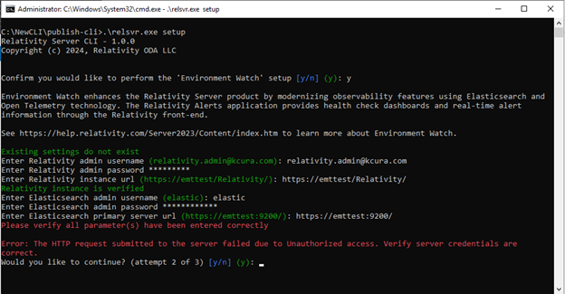
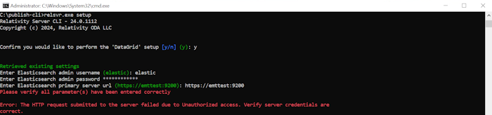
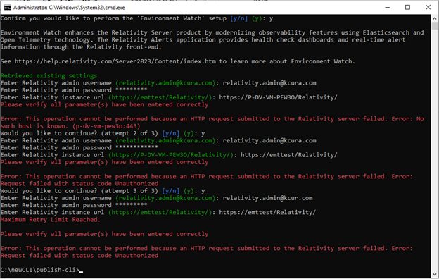

# Relativity Server CLI Troubleshooting

This document provides troubleshooting guidance for common Relativity Server CLI issues encountered during Environment Watch and Data Grid Audit setup, configuration, and operation.

## Prerequisite Access

> [!IMPORTANT]
> Before running the CLI, you must have access to all of the following:
> - **Relativity Admin account**
> - **Secret Store**
> - **Kepler (SSL certificate)**
> - **Elasticsearch**
> - **Kibana**
> - **APM Server**
>
> For verification steps for all prerequisites, see [Additional Pre-requisite Access Checks](monitoring-agent-and-otel-collector.md#additional-pre-requisite-access-checks).

> [!NOTE]
> This guide assumes the Relativity Server bundle was extracted to `C:\server-bundle` or a similar directory chosen by the user.

## Table of Contents

1. [APM Integration and Data View](#1-apm-integration-and-data-view)
2. [Kibana Encryption Keys Issues](#2-kibana-encryption-keys-issues)
3. [Common CLI Errors](#3-common-cli-errors)

---


## 1. APM Integration and Data View

### 1.1 Elastic APM Integration Package

The Elastic APM integration package must be added and configured in Kibana before running the CLI setup.

**Troubleshooting Steps:**

1. **Verify if APM Integration is already installed:**
   - Login to Kibana and navigate to **Management** > **Integrations**.
   - Search for "Elastic APM" in the search bar.
   - Check if "Elastic APM" appears under **Installed integrations**.

   - If APM integration is not installed, follow the detailed setup instructions in the [Elastic APM Integration Setup Guide](../elasticsearch_setup_development.md#step-4-additional-setup-and-verification).


> [!NOTE]
> If you encounter errors such as "Package not found" or installation timeouts during APM integration package installation, refer to the official [Elastic APM Integration Setup Guide](../elasticsearch_setup_development.md#elastic-apm-integration-package).

To verify connectivity, always use the following format for verification commands:
```powershell
curl.exe -k -u <username>:<password> -X GET "https://<hostname_or_ip>:9200/"
```
<details>
<summary>Expected Output</summary>

```json
{
  "name" : "EMTTEST",
  "cluster_name" : "elasticsearch",
  "cluster_uuid" : "PwBZoINKQjGZ53WH4gFfBg",
  "version" : {
    "number" : "8.17.3",
    "build_flavor" : "default",
    "build_type" : "zip",
    "build_hash" : "a091390de485bd4b127884f7e565c0cad59b10d2",
    "build_date" : "2025-02-28T10:07:26.089129809Z",
    "build_snapshot" : false,
    "lucene_version" : "9.12.0",
    "minimum_wire_compatibility_version" : "7.17.0",
    "minimum_index_compatibility_version" : "7.0.0"
  },
  "tagline" : "You Know, for Search"
}
```
</details>


### 1.2 Data View

#### Self Instrumentation Data View

Self-instrumentation allows you to monitor the CLI's own metrics, traces, and logs.

See [Self-Instrumentation](apm-server.md#self-instrumentation) for setup and troubleshooting instructions.

> [!NOTE]
> Without the self-instrumentation Data View, you may not see CLI self-monitoring data in Kibana dashboards.

* To check if the APM Data View is created in Kibana:

* Open a browser and go to `http://<hostname_or_ip>:5601`
* Log in using elastic credentials
* Confirm the APM Data View is present:

   

---


## 2. Kibana Encryption Keys Issues

* Kibana encryption keys must be added to `C:\elastic\kibana\config\kibana.yml` before running CLI setup.  
**If encryption keys are missing or invalid, the CLI will display errors such as:**
```
[ERROR] Missing required Kibana encryption key: xpack.encryptedSavedObjects.encryptionKey
[ERROR] Missing required Kibana encryption key: xpack.reporting.encryptionKey
[ERROR] Missing required Kibana encryption key: xpack.security.encryptionKey
```
> [!NOTE]
> If you encounter encryption key validation errors or warnings in the CLI, follow the instructions in [Kibana Encryption Keys Configuration](kibana.md#5-kibana-encryption-keys-configuration).

---

## 3. Common CLI Errors

This section covers common errors encountered during the Environment Watch and Data Grid Audit setup workflows.

### 3.1 Unauthorized Access

**Symptoms:**
- The CLI returns an "Unauthorized" error for Relativity or Elasticsearch credentials.

  
  
  

**Troubleshooting Steps:**
1.  **Verify Relativity Credentials:** Ensure the Relativity admin username and password are correct.
2.  **Verify Elasticsearch Credentials:** Ensure the Elasticsearch admin username and password are correct.

### 3.2 Incorrect Server URLs

**Symptoms:**
- The CLI returns an error indicating that a server URL is incorrect.

  
  
  
  

**Troubleshooting Steps:**
1.  **Verify URLs:** Check the URLs for Relativity, Elasticsearch, APM, and Kibana to ensure they are correct and accessible.

### 3.3 Incorrect Elasticsearch Server Credentials

**Symptoms:**
- The CLI specifically flags Elasticsearch credentials as incorrect.

  
  

**Troubleshooting Steps:**
1.  **Verify Elasticsearch Credentials and URL:** Double-check the Elasticsearch admin username, password, and server URL.

### 3.4 Retry Limit Reached

**Symptoms:**
- The CLI exits after multiple failed attempts to enter correct parameters.

  
  
  
  
  

**Troubleshooting Steps:**
1.  **Restart the CLI:** The maximum number of attempts has been reached. Rerun the setup command:
    ```
    relsvr.exe setup
    ```

---

For full setup instructions, see [Relativity_Server_CLI Setup](../relativity_server_cli_setup.md).

