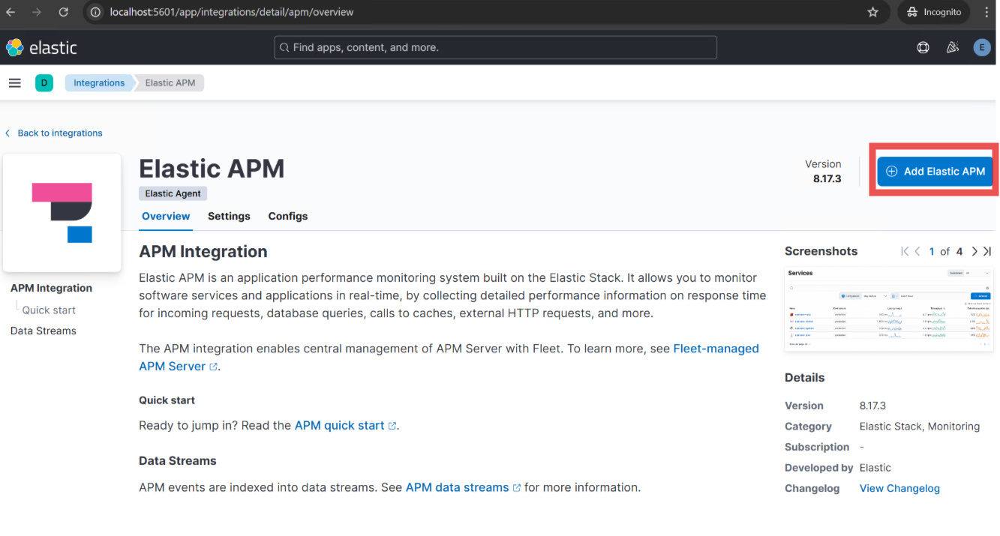

# Relativity Server CLI Troubleshooting

This document provides troubleshooting guidance for common Relativity Server CLI issues encountered during Environment Watch and Data Grid Audit setup, configuration, and operation.

> [!NOTE]
> This guide assumes the Relativity Server bundle was extracted to `C:\server-bundle` or a similar directory chosen by the user.

## Table of Contents

- [APM Integration and Data View](#apm-integration-and-data-view)
- [Kibana Encryption Keys Issues](#kibana-encryption-keys-issues)
- [Prerequisite Access Verification](#prerequisite-access-verification)

---

## APM Integration and Data View

### Elastic APM Integration Package

The Elastic APM integration package must be added and configured in Kibana before running the CLI setup.

- Login to Kibana and select the Elastic APM under Integration, or in the search bar type "Elastic APM" and select it under Integration.
- In the top right, select the **Add Elastic APM** button.
- Add an Integration name and for server configuration. Update APM hostname and APM URL.  
  Example:  
  Host: `<hostname_or_ip>:8200`  
  URL: `http://<hostname_or_ip>:8200`
- Click on **Save and Continue**.
- Select **Add Elastic Agent later** button as Agent is not required for the initial setups.





> [!NOTE]
> If you encounter errors such as "Package not found" or installation timeouts during APM integration package installation, refer to the official [Elastic APM Integration Setup Guide](../elasticsearch_setup_development.md#elastic-apm-integration-package).

To verify connectivity, always use the following format for verification commands:
```powershell
curl.exe -k -u <username>:<password> -X GET "https://<hostname_or_ip>:9200/"
```
<details>
<summary>Expected Output</summary>

```json
{
  "name" : "EMTTEST",
  "cluster_name" : "elasticsearch",
  "cluster_uuid" : "PwBZoINKQjGZ53WH4gFfBg",
  "version" : {
    "number" : "8.17.3",
    "build_flavor" : "default",
    "build_type" : "zip",
    "build_hash" : "a091390de485bd4b127884f7e565c0cad59b10d2",
    "build_date" : "2025-02-28T10:07:26.089129809Z",
    "build_snapshot" : false,
    "lucene_version" : "9.12.0",
    "minimum_wire_compatibility_version" : "7.17.0",
    "minimum_index_compatibility_version" : "7.0.0"
  },
  "tagline" : "You Know, for Search"
}
```
</details>

### Data View

Data views must be created and managed through the Kibana frontend.  

Check if the APM Data View is created in Kibana:

- Open a browser and go to `http://<hostname_or_ip>:5601`
- Log in using elastic credentials
- Confirm the APM Data View is present:

  

#### Self Instrumentation Data View
  
Self-instrumentation allows you to monitor the CLI's own metrics, traces, and logs.

See [Self-Instrumentation](apm-server.md#self-instrumentation) for setup and troubleshooting instructions.

> [!NOTE]
> Without the self-instrumentation Data View, you may not see CLI self-monitoring data in Kibana dashboards.

---

## Kibana Encryption Keys Issues

Kibana encryption keys must be added to `C:\elastic\kibana\config\kibana.yml` before running CLI setup.  
**If encryption keys are missing or invalid, the CLI will display errors such as:**
```
[ERROR] Missing required Kibana encryption key: xpack.encryptedSavedObjects.encryptionKey
[ERROR] Missing required Kibana encryption key: xpack.reporting.encryptionKey
[ERROR] Missing required Kibana encryption key: xpack.security.encryptionKey
```
> [!NOTE]
> If you encounter encryption key validation errors or warnings in the CLI, follow the instructions in [Kibana Encryption Key Configuration](kibana.md#missing-or-invalid-encryption-keys).

---

## Prerequisite Access Verification

Before running the CLI, you must have access to all of the following:

- **Relativity Admin account**  
  To verify Relativity admin account credentials, run:
  ```powershell
  curl.exe -k -u <username>:<password> -X GET "https://<hostname_or_ip>/Relativity.REST/API/Relativity.Services.InstanceDetails.IInstanceDetailsModule/InstanceDetailsService/GetRelativityVersionAsync"
  ```
  <details>
  <summary>Expected Output</summary>

  ```json
  {
    "Version": "24.0.0.0",
    ...
  }
  ```
  </details>

- **Secret Server**    
  See [Secret Server Access Verification](monitoring-agent-and-otel-collector.md#secret-server-access-verification) for verification steps.

- **Kepler (SSL certificate)**    
  See [Kepler (SSL Certificate) Verification](monitoring-agent-and-otel-collector.md#kepler-ssl-certificate-verification) for verification steps.

- **Elasticsearch**  
  See [Elasticsearch Troubleshooting](elasticsearch.md) for verification steps.

- **Kibana**  
  See [Kibana Troubleshooting](kibana.md) for verification steps.

- **APM Server**  
  See [APM-Server Troubleshooting](apm-server.md) for verification steps.

--- 

For full setup instructions, see [Relativity_Server_CLI Setup](../relativity_server_cli_setup.md).

