# Relativity Alerts Troubleshooting

This guide will help you resolve common issues that may arise during the installation of Alert application. If you encounter difficulties, follow the steps outlined below to identify and fix the problem quickly. Before proceeding, ensure that your device meets the system requirements and that you have a stable internet connection.

## During Installation

#### Issue 1: "Relativity Alert object data is unavailable or stale because Environment Watch is not currently enabled in this instance. Please see {doc page} for instructions on how to deploy and enable Environment Watch." error is displayed.

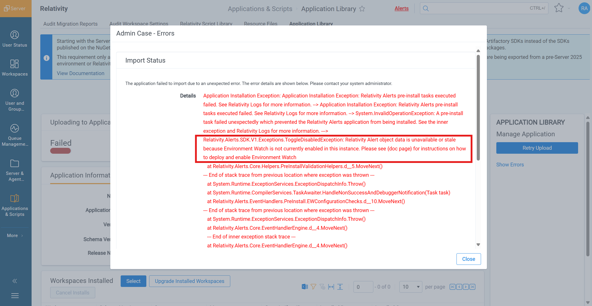

**Causes:**

1. Relativity Server CLI First-Time Setup not executed properly.

**Troubleshooting Steps:**

1. Please execute the Relativity Server CLI first time setup again to resolve this issue.

#### Issue 2: "This operation cannot be completed because an HTTP request to the Elasticsearch server failed. Please try again. If the issue persists, ensure that the Elasticsearch server is accessible and the configuration is correct." error is displayed.

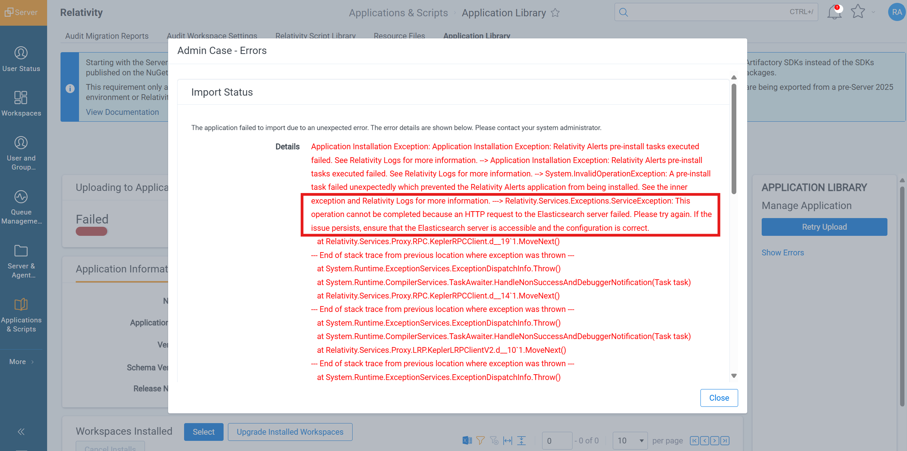

**Causes:**

1. Missing Setup of Elastic/Kibana/APM Servers.
2. Relativity Server CLI First-Time Setup not executed properly.

**Troubleshooting Steps:**

1. Please verify Elastic/Kibana/APM Servers are up and running.
2. You might need to execute the Relativity Server CLI first time setup again to resolve this issue.

## After Installation

#### Issue 3: "Agent information doesn't exist." error is displayed.

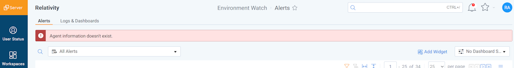
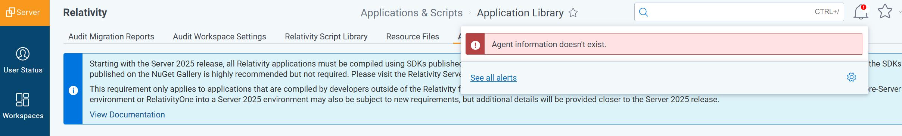

**Causes:**
1. You might be missing the "Alert Manager" agent. 

**Troubleshooting Steps:**

Please follow below steps to verify and create a new agent if needed:

1. Verify the "Alert Manager" Agent
   
   a. Navigate to the Agents tab in Relativity.

   b. Filter the Name field to check if the 'Alert Manager' agent is present..

   c. If the agent is missing, proceed to create a new one by following the step2 below.

2. Create a New "Alert Manager" agent
   
   a. Navigate to the Agents tab in relativity.

   b. Click on the "New Agent" button.

   c. In the Agent Type dropdown, choose "Alert Manager".

   d. Enter 30 as the Run Interval (in seconds).

   e. Choose an active Agent Server that is assigned to one of the existing Resource Pools.

   f. Click on Save

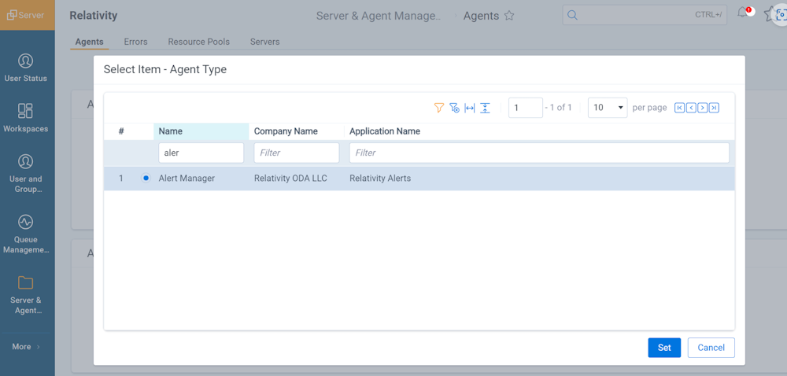
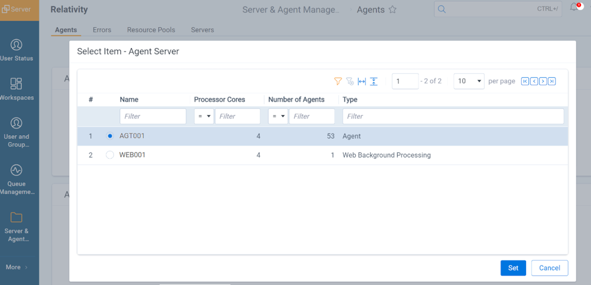
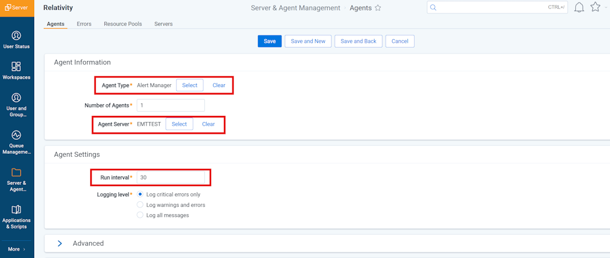
    
  Once these steps are completed, the "Alert Manager" agent should now be active and functioning correctly.

#### Issue 4: "The Alert Manager agent is unable to retrieve current alert state information from Kibana. Please ensure that the Alert Manager agent is enabled. To see accurate alert state information please navigate to Kibana." error is displayed.

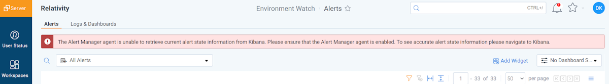
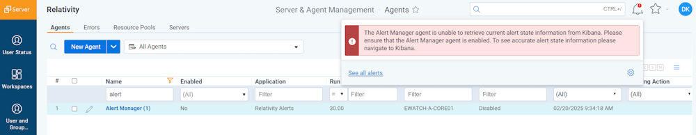

**Causes:**
1. Your "Alert Manager" agent might be disabled.

**Troubleshooting Steps:**

Please follow below steps to verify and enable the agent if needed:

1. Verify the "Alert Manager" Agent
   
	a. Navigate to the Agents tab in Relativity.

	b. Filter the Name field to check 'Alert Manager' agent is present.

	c. Click on 'Alert Manager' agent and check if the agent is disabled, if so, proceed to enable the agent by following step 2 below.

2. Enable the 'Alert Manager' agent
   
	a. Navigate to the Agents tab in Relativity.

	b. Filter the Name field to check 'Alert Manager' agent is present.

	c. Click on 'Alert Manager' agent and click on 'Enable Agent' 

	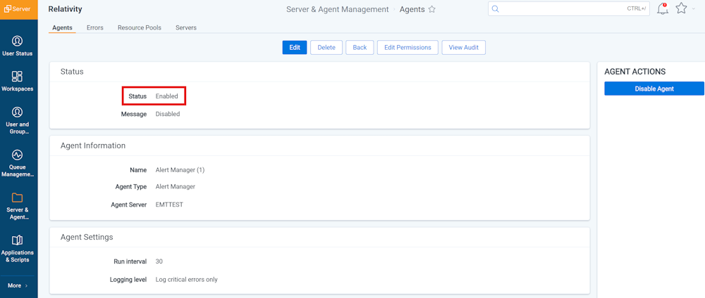  

  Once these steps are completed, the "Alert Manager" agent should now be Enabled and functioning correctly.

#### Issue 5: "The Alert Manager agent interval is currently set to more than 15 minutes. If you want alert state information to be retrieved from Kibana more frequently, please update the agent interval." warning is displayed.

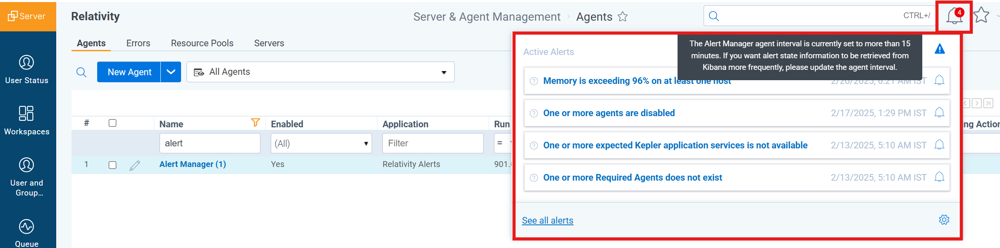

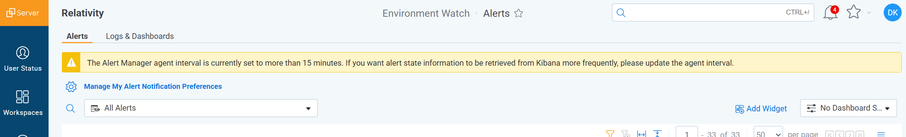

**Troubleshooting Steps:**

Your "Alert Manager" agent might have exceeded the interval. Please follow below steps to verify and to update interval value if needed:

1. Verify the "Alert Manager" Agent
   
	a. Navigate to the Agents tab in Relativity.

	b. Filter the Name field to check 'Alert Manager' agent is present.

	c. Click on 'Alert Manager' agent and check if the agent interval exceeds 900 seconds (15 minutes), if so, proceed to update agent interval value by following the step2 below.

2. Update Agent interval to a value less then 900 seconds (15 minutes)
   
	a. Navigate to the Agents tab in Relativity.

	b. Filter the Name field to check 'Alert Manager' agent is present.

	c. Click on 'Alert Manager' agent and Update Agent interval to a value less then 900 seconds (15 minutes). Recommended value is 30 (default). 
	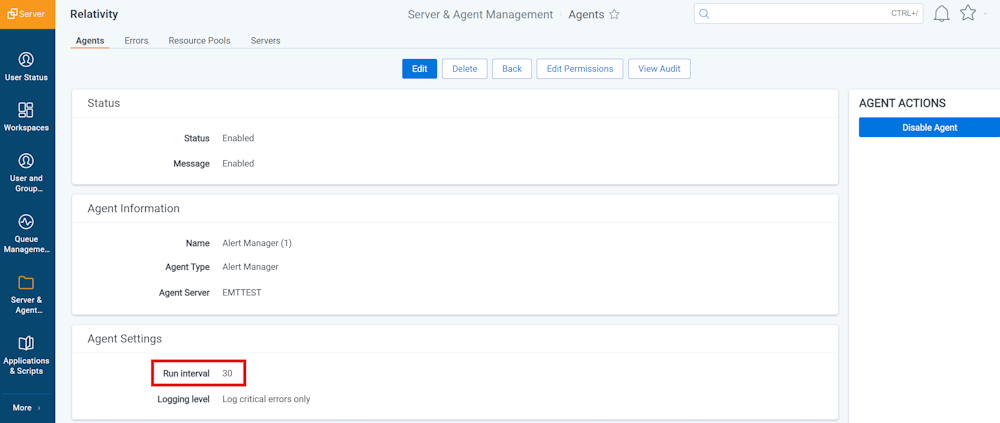

#### Issue 6: "Unable to retrieve alert state information from Kibana. Please ensure that Elasticsearch and Kibana are functional." error is displayed.

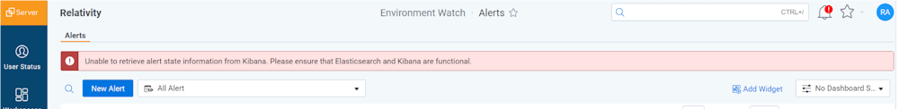

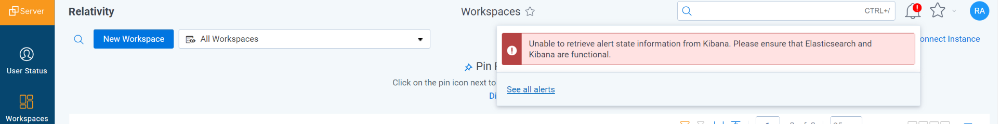

**Causes:**

1. Missing Setup of Elastic/Kibana/APM Servers.
2. Relativity Server CLI First-Time Setup not executed properly.

**Troubleshooting Steps:**

1. Ensure that the ElasticSearch, Kibana, and APM Servers are up and running. Verify that these services are properly started and accessible.
2. Re-run the Relativity Server CLI first-time setup. It may be necessary to execute the setup again to resolve any configuration issues or missing components related to the integration.

#### Issue 7: "The user does not have permission to perform this action." error is displayed.
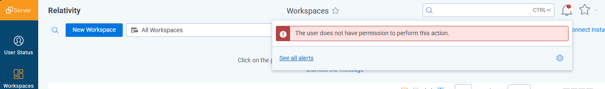

**Causes:**

1. User doesn't have System Administrator permissions.

**Troubleshooting Steps:**

1. Please verify that user has the System Administrator permissions to perform the required actions.

#### Issue 8: "Relativity Alert object data is unavailable or stale because Environment Watch is not currently enabled in this instance. Please see {doc page} for instructions on how to deploy and enable Environment Watch" error is displayed.
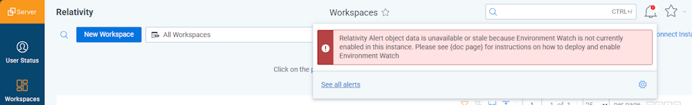

**Causes:**
1. Relativity Server CLI First-Time Setup not executed properly.

**Troubleshooting Steps:**
1. Please execute the Relativity Server CLI first time setup again to resolve this issue.

[Back to EnvironmentWatch Troubleshooting guide](../environment_watch_troubleshooting.md)