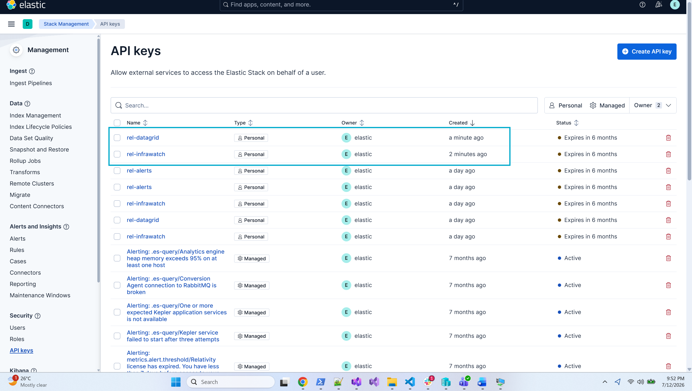
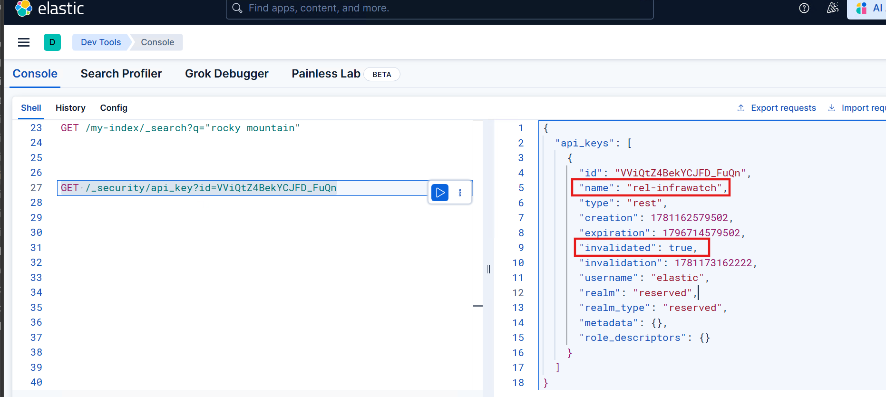
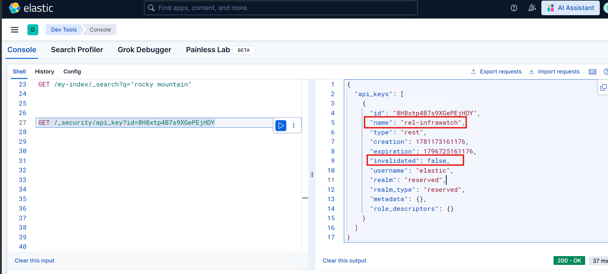

# Rotate an Elasticsearch API Key using the Relativity Server CLI

The `rotate-api-key` command creates a new Elasticsearch API key for the specified cluster, persists it to the Relativity Secret Store, and invalidates the old key. Run this command periodically to rotate expiring keys or as part of a scheduled security practice.

> [!NOTE]
> It is recommended to run the CLI from the Primary SQL Server.

> This guide assumes the Relativity Server bundle was extracted to `C:\Server.Bundle.x.y.z` or a similar directory chosen by the user.

## Prerequisites

- The Server-bundle zip file has been downloaded and extracted to `C:\Server.Bundle.x.y.z`
- Access to the Relativity Secret Store (Whitelisted for Secret Store access. Please see [here](https://help.relativity.com/Server2025/Content/System_Guides/Secret_Store/Secret_Store.htm#Configuringclients) for information on whitelisting.)
- Elasticsearch is running and accessible
- The initial Environment Watch setup has been completed. See [Set up Environment Watch using the Relativity Server CLI](./elastic-stack-setup-02-environment-watch.md)

## Options

| Flag | Short alias | Description | Default |
|------|-------------|-------------|---------|
| `--cluster <value>` | `-c` | Target Elasticsearch cluster. Valid values: `rel-cluster-infrawatch`, `rel-cluster-datagrid` | Prompted interactively |
| `--quiet` | | Suppress confirmation and expiry prompts; auto-confirms with the default 180-day expiry. Use together with `--cluster` for fully unattended execution | `false` |
| `--dryrun` | | Preview what would happen without making any changes to Elasticsearch or the Secret Store | `false` |

## Usage

### Interactive

Running `rotate-api-key` without any flags launches an interactive session. The CLI prompts you to select a target cluster.

```
C:\Server.Bundle.x.y.z\relsvr.exe rotate-api-key

Relativity Server CLI - 102.1.18
Copyright (c) 2026, Relativity ODA LLC

Select the Elasticsearch cluster to rotate the API key for:

> rel-cluster-infrawatch
  rel-cluster-datagrid
```

After selecting a cluster, the CLI displays the current API key ID and the number of days remaining before expiry, then asks you to confirm the rotation. Entering `n` aborts with no changes made:

```
Key rotation aborted. No changes were made.
```

Entering `y` continues to prompt for a validity period in days, then performs the rotation.

**InfraWatch cluster:**

```
Current API key ID: g9tMUp8BVmBEyCHxvRon  (name: rel-infrawatch)
Days remaining before expiry: 179
Rotate API key for cluster 'rel-cluster-infrawatch'? This will invalidate the current key. [y/n] (n): y
How many days should the new key be valid? (180): 180

API key rotation completed ----------------------------------------- 100%

Successfully rotated the Elasticsearch API key and persisted the new key to the Secret Store.
```

**DataGrid cluster:**

```
Current API key ID: idtNUp8BVmBEyCHxYC02  (name: rel-datagrid)
Days remaining before expiry: 179
Rotate API key for cluster 'rel-cluster-datagrid'? This will invalidate the current key. [y/n] (n): y
How many days should the new key be valid? (180): 180

API key rotation completed ----------------------------------------- 100%

Successfully rotated the Elasticsearch API key and persisted the new key to the Secret Store.
```

### Rotate with a pre-selected cluster

Use `--cluster` to target a specific cluster directly, skipping the cluster selection menu. The CLI still displays the current key information and asks for confirmation before rotating.

```
C:\Server.Bundle.x.y.z\relsvr.exe rotate-api-key --cluster rel-cluster-infrawatch

Relativity Server CLI - 102.1.18
Copyright (c) 2026, Relativity ODA LLC

Current API key ID: GUgcV58BbZgP437js08h  (name: rel-infrawatch)
Days remaining before expiry: 179
Rotate API key for cluster 'rel-cluster-infrawatch'? This will invalidate the current key. [y/n] (n): y
How many days should the new key be valid? (180): 180

API key rotation completed ----------------------------------------- 100%

Successfully rotated the Elasticsearch API key and persisted the new key to the Secret Store.
```

```
C:\Server.Bundle.x.y.z\relsvr.exe rotate-api-key --cluster rel-cluster-datagrid

Relativity Server CLI - 102.1.18
Copyright (c) 2026, Relativity ODA LLC

Current API key ID: gUkdV58BbZgP437jHQNQ  (name: rel-datagrid)
Days remaining before expiry: 179
Rotate API key for cluster 'rel-cluster-datagrid'? This will invalidate the current key. [y/n] (n): y
How many days should the new key be valid? (180): 180

API key rotation completed ----------------------------------------- 100%

Successfully rotated the Elasticsearch API key and persisted the new key to the Secret Store.
```

Use the `-c` short alias to achieve the same result:

```
C:\Server.Bundle.x.y.z\relsvr.exe rotate-api-key -c rel-cluster-infrawatch

Relativity Server CLI - 102.1.18
Copyright (c) 2026, Relativity ODA LLC

Current API key ID: GUgcV58BbZgP437js08h  (name: rel-infrawatch)
Days remaining before expiry: 179
Rotate API key for cluster 'rel-cluster-infrawatch'? This will invalidate the current key. [y/n] (n): y
How many days should the new key be valid? (180): 180

API key rotation completed ----------------------------------------- 100%

Successfully rotated the Elasticsearch API key and persisted the new key to the Secret Store.
```

### Quiet mode (automated / scripted rotation)

Combining `--quiet` with `--cluster` suppresses all prompts, auto-confirms the rotation, and uses the default 180-day expiry. This is suitable for scheduled or unattended scripts.

```
C:\Server.Bundle.x.y.z\relsvr.exe rotate-api-key --quiet --cluster rel-cluster-infrawatch

Relativity Server CLI - 102.1.18
Copyright (c) 2026, Relativity ODA LLC

Current API key ID: 5UkeV58BbZgP437jfiJ8  (name: rel-infrawatch)
Days remaining before expiry: 179

API key rotation completed ----------------------------------------- 100%

Successfully rotated the Elasticsearch API key and persisted the new key to the Secret Store.
```

```
C:\Server.Bundle.x.y.z\relsvr.exe rotate-api-key --quiet --cluster rel-cluster-datagrid

Relativity Server CLI - 102.1.18
Copyright (c) 2026, Relativity ODA LLC

Current API key ID: gUkdV58BbZgP437jHQNQ  (name: rel-datagrid)
Days remaining before expiry: 179

API key rotation completed ----------------------------------------- 100%

Successfully rotated the Elasticsearch API key and persisted the new key to the Secret Store.
```

### Dry run

Use `--dryrun` to simulate the rotation without making any changes. The CLI displays the current key information, accepts the same prompts as a normal rotation, then confirms the simulation without writing to Elasticsearch or the Secret Store.

```
C:\Server.Bundle.x.y.z\relsvr.exe rotate-api-key --cluster rel-cluster-infrawatch --dryrun

Relativity Server CLI - 102.1.18
Copyright (c) 2026, Relativity ODA LLC

Current API key ID: 5UkeV58BbZgP437jfiJ8  (name: rel-infrawatch)
Days remaining before expiry: 179
Rotate API key for cluster 'rel-cluster-infrawatch'? This will invalidate the current key. [y/n] (n): y
How many days should the new key be valid? (180): 180
DryRun mode: No changes were committed. The API key rotation was simulated successfully.
```

### Invalid cluster value

If an unrecognized value is passed to `--cluster`, the CLI rejects it immediately and lists the valid options.

```
C:\Server.Bundle.x.y.z\relsvr.exe rotate-api-key --cluster infrawatch

Relativity Server CLI - 102.1.18
Copyright (c) 2026, Relativity ODA LLC

Invalid --cluster value 'infrawatch'. Valid values are: rel-cluster-infrawatch, rel-cluster-datagrid
```

## Verify the rotation

### Kibana API keys

1. In Kibana, navigate to **Stack Management** > **Security** > **API keys**.
2. Confirm a new key for the rotated cluster appears at the top of the list with a recent creation timestamp and an expiry approximately 180 days in the future.



### Secret Store

To confirm the new API key was persisted, use the Secret Store CLI to read the secret for the rotated cluster. To compare values, read the secret both before and after running `rotate-api-key` — the `api-key` value should differ between the two reads.

From an elevated PowerShell on the Secret Store server, navigate to `C:\Program Files\Relativity Secret Store\Client\` and run the read command for the rotated cluster:

**InfraWatch:**

```
.\secretstore.exe secret read /database/elasticsearch/clusters/rel-cluster-infrawatch/security/api-keys/rel-infrawatch
```

**DataGrid:**

```
.\secretstore.exe secret read /database/elasticsearch/clusters/rel-cluster-datagrid/security/api-keys/rel-datagrid
```

### Elasticsearch Dev Tools (optional)

To confirm that the old key has been invalidated and the new key is active, query the Elasticsearch security API in Kibana Dev Tools using the key ID.

1. In Kibana, navigate to **Dev Tools** > **Console**.
2. Run the following query, replacing `<key_id>` with the ID of the key to inspect:

    ```
    GET /_security/api_key?id=<key_id>
    ```

3. Verify the results:
    - The old key shows `"invalidated": true`.
    - The new key shows `"invalidated": false`.

**Old key — invalidated:**



**New key — active:**



If the Audit tab does not load after rotating the DataGrid API key, refer to [Data Grid Audit Troubleshooting](../troubleshooting/datagrid-audit-troubleshooting.md).
