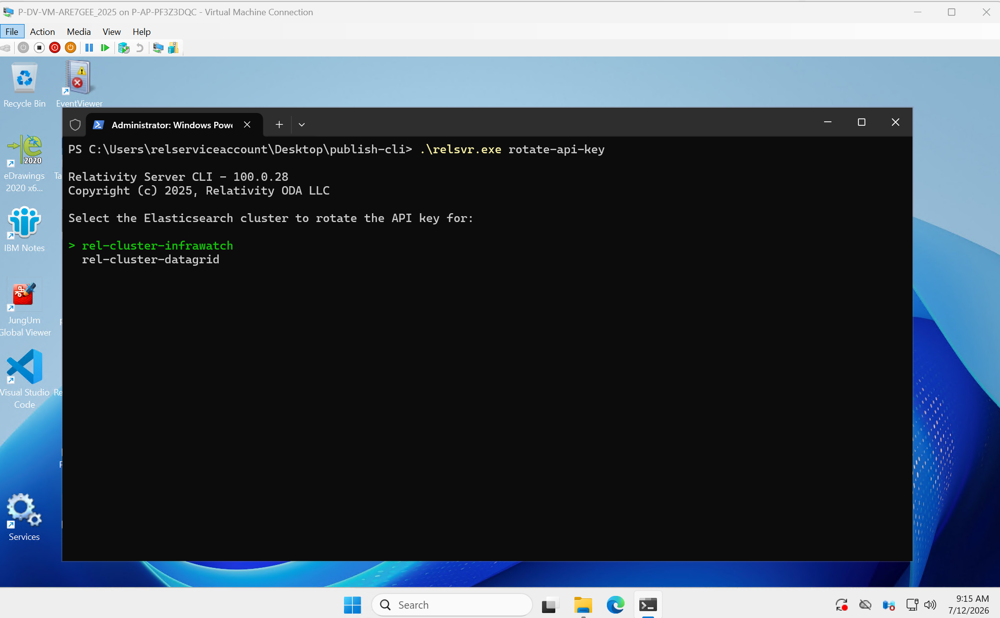
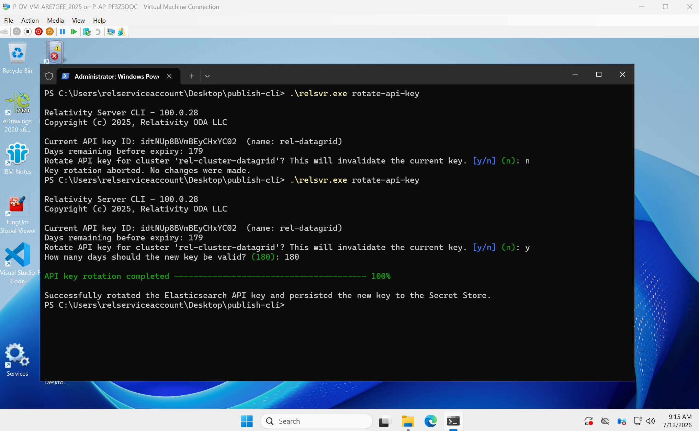
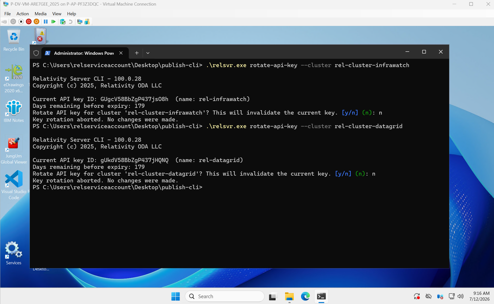
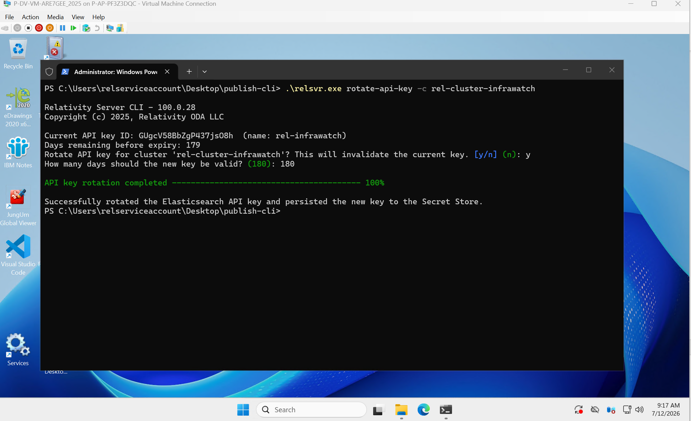
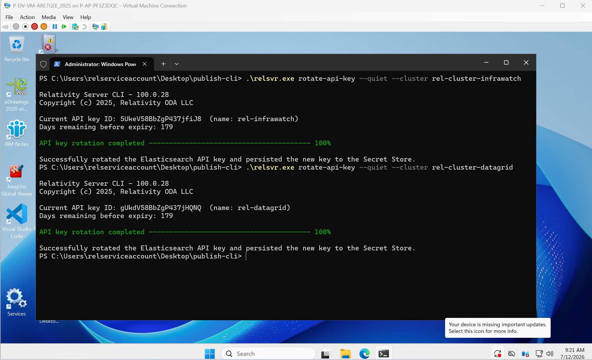
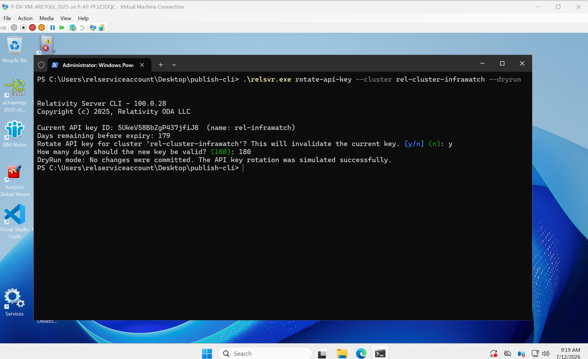
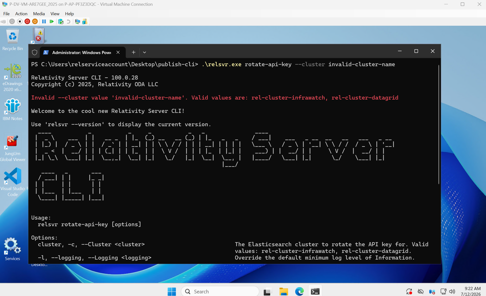

# Rotate Elasticsearch API Keys using the Relativity Server CLI

The `rotate-api-key` command creates a new Elasticsearch API key for the specified cluster, persists it to the Relativity Secret Store, and invalidates the old key. Run this command periodically to rotate expiring keys or as part of a scheduled security practice.

> [!NOTE]
> It is recommended to run the CLI from the Primary SQL Server.

> This guide assumes the Relativity Server bundle was extracted to `C:\Server.Bundle.x.y.z` or a similar directory chosen by the user.

## Prerequisites

- The Server-bundle zip file has been downloaded and extracted to `C:\Server.Bundle.x.y.z`
- Access to the Relativity Secret Store (whitelisted for Secret Store access)
- Elasticsearch is running and accessible
- The initial Environment Watch setup has been completed. See [Set up Environment Watch using the Relativity Server CLI](./elastic-stack-setup-02-environment-watch.md)

## Options

| Flag | Short alias | Description | Default |
|------|-------------|-------------|---------|
| `--cluster <value>` | `-c` | Target Elasticsearch cluster. Valid values: `rel-cluster-infrawatch`, `rel-cluster-datagrid` | Prompted interactively |
| `--quiet` | | Suppress all prompts, auto-confirm, and use the default 180-day expiry | `false` |
| `--dryrun` | | Preview what would happen without making any changes to Elasticsearch or the Secret Store | `false` |

## Usage

### Interactive

Running `rotate-api-key` without any flags launches an interactive session. The CLI prompts you to select a target cluster.

```
C:\Server.Bundle.x.y.z\relsvr.exe rotate-api-key
```



After selecting a cluster, the CLI displays the current API key ID, the number of days remaining before it expires, and asks you to confirm the rotation. Entering `n` aborts with no changes made. Entering `y` continues to prompt for a validity period in days, then performs the rotation.

**InfraWatch cluster:**


**DataGrid cluster:**



### Rotate with a pre-selected cluster

Use `--cluster` to target a specific cluster directly, skipping the cluster selection menu. The CLI still displays the current key information and asks for confirmation before rotating.

```
C:\Server.Bundle.x.y.z\relsvr.exe rotate-api-key --cluster rel-cluster-infrawatch
```

```
C:\Server.Bundle.x.y.z\relsvr.exe rotate-api-key --cluster rel-cluster-datagrid
```



Use the `-c` short alias to achieve the same result:

```
C:\Server.Bundle.x.y.z\relsvr.exe rotate-api-key -c rel-cluster-infrawatch
```



### Quiet mode (automated / scripted rotation)

Combining `--quiet` with `--cluster` suppresses all prompts, auto-confirms the rotation, and uses the default 180-day expiry. This is suitable for scheduled or unattended scripts.

```
C:\Server.Bundle.x.y.z\relsvr.exe rotate-api-key --quiet --cluster rel-cluster-infrawatch
```

```
C:\Server.Bundle.x.y.z\relsvr.exe rotate-api-key --quiet --cluster rel-cluster-datagrid
```



### Dry run

Use `--dryrun` to simulate the rotation without making any changes. The CLI displays the current key information, accepts the same prompts as a normal rotation, then confirms the simulation without writing to Elasticsearch or the Secret Store.

```
C:\Server.Bundle.x.y.z\relsvr.exe rotate-api-key --cluster rel-cluster-infrawatch --dryrun
```

```
DryRun mode: No changes were committed. The API key rotation was simulated successfully.
```



### Invalid cluster value

If an unrecognized value is passed to `--cluster`, the CLI rejects it immediately and lists the valid options.

```
C:\Server.Bundle.x.y.z\relsvr.exe rotate-api-key --cluster infrawatch
```

```
Invalid --cluster value 'infrawatch'. Valid values are: rel-cluster-infrawatch, rel-cluster-datagrid
```



## Verify the rotation

### Kibana API keys

1. In Kibana, navigate to **Stack Management** > **Security** > **API keys**.
2. Confirm a new key for the rotated cluster appears at the top of the list with a recent creation timestamp and an expiry approximately six months in the future.


### Secret Store

To confirm the new API key was persisted, read the secret for the rotated cluster using the Secret Store client. The `api-key` value should differ from the value recorded before rotation.

- **InfraWatch secret path:** `/database/elasticsearch/clusters/rel-cluster-infrawatch/security/api-keys/rel-infrawatch`
- **DataGrid secret path:** `/database/elasticsearch/clusters/rel-cluster-datagrid/security/api-keys/rel-datagrid`

### Elasticsearch Dev Tools (optional)

To confirm that the old key has been invalidated and the new key is active, query the Elasticsearch security API in Kibana Dev Tools using the key ID.

1. In Kibana, navigate to **Dev Tools** > **Console**.
2. Run the following query, replacing `<key_id>` with the ID of the key to inspect:

    ```
    GET /_security/api_key?id=<key_id>
    ```

3. Verify the results:
    - The old key shows `"invalidated": true`.
    - The new key shows `"invalidated": false`.

**Old key — invalidated:**


**New key — active:**


Refer to the [Troubleshooting Guide](../troubleshooting/relativity-server-cli.md) if you encounter any issues.
