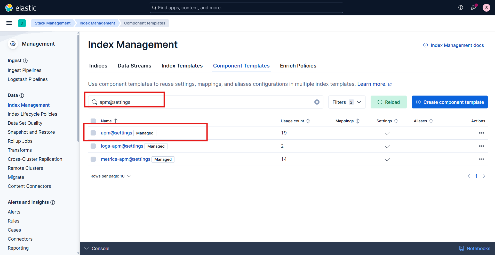
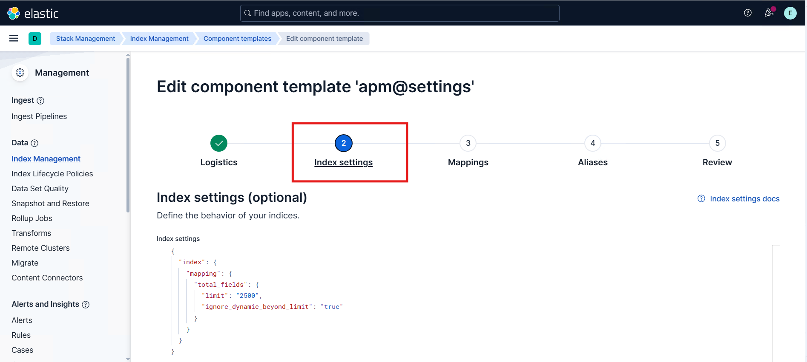
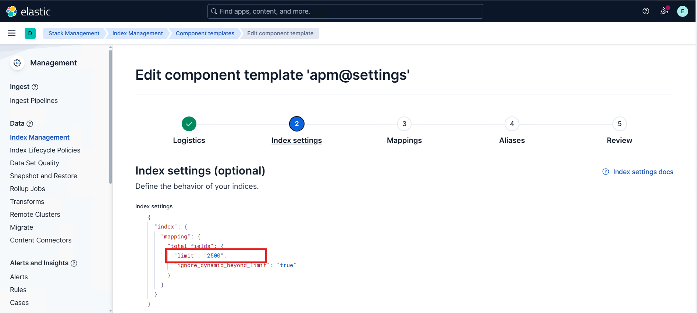
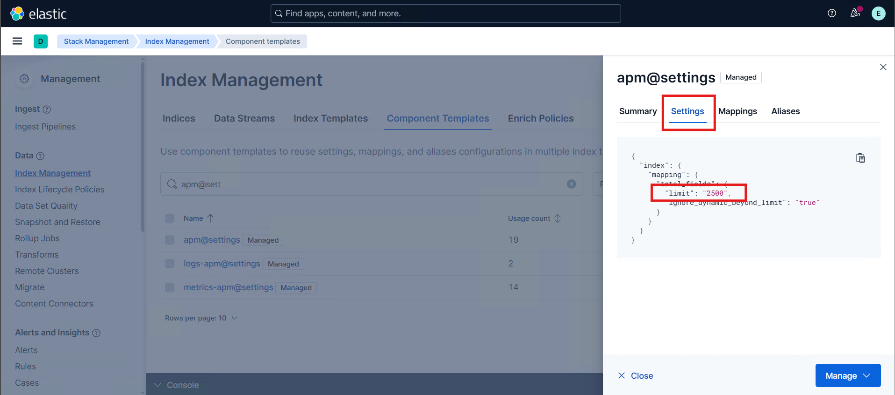
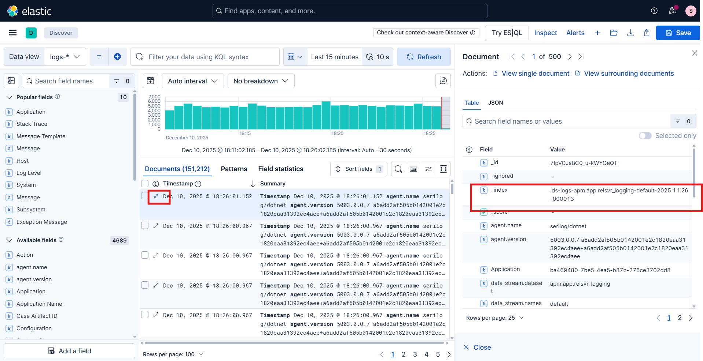

# Manual Elasticsearch Configuration: Index Field Limit

## Overview

This guide provides the required steps to update and optimize Elasticsearch settings. These adjustments help ensure that Elasticsearch is configured to handle the expected data volume, prevent indexing issues, and maintain reliable system performance.

## Update the Index Field Limit

Elasticsearch enforces a limit on the total number of fields that can exist within an index. This is controlled by the `index.mapping.total_fields.limit` setting, which helps protect the cluster from mapping explosions and excessive memory usage.

When documents contain more fields than the value configured in `index.mapping.total_fields.limit`, Elasticsearch may reject the document or ignore additional dynamic fields depending on index settings, which can result in missing data or ingestion failures. This can lead to:

- Missing or incomplete data
- Inconsistent query results
- Difficulty performing accurate analysis and aggregations
- Document ingestion failures

To ensure all fields are properly indexed and stored, the `index.mapping.total_fields.limit` value must be increased to accommodate the actual number of fields present in the incoming documents.

This documentation provides step-by-step instructions for manually updating Elasticsearch index settings to adjust the field limit and prevent data loss caused by exceeding the configured threshold.

### Steps to Update the Index Field Limit

### Prerequisites 

1. Administrator privileges in Kibana/Elasticsearch.

#### Step 1: Update the Field Limit

1. Log in to Kibana as a user with administrative privileges.
2. In Kibana, go to **Stack Management** → **Index Management** → **Component Templates**.
3. Use the search box to find the **apm@settings** component template.
   
4. Click the **Edit** button in the **Actions** column.
5. In the edit view, navigate to the **Index settings** section.
    
6. Add or update the field limit setting:
   - Key: `index.mapping.total_fields.limit`
   - Value: the required limit (for example, `2500`)
  
    
    
    > [!NOTE]
    > - The default value of `index.mapping.total_fields.limit` is `1000`. The `limit` field is not included by default; for a first-time update, add the `limit` field and set it to the required value.
    > - Increasing this limit excessively may increase memory usage and impact cluster stability, so it should be set slightly above the expected maximum number of fields.

7. After updating the field limit, navigate to the **Review** tab and click **Save component template**.
8. Verify that the **apm@settings** component template shows the updated field limit.
  


#### Step 2: Perform a Rollover to Apply the New Settings

> [!NOTE]
> A rollover is only required when APM data streams already contain existing backing indices.
In the case of a fresh installation, no data has been ingested yet, and the APM data streams have not created any backing indices.
Because of this, Elasticsearch will automatically create the first index using the updated component template settings, and no rollover action is needed.

APM data streams consist of multiple backing indices (for example: metrics-apm-default-000123).
Updating the component template does not retroactively apply changes to these existing backing indices.

Because the data stream already has active backing indices, the updated field limit will only apply to new indices created after the change.

To apply the new settings, the following steps are required:
- Identify the correct APM data stream.
- Trigger a rollover to create a new backing index.
- Verify that the newly created index includes the updated limit.


1. Identify the APM Data Stream
    1. Go to **Discover**.
    2. Select the **Data view** associated with the logs/metrics/traces you are working with.
    3. Open one of the latest documents to expand its details.
    4. Locate the `_index` field. 
        
       In the document details, find the value of the `_index` field.        
       Example: `.ds-logs-apm.app.relsvr_logging-default-2025.11.26-000013`
       

    5. Derive the data stream name
         
        Remove the `.ds-` prefix and the `date/suffix` portion from the index name.
        
        Using the example above: 
        `logs-apm.app.relsvr_logging-default`
        
        This is the data stream name to use with the rollover API.

2. Perform a Rollover

    1. In Kibana, navigate to **Management** → **Dev Tools** → **Console**.
    2. Run the rollover command in the console window. Paste the following API request (replace `<data-stream-name>` with the actual data stream name).
       ```
       POST /<data-stream-name>/_rollover
       ```
    3. Click the **Run** button (the arrow icon on the right side of the console input panel) to execute the request. In the response panel, ensure that the output contains:
        
        - `"rolled_over": true`, and
        - The `"new_index"` field is present with the new backing index name.

        <details>
        <summary>Sample JSON response</summary>

        ```
        {
          "acknowledged": true,
          "shards_acknowledged": true,
          "old_index": ".ds-logs-apm.app.relsvr_logging-default-2025.12.17-000002",
          "new_index": ".ds-logs-apm.app.relsvr_logging-default-2025.12.17-000003",
          "rolled_over": true,
          "dry_run": false,
          "lazy": false,
          "conditions": {}
        }
        ```
        </details>

       > [!NOTE]
       > Ensure the data stream name is valid; otherwise, the rollover request fails.

3. Verify the Updated Field Limit

    1. In Kibana, navigate to **Management** → **Dev Tools** → **Console**.
    2. Run the GET command in the console window. Paste the following API request (replace `<index-name>` with the `"new_index"` value returned by the rollover response).
       ```
       GET /<index-name>/_settings
       ```
    3. Click the **Run** button (the arrow icon on the right side of the console input panel) to execute the request. In the response panel, ensure that the output contains:
        
       - `"index.mapping.total_fields.limit": <updated-field-limit>`.

        <details>
        <summary>Sample JSON response</summary>

        ```
        {
          ".ds-logs-apm.app.relsvr_logging-default-2025.12.17-000003": {
            "settings": {
              "index": {
                "mapping": {
                  "total_fields": {
                    "limit": "2500",
                    "ignore_dynamic_beyond_limit": "true"
                  }
                },
              }
            }
          }
        }
        ```
        </details>