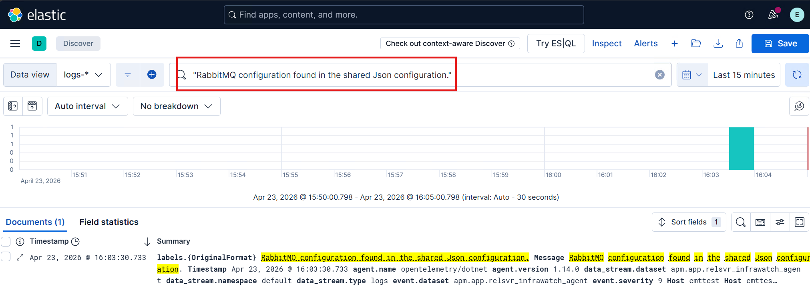
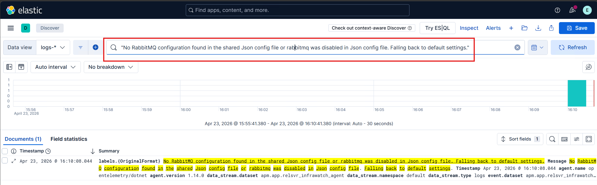
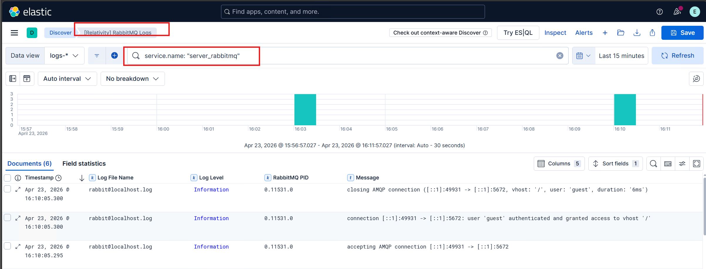

# File Log Receiver Configuration

This section describes how to configure file log receiver monitoring using the `environmentWatchConfiguration` JSON configuration file.

---

## Overview

The file log receiver allows Environment Watch to collect and parse log files from custom sources using the OpenTelemetry Collector. By defining log sources in the `openTelemetryOverrides` section, users can extend monitoring to include application-specific log files (e.g., RabbitMQ logs) with custom parsing rules for log file path, multiline handling, regex extraction, and timestamp parsing.

### Assumptions

- The log file is expected to be in **plaintext** format, not JSON.
- The log file path must be accessible from the host where the Environment Watch Windows service is running.
- Each log entry is expected to follow a consistent format that can be matched by the provided regex patterns.
- The attributes in the `regexPattern` must match the exact field names defined in the source code. For RabbitMQ, the expected field names are:

  | Field Name                | Log Entry Component                          | Example Value                          |
  |--------------------------|----------------------------------------------|----------------------------------------|
  | `rabbitmq_log_date_time` | Timestamp                                    | `2025-10-28 18:20:43.375000-07:00`     |
  | `severity`               | Log level                                    | `info`                                 |
  | `rabbitmq_pid_node`      | First segment of PID `<node.process.serial>` | `0`                                    |
  | `rabbitmq_pid_process`   | Second segment of PID                        | `211`                                  |
  | `rabbitmq_pid_serial`    | Third segment of PID                         | `0`                                    |
  | `message`                | Log message body                             | `ra: starting system coordination`     |

  **Sample log entry:**
  ```text
  2025-10-28 18:20:43.375000-07:00 [info] <0.211.0> ra: starting system coordination
  ```

> [!IMPORTANT]
> The attributes in the `regexPattern` must exactly match the default field names defined in the source code. Failing to use the correct field names will cause the OpenTelemetry Collector to throw a fatal error and stop working. These field names are also referenced in saved searches and dashboards in Kibana, which may also break if the names do not match.

---

## Properties Table

The following table lists the properties used to configure a log source in the custom JSON configuration file.

| Property                  | Type    | Description                                                                                          |
|--------------------------|---------|------------------------------------------------------------------------------------------------------|
| `type`                   | string  | Identifies the log source type (e.g., `"rabbitmq"`).                                                 |
| `enabled`                | boolean | Enables or disables collection for this log source.                                                  |
| `logFilePath`            | string  | The full file path to the log file to be monitored (e.g., `"C:\\rabbitmq\\data\\log\\rabbit@localhost.log"`). |
| `multilineStartPattern`  | string  | A regex pattern that identifies the start of a new multiline log entry.                              |
| `regexPattern`           | string  | A regex pattern used to extract fields (e.g., timestamp) from each log entry. Supports named capture groups. |
| `timestampLayout`        | string  | The timestamp format used to parse the extracted timestamp (e.g., `"%Y-%m-%d %H:%M:%S.%f"`).         |

---

## Configure File Log Receiver

The file log receiver is configured in the `openTelemetryOverrides` section of the custom JSON configuration file. The `logSources` array contains one or more log source objects.
For log sources to monitor, locate `logSources` under the `openTelemetryOverrides` section and update the configuration as shown below.

- `type` : Set to the identifier for the log source (e.g., `"rabbitmq"`).
- `enabled` : Set to `true` to enable log collection for this source.
- `logFilePath` : Specify the full path to the log file on the host.
- `multilineStartPattern` : Provide a regex pattern that matches the beginning of each log entry.
- `regexPattern` : Provide a regex pattern with named capture groups to extract fields from each log entry.
- `timestampLayout` : Specify the format string used to parse the extracted timestamp.

**Example**

```json
{
  "environmentWatchConfiguration": {
    "monitoring": {
      "instance": {
        "sources": {
          "certificates": {},
          "windowsServices": {}
        },
        "otelCollectorYamlFiles": []
      },
      "installedProducts": [],
      "hosts": [],
      "openTelemetryOverrides": {
            "logSources": [
              {
                "type": "rabbitmq",
                "enabled": true,
                "logFilePath": "C:\\rabbitmq\\data\\log\\rabbit@localhost.log",
                "multilineStartPattern": "^\\d{4}-\\d{2}-\\d{2} \\d{2}:\\d{2}:\\d{2}\\.\\d{6}[+-]\\d{2}:\\d{2}",
                "regexPattern": "^(?P<rabbitmq_log_date_time>\\d{4}-\\d{2}-\\d{2} \\d{2}:\\d{2}:\\d{2}\\.\\d{6}[+-]\\d{2}:\\d{2}) \\[(?P<severity>[a-z]*)\\] <(?P<rabbitmq_pid_node>\\d+)\\.(?P<rabbitmq_pid_process>\\d+)\\.(?P<rabbitmq_pid_serial>\\d+)>[ \\t]*(?P<message>[\\s\\S]*)$",
                "timestampLayout": "%Y-%m-%d %H:%M:%S.%f%j"
              }
            ]
        }
    },
    "alertNotificationHandlers": {}
  }
}
```

> [!NOTE]
> Ensure the `logFilePath` points to a valid log file on the host. If the specified file does not exist, the OpenTelemetry Collector will not be able to collect logs from this source.

> [!NOTE]
> The `multilineStartPattern` and `regexPattern` fields use regex syntax. Backslashes must be escaped as `\\` in the JSON configuration file.

### Default Behavior

If a log source is not explicitly configured in the `logSources` array, it will use its default settings from the source code. For example, if the RabbitMQ log source is not defined in the JSON configuration, it will not be enabled by default since the default `enabled` value for the RabbitMQ log source is `false` in the source code. To enable it, you must explicitly define it in the `logSources` array with `"enabled": true`.

At the property level, if a property is not set or is set to an empty/null value, it will be overridden by the default value defined in the source code. This applies to the following properties:

| Property                  | Default Behavior When Empty or Null                                                              |
|--------------------------|--------------------------------------------------------------------------------------------------|
| `logFilePath`            | Falls back to the default log file path defined in the source code for the given log source type. |
| `multilineStartPattern`  | Falls back to the default multiline start pattern defined in the source code.                     |
| `regexPattern`           | Falls back to the default regex pattern defined in the source code.                               |
| `timestampLayout`        | Falls back to the default timestamp layout defined in the source code.                            |

> [!NOTE]
> Currently, the file log receiver is only supported for RabbitMQ file log receiver.

> [!NOTE]
> After updating the custom JSON configuration file, restart the Environment Watch Windows service to apply the changes.

### Verification in Kibana

- Navigate to **Kibana > Discover**.
- Select the **logs-\*** data view.
- Search for `"RabbitMQ configuration found in the shared Json configuration."` to confirm that Environment Watch detected the RabbitMQ file log receiver configuration.



- If `enabled` is `false`, search for `"No RabbitMQ configuration found in the shared Json config file or rabbitmq was disabled in Json config file. Falling back to default settings."` to confirm that the file log receiver was not enabled or was disabled in the JSON configuration file.



- Search for `service.name: "server_rabbitmq"` in the **logs-\*** data view.
- Ensure that log entries from the RabbitMQ log file appear in Kibana. The example below demonstrates how RabbitMQ log entries from the file log receiver are successfully collected and displayed in Kibana.



> [!NOTE]
> When `enabled` is `true`, the file log receiver settings are fetched from the custom JSON configuration file. When `enabled` is `false`, the file log receiver falls back to the default settings defined in the source code based on the [Assumptions](#assumptions) made.

---

## Troubleshooting
Refer to the [Troubleshooting Guide](../../../troubleshooting/custom-json-troubleshooting.md) to resolve any custom JSON file log receiver configuration issues.