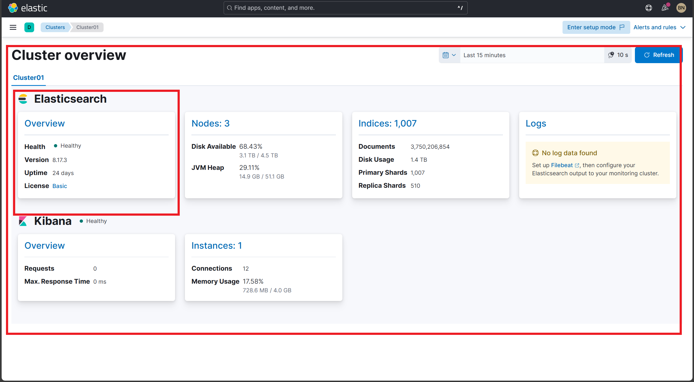

# Post-Install Verification for Elastic Cluster Health  

## Verify that the dashboard exists

Navigate to the Elasticsearch cluster health monitoring dashboard.

**Steps:**  
1. Login to Kibana.
2. Navigate to **Dashboards**
2. Use the search bar to search for `Monitoring Agents` and open the dashboard
3. Click on **Cluster Overview**.
4. Alternatively, visit this direct link: http://<hostname_or_ip>:5601/app/monitoring#

**Expected Result:** 
- Successfully access the Elasticsearch monitoring dashboard.
- Cluster health panels and metrics are visible.
- Dashboard loads without errors.

## Verify cluster health summary

Confirm cluster health status, total nodes, shards, indices, and document count are displayed and accurate.

**Steps:**  
1. Locate the **Cluster Health Summary** panel.
2. Validate:  
   - Cluster status (Green, Yellow, Red) — expect Green for healthy cluster.  
   - Number of nodes.  
   - Number of indices.  
   - Total shards and unassigned shards.  
   - Total documents.  
   - Data size.

**Expected Result:**
- Under any Data Store Dashboard, click on Cluster Overview link.  
- Verify cluster health is **Green (Healthy)**.  
- Nodes, shards, indices, and documents display current, non-zero values.  
- No unassigned shards.  
- Data size is displayed accurately.  

**Screenshot:**  

## Verify node metrics

Ensure node-level metrics such as CPU usage, JVM heap usage, and disk space are reported per node.

**Steps:**  
1. Open the **Node Metrics** or **Elasticsearch Nodes** panel.  
2. Confirm each node shows:  
   - Status (Online).  
   - CPU usage (percentage).  
   - JVM heap usage (percentage).  
   - Disk free space.  
   - Load Average (may be unavailable, verify if data present).

**Expected Result:**
- All nodes listed.  
- CPU, JVM heap %, and disk free space values present.  
- Load average may show as N/A if unsupported but should be monitored for future inclusion.  

**Screenshot:**  

## Verify index statistics

Validate index-level metrics including document counts, data size, indexing rate, and search rate.

**Steps:**  
1. Open the **Indices** panel.  
2. Review per-index data such as:  
   - Document count.  
   - Data size.  
   - Indexing rate (docs per second).  
   - Search rate (queries per second).  
   - Unassigned shards (should be zero).  
3. Check for any alerts or warnings on indices.

**Expected Result:**
- Per-index document counts and data sizes are populated.  
- Indexing and search rates update regularly.  
- No unassigned shards.  
- Alerts show clear or no issues on indices.  

**Screenshot:**  

## Verify disk and storage utilization

Ensure disk free space and usage metrics are visible for each node.

**Steps:**  
1. Check disk free space shown per node in the **Node Metrics** panel.  
2. Confirm reported disk free space aligns with expectations.  

**Expected Result:**
- Disk free space values displayed for all nodes.  
- No fields marked as N/A for disk metrics.  

**Screenshot:**  

